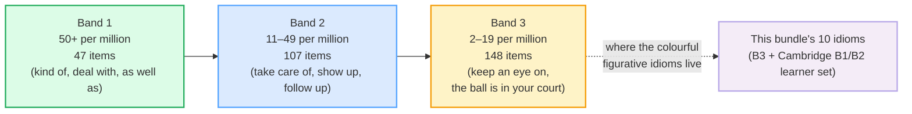

# Top-Frequency Idioms

> **Phase 4 · discourse · bundle #69 · Days 137–138.**
> *Only the idioms in the top ~200 (no obscure ones).*
>
> 🔗 This bundle sits in the discourse phase. It leans on
> [FINAL CONSONANTS](../pronunciation/FINAL_CONSONANTS.md) (every idiom ends in a
> sound you must release — *cake*, *leg*, *head*), and it is the **deliberately
> small** counterweight to [PHRASAL VERBS: WORK](./PHRASAL_VERBS_WORK.md) and
> [COLLOCATIONS](./COLLOCATIONS.md): a few high-utility idioms, then move on.

---

## Why this bundle is short (read this first)

Vietnamese has a rich idiom system — *thành ngữ* — so learners arrive expecting
English idioms to be **translatable**. They are not. *A piece of cake* is not
*một miếng bánh*; *on the same page* is not *trên cùng một trang*. English idioms
are **non-compositional**: their meaning cannot be assembled from their words.
Translate any of them literally and the result is nonsense.

The cost of getting this wrong is twofold, and both sides waste a learner's time:

1. **Over-study of rare/dramatic idioms.** Phrasebooks love *raining cats and
   dogs*, *kick the bucket*, *burn the midnight oil* — colourful, memorable, and
   almost never heard in real conversation. A learner who drills 200 of these
   sounds like a 1950s textbook.
2. **Wrong register / wrong context.** *Break a leg* is theatre slang; using it
   before a job interview is fine, but using it to wish a surgeon luck is odd.
   Idioms are register-sensitive in a way single words are not.

So this bundle does the opposite of a phrasebook: it teaches **only the ~10
highest-utility idioms**, each one cited to a real dictionary entry + a frequency
source, and it tells you to **stop collecting more**. The time you would spend on
idiom #50 is better spent on phrasal verbs and collocations — which are far more
frequent and more compositional.

> From `frequency_idioms_corpus.md` (the pinned sanity-check anchors):
>
> | a piece of cake | on the same page |
> |---|---|
> | /ə ˈpiːs əv ˈkeɪk/ | UK /ɒn ðə ˈseɪm ˈpeɪdʒ/ · US /ɑːn ðə ˈseɪm ˈpeɪdʒ/ |
> | **fig.** something very easy to do (informal, Cambridge B2) | **fig.** sharing the same understanding/aims (Cambridge Business English) |
>
> These two are the load-bearing anchors — both verified in real dictionary idiom
> entries, both in the top-frequency band for learners.

---

## 1. The frequency-first principle

The research that licenses this short list is Liu (2003), "The Most Frequently
Used Spoken American English Idioms" (*TESOL Quarterly* 37(4), 671). Liu mined
three spoken-American-English corpora and ranked 302 idioms into three frequency
bands:

Two of this bundle's idioms — **keep an eye on** and **the ball is in your
court** — are *directly attested* in Liu's Band 3. The remaining eight (e.g. *a
piece of cake*, *under the weather*) are absent from Liu's *academic-spoken*
corpora, but that is a **register mismatch, not rarity**: Liu sampled university
lectures and professional meetings, which under-represent the colourful everyday
register where these idioms actually live. They are Cambridge **B1–B2** learner
idioms — and Cambridge's CEFR band *is* a frequency ranking (it admits only
high-frequency items).

> From `frequency_idioms_corpus.md` (the two Liu-attested idioms, verbatim):
>
> - **the ball is in your court** — Liu (2003) Band 3, 2–19 tokens/million,
>   spoken American English. *It's your turn to decide/act.*
> - **keep an eye on** — Liu (2003) Band 3, 2–19 tokens/million. *Watch/monitor
>   carefully.*

**The curation rule, stated plainly:** learn these ten, use them in the right
register, and resist the urge to hoard more. If you want to sound native-like,
the higher-ROI neighbours are [PHRASAL VERBS: WORK](./PHRASAL_VERBS_WORK.md) and
[COLLOCATIONS](./COLLOCATIONS.md).

---

## 2. The ten idioms — literal vs figurative, with register

Every idiom below is **non-compositional**: the figurative meaning is invisible
from the words. The literal column exists only to show *why* literal translation
fails.

| Idiom | Literal (nonsense) | Figurative (what it means) | Register |
|---|---|---|---|
| **a piece of cake** | a slice of cake | very easy to do | informal |
| **on the same page** | reading one physical page | sharing the same understanding | neutral–professional |
| **break a leg** | fracture a leg | good luck! (originally theatre) | casual |
| **the ball is in your court** | the ball is on your tennis side | it's your turn to decide | neutral |
| **under the weather** | beneath the weather | slightly ill | casual |
| **cost an arm and a leg** | priced at an arm + a leg | very expensive | casual/informal |
| **hit the nail on the head** | strike the nail on its head | describe the problem exactly | neutral |
| **once in a blue moon** | during a blue-coloured moon | very rarely | neutral–casual |
| **give someone a hand** | hand someone a hand | help someone | neutral–casual |
| **keep an eye on** | hold an eye over | watch/monitor carefully | neutral |

> From `frequency_idioms_corpus.md` (IPA per idiom — built from Cambridge
> component-word entries, US/UK given where they differ):
>
> - `a piece of cake` /ə ˈpiːs əv ˈkeɪk/ · `once in a blue moon`
>   /ˈwʌns ɪn ə ˌbluː ˈmuːn/ · `break a leg` /ˈbreɪk ə ˈleɡ/ — identical US/UK.
> - `on the same page` UK /ɒn ðə ˈseɪm ˈpeɪdʒ/ · US /ɑːn ðə ˈseɪm ˈpeɪdʒ/ — `on`
>   shifts /ɒ/→/ɑː/.
> - `under the weather` UK /ˈʌndə ðə ˈweðə/ · US /ˈʌndər ðə ˈweðər/ — US adds /r/.

---

## 3. Pronunciation: every idiom ends in a final consonant

🔗 This is where [FINAL CONSONANTS](../pronunciation/FINAL_CONSONANTS.md) bites.
Eight of the ten idioms end in a sound Vietnamese has no slot for — *cake* /keɪk/,
*page* /peɪdʒ/, *leg* /leɡ/, *court* /kɔːrt/, *head* /hed/, *hand* /hænd/. Drop
that final and *hit the nail on the head* becomes "hit the nail on the hea" — the
native hears a broken word, not an idiom. Drill the final consonant of each idiom
before you drill its meaning.

---

## 4. Cheat sheet — the 8 survival chunks

The Pareto set. These eight are the highest-utility; drill them aloud until every
final is audible and the figurative meaning jumps out without translation. (All
ten live in the corpus; the deck + cheat sheet cap at 8 per spec §5.)

| # | Chunk | IPA | Why it's here |
|---|---|---|---|
| 1 | **a piece of cake** | /ə ˈpiːs əv ˈkeɪk/ | pinned; the "easy" idiom everyone meets first |
| 2 | **on the same page** | UK /ɒn ðə ˈseɪm ˈpeɪdʒ/ · US /ɑːn ðə ˈseɪm ˈpeɪdʒ/ | pinned; workplace-aligned agreement |
| 3 | **the ball is in your court** | UK /ðə ˌbɔːl ɪz ɪn jɔː ˈkɔːt/ · US /ðə ˌbɑːl ɪz ɪn jɔːr ˈkɔːrt/ | Liu-attested; handing over a decision |
| 4 | **keep an eye on** | UK /ˌkiːp ən ˈaɪ ɒn/ · US /ˌkiːp ən ˈaɪ ɑːn/ | Liu-attested; monitoring (workplace-useful) |
| 5 | **under the weather** | UK /ˈʌndə ðə ˈweðə/ · US /ˈʌndər ðə ˈweðər/ | feeling ill — everyday-casual |
| 6 | **hit the nail on the head** | UK /hɪt ðə ˈneɪl ɒn ðə ˈhed/ · US /hɪt ðə ˈneɪl ɑːn ðə ˈhed/ | "exactly right" — high-utility praise |
| 7 | **once in a blue moon** | /ˈwʌns ɪn ə ˌbluː ˈmuːn/ | "very rarely" — frequency stance |
| 8 | **break a leg** | /ˈbreɪk ə ˈleɡ/ | the good-luck wish — register-sensitive |

> Open [`frequency_idioms.html`](./frequency_idioms.html) to drill these as flip
> cards, hear native clips, play the role-play, shadow, and write.

---

## 5. Vietnamese → English L1 pitfalls table

The "expert payoff." These are the specific interference traps a Vietnamese
speaker hits on English idioms — extend, don't replace, the seed rows from the
spec.

| Vietnamese trap (what you do) | English fix (what to do instead) |
|---|---|
| **Translates idioms literally** — "một miếng bánh" for *a piece of cake*, "trên cùng một trang" for *on the same page* | Treat the idiom as **one inseparable chunk**. Learn the *figurative* meaning whole; never decode word-by-word. The literal translation is nonsense by design. |
| **Maps thành ngữ onto English idioms** — expects a 1:1 Vietnamese idiom for each English one | Most don't map. *Under the weather* ≠ *ốm yếu*; *break a leg* ≠ *chúc may mắn* literally. Learn the English idiom *on its own terms*, not via an L1 gloss. |
| **Over-studies rare/dramatic idioms** — drills *raining cats and dogs*, *kick the bucket*, *burn the midnight oil* they'll never hear | Apply the **frequency-first principle**: only idioms in the top band. Skip the colourful-rare ones; spend that time on phrasal verbs + collocations instead. |
| **Wrong register / wrong context** — uses *break a leg* to wish a surgeon luck; *a piece of cake* in a formal report | Idioms are register-sensitive. *A piece of cake* / *break a leg* = casual/informal; *on the same page* = neutral–professional. Match the idiom to the setting, or use plain words. |
| **Inserts the idiom word-by-word / breaks its fixed form** — "a cake of piece", "on same page" (drops *the*) | Idioms are **frozen**: keep the exact words and order, including articles (*a*, *the*) and prepositions. *On the same page*, not *on same page*. |
| **Drops the final consonant** — "hit the nail on the hea", "a piece of ca" | Eight of ten end in a cluster Vietnamese has no slot for (*cake* /keɪk/, *court* /kɔːrt/, *hand* /hænd/). Release every final — the idiom lives or dies on it. 🔗 [FINAL CONSONANTS](../pronunciation/FINAL_CONSONANTS.md). |
| **Uses an idiom to sound "advanced"** when plain words fit better — forcing idioms into every sentence | Idioms are **seasoning, not the meal**. One well-placed idiom per few turns sounds native; three in a row sounds like a phrasebook. Default to clear plain English. |
| **Misses the stress** — stresses every word equally (*on THE same PAGE*) | Stress the **content words**: *on the SAME PAGE*, *a PIECE of CAKE*, *once in a BLUE MOON*. Equal stress kills the rhythm that signals "this is a fixed chunk." |

---

## How to practise this bundle (the daily 20 min)

1. **READ** (5 min) — this guide, §1–§3.
2. **SHADOW** (7 min) — open `frequency_idioms.html`, drill the 8 flip cards +
   the role-play **aloud**, releasing every final consonant.
3. **PRODUCE** (8 min) — the writing task: use **2 high-frequency idioms** in
   sentences, each in the correct register. Read them aloud and check the
   figurative meaning survives a literal translation *failure* (it should).

---

## Sources

- Cambridge Advanced Learner's Dictionary — idiom entries:
  - `a piece of cake` (B2) — https://dictionary.cambridge.org/dictionary/english/piece-of-cake
  - `on the same page` — https://dictionary.cambridge.org/dictionary/english/page (Business English)
  - `break a leg` — https://dictionary.cambridge.org/dictionary/english/break-a-leg
  - `the ball is in your court` — https://dictionary.cambridge.org/dictionary/english/the-ball-is-in-your-court
  - `under the weather` (B2) — https://dictionary.cambridge.org/dictionary/english/under-the-weather
  - `cost an arm and a leg` — https://dictionary.cambridge.org/dictionary/english/cost-an-arm-and-a-leg
  - `hit the nail on the head` — https://dictionary.cambridge.org/dictionary/english/hit-the-nail-on-the-head
  - `once in a blue moon` — https://dictionary.cambridge.org/dictionary/english/once-in-a-blue-moon
  - `give someone a hand` — https://dictionary.cambridge.org/dictionary/english/give-a-hand
  - `keep an eye on` — https://dictionary.cambridge.org/dictionary/english/keep-an-eye-on
- Oxford Advanced Learner's Dictionary (component-word IPA corroboration) — https://www.oxfordlearnersdictionaries.com/definition/english/cake
- Merriam-Webster — `on the same page` — https://www.merriam-webster.com/dictionary/on%20the%20same%20page
- Liu, D. (2003). "The Most Frequently Used Spoken American English Idioms: A Corpus Analysis and Its Implications." *TESOL Quarterly*, 37(4), 671–700 — https://abconltd.et/images/pdf_files/brocher.pdf (Band 3 attests `the ball is in your court` + `keep an eye on`)
- Liu, D. (2008). *Idioms: Description, Comprehension, Acquisition, and Pedagogy*. Routledge. (frequency methodology + pedagogy)
- EF English Idioms (top-idiom corroboration) — https://www.ef.edu/english-resources/english-idioms/
- Native audio: YouGlish — https://youglish.com/pronounce/{phrase}/english/us? (HTTP 200, verified 2026-06-24)
