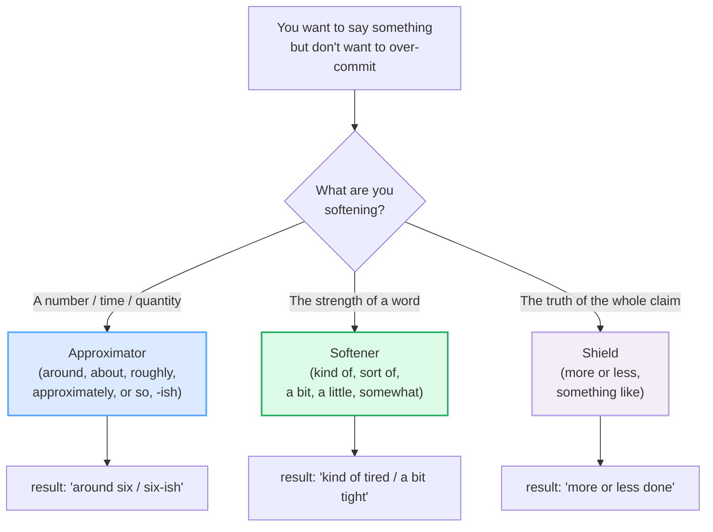

# Hedging & Vagueness

> **Phase 4 · discourse · bundle #66 · Days 131–132.**
> *"kind of", "a bit", "ish", "around" — softening.*
>
> 🔗 This bundle polishes the fluency layer that earlier phases set up:
> [OPINIONS HEDGED](../speech_acts/OPINIONS_HEDGED.md) (Phase 1) drills the
> *speech-act* hedges ("I'd say…", "Correct me if I'm wrong…") — this bundle
> drills the *lexical* hedges that soften almost any word. In writing mode,
> [EDITING: HEDGING & TONE](../writing/EDITING_HEDGING.md) (Phase 3) covers the
> *calibration* of academic/professional hedging — this bundle covers the
> *spoken, informal* end. Read them as a set.

---

## Why this is bundle #66 (read this first)

A Vietnamese learner who has survived Phases 0–3 is intelligible, can handle the
speech acts, and can write the genres. What still makes them sound *foreign* —
even *blunt* — is that they are **too precise**. "The meeting is at 3:00. It
costs $50. I am tired." Each sentence is a hard, unsoftened claim. A native
speaker in the same spot says "The meeting is **around** three, **kind of**?
It's **fifty-ish** bucks. I'm **a bit** tired." Nothing is lost in accuracy;
everything is gained in warmth.

English uses vagueness as **politeness, informality, and flexibility** — it lets
the speaker *not over-commit* and lets the hearer save face. Vietnamese, by
contrast, tends toward precision and directness: time is exact, a price is a
number, a state is named. So the Vietnamese learner sounds either robotic
(every figure exact) or abrupt (claims unsoftened). Learning to **hedge on
demand** is the single biggest "sounds native" upgrade left.

This bundle is spoken-first: the role-play is primary, the writing task is a
short hedge-it-three-ways drill.

---

## 1. The mechanism: three jobs, one family of words

Hedging/vagueness items all do versions of the same thing — **they weaken the
speaker's commitment** — but the literature (Prince, Frader & Bosk 1980;
Channel 1994) splits them by *what* they weaken:

| Family | Weakens… | Members | Example |
|---|---|---|---|
| **Approximators** ("rounders") | the *precision* of a number/time/qty | around · about · roughly · approximately · or so · **-ish** | "We left **around** 8 o'clock." |
| **Softeners** ("adaptors") | the *force* of the word that follows | kind of · sort of · a bit · a little · somewhat | "These trousers are **a bit** tight." |
| **Shields** ("plausibility shields") | the *truth* of the whole claim | more or less · something like | "I've **more or less** finished." |

> From `hedging_vagueness_corpus.md` (the three families, verbatim):
>
> - Approximators → **around** /əˈraʊnd/, **about** /əˈbaʊt/, **roughly**
>   /ˈrʌfli/, **approximately** /əˈprɒksɪmətli/–/əˈprɑːksɪmətli/, **or so**
>   /ər ˈsəʊ/–/ər ˈsoʊ/, **-ish** /ɪʃ/
> - Softeners → **kind of** /ˌkaɪnd əv/, **sort of** /ˈsɔːt əv/–/ˈsɔːrt əv/,
>   **a bit** /ə bɪt/, **a little** /ə ˈlɪtl/, **somewhat** /ˈsʌmwɒt/–/ˈsʌmwʌt/
> - Shields → **more or less** /ˌmɔːr ər ˈles/, **something like**
>   /ˈsʌmθɪŋ laɪk/

---

## 2. Approximators — "around six", "fifty-ish", "an hour or so"

The polite way to give a number you're not 100% sure of, or that doesn't need to
be exact. Oxford's *approximately* entry itself lists the whole set in its
"Ways of saying approximately" bank and grades them: **about is the most
common, approximately the most formal.** For speaking, default to **around** /
**about** / **-ish**; save *approximately* for written or formal contexts.

> From `hedging_vagueness_corpus.md`:
>
> - **around** / **about**: "We left **around/about** 8 o'clock." (Oxford,
>   *around*)
> - **roughly**: "Sales are up by **roughly** 10 per cent." (Oxford, *roughly*)
> - **or so**: "We are expecting thirty **or so** people to come." (Oxford,
>   *approximately* bank)

**The `-ish` suffix** is the spoken-English specialty (§B of the corpus). Clip
`/ɪʃ/` onto a number, time, colour, or adjective and you've hedged it in one
syllable: **six-ish** ("around six"), **thirtyish** ("about thirty"),
**reddish**, **tired-ish**. Oxford lists this as a real sense of the suffix
("fairly; approximately"). Vietnamese has nothing like it, so it feels odd to
learners — but it is *the* signature of casual native speech.

> From `hedging_vagueness_corpus.md` (PINNED — the two anchors):
>
> - **kind of** /ˌkaɪnd əv/ — "It was **kind of** strange to see him again."
>   (Cambridge, *kind of*)
> - **-ish** (suffix) /ɪʃ/ — "fairly; approximately — **reddish**,
>   **thirtyish**." (Oxford, *-ish*) → spoken extension: **six-ish** /sɪks ɪʃ/.

---

## 3. Softeners — "kind of tired", "a bit tight", "sort of"

Softeners sit *before* the word they weaken. **kind of** and **sort of** are the
two most frequent downtoners in spoken English (Jucker, Smith & Lüdge 2003) and
Channel (1994) calls them "the most stereotypical" vague-language items. They
do two jobs at once: they mark the claim as approximate *and* they mark the
register as informal/friendly.

There is a transatlantic split worth drilling (Oxford, *bit*):

| | British English | North American English |
|---|---|---|
| default softener | **a bit** tight | **a little** / **a little bit** tight |
| both accept | kind of / sort of | kind of / sort of |

> From `hedging_vagueness_corpus.md`:
>
> - **a bit**: "These trousers are **a bit** tight." / "I was **a bit**
>   disappointed by the film." (Oxford, *bit*)
> - **sort of**: "She **sort of** pretends that she doesn't really care." /
>   "'Do you understand?' '**Sort of**.'" (Oxford, *sort of*)
> - **somewhat**: "I was **somewhat** surprised to see him." (Oxford,
>   *somewhat* — "(rather formal)")

> **Register ladder:** *a bit / a little* (informal, spoken) → *kind of / sort
> of* (informal, very common) → *somewhat* (formal, written) → *rather*
> (formal, slightly BrE). For daily speech, live in the first two rungs.

---

## 4. Shields — "more or less finished", "something like that"

Shields hedge the *truth of the proposition*, not a number. *More or less* is
the workhorse: Oxford gives it two senses — **"almost"** and **"approximately"**
— so it floats between shield and approximator. *Something like* leaves a
referent unnamed ("something like $50" = "around $50, give or take").

> From `hedging_vagueness_corpus.md`:
>
> - **more or less**: "I've **more or less** finished the book." (almost) /
>   "She could earn $200 a night, **more or less**." (approximately) (Oxford,
>   *less*)
> - **something like**: "something like, something approaching or
>   approximating." (Collins / Dictionary.com, *like*)

---

## 5. The social function — why natives hedge so much

This is the part Vietnamese learners most often miss. Hedging is not weakness or
evasion; in English it does **three positive social jobs** (Overstreet 1999,
2005; Channel 1994):

1. **Politeness / face-saving.** "It's **kind of** expensive" lets the hearer
   react without a hard claim being rejected. (🔗 See
   [POLITENESS STRATEGIES](#) — Phase 4 bundle #68, the negative-face layer.)
2. **Informality / warmth.** "Let's meet **around six-ish**" signals "we're
   friends, no need to be exact." Precision reads as formal or cold.
3. **Flexibility / not over-committing.** "It's **more or less** done" keeps an
   escape hatch if it turns out *not* to be fully done.

The cost of *never* hedging is being read as blunt, over-precise, or
over-claiming. The cost of *over*-hedging is sounding uncertain or evasive
(🔗 [EDITING: HEDGING & TONE](../writing/EDITING_HEDGING.md) covers the
calibration). The target is the **middle**: hedge casual claims freely, state
professional facts cleanly.

---

## 6. Cheat sheet — the ≤8 survival chunks

The Pareto set. Drill these eight aloud until each one rolls out automatically.
(Every row is a corpus attestation above.)

| # | Chunk | IPA | Why it's here |
|---|---|---|---|
| 1 | **kind of** | /ˌkaɪnd əv/ | the #1 softener — "kind of strange" |
| 2 | **-ish** (six-ish) | /ɪʃ/ | the spoken approximating suffix — "six-ish" |
| 3 | **a bit** | /ə bɪt/ | the BrE softener — "a bit tired" |
| 4 | **sort of** | /ˈsɔːt əv/ | kind of's twin — "Sort of." |
| 5 | **around** | /əˈraʊnd/ | the NAmE approximator — "around 8" |
| 6 | **about** | /əˈbaʊt/ | the commonest approximator — "about fifty" |
| 7 | **or so** | /ər ˈsəʊ/–/ər ˈsoʊ/ | postposed approximator — "an hour or so" |
| 8 | **more or less** | /ˌmɔːr ər ˈles/ | the shield — "more or less done" |

> Open [`hedging_vagueness.html`](./hedging_vagueness.html) to drill these as
> flip cards, hear native clips, play the "let's meet" role-play, shadow, and
> hedge a sentence three ways.

---

## 7. Vietnamese → English L1 pitfalls table

The "expert payoff." These are the specific interference traps a Vietnamese
speaker hits on hedging and vagueness — extend, don't replace, the seed rows
from the spec.

| Vietnamese trap (what you do) | English fix (what to do instead) |
|---|---|
| **Too precise / too direct** — "The meeting is at 3:00. It costs $50." (exact, unsoftened, because Vietnamese states time/price as fixed numbers) | Soften the claim: "It's **around** three." / "Fifty-**ish** bucks." Hedge by default in casual speech; reserve precision for when it's actually needed. |
| **Never softens a claim** — "I am tired." / "It is expensive." (no *kind of / a bit*, because Vietnamese marks degree with separate words like *hơi*, not a pre-word filler) | Insert a softener before adjectives/states: "I'm **kind of** tired." / "It's **a bit** expensive." Drill *hơi* → *a bit / kind of* as a translation habit. |
| **The `-ish` suffix is unfamiliar** — Vietnamese has no bound morpheme that means "approximately," so learners either ignore "six-ish" or misread it as the adjective suffix (*childish*) | Learn `-ish` as its own chunk: number/time + /ɪʃ/ = "around ___". Practise **six-ish, seven-ish, forty-ish**. Remember the standalone **"Ish."** too ("I've finished. Ish."). |
| **Translates literally → "more or less" becomes "nhiều hoặc ít"** (which means a quantity, not a hedge) | Treat **more or less** as one unit = "almost / approximately": "I've **more or less** finished." Don't decompose it. |
| **Over-formal in casual chat** — reaches for *approximately* / *somewhat* in speech (because textbooks taught the formal word) | Downshift in speech: *approximately* → **around/about**, *somewhat* → **kind of / a bit**. Save the formal ones for writing/emails. |
| **Drops the hedge under stress** — reverts to blunt claims when nervous (the L1 default resurfaces) | Pre-load one hedge per turn: decide *before* you speak whether the claim is exact. If not, attach **around / -ish / a bit** automatically. |
| **Confuses *a bit* (small degree) with *a bit of a* (rather a — often negative)** — "It's a bit of a problem" is stronger than "It's a bit expensive" | Learn the frame: **a bit + adjective** = slightly; **a bit of a + noun** = rather a (often bad): "a bit of a mess / a bit of a pain." |
| **Mispronounces the weak *of* in *kind of / sort of*** — says /ɒv/ or /ɑːv/ fully (because *of* is taught with its strong form) | Weak-form the *of*: **kind of** /ˌkaɪnd əv/ → often /ˌkaɪndə/. 🔗 See [LINKING](../pronunciation/LINKING.md) and [REDUCTIONS](../pronunciation/REDUCTIONS.md) — weak *of* is the same reduction as in *cup of tea*. |

---

## How to practise this bundle (the daily 20 min)

1. **READ** (5 min) — this guide, §1–§5.
2. **SHADOW** (7 min) — open `hedging_vagueness.html`, drill the 8 flip cards +
   the "let's meet" role-play **aloud**, leaning into every hedge word
   (*around*, *-ish*, *kind of*, *a bit*).
3. **PRODUCE** (8 min) — the writing task: take a blunt sentence and hedge it
   three ways (one with *kind of*, one with *around*, one with *-ish*). Read it
   aloud; check each hedge is audible and that you didn't over-hedge.

---

## Sources

- Oxford Advanced Learner's Dictionary —
  https://www.oxfordlearnersdictionaries.com/definition/english/{word}
  (entries for *around, about, roughly, approximately, ish [adverb & -ish
  suffix], bit, little, somewhat, sort, less, more*; the *approximately*
  "Ways of saying approximately" bank is the spine of §A; the *bit*
  "British/American a bit / a little" box is the transatlantic split in §3)
- Cambridge Advanced Learner's Dictionary —
  https://dictionary.cambridge.org/dictionary/english/kind-of
  (entry for *kind of*: "used when you are trying to explain or describe
  something, but you cannot be exact" — the PINNED anchor)
- Collins English Dictionary —
  https://www.collinsdictionary.com/dictionary/english/like
  (entry for *like*, sub-entry "something like" = *about*, approximating)
- Dictionary.com — https://www.dictionary.com/browse/like
  ("something like, something approaching or approximating")
- Prince, E., Frader, J. & Bosk, C. (1980). "On hedging in physician-physician
  discourse." — the **rounders / shields (plausibility & attribution) /
  adaptors** taxonomy (§1).
- Lakoff, R. (1973). "Hedges: a study in meaning criteria." — the founding
  hedge list (*sort of, kind of, loosely speaking, more or less, roughly,
  pretty (much)*).
- Channel, J. (1994). *Vague Language* (OUP) — *kind of/sort of* as the
  stereotypical vague items; downtoner/adaptor analysis.
- Jucker, A., Smith, S. & Lüdge, M. (2003). "Interactive aspects of vagueness
  in conversation." *Journal of Pragmatics* 35 — frequency of *sort of/kind of*
  in conversation.
- Overstreet, M. (1999, 2005). Vague language — the social functions
  (informality, solidarity, shared knowledge), via *Language Teaching* review
  (https://www.cambridge.org/core/journals/language-teaching/article/vague-language-in-business-and-academic-contexts/5E666D5B406FE453E9B3FD79EE1848DA)
  and *Pragmatics* 24(1).
- Frequency methodology: wordfrequency.info (spoken sub-corpus) —
  https://www.wordfrequency.info/ (ranks marked `≈`).
- Native audio: YouGlish — https://youglish.com/pronounce/{chunk}/english/us?
  (all 12 focus clips verified HTTP 200 on 2026-06-24.)
