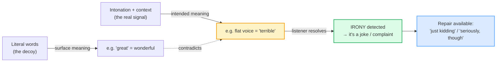
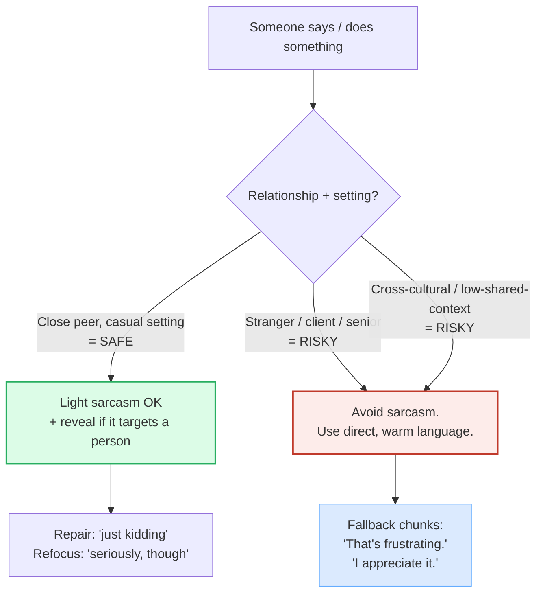

# Light Humor &amp; Sarcasm

> **Phase 4 · discourse · bundle #67 · Days 133–134.**
> *Deadpan delivery; knowing when not to.*
>
> 🔗 This bundle leans on three earlier ones:
> [INTONATION](../pronunciation/INTONATION.md) (the rising/falling pitch that
> *is* the sarcasm signal), [HEDGING &amp; VAGUENESS](./HEDGING_VAGUENESS.md)
> (softening is the cousin of the "just kidding" reveal), and
> [REGISTER SWITCHING](./REGISTER_SWITCHING.md) (sarcasm is register-loaded —
> casual only, never with a senior at work).

---

## Why humor &amp; sarcasm is bundle #67 (read this first)

A Vietnamese learner who has reached Phase 4 can already *say* most things.
What they still cannot do is **recognize when a native speaker is joking at
them** — and that single gap causes two opposite, equally costly failures:

1. **Taking a sarcastic line literally.** A colleague mutters *"Oh, great.
   The printer's broken again."* The learner hears the word *great* and files
   the situation as positive. The conversation drifts apart.
2. **Misusing sarcasm and offending.** The learner hears *"Yeah, right"* used
   for laughs and tries it on their manager. It reads as insubordination.

Both failures share one root cause: **English sarcasm = verbal irony** — saying
the *opposite* of what you mean, carried almost entirely by **intonation and
context**, not by the words. Vietnamese has irony too (research finds Vietnamese
speakers actually use it *more* often than Americans in some slots — 15.5% vs
9.4% in one working-class corpus), but the **prosodic cues are different**, the
**acceptable targets are different**, and the **repair moves** (*just kidding*,
*seriously, though*) are language-specific chunks the learner has not yet
acquired.

This bundle teaches the **eight highest-frequency sarcastic/humor chunks**, the
**deadpan delivery** that makes them work, the **reveal** that keeps them safe,
and — crucially — **when not to deploy them at all**.

---

## 1. The mechanism: English sarcasm is irony carried by intonation

| | English sarcasm (the target) | Vietnamese L1 instinct |
|---|---|---|
| Core device | **Verbal irony** — say the opposite, mean the reverse | Irony exists, but humor leans more on wordplay + shared context |
| Main signal carrier | **Intonation** (flat/deadpan OR exaggerated "happy" prosody) + facial expression | More lexical/contextual; less reliance on pitch contour |
| Default repair move | **"Just kidding" / "I'm joking"** reveal after a tease | Different repair chunks, or none (the tease stands) |
| Refocus move | **"Seriously, though" / "Jokes aside"** to pivot back | Often a full re-statement rather than a discourse marker |
| Risk if misread | Taken literally → confusion, OR lands as rude → offense | Tease may read as sincerity; refusal may read as insult |

The single sentence to internalize:

> **In English sarcasm, the WORDS lie and the INTONATION tells the truth.**
> *"Oh, great."* with a flat, slow voice means *"Oh no."* The word *great* is a
> decoy; the deadpan pitch is the real message.

---

## 2. The five sarcastic one-liners (say the OPPOSITE)

These five are the highest-frequency ironic moves. **Every one means the
reverse of its literal words.** The deadpan intonation is what flips it.

> From `humor_sarcasm_corpus.md` (section A, verbatim):
>
> - **Yeah, right.** /ˌjeə ˈraɪt/ — "I don't believe you"
> - **Oh, great.** /ˌəʊ ˈɡreɪt/ UK · /ˌoʊ ˈɡreɪt/ US — "Oh no, that's bad"
> - **Lucky me.** /ˌlʌki ˈmiː/ — "How unlucky for me"
> - **Big deal.** /ˌbɪɡ ˈdiːl/ — "That's not impressive / not important"
> - **Wow, what a surprise.** /ˌwaʊ wɒt ə səˈpraɪz/ UK · /ˌwaʊ wət ə sərˈpraɪz/
>   US — "That's completely expected"

**The Vietnamese trap (the "great" trap):** the learner hears *"Oh, great"* and
translates the *word* → *tuyệt vời* → assumes the speaker is pleased. They miss
that the flat, falling intonation + the bad context (a broken printer, a
cancelled flight) = the speaker is **annoyed**. The fix is to **listen to the
pitch, not the lexical meaning**: if *great* is said slowly, flatly, or with a
long drawn-out vowel, it almost always means the opposite.

---

## 3. The false friend: "Tell me about it" is NOT a question

This one line causes more cross-cultural confusion than the five above
combined, because it is **not even sarcastic** — but its literal reading is the
exact opposite of its real function.

> From `humor_sarcasm_corpus.md` (section B):
>
> - **Tell me about it.** /ˌtel miː əˈbaʊt ɪt/ — "I completely agree, I've
>   experienced that myself" (NOT a request for more information)

**The Vietnamese trap:** a colleague complains *"This traffic is killing me."*
The learner hears *"Tell me about it"* and — translating word by word —
launches into a detailed description of their own commute. The native speaker
meant **the opposite of a request**: they meant *"I know exactly what you mean,
I've been there."* It is a **sympathy / agreement chunk**, functionally
identical to *"I feel you"* or *"I know, right?"*

> The Cambridge Dictionary registers it under the topic *Accepting and
> agreeing*, glossed: "used to say that you already know how bad something is,
> especially because you have experienced it yourself."

🔗 Contrast this with [SYMPATHY &amp; CONCERN](../speech_acts/SYMPATHY.md) —
"Tell me about it" lives in the same functional family as *"That sounds rough"*
but with the ironic twist that its words look like a question.

---

## 4. The reveal: "Just kidding" keeps a tease safe

A sarcastic or teasing line is a small social risk. English speakers **routinely
repair immediately** with a reveal that says "that was a joke, not an attack."
Mastering these three chunks is what lets a learner experiment with humor
without burning relationships.

> From `humor_sarcasm_corpus.md` (section C, verbatim):
>
> - **Just kidding.** /ˌdʒʌst ˈkɪdɪŋ/ — "I was only joking"
> - **I'm joking.** /aɪm ˈdʒəʊkɪŋ/ UK · /aɪm ˈdʒoʊkɪŋ/ US — "I am not serious"
> - **Kidding!** /ˈkɪdɪŋ/ — short form of "just kidding"

**The Vietnamese trap:** Vietnamese teases often *stand without repair* — the
shared context carries the "it's a joke" signal. In English, skipping the
reveal on a tease aimed at a person (especially their work, appearance, or
English) reads as a **genuine insult**. The rule of thumb: **if a tease targets
a person, follow it with a reveal within one or two turns.**

> Oxford's model line for *kid*: *"Don't look so worried—I was just kidding."*

---

## 5. The refocus: "Seriously, though" closes the joke

After a stretch of banter, English speakers use a **pivot marker** to signal
"the joking is over, here is the real point." These three close the humorous
bracket and reopen sincerity.

> From `humor_sarcasm_corpus.md` (section D, verbatim):
>
> - **Seriously, though.** /ˌsɪəriəsli ˈðəʊ/ UK · /ˌsɪriəsli ˈðoʊ/ US — "Now,
>   in all seriousness"
> - **But actually.** /ˌbʌt ˈæktʃuəli/ — "On the other hand, the real point
>   is…"
> - **Jokes aside.** /ˌdʒəʊks əˈsaɪd/ UK · /ˌdʒoʊks əˈsaɪd/ US — "Setting the
>   jokes aside"

🔗 These belong to the same family as the discourse markers in
[DISCOURSE MARKERS](./DISCOURSE_MARKERS.md) — *though* here is doing the same
"pivot" job that *anyway* and *so* do for topic shifts, but specifically for
**register shifts** (joking → serious).

---

## 6. Deadpan delivery: the prosody IS the sarcasm

The words are the same; the intonation flips the meaning. These five prosodic
cues are documented across the verbal-irony research (see Sources). Drill them
in the shadowing lane — a sarcastic line said with genuine enthusiasm is either
missed or sounds unhinged.

| Cue | What it sounds like | Signals |
|---|---|---|
| **Flat / deadpan** | Pitch held level, slower, no enthusiasm | The literal meaning is NOT intended |
| **Exaggerated "happy" prosody** | Over-rising pitch, drawn-out vowel | Irony by mismatch with a bad context |
| **Falling intonation on "Yeah, right."** | Drops at the end (not rising) | "I don't believe you" |
| **Nasalized / drawled vowel** | *"gr-eat"*, *"ri-ight"* — lengthened + nasal | A cross-cultural sarcasm marker |
| **Eye contact + pause after** | Hold gaze, then a beat of silence | Invites the listener to "get it" before repair |

> **The golden delivery rule:** when in doubt, **go flatter and slower than
> feels natural.** Vietnamese learners tend to over-animate English (carrying
> syllable-timed energy into a stress-timed language), which kills deadpan. A
> sarcastic *"Oh, great."* should sound almost bored.

---

## 7. Knowing when NOT to joke (the pragmatic boundary)

This is the part most ESL material skips, and it is where Vietnamese learners
get hurt. Sarcasm is **register-loaded**: it is casual speech, and it carries
real social risk in the wrong slot.

**The four "do not deploy" zones:**

1. **Upward status** — never sarcastic to a manager, client, or teacher. It
   reads as insubordination or rudeness, not humor.
2. **Cross-cultural / low-shared-context** — sarcasm needs shared context to
   land. With a stranger or a non-native interlocutor, it routinely misfires.
3. **A tease that targets English ability, appearance, or identity** — these
   are not "light"; they wound even with a reveal.
4. **Written channels without tone cues** — text, email, Slack without an
   emoji. *Yeah, right.* in an email reads as aggression, not banter. Use
   [IM / SLACK STYLE](../writing/IM_SLACK_STYLE.md) tone markers (emoji-as-tone)
   if you must joke in writing.

> Research on Vietnamese EFL pragmatics found that **addressees tended to read
> sarcasm as MORE severe than the speaker intended.** Assume your tease hits
> harder than you think.

---

## 8. Cheat sheet — the ≤8 survival chunks

The Pareto set. Drill these eight aloud with the deadpan intonation until the
flat tone is automatic. (Every row is a corpus attestation above.)

| # | Chunk | IPA | Why it's here |
|---|---|---|---|
| 1 | **Yeah, right.** | /ˌjeə ˈraɪt/ | sarcastic disbelief — the #1 ironic line |
| 2 | **Oh, great.** | /ˌəʊ ˈɡreɪt/ UK · /ˌoʊ ˈɡreɪt/ US | sarcastic "oh no" (deadpan) |
| 3 | **Lucky me.** | /ˌlʌki ˈmiː/ | sarcastic "how unfortunate for me" |
| 4 | **Big deal.** | /ˌbɪɡ ˈdiːl/ | sarcastic "not impressive / not important" |
| 5 | **Tell me about it.** | /ˌtel miː əˈbaʊt ɪt/ | warm agreement (NOT literal — false friend) |
| 6 | **Just kidding.** | /ˌdʒʌst ˈkɪdɪŋ/ | the safe reveal after a tease |
| 7 | **Seriously, though.** | /ˌsɪəriəsli ˈðəʊ/ UK · /ˌsɪriəsli ˈðoʊ/ US | refocus from joke to real point |
| 8 | **Wow, what a surprise.** | /ˌwaʊ wɒt ə səˈpraɪz/ UK · /ˌwaʊ wət ə sərˈpraɪz/ US | sarcastic "completely expected" |

> Open [`humor_sarcasm.html`](./humor_sarcasm.html) to drill these as flip
> cards, hear native clips, play the banter role-play, shadow the deadpan
> delivery, and write your own sarcastic line + refocus.

---

## 9. Vietnamese → English L1 pitfalls table

The "expert payoff." These are the specific interference traps a Vietnamese
speaker hits on humor and sarcasm — extend, don't replace, the seed rows from
the spec.

| Vietnamese trap (what you do) | English fix (what to do instead) |
|---|---|
| **Takes sarcasm literally** — hears *"Oh, great"* on a broken printer and assumes the speaker is pleased | **Listen to the intonation, not the word.** Flat/slow/deadpan pitch = the meaning is the reverse. If in doubt, watch the speaker's face, not the dictionary. |
| **Translates "Tell me about it" as a request** → launches into a detailed story when the speaker meant agreement | Treat it as a **fixed agreement chunk** = *"I know what you mean / I've been there."* Never respond with more information. |
| **Skips the "just kidding" reveal** after a tease (Vietnamese teases often stand without repair) | **Always follow a person-targeted tease with a reveal** within 1–2 turns: *"Just kidding" / "I'm joking."* No reveal = it reads as a genuine insult. |
| **Deploys sarcasm upward** — to a manager, client, or senior (carries L1 peer-banter norms into a status gap) | **Sarcasm is casual register only.** With a senior, use direct warm language instead: *"That's frustrating" / "I appreciate it."* See [REGISTER SWITCHING](./REGISTER_SWITCHING.md). |
| **Uses sarcasm in writing without tone cues** — *"Yeah, right."* in an email reads as aggression | In text/email/Slack, either **drop the sarcasm** or **add a tone marker** (emoji, "😄", "/s"). See [IM / SLACK STYLE](../writing/IM_SLACK_STYLE.md). |
| **Over-animates the delivery** — carries syllable-timed energy into a line that needs deadpan | **Go flatter and slower than feels natural.** A sarcastic *"Oh, great."* should sound almost bored. Drill the shadowing lane. |
| **Misreads the falling vs rising "Yeah, right."** — rising = genuine question, falling = sarcasm | Drill the **falling contour** for the sarcastic use. A rising *"Yeah, right?"* = "is that true?"; a falling *"Yeah, right."* = "I don't believe you." |
| **Targets English ability / appearance / identity** in a tease (thinks it's light) | These are **never light** in English, even with a reveal. Tease shared situations, not personal traits. |
| **Jokes across a cultural gap** where shared context is thin | Sarcasm needs shared context to land. With strangers or non-natives, **default to sincere** until rapport is built. |
| **Misses the "Seriously, though" pivot** — keeps joking when the room has gone serious | Read the register shift; **close the joke** with *"Seriously, though" / "Jokes aside"* the moment the topic turns real. |

---

## How to practise this bundle (the daily 20 min)

1. **READ** (5 min) — this guide, §1–§7.
2. **SHADOW** (7 min) — open `humor_sarcasm.html`, drill the 8 flip cards +
   the banter role-play **aloud**, exaggerating the deadpan tone first, then
   relaxing it. Pay special attention to the falling contour on *"Yeah, right."*
3. **PRODUCE** (8 min) — the writing task: write **one light humorous/sarcastic
   line** aimed at a safe target (a situation, not a person), then **a
   "seriously, though" refocus** that pivots to a real point. Read it aloud and
   check the deadpan lands.

---

## Sources

- Oxford Advanced Learner's Dictionary — `yeah` + "yeah, right" idiom — https://www.oxfordlearnersdictionaries.com/definition/english/yeah
- Oxford Advanced Learner's Dictionary — `great` /ɡreɪt/ (ironic example "Oh great, they left without us.") — https://www.oxfordlearnersdictionaries.com/definition/english/great_1
- Oxford Advanced Learner's Dictionary — `deal` /diːl/ + "big deal!" idiom — https://www.oxfordlearnersdictionaries.com/definition/english/deal_1
- Oxford Advanced Learner's Dictionary — `serious` /ˈsɪəriəs/ UK · /ˈsɪriəs/ US — https://www.oxfordlearnersdictionaries.com/definition/english/serious
- Oxford Advanced Learner's Dictionary — `kid` /kɪd/, `kidding` /ˈkɪdɪŋ/ — https://www.oxfordlearnersdictionaries.com/definition/english/kid_2
- Oxford Advanced Learner's Dictionary — `joke` /dʒəʊk/ — https://www.oxfordlearnersdictionaries.com/definition/english/joke_1
- Oxford Advanced Learner's Dictionary — `lucky` /ˈlʌki/ + "lucky you, me, etc." idiom — https://www.oxfordlearnersdictionaries.com/definition/english/lucky
- Oxford Advanced Learner's Dictionary — `surprise` /səˈpraɪz/ UK · /sərˈpraɪz/ US + "surprise, surprise" ironic idiom — https://www.oxfordlearnersdictionaries.com/definition/english/surprise_1
- Oxford Advanced Learner's Dictionary — `right` /raɪt/ — https://www.oxfordlearnersdictionaries.com/definition/english/right_1
- Cambridge Dictionary — *Accepting and agreeing* topic ("tell me about it!") — https://dictionary.cambridge.org/us/topics/expressing-agreement-and-support/accepting-and-agreeing/
- "Pragmatics and Implied Meaning" (American English Online) — flat/slow delivery cue — https://americanenglish.online/blog/2026/03/02/pragmatics-and-implied-meaning/
- "Mastering Irony in English Listening: A Pragmatic Approach" — https://dimeloeningles.com/listening/mastering-irony-in-english-listening-a-pragmatic-approach/
- "Acquiring irony" (ResearchGate) — nasalized/drawled-vowel sarcasm marker — https://www.researchgate.net/publication/358035263_Acquiring_irony
- "Gestural codas pave the way to the understanding of verbal irony" (ScienceDirect) — eye-contact + pause cue — https://www.sciencedirect.com/science/article/abs/pii/S0378216615002714
- "A Review on Second Language Learners' Irony Comprehension" (IJLLL) — https://www.ijlll.org/vol8/330-RA0034.pdf
- "A Comparative Study of Vietnamese and American Working-Class Humor" (IJSCL) — https://www.ijscl.com/article_732233_32d0d7bb4034aae2d88667f31f0f0f22.pdf
- "Pragmatic strategies used by Vietnamese EFL learners" (NIE Singapore repository) — sarcasm read as more severe than intended — https://repository.nie.edu.sg/server/api/core/bitstreams/6a730e77-4aa4-42db-afee-d2fec850054b/content
- "Recognition of Sarcasm" (Northern Arizona University) — L2 instruction improves recognition — https://nau.edu/wp-content/uploads/sites/117/2018/05/Karakoc_Seval_PIE_report.pdf
- BBC Learning English — *The English We Speak* ("Tell me about it") — https://www.bbc.co.uk/learningenglish/features/the-english-we-speak/ep-200608
- Native audio: YouGlish — https://youglish.com/pronounce/{chunk}/english/us?
- Frequency methodology: wordfrequency.info (spoken sub-corpus) — https://www.wordfrequency.info/
