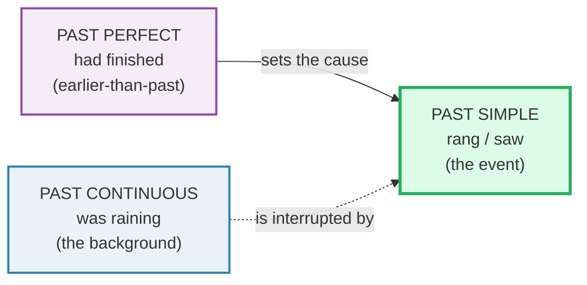
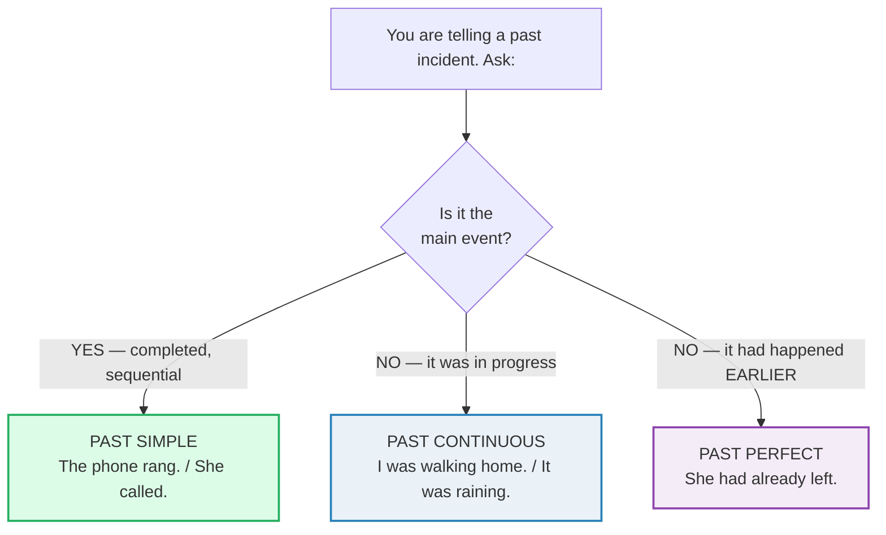

# Narrative Tenses

> **Phase 4 · discourse · bundle #80 · Days 159–160.**
> *Past simple + past continuous + past perfect.*
>
> 🔗 This bundle is the grammar engine behind storytelling. It pairs with
> [STORYTELLING STRUCTURE](./STORYTELLING_STRUCTURE.md) (the *shape* of a story:
> setting → tension → turn → payoff) and with
> [ANECDOTES](../speech_acts/ANECDOTES.md) (the spoken frames: *"So then…" / "The
> funny thing is…"*). Those bundles give you the **skeleton** and the **phrases**;
> this one gives you the **tenses** that make a past incident sound layered
> instead of flat.

---

## Why this bundle exists (read this first)

A flat story sounds like a list: *"I go home. I see her. She cry."* Even with
past tense bolted on — *"I went home. I saw her. She cried."* — it is still a
**sequence of equals**: event, event, event. Native narration is never that. It
layers time: one thing **was happening** (the background), something **happened**
(the event that landed), and something **had already happened** before either of
them (the cause the listener needs). Three tenses, three jobs, one sentence.

The Vietnamese learner's problem is brutal and specific: **Vietnamese has no tense
inflection at all.** Past is shown by a time word (*đã*), ongoing by *đang*,
future by *sẽ* — the verb never changes shape. So the instinct is to **collapse
all past narration into one flat past**, losing exactly the background/event and
earlier/layer distinctions that make English narrative sound native. This bundle
rebuilds those three layers.

---

## 1. The three layers (what each tense does)

| Tense | Form | Job in a story | One-line feel |
|---|---|---|---|
| **Past simple** | *walked / went / rang* | the **events** — completed, sequential | "this happened" |
| **Past continuous** | *was walking / was raining* | the **background** — in progress, then interrupted | "this was going on" |
| **Past perfect** | *had finished / had left* | the **earlier past** — done before the story's now | "this had already happened" |

Read it as: the **past continuous** paints the scene, the **past simple** is the
action that breaks into it, and the **past perfect** is the hidden cause that
made it all happen. Master those three and a five-sentence anecdote sounds like a
native told it.

---

## 2. Past simple — the backbone events

The past simple carries the **main events** — things that started and finished.
It is the default, the workhorse, the tense you reach for first.

> From `narrative_tenses_corpus.md`:
>
> | walked | called | went | rang | saw | left | arrived |
> |---|---|---|---|---|---|---|
> | /wɔːkt/ UK · /wɑːkt/ US | /kɔːld/ UK · /kɑːld/ US | /went/ | /ræŋ/ | /sɔː/ UK · /sɑː/ US | /left/ | /əˈraɪvd/ |
>
> Each is a completed event. The British Council "Past simple" reference attests
> the function: *"something that happened once in the past"* and *"something that
> happened several times"* — both land in the past simple.

**The Vietnamese trap:** with no verb inflection in L1, learners either drop the
past entirely (*"Yesterday I go"*) or reach for one form and freeze there.
🔗 See [FINAL CONSONANTS](../pronunciation/FINAL_CONSONANTS.md) §3 — the `-ed`
allomorphs (/t/ /d/ /ɪd/) are the *sound* layer of past simple; this bundle is
the *meaning* layer.

---

## 3. Past continuous — the background

The past continuous is **scenery in motion**. It sets what *was going on* when
the main event struck. Form: *was/were* + `-ing`.

> From `narrative_tenses_corpus.md`:
>
> - **was walking** /wəz ˈwɔːkɪŋ/ — ongoing movement (background)
> - **was raining** /wəz ˈreɪnɪŋ/ — weather in progress (background)
> - **was driving** /wəz ˈdraɪvɪŋ/ — ongoing act of driving (background)
> - **was waiting** /wəz ˈweɪtɪŋ/ — ongoing act of waiting (background)
>
> British Council attests the function verbatim: *"The children **were doing**
> their homework when I **got** home."* and *"The other day I **was waiting** for
> a bus when…"* — the `-ing` clause is the backdrop; the past-simple clause is
> the thing that landed in it.

**Why it matters:** without the continuous, a story has no atmosphere. *"It
rained. I walked. The phone rang."* is a police report. *"It **was raining**. I
**was walking** home. The phone **rang**."* is a story — the `-ing` paints what
was already alive when the event hit.

---

## 4. Past perfect — the earlier past

The past perfect is the **hidden layer**: what had *already* happened before the
story's now — usually the cause the listener needs to make sense of the event.
Form: *had* + past participle.

> From `narrative_tenses_corpus.md`:
>
> - **had finished** /həd ˈfɪnɪʃt/ — completed before another past moment
> - **had left** /həd left/ — gone away before another past moment
> - **had lost** /həd lɒst/–/həd lɑːst/ — misplaced before another past moment
> - **had gone** /həd ɡɒn/–/həd ɡɑːn/ — departed before another past moment
>
> British Council attests the function verbatim: *"I **had finished** the work."*;
> *"I couldn't get into the house. I **had lost** my keys."*; *"Teresa wasn't at
> home. She **had gone** shopping."* — the *had*-clause is always *earlier* than
> the simple-past frame around it.

**The Vietnamese trap:** there is no "earlier-than-past" concept in Vietnamese.
A learner narrates *"I lost my keys. I couldn't get in"* as two equal pasts,
which works — but misses the *causal* link the past perfect makes automatic:
*"I couldn't get in because I **had lost** my keys"* tells the listener *the loss
caused the problem*. That is the nuance intermediates drop.

---

## 5. The interplay — three tenses, one sentence

This is the whole bundle in one move. The three tenses combine in two
high-frequency patterns:

### 5a. Background + interrupting event

> From `narrative_tenses_corpus.md`:
>
> > **I was walking when I saw…** /aɪ wəz ˈwɔːkɪŋ wen aɪ sɔː/
>
> Past continuous (the backdrop) **+ when +** past simple (the event that broke
> in). Oxford attests the exact shape: *"I was walking down the street when I
> suddenly felt ill."*

### 5b. "By the time" + past perfect

> From `narrative_tenses_corpus.md`:
>
> > **By the time we arrived, she had already left.**
> > /baɪ ðə taɪm wiː əˈraɪvd ʃiː həd ɔːlˈredi left/
>
> Past simple (the later arrival) meets past perfect (the earlier thing already
> done). *By the time* is the canonical trigger that forces the past perfect.

### 5c. Sequence: "After … had … , …"

> From `narrative_tenses_corpus.md`:
>
> > **After I had eaten, I left.** /ˈɑːftər aɪ həd ˈiːtn̩ aɪ left/
>
> Past perfect (the first, completed action) then past simple (the next event).
> *After* makes the order explicit, so the past perfect is optional here — but it
> adds the "this was fully done first" nuance.

---

## 6. Cheat sheet — the ≤8 survival chunks

The Pareto set. Drill these eight aloud until the three layers feel automatic.
(Every row is a corpus attestation above.)

| # | Chunk | IPA | Why it's here |
|---|---|---|---|
| 1 | **I was walking when I saw…** | /aɪ wəz ˈwɔːkɪŋ wen aɪ sɔː/ | background + interrupting event (pinned) |
| 2 | **By the time we arrived, she had already left.** | /baɪ ðə taɪm wiː əˈraɪvd ʃiː həd ɔːlˈredi left/ | past simple meets past perfect (pinned) |
| 3 | **The phone rang.** | /ðə fəʊn ræŋ/ | past simple — a completed event lands |
| 4 | **It was raining.** | /ɪt wəz ˈreɪnɪŋ/ | past continuous — atmospheric background |
| 5 | **I had finished.** | /aɪ həd ˈfɪnɪʃt/ | past perfect — earlier-than-past |
| 6 | **She called.** | /ʃiː kɔːld/ | past simple — a completed action |
| 7 | **After I had eaten, I left.** | /ˈɑːftər aɪ həd ˈiːtn̩ aɪ left/ | sequence: past perfect then past simple |
| 8 | **I was on my way home.** | /aɪ wəz ɒn maɪ weɪ həʊm/ | past continuous — the in-progress backdrop |

> Open [`narrative_tenses.html`](./narrative_tenses.html) to drill these as flip
> cards, hear native clips, play the role-play, shadow, and write the incident.

---

## 7. Vietnamese → English L1 pitfalls table

The "expert payoff." Vietnamese has **no tense morphology**: past = *đã*, ongoing
= *đang*, future = *sẽ* — the verb never inflects. So the entire three-layer
system collapses in a Vietnamese learner's mouth.

| Vietnamese trap (what you do) | English fix (what to do instead) |
|---|---|
| **No tense inflection** → collapse all past narration to one flat form: *"I go home, then she call"* (L1 *đã* carries it mentally, never aloud) | Mark **every** past verb. Past simple is the default: *"I **went** home, then she **called**."* Drill the irregulars (go→went, ring→rang, see→saw, leave→left). |
| **No continuous concept** → *"It rain. I walk home."* loses the in-progress backdrop | Add *was/were + -ing* for anything **in progress when** the event hit: *"It **was raining**. I **was walking** home."* The `-ing` paints the scene; without it, the story has no atmosphere. |
| **No "earlier-than-past" concept** → narrate cause and event as two equal pasts: *"I lose my keys. I can't get in."* | Use *had + past participle* for the **earlier** cause: *"I couldn't get in because I **had lost** my keys."* The past perfect makes the causal layer automatic. |
| **Confuses the two pasts** → uses past continuous where past simple belongs: *"The phone was ringing"* (still going) vs the event *"The phone rang"* | Ask: *did it finish, or was it in progress?* Finished = past simple (*rang*); in-progress-then-interrupted = past continuous (*was ringing*). |
| **Overuses past perfect** (taught it exists, now force it everywhere) → *"After I had arrived, I had eaten"* | Past perfect is for the **earlier** of two pasts only. With *after*, the order is already clear, so past simple often suffices: *"After I arrived, I ate."* Reserve *had* for genuine earlier-past nuance. |
| **Drops the `-ed` / mispronounces it** → *"walk"* for *walked*, *"call"* for *called*, or full-syllable *"walk-ed"* | The sound layer: /t/ /d/ /ɪd/. 🔗 See [FINAL CONSONANTS](../pronunciation/FINAL_CONSONANTS.md) §3 — never say the "e" in `-ed` unless the stem ends in /t/ or /d/. |
| **Translates *đã* as past perfect** → *"I had went home"* (double-marking) | *đã* = simple past by default. Reserve *had* for the earlier-than-past layer only. Never combine *had* with a past-simple form (*had went* ✗ → *had gone* ✓ / *went* ✓). |

---

## How to practise this bundle (the daily 20 min)

1. **READ** (5 min) — this guide, §1–§5.
2. **SHADOW** (7 min) — open `narrative_tenses.html`, drill the 8 flip cards +
   the role-play **aloud**, exaggerating the three layers (background `-ing`,
   event past simple, earlier past `had`).
3. **PRODUCE** (8 min) — the writing task: **narrate a short incident using past
   simple + past continuous + past perfect.** 4–6 sentences minimum, all three
   tenses interacting. Read it aloud; check each layer is doing its job.

---

## Sources

- British Council — "Past simple" — https://learnenglish.britishcouncil.org/grammar/english-grammar-reference/past-simple
- British Council — "Past continuous" — https://learnenglish.britishcouncil.org/grammar/english-grammar-reference/past-continuous
- British Council — "Past perfect" — https://learnenglish.britishcouncil.org/grammar/english-grammar-reference/past-perfect
- Cambridge Grammar of English (Carter & McCarthy, CUP) — narrative-tenses interplay; "by the time" + past perfect.
- Cambridge Grammar (british-grammar) — https://dictionary.cambridge.org/grammar/british-grammar/
- Oxford Advanced Learner's Dictionary (verb forms + IPA + example sentences) — https://www.oxfordlearnersdictionaries.com/definition/english/{walk_1,leave_1,rain_1,finish_1}
- Cambridge Advanced Learner's Dictionary (IPA + irregular forms) — https://dictionary.cambridge.org/dictionary/english/{call,went,ring,see,arrive,drive,wait,happen,lose,go}
- Native audio: YouGlish — https://youglish.com/pronounce/{chunk}/english/us?
- Frequency methodology: wordfrequency.info (spoken sub-corpus) — https://www.wordfrequency.info/
- Style anchor: `english/pronunciation/final_consonants_corpus.md`
