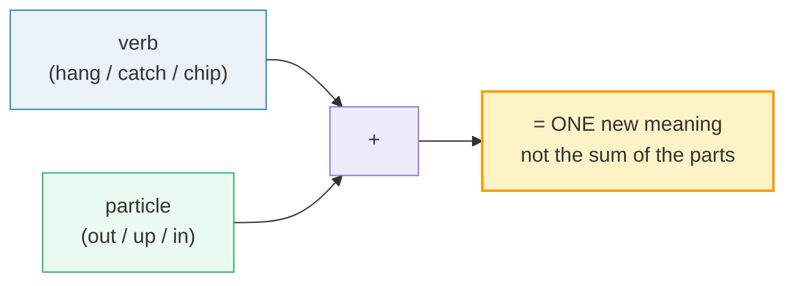

# Phrasal Verbs: Social

> **Phase 4 · discourse · bundle #71 · Days 141–142.**
> *'hang out', 'catch up', 'drop by', 'chip in'.*
>
> 🔗 Sibling bundles in the fluency arc: [FREQUENCY IDIOMS](./FREQUENCY_IDIOMS.md)
> (the same "chunk, not word" discipline applied to top idioms), and the planned
> work counterpart `phrasal_verbs_work` (bundle #70, "follow up / roll out / push
> back / reach out") — same verb+particle engine, different register (social vs
> office). Also leans on [SMALL TALK](../speech_acts/SMALL_TALK.md) (these verbs
> live in casual social turns) and [LINKING](../pronunciation/LINKING.md) (the
> verb glides into the particle: *hang‿out*, *chip‿in*).

---

## Why this bundle (read this first)

Native social English runs on **phrasal verbs** — a verb + a little particle
(*out, up, by, in, along, together*) that fuse into one meaning. "Let's **hang
out** and **catch up**" is how two friends actually talk; "Let us **associate**
and **exchange information**" is how no one talks. The social register *is* the
phrasal-verb register.

The Vietnamese learner's problem is structural, not lexical. **Vietnamese has no
verb+particle structure at all** — every verb is a single morpheme (*gặp* = meet,
*đóng góp* = contribute, *ghé thăm* = drop in). So there is no mental slot for
"two words = one verb." Two failure modes follow, both of which make a learner
sound stiff or broken in a casual setting:

1. **Reach for the formal one-word synonym** — "accompany" instead of **tag
   along**, "contribute" instead of **chip in**, "visit" instead of **drop by**.
   Grammatically fine, socially wrong — it sounds like a textbook, not a friend.
2. **Translate the verb alone and drop the particle** — "I will *meet* my friends
   this weekend" (loses the casual *meet up*); or worse, translate the parts
   literally and produce nonsense ("catch up" ≠ grab something upward).

This bundle drills the **8 social phrasal verbs** that cover the overwhelming
majority of casual "making plans / hanging out" turns. Each is a real, cited
Cambridge attestation — nothing invented.

---

## 1. The mechanism: verb + particle = ONE meaning

A phrasal verb is a **single semantic unit**. The particle does **not** keep its
literal spatial meaning — *out* in *hang out* is not "outdoors," *up* in *catch
up* is not "upward." This is the core trap: word-by-word translation yields
nonsense.

Crucially, these eight are **informal / casual register**. You would not write
"we should hang out" in a formal cover letter — but in a text to a friend, the
single-word synonym ("we should socialize") sounds cold. **Register is the
meaning.** Using the chunk signals "we are casual friends."

---

## 2. The 8 social verbs, with real examples

> From `phrasal_verbs_social_corpus.md` (§A1 — spending time together):
>
> - **hang out** /hæŋ ˈaʊt/ — "to spend a lot of time in a place or with someone"
>   (informal, B1). *"I've been hanging out backstage with the band."* /
>   *"They spent the whole day hanging out by the pool."*
> - **catch up** /kætʃ ˈʌp/ — "to learn or discuss the latest news" (B2).
>   *"Let's go for a coffee — I need to catch up on all the gossip."* /
>   American dict: *"Let's have a coffee next week and catch up."*
> - **get together** /ɡet təˈɡeð.ər/ — "(of two or more people) to meet each
>   other, having arranged it before." *"Shall we get together on Friday and go
>   for a drink or something?"*
> - **meet up** /miːt ˈʌp/ — "to meet another person in order to do something
>   together." *"I met up with a couple of friends after school to play tennis."*

> From `phrasal_verbs_social_corpus.md` (§A2 — visiting & arriving):
>
> - **drop by** /drɒp ˈbaɪ/ UK · /drɑːp ˈbaɪ/ US — "to come to see someone,
>   usually briefly and without a specific invitation."
>   *"He dropped by the woman's house to ask for money."*
> - **show up** /ʃəʊ ˈʌp/ UK · /ʃoʊ ˈʌp/ US — "to arrive somewhere in order to
>   join a group of people, especially late or unexpectedly" (B1, informal).
>   *"I invited him for eight o'clock, but he didn't show up until 9.30."*

> From `phrasal_verbs_social_corpus.md` (§A3 — contributing & accompanying):
>
> - **chip in** /tʃɪp ˈɪn/ — "to give some money when several people are giving
>   money to pay for something together" (informal, C2).
>   *"They all chipped in £100 and bought their mother a trip to Greece."*
> - **tag along** /tæɡ əˈlɒŋ/ UK · /tæɡ əˈlɑːŋ/ US — "to go somewhere with a
>   person or group, usually when they have not asked you to go with them"
>   (informal). *"I don't know her, she just tagged along with us."*

> **Pinned sanity check:** the corpus MUST contain — and does — the Cambridge
> entry for **hang out** `/hæŋ/` at
> https://dictionary.cambridge.org/dictionary/english/hang-out, and **catch up**
> `/kætʃ/` at https://dictionary.cambridge.org/dictionary/english/catch-up.
> These are real, clickable attestations, not invented.

---

## 3. Literal vs figurative — the translation trap

This table is the single most useful page for a Vietnamese learner. **Never
translate the parts.** Learn the chunk as one word.

| Phrasal verb | ❌ Literal reading (the trap) | ✅ Real social meaning | Vietnamese learner's stiff synonym → use this instead |
|---|---|---|---|
| **hang out** | suspend something outdoors | spend casual time together | *associate* → **hang out** |
| **catch up** | grab something upward | update each other on news | *exchange information* → **catch up** |
| **drop by** | let something fall near | visit briefly, unannounced | *visit* → **drop by** |
| **chip in** | break a piece inward | contribute money/effort together | *contribute* → **chip in** |
| **show up** | display upward | arrive / appear (often late) | *arrive* → **show up** |
| **meet up** | encounter upward | meet socially | *meet* → **meet up** |
| **tag along** | label along a line | accompany (often uninvited) | *accompany* → **tag along** |
| **get together** | obtain togetherness | meet socially (pre-arranged) | *gather* → **get together** |

🔗 The "one chunk = one meaning" habit is the same muscle as
[FREQUENCY IDIOMS](./FREQUENCY_IDIOMS.md) — once you stop translating word by
word, both idioms and phrasal verbs unlock at once.

---

## 4. Pronunciation: link the verb into the particle

In fast speech the verb **glides** into the particle — they are not two separate
stressed beats. 🔗 This is straight out of
[LINKING](../pronunciation/LINKING.md): consonant-to-vowel linking.

- *hang out* → /hæŋ‿ˈaʊt/ (the /ŋ/ of *hang* is the launch for *out*)
- *chip in* → /tʃɪp‿ˈɪn/ (the /p/ of *chip* links to the /ɪ/ of *in*)
- *meet up* → /miːt‿ˈʌp/ (the /t/ of *meet* links to the /ʌ/ of *up*)

Stress lands on the **particle**, not the verb: *hang **OUT***, *chip **IN***,
*meet **UP***. (Exception-feeling: *GET together* stresses the verb, because
*together* is a long content word.) Mis-stressing — *HANG out* — is an instant
tell.

---

## 5. Cheat sheet — the 8 survival chunks

The Pareto set. Drill these aloud until the verb glides into the particle and the
stress falls on the particle. (Every row is a corpus attestation in §2.)

| # | Chunk | IPA | Why it's here |
|---|---|---|---|
| 1 | **hang out** | /hæŋ ˈaʊt/ | the #1 "spend casual time" verb — replaces stiff *socialize* |
| 2 | **catch up** | /kætʃ ˈʌp/ | "exchange news" — replaces *exchange information*; NOT "grab upward" |
| 3 | **drop by** | /drɒp ˈbaɪ/ UK · /drɑːp ˈbaɪ/ US | brief unannounced visit — replaces *visit* |
| 4 | **chip in** | /tʃɪp ˈɪn/ | contribute money/effort together — replaces *contribute* |
| 5 | **show up** | /ʃəʊ ˈʌp/ UK · /ʃoʊ ˈʌp/ US | arrive (often unexpectedly) — replaces *arrive* |
| 6 | **meet up** | /miːt ˈʌp/ | meet socially — replaces *meet* (casual) |
| 7 | **tag along** | /tæɡ əˈlɒŋ/ UK · /tæɡ əˈlɑːŋ/ US | accompany (often uninvited) — replaces *accompany* |
| 8 | **get together** | /ɡet təˈɡeð.ər/ | meet socially (pre-arranged) — replaces *gather* |

> Open [`phrasal_verbs_social.html`](./phrasal_verbs_social.html) to drill these
> as flip cards, hear native clips, play the making-plans role-play, shadow, and
> write.

---

## 6. Vietnamese → English L1 pitfalls table

The "expert payoff." These are the specific interference traps a Vietnamese
speaker hits on social phrasal verbs — extend, don't replace, the seed rows from
the spec.

| Vietnamese trap (what you do) | English fix (what to do instead) |
|---|---|
| **Vietnamese has no verb+particle structure** → treats "hang out" as two words, translates only "hang" | Learn the chunk as ONE lexical unit. Drill *hang out* like a single word; never split the meaning across the parts. |
| **Reaches for the formal one-word synonym** — "I will *accompany* my friends" / "let us *contribute*" | Swap to the casual chunk in social settings: *tag along*, *chip in*. The Latinate verb sounds like a textbook among friends. |
| **Translates the parts literally** — thinks *catch up* = "grab upward", *chip in* = "break inward" | Memorize the figurative meaning (§3). *Catch up* = update each other on news; *chip in* = contribute. The particle carries no spatial sense here. |
| **Drops the particle entirely** — "we will *meet* this weekend" (loses casual *meet up*) | Always produce the full chunk. The particle IS the casual register — without it, *meet* is neutral/formal. |
| **Mis-stresses the verb** — *HANG out*, *CHIP in* (stressing the verb like Vietnamese syllable-timing) | Stress the **particle**: *hang **OUT***, *chip **IN***, *meet **UP***. Vietnamese is syllable-timed (every beat equal); English phrasal verbs are not. |
| **No linking** → pronounces *hang out* as two separate words with a glottal break | Link consonant-to-vowel: /hæŋ‿ˈaʊt/, /tʃɪp‿ˈɪn/. 🔗 See [LINKING](../pronunciation/LINKING.md). |
| **Drops the final consonant of the verb** → "han-out" for *hang out*, "chi-in" for *chip in* | Release the verb's final consonant — it's the launch for the particle. 🔗 See [FINAL CONSONANTS](../pronunciation/FINAL_CONSONANTS.md). |
| **Confuses *meet up* (casual, 1x) vs *get together* (pre-arranged social)** as interchangeable | *Meet up* = any informal meet; *get together* implies a planned social occasion (often a small gathering). Match the nuance. |
| **Uses these in formal writing** — "I will *hang out* with the client" in an email | Register check: these are **informal/spoken**. In workplace writing use the single verb or a more formal phrase. 🔗 See [REGISTER SWITCHING](./REGISTER_SWITCHING.md). |

---

## How to practise this bundle (the daily 20 min)

1. **READ** (5 min) — this guide, §1–§4.
2. **SHADOW** (7 min) — open `phrasal_verbs_social.html`, drill the 8 flip cards
   + the making-plans role-play **aloud**, gliding the verb into the particle and
   stressing the particle.
3. **PRODUCE** (8 min) — the writing task: use **3 social phrasal verbs** in
   sentences about your own weekend plans. Read them aloud; check each verb links
   into its particle and the stress is on the particle.

---

## Sources

- Cambridge Advanced Learner's Dictionary — `hang out` — https://dictionary.cambridge.org/dictionary/english/hang-out
- Cambridge Advanced Learner's Dictionary — `catch up` — https://dictionary.cambridge.org/dictionary/english/catch-up
- Cambridge Academic Content Dictionary — `drop by (somewhere)` — https://dictionary.cambridge.org/dictionary/english/drop-by
- Cambridge Advanced Learner's Dictionary — `chip (something) in` — https://dictionary.cambridge.org/dictionary/english/chip-in
- Cambridge Advanced Learner's Dictionary — `show up` — https://dictionary.cambridge.org/dictionary/english/show-up
- Cambridge Advanced Learner's Dictionary — `meet up` — https://dictionary.cambridge.org/dictionary/english/meet-up
- Cambridge Advanced Learner's Dictionary — `tag along` — https://dictionary.cambridge.org/dictionary/english/tag-along
- Cambridge Advanced Learner's Dictionary — `get together` — https://dictionary.cambridge.org/dictionary/english/get-together
- Oxford Advanced Learner's Dictionary — `catch-up` noun (US /ˈketʃ ʌp/ corroborated) — https://www.oxfordlearnersdictionaries.com/definition/english/catch-up_2
- Native audio: YouGlish — https://youglish.com/pronounce/{chunk}/english/us? (all 8 chunks return HTTP 200)
- L1 morphology background: Nguyen, "The systematic reduction of English syllable-final consonants" (GMU Linguistics Club) — https://orgs.gmu.edu/lingclub/WP/texts/6_Nguyen.pdf ; "Vietnamese Phonology: A Complete Guide" (Remitly) — https://www.remitly.com/blog/education/vietnamese-phonology-guide/
- Frequency methodology: wordfrequency.info (spoken sub-corpus) — https://www.wordfrequency.info/
