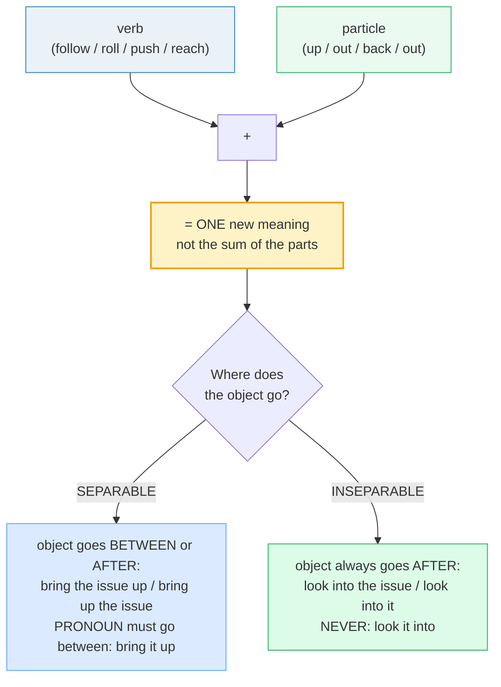

# Phrasal Verbs: Work

> **Phase 4 · discourse · bundle #70 · Days 139–140.**
> *'follow up', 'roll out', 'push back', 'reach out'.*
>
> 🔗 Sibling bundles in the fluency arc:
> [PHRASAL VERBS: SOCIAL](./PHRASAL_VERBS_SOCIAL.md) (same verb+particle engine,
> social register — *hang out* / *catch up* / *chip in*), and
> [REGISTER SWITCHING](./REGISTER_SWITCHING.md) (when to use the phrasal verb vs
> the Latinate synonym). Also leans on
> [STATUS UPDATES](../workplace/STATUS_UPDATES.md) (these verbs live in standups
> and follow-up emails) and [LINKING](../pronunciation/LINKING.md) (the verb
> glides into the particle: *follow‿up*, *reach‿out*).

---

## Why this bundle (read this first)

Native workplace English runs on **phrasal verbs** — a verb + a little particle
(*up, out, back, into, with*) that fuse into one meaning. "I'll **follow up**
with the client and **reach out** to the design team" is how two colleagues
actually talk in a standup; "I will **pursue** the matter and **initiate
contact** with the design department" is how no one talks. The office register
*is* the phrasal-verb register.

The Vietnamese learner's problem is structural, not lexical. **Vietnamese has no
verb+particle structure at all** — every verb is a single morpheme (*theo dõi* =
follow up, *liên hệ* = contact, *điều tra* = investigate, *trì hoãn* = postpone).
So there is no mental slot for "two words = one verb." Two failure modes follow,
both of which make a learner sound stiff or broken in a fast office exchange:

1. **Avoid the phrasal verb entirely** — reach for the formal Latinate
   single-word synonym: "investigate" instead of **look into**, "postpone"
   instead of **put off**, "contact" instead of **reach out**. Grammatically
   fine, socially wrong — it sounds like a legal brief, not a Slack message.
2. **Split the verb wrong** — place the object where it doesn't belong: *"look
   **it** into"* (inseparable — should be *"look into **it**"*) or *"bring up
   **it**"* (separable — should be *"bring **it** up"*). Both mark the speaker
   instantly as non-native.

This bundle drills the **8 workplace phrasal verbs** that cover the overwhelming
majority of office turns: following up, contacting, launching, delaying,
finishing, raising, investigating, and inventing. Each is a real, cited
dictionary attestation — nothing invented.

---

## 1. The mechanism: verb + particle = ONE meaning (+ grammar)

A phrasal verb is a **single semantic unit**. The particle does **not** keep its
literal spatial meaning — *up* in *follow up* is not "upward," *out* in *roll
out* is not "outdoors." This is the core trap: word-by-word translation yields
nonsense. Equally critical is the **grammar**: where does the object go?

Crucially, these eight are **standard workplace register** — not slang, not
overly formal. Using **look into** in a standup sounds natural; using
"investigate" sounds like a police report. Using **reach out** in a follow-up
email is standard American business English; using "initiate contact" sounds
like a robot. **Register is the meaning.** The phrasal verb says "we are
colleagues doing fast, practical work."

---

## 2. The 8 workplace verbs, with real examples

> From `phrasal_verbs_work_corpus.md` (§A1 — following up & contacting):
>
> - **follow up** /ˈfɒləʊ ʌp/ UK · /ˈfɑːloʊ ʌp/ US — "to find out more about
>   something, or take more action connected with it" (B2, **separable**).
>   *"The idea sounded interesting and I decided to **follow it up**."*
>   (Cambridge / Collins)
> - **reach out** /riːtʃ aʊt/ — "(especially North American English) to contact
>   somebody in order to get help, information, or to build a connection" (C1,
>   **inseparable**).
>   *"If you have any questions or concerns, please **reach out** to us at this
>   email address."* (Oxford)

> From `phrasal_verbs_work_corpus.md` (§A2 — launching, delaying & finishing):
>
> - **roll out** /rəʊl aʊt/ UK · /roʊl aʊt/ US — "to introduce or start to use a
>   new product, service, or system" (**separable**).
>   *"The **roll-out** of high-speed broadband and 5G networks is vital for the
>   city's future."* (Oxford)
> - **push back** /pʊʃ bæk/ — "to arrange a later time for something; also to
>   resist or oppose an idea, request, or deadline" (**separable**).
>   *"Can I **push back** our meeting to 27 May?"* (Macmillan)
> - **wrap up** /ræp ʌp/ — "(informal) to complete something such as an
>   agreement, a meeting, or a project" (**separable**).
>   *"That just about **wraps it up** for today."* (Oxford)

> From `phrasal_verbs_work_corpus.md` (§A3 — raising, investigating & inventing):
>
> - **bring up** /brɪŋ ʌp/ — "to mention a subject or start to talk about it"
>   (synonym: raise; **separable**).
>   *"**Bring it up** at the meeting."* (Oxford)
> - **look into** /lʊk ˈɪntə/ UK · /lʊk ˈɪntuː/ US — "to examine or investigate
>   something" (**inseparable**).
>   *"A working party has been set up to **look into** the problem."* (Oxford)
> - **come up with** /kʌm ʌp wɪð/ — "to think of something such as an idea or a
>   plan; to produce or invent something" (**inseparable**).
>   *"Is that the best you can **come up with**?"* (Macmillan)

> **Pinned sanity check:** the corpus MUST contain — and does — the Cambridge
> entry for **follow up** `/ˈfɒləʊ ʌp/` UK · `/ˈfɑːloʊ ʌp/` US at
> https://dictionary.cambridge.org/dictionary/english/follow-up, and the Oxford
> entry for **reach out** `/riːtʃ aʊt/` at
> https://www.oxfordlearnersdictionaries.com/definition/english/reach-out.
> These are real, clickable attestations, not invented.

---

## 3. Literal vs figurative + separable/inseparable — the two traps

This table is the single most useful page for a Vietnamese learner. **Never
translate the parts.** Learn the chunk as one word. AND learn where the object
goes — separable verbs let the object split the pair; inseparable verbs do not.

| Phrasal verb | ❌ Literal reading (the trap) | ✅ Real workplace meaning | Grammar | Pronoun-object test |
|---|---|---|---|---|
| **follow up** | pursue something upward | pursue / check on a previous action | separable | *follow **it** up* ✓ |
| **reach out** | extend one's arm outward | make contact / communicate | inseparable | *reach out **to them*** ✓ |
| **roll out** | unroll a mat | launch / introduce a product | separable | *roll **it** out* ✓ |
| **push back** | shove something backward | resist / delay / oppose | separable | *push **it** back* ✓ |
| **wrap up** | enclose in wrapping | finish / complete | separable | *wrap **it** up* ✓ |
| **bring up** | carry something upward | mention / raise a topic | separable | *bring **it** up* ✓ |
| **look into** | direct eyes inside | investigate / examine | inseparable | *look into **it*** ✓ · ~~look it into~~ ✗ |
| **come up with** | move upward with | invent / produce an idea | inseparable | *come up with **it*** ✓ |

> **The golden rule for separability:** if the verb is **separable**, a **pronoun**
> object MUST go between the verb and the particle — *"bring **it** up"*, never
> *"bring up it"*. If the verb is **inseparable**, the object ALWAYS follows the
> whole phrase — *"look into **it**"*, never *"look it into"*. This is the
> single most common grammar error for Vietnamese learners.

🔗 The "one chunk = one meaning" habit is the same muscle as
[PHRASAL VERBS: SOCIAL](./PHRASAL_VERBS_SOCIAL.md) and
[FREQUENCY IDIOMS](./FREQUENCY_IDIOMS.md) — once you stop translating word by
word, all three unlock at once.

---

## 4. Pronunciation: link the verb into the particle

In fast speech the verb **glides** into the particle — they are not two separate
stressed beats. 🔗 This is straight out of
[LINKING](../pronunciation/LINKING.md): consonant-to-vowel linking.

- *follow up* → /ˈfɒləʊ‿ʌp/ (the /ʊ/ of *follow* glides into the /ʌ/ of *up*)
- *reach out* → /riːtʃ‿aʊt/ (the /tʃ/ of *reach* links to the /aʊ/ of *out*)
- *bring up* → /brɪŋ‿ʌp/ (the /ŋ/ of *bring* is the launch for *up*)

Stress lands on the **particle**, not the verb: *follow **UP***, *reach **OUT***,
*push **BACK***. (Exception-feeling: *look **INTO*** and *come **UP** with* —
where the stress falls on the particle or the content word after it.)
Mis-stressing — ***FOLLOW** up* — is an instant tell.

---

## 5. Cheat sheet — the 8 survival chunks

The Pareto set. Drill these aloud until the verb glides into the particle, the
stress falls on the particle, and the object goes in the right place. (Every row
is a corpus attestation in §2.)

| # | Chunk | IPA | Why it's here |
|---|---|---|---|
| 1 | **follow up** | /ˈfɒləʊ ʌp/ UK · /ˈfɑːloʊ ʌp/ US | pursue/check — replaces stiff *pursue*; separable |
| 2 | **reach out** | /riːtʃ aʊt/ | contact — replaces *initiate contact*; inseparable |
| 3 | **roll out** | /rəʊl aʊt/ UK · /roʊl aʊt/ US | launch a product — replaces *introduce*; separable |
| 4 | **push back** | /pʊʃ bæk/ | resist/delay — replaces *postpone* / *oppose*; separable |
| 5 | **wrap up** | /ræp ʌp/ | finish a meeting/project — replaces *conclude*; separable |
| 6 | **bring up** | /brɪŋ ʌp/ | mention a topic — replaces *raise* / *mention*; separable |
| 7 | **look into** | /lʊk ˈɪntə/ UK · /lʊk ˈɪntuː/ US | investigate — replaces *investigate*; inseparable |
| 8 | **come up with** | /kʌm ʌp wɪð/ | invent/produce an idea — replaces *devise*; inseparable |

> Open [`phrasal_verbs_work.html`](./phrasal_verbs_work.html) to drill these as
> flip cards, hear native clips, play the workplace role-play, shadow, and write.

---

## 6. Vietnamese → English L1 pitfalls table

The "expert payoff." These are the specific interference traps a Vietnamese
speaker hits on workplace phrasal verbs — extend, don't replace, the seed rows
from the spec.

| Vietnamese trap (what you do) | English fix (what to do instead) |
|---|---|
| **Vietnamese has no verb+particle structure** → treats "follow up" as two words, translates only "follow" | Learn the chunk as ONE lexical unit. Drill *follow up* like a single word; never split the meaning across the parts. |
| **Avoids phrasal verbs entirely** — "I will *investigate* the issue" / "I will *postpone* the meeting" | Swap to the workplace chunk: *look into*, *put off*, *push back*. The Latinate verb sounds like a legal brief in a standup. |
| **Wrong object placement** — "look **it** into" (inseparable, WRONG) vs "look **into it**" (RIGHT); "bring **up it**" (separable, WRONG) vs "bring **it** up" (RIGHT) | Learn separable vs inseparable per verb (§3). **Pronoun** objects always go between separable verbs; always after inseparable verbs. Drill the pattern. |
| **Translates the parts literally** — thinks *bring up* = "carry upward", *roll out* = "unroll a mat" | Memorize the figurative meaning (§3). *Bring up* = mention; *roll out* = launch. The particle carries no spatial sense here. |
| **Drops the particle entirely** — "I will *follow* the client" instead of "follow **up** with" | Always produce the full chunk. The particle IS the workplace meaning — without it, *follow* is a completely different verb. |
| **Register confusion** — uses the Latinate synonym in casual speech ("I will *initiate contact*") and the phrasal verb in formal writing ("I'll *reach out* to the Board") | Match register: phrasal verb = **standard/casual** workplace (Slack, standup, email to a peer); Latinate verb = **formal** (board memo, contract). 🔗 See [REGISTER SWITCHING](./REGISTER_SWITCHING.md). |
| **Mis-stresses the verb** — *FOLLOW up*, *REACH out* (syllable-timed like Vietnamese) | Stress the **particle**: *follow **UP***, *reach **OUT***, *push **BACK***. Vietnamese is syllable-timed (every beat equal); English phrasal verbs are not. |
| **No linking** → pronounces *follow up* as two separate words with a glottal break | Link verb-to-particle: /ˈfɒləʊ‿ʌp/, /riːtʃ‿aʊt/. 🔗 See [LINKING](../pronunciation/LINKING.md). |
| **Confuses *follow up* (pursue/check) with *follow* (go behind)** as the same verb | *Follow up* = take further action on a previous contact; *follow* = go behind physically. Different verbs entirely — the particle creates a new word. |

---

## How to practise this bundle (the daily 20 min)

1. **READ** (5 min) — this guide, §1–§4.
2. **SHADOW** (7 min) — open `phrasal_verbs_work.html`, drill the 8 flip cards
   + the workplace role-play **aloud**, gliding the verb into the particle,
   stressing the particle, and placing the object correctly.
3. **PRODUCE** (8 min) — the writing task: use **3 workplace phrasal verbs** in
   sentences with the correct separable/inseparable object placement. Read them
   aloud; check each verb links into its particle and the object is in the right
   spot.

---

## Sources

- Cambridge Advanced Learner's Dictionary — `follow up` — https://dictionary.cambridge.org/dictionary/english/follow-up
- Oxford Advanced Learner's Dictionary — `follow-up` adjective (UK /ˈfɒləʊ ʌp/ · US /ˈfɑːləʊ ʌp/ IPA corroborated) — https://www.oxfordlearnersdictionaries.com/definition/english/follow-up_2
- Oxford Advanced Learner's Dictionary — `reach out` — https://www.oxfordlearnersdictionaries.com/definition/english/reach-out
- Cambridge Advanced Learner's Dictionary — `roll out` — https://dictionary.cambridge.org/dictionary/english/roll-out
- Oxford Advanced Learner's Dictionary — `roll-out` noun (/ˈrəʊl aʊt/ corroborated) — https://www.oxfordlearnersdictionaries.com/definition/english/roll-out_2
- Macmillan Dictionary — `push back` — https://www.macmillandictionary.com/dictionary/british/push-back
- Oxford Advanced Learner's Dictionary — `wrap up` — https://www.oxfordlearnersdictionaries.com/definition/english/wrap-up_1
- Oxford Advanced Learner's Dictionary — `bring up` — https://www.oxfordlearnersdictionaries.com/definition/english/bring-up
- Oxford Advanced Learner's Dictionary — `look into` — https://www.oxfordlearnersdictionaries.com/definition/english/look-into
- Macmillan Dictionary — `come up with` — https://www.macmillandictionary.com/dictionary/british/come-up-with
- Collins English Dictionary — `follow up` (meaning corroborated) — https://www.collinsdictionary.com/dictionary/english/follow-up
- Cambridge Advanced Learner's Dictionary — `set up` / `put off` / `figure out` / `go ahead` (supplementary §C) — https://dictionary.cambridge.org/dictionary/english/{stem}
- Native audio: YouGlish — https://youglish.com/pronounce/{chunk}/english/us? (all 8 chunks return HTTP 200)
- Business-phrasal-verb frequency: "Who's afraid of phrasal verbs?" (English for Specific Purposes, ScienceDirect) — https://www.sciencedirect.com/science/article/pii/S1475158519301389
- L1 morphology background: Nguyen, "The systematic reduction of English syllable-final consonants" (GMU Linguistics Club) — https://orgs.gmu.edu/lingclub/WP/texts/6_Nguyen.pdf ; "Vietnamese Phonology: A Complete Guide" (Remitly) — https://www.remitly.com/blog/education/vietnamese-phonology-guide/
- Frequency methodology: wordfrequency.info (spoken sub-corpus) — https://www.wordfrequency.info/
