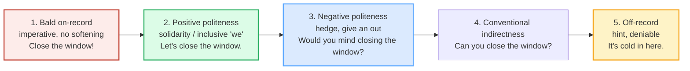

# Politeness Strategies

> **Phase 4 · discourse · bundle #68 · Days 135–136.**
> *Negative/positive face; indirectness as respect.*
>
> 🔗 Builds on [REQUESTING & OFFERING](../speech_acts/REQUESTING_OFFERING.md)
> (the bare "Could you…?" / "Shall I…?" forms) and
> [DIPLOMATIC DISAGREEMENT](../workplace/DIPLOMATIC_DISAGREEMENT.md) (softening
> a "no"). This bundle steps back to the **framework** that explains *why* those
> softeners exist — and why a request that feels polite in Vietnamese can land as
> blunt in English.

---

## Why indirectness is respect (not weakness)

A Vietnamese speaker asking a senior for help does it with **pronouns**: *em*
(younger-self) + *anh/chị* (older-respected-other) + *ạ* (deference particle).
The verb itself barely changes — politeness is **encoded in the hierarchy**, not
in the syntax. Switch to English and that ladder vanishes: there is no *anh/em*,
no *ạ*. So where does the respect *go*?

It goes into **indirectness**. English politeness is **syntactic**: the further
you push a request away from a bare imperative, the more respect you signal.
"Close the window" → "Can you close the window?" → "Would you mind closing the
window?" → "I was wondering if you could close the window?" — these all ask for
the same thing, but each extra layer of hedging says *"I recognise I'm imposing
on your freedom, and I'm giving you room to say no."*

> The trap: a Vietnamese learner who maps "polite" onto *pronouns* will, in
> English, use a bare imperative ("Send me the file") to a senior — because the
> verb feels the same as the Vietnamese verb did. To a native ear that reads as
> **a demand, not a request**. The fix is not to memorise more words; it is to
> internalise that **in English, indirectness = respect**.

This is the framework Brown & Levinson (1987) gave a name to: **face**.

---

## 1. The face framework (Brown & Levinson, 1987)

Every competent adult has two "face wants":

| | Negative face | Positive face |
|---|---|---|
| **Want** | freedom of action, unimpeded; not be imposed on | to be liked, approved of, seen as a member of the group |
| **A request threatens…** | …negative face (it imposes on your time/freedom) | …positive face (if it looks like rejection/disapproval) |
| **Repair strategy** | **Negative politeness** — hedge, apologise, give an "out" | **Positive politeness** — emphasise solidarity, use "we" |

A request is inherently **face-threatening** (it imposes). Brown & Levinson list
five ways to do it, ordered from most to least face-risky:

The further **right**, the more respect you show — and the more you let the hearer
say "no" without losing face. The further **left**, the more efficient but the
more imposing.

---

## 2. Negative politeness — give them an "out"

Negative politeness is the workhorse for requests to **seniors, strangers, and
anyone whose freedom you're imposing on**. The mechanism: pile on hedges that
make the request *easy to refuse*. Four high-frequency anchors:

> From `politeness_strategies_corpus.md`:
>
> - **Would you mind opening the window, please?** — *mind* /maɪnd/. Cambridge
>   Grammar calls "would you mind" the **most polite and most common** request
>   form ("would" < "do" in certainty).
> - **Could I possibly borrow this umbrella?** — *possibly* /ˈpɑː.sə.bli/ US.
>   Cambridge blog: "possibly" piled onto "could" maximises deference.
> - **I was wondering if you'd like to come to the movies with me** — *wonder*
>   /ˈwʌn.dɚ/ US. The past-continuous hedge turns a direct ask into a *tentative
>   thought*.
> - **If it's not too much trouble, could you help me?** — *trouble* /ˈtrʌb.əl/.
>   Minimises the imposition; flags you know you may be asking a lot.

**Why these work:** each one inserts distance — a modal (*could/would*), a hedge
(*possibly/wondering*), or a conditional (*if…*) — between the speaker and the
imposition. The hearer can decline ("Actually, I'm a bit busy") and neither side
loses face, because the request was never a bare command.

> **PINNED sanity-check:** "Would you mind…?" and "I was wondering if…" are the
> two anchors you should be able to produce on demand. Both are verbatim
> Cambridge attestations (see corpus §A). If you can swap *"Send me the report"*
> for *"I was wondering if you could send me the report?"*, you've made the
> single biggest politeness upgrade available to a Vietnamese L1 speaker.

---

## 3. Positive politeness — shrink the distance

Positive politeness works the **opposite** lever: instead of giving an "out", it
**claims common ground**. You and the hearer are on the same team; the request
is a shared project. The signature move is inclusive *we*:

> From `politeness_strategies_corpus.md`:
>
> - **Let's go to the park.** — *let's* /lets/. Inclusive imperative; frames the
>   action as joint.
> - **We could try the new place.** — *could* /kʊd/. Inclusive modal suggestion;
>   low-pressure, shared option.
> - **Perhaps we could go over it together.** — *perhaps* /pɚˈhæps/ US. Hedged
>   inclusive suggestion: "perhaps" softens while "we" bonds.

**When to use it:** with colleagues you're close to, in brainstorming, in
feedback ("We could tighten this section"), in any context where you want to
signal *we're aligned*. It is the English analog of the solidarity Vietnamese
expresses with kinship terms — but done with **syntax, not pronouns**.

---

## 4. The two poles — bald-on-record & off-record

| Strategy | What it is | When it's OK | Vietnamese-trap |
|---|---|---|---|
| **Bald-on-record** | bare imperative, no softening: "Close the window." | **low face-risk only**: intimates, emergencies, routine task-work | learners over-apply it to seniors → sounds like a demand |
| **Off-record** | a hint so indirect it's deniable: "It's cold in here." (= close the window) | when you want to avoid imposing at all, or test the waters | learners under-use it; also risk **missing** others' hints |

> From `politeness_strategies_corpus.md` (the same request, three levels — one
> ranked example set, HAL paper hal-03123952):
>
> - Level 1 (bald): **Close the window!**
> - Level 3 (conventional indirect): **Can you close the window?**
> - Level 5 (off-record): **It's cold in here.**

**Bald-on-record is not "impolite" by definition** — Brown & Levinson predict it
whenever face-risk is low (a friend, an emergency, a clear task). The error is
using it **where negative politeness is expected** (a senior, a stranger, a
favour). Conversely, off-record hints are **deniable** — which means the hearer
can also *miss* them. A learner who's used to direct, pronoun-encoded respect may
not register that "It's cold in here" *is* a request.

---

## 5. Cheat sheet — the ≤8 survival chunks

The Pareto set. These eight let you calibrate any request across the full face
scale. (Every row is a corpus attestation above.)

| # | Chunk | IPA | Strategy |
|---|---|---|---|
| 1 | **Could you possibly…?** | /ˈpɑː.sə.bli/ US | negative politeness (max deference) |
| 2 | **Would you mind…?** | /maɪnd/ | negative politeness (most common) |
| 3 | **I was wondering if…** | /ˈwʌn.dɚ.ɪŋ ɪf/ US | negative politeness (tentative) |
| 4 | **If it's not too much trouble** | /ˈtrʌb.əl/ | negative politeness (minimise imposition) |
| 5 | **Let's…** | /lets/ | positive politeness (inclusive imperative) |
| 6 | **We could…** | /wiː kʊd/ | positive politeness (shared option) |
| 7 | **It's cold in here.** | /ˈkoʊld ɪn hɪr/ US | off-record (hint) |
| 8 | **Close the window.** | /kloʊz/ US | bald-on-record (low-risk only) |

> Open [`politeness_strategies.html`](./politeness_strategies.html) to drill
> these as flip cards, hear native clips, play the three-level role-play,
> shadow, and rewrite a blunt request.

---

## 6. Vietnamese → English L1 pitfalls table

The "expert payoff." These are the specific interference traps a Vietnamese
speaker hits on politeness — the single concept where L1 and target diverge most
sharply.

| Vietnamese trap (what you do) | English fix (what to do instead) |
|---|---|
| **Politeness encoded via pronouns** (*anh/em*, *thưa*, *ạ*) — so you use the **same verb** to a senior as to a friend | In English, switch the **syntax**: push the request indirect (*Could you…?* / *I was wondering if…*). Indirectness *is* the respect *anh/em* used to carry. |
| **Too direct to seniors/strangers** — bare imperative ("Send me the file") reads as a **demand**, not a request | Add a modal + hedge: *"I was wondering if you could send me the file?"* The extra words are the politeness. |
| **Reads English indirectness as weakness/evasion** — "Would you mind…?" feels like the speaker is unsure or beating around the bush | Recalibrate: indirectness = **respect for the hearer's freedom**, not lack of confidence. A native who hedges is being polite, not weak. |
| **Misses off-record hints** — "It's cold in here" sounds like small talk, not a request | Learn the canonical hints. "It's cold in here" = close the window; "I should let you go" = I want to end the call. If a statement of fact *could* prompt an action, it may be a request. |
| **Over-applies bald-on-record** because Vietnamese imperatives are softened by *ạ*/pronouns, so the bare verb feels already-polite | In English the bare imperative has **no built-in softener**. Default to negative politeness for any request above casual-friend level. |
| **Confuses "no" after "Would you mind?"** — answers "Yes" meaning "yes I mind" | "Would you mind…?" expects **"No, not at all"** (= I don't mind = yes I'll do it). Replying "Yes" alone is ambiguous — say "Not at all" or "Of course." |
| **Drops the hedge, keeps only the modal** — "Could you send the report" (no softener) sounds curt vs "Could you possibly send the report?" | Stack at least **two** distance markers for high-stakes requests: modal + hedge (*Could you possibly / I was wondering if you could*). |
| **Translates *làm ơn* as a bare "please"** tacked on a command — "Close the window, please" is still bald-on-record with a tag | "Please" alone does **not** convert a command into a request. Use the indirect form *first*: "Would you mind closing the window?" |
| **No inclusive-"we" instinct** — suggests alone ("I think you should…") instead of jointly | Use **Let's / We could** to frame suggestions as shared. *"Perhaps we could go over it together"* bonds where *"You should fix this"* accuses. |

---

## How to practise this bundle (the daily 20 min)

1. **READ** (5 min) — this guide, §1–§4.
2. **SHADOW** (7 min) — open `politeness_strategies.html`, drill the 8 flip cards
   + the three-level role-play **aloud**. Pay attention to the **modal + hedge**
   stacking on the negative-politeness chunks.
3. **PRODUCE** (8 min) — the writing task: take a blunt request ("Send me the
   report", "Fix this bug", "Close the door") and rewrite it as politely indirect
   using *I was wondering if…*. Reveal the model answer and compare.

---

## Sources

- Brown, P. & Levinson, S. C. *Politeness: Some Universals in Language Usage* (CUP, 1987) — face framework, four super-strategies. PDF via MPG.PuRe — https://pure.mpg.de/rest/items/item_64421/component/file_2225570/content
- Wikipedia, "Politeness theory" — https://en.wikipedia.org/wiki/Politeness_theory
- Iowa State University, "Face and Politeness Theories" — https://dr.lib.iastate.edu/server/api/core/bitstreams/976d221e-a6d3-4b0a-afec-d9b8b035724c/content
- Cambridge Grammar — *Mind* — https://dictionary.cambridge.org/us/grammar/british-grammar/mind ("Would you mind opening the window, please?")
- Cambridge Dictionary blog, Woodford, "Would you mind reading this, please?" — https://dictionaryblog.cambridge.org/2014/04/30/would-you-mind-reading-this-please/ ("Could I possibly borrow this umbrella?")
- Cambridge Advanced Learner's Dictionary — https://dictionary.cambridge.org/us/dictionary/english/{word} (entries for *mind, wonder, possibly, perhaps, trouble, let, could, close, cold, window*)
- Cambridge Dictionary, *wonder* — https://dictionary.cambridge.org/us/dictionary/english/wonder ("I was wondering if you'd like to come to the movies with me")
- Auguie & Michelet, "Do indirect requests communicate politeness?" (HAL) — https://hal.science/hal-03123952 ("Close the window!" / "Can you close the window?" / "It's cold in here.")
- Bergen & Ward, "The Role of Prosody in Disambiguating English Indirect Requests" (UCSD) — https://pages.ucsd.edu/~bkbergen/papers/prosody.pdf
- PMC10158615, "Individual Differences in Indirect Speech Act Processing" — https://pmc.ncbi.nlm.nih.gov/articles/PMC10158615/
- Nguyen, "Requests and politeness in Vietnamese as a native language" (ResearchGate) — https://www.researchgate.net/publication/265913115
- Native audio: YouGlish — https://youglish.com/pronounce/{word}/english/us?
- Frequency methodology: wordfrequency.info (spoken sub-corpus) — https://www.wordfrequency.info/
