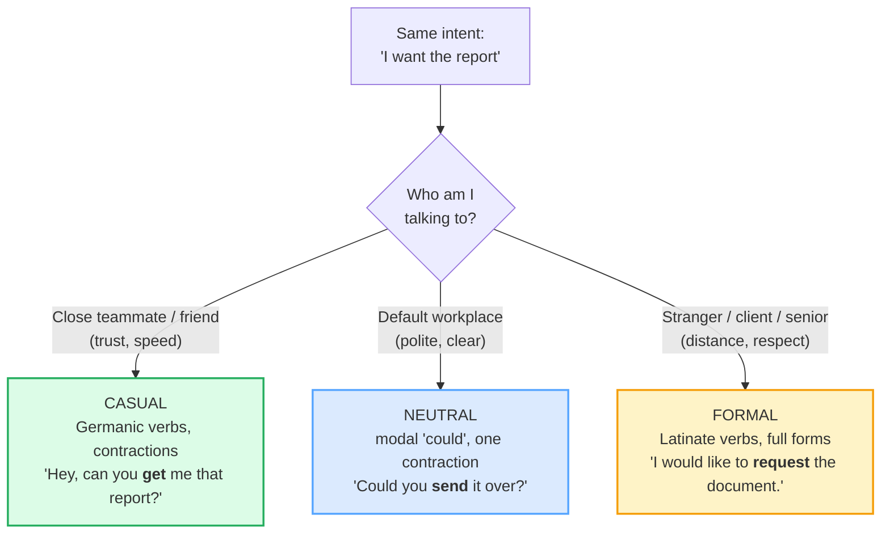

# Register Switching

> **Phase 4 · discourse · bundle #73 · Days 145–146.**
> *Same idea, three formality levels.*
>
> 🔗 This is the **spoken / discourse dimension** of register. The **written**
> dimension lives in [FORMAL CASUAL REGISTER](../writing/FORMAL_CASUAL_REGISTER.md)
> (Phase 3 · writing · bundle #47) — that bundle teaches email openers and
> contractions; **this** bundle teaches *why* English has two words for
> everything (the Latinate/Germanic history) and how to switch register **live,
> while speaking**. The two are a pair: read that one for the writing genre, this
> one for the historical WHY + the spoken ladder.

---

## Why this is a discourse bundle (read this first)

A Vietnamese learner who has studied English for years can still sound "off" in
one specific way: **the register is mixed within a single sentence.** They say
things like *"I endeavor to obtain a coffee"* — three Latinate, formal verbs
stacked around an everyday object — or *"The manager get the sufficient funds"*
— a casual Germanic verb glued to a formal Latinate adjective. Neither is
grammatically wrong. Both sound **jarring**, because a native speaker keeps the
whole utterance on **one rung of the ladder**.

English is unusual: it keeps **two words for the same idea** — a **Latinate**
twin (formal) and a **Germanic** twin (casual). This is not a style preference;
it is the residue of the **Norman Conquest of 1066** (see §2). The skill this
bundle builds is **matching the whole utterance to the audience** — and knowing
which twin to reach for.

---

## 1. The mechanism: register is a ladder, not a switch

The same intent (ask for a report) climbs through three rungs. Each rung swaps
**vocabulary** (Germanic → Latinate), **contractions**, and **hedging**:



> From `register_switching_corpus.md`:
>
> | casual | neutral | formal |
> |---|---|---|
> | Hey, can you **get** me that report? | Could you **send** it over when you have a moment? | I would like to **request** the document at your convenience. |
>
> The intent is identical. What changes is **vocabulary origin** (Germanic *get*
> → Latinate *request*), **contraction** (*can* → *would like to*), and
> **hedging** (none → "at your convenience").

**When each rung fits:**

| Rung | Use it when… | Sounds right with… |
|---|---|---|
| **Casual** (Germanic) | speed, trust, familiarity | friends, close teammates, family |
| **Neutral** (mixed) | the safe default; most workplace talk | colleagues you know, ordinary meetings |
| **Formal** (Latinate) | distance, respect, ceremony | strangers, clients, seniors, ceremonies, official documents |

---

## 2. The historical WHY: Latinate (formal) vs Germanic (casual)

This is the single fact that makes register switching **click** instead of being
a memorised list. English keeps two layers of vocabulary for the same idea
because of **one political event**:

1. **Before 1066** — English was a **West Germanic** language (Anglo-Saxon). Its
   everyday words — *buy, get, help, start, enough, end, ask, need* — were
   Germanic.
2. **1066 — the Norman Conquest** — French-speaking Normans conquered England
   and became the ruling class. For ~300 years, law, government, the church, and
   high culture ran in **French and Latin**. Their words — *purchase, obtain,
   assist, commence, sufficient, terminate, request, require* — entered English
   as the **formal, official, learned** layer.
3. **The result** — for hundreds of core concepts, English has a **Latinate
   twin** (formal) sitting next to a **Germanic twin** (casual). The formal twin
   never *replaced* the casual one; they **coexist**, and register is the choice
   between them.

```text
   GERMANIC (Anglo-Saxon, pre-1066)      LATINATE (French/Latin, post-1066)
   ─────────────────────────────────      ──────────────────────────────────
   buy      get     help    start          purchase  obtain  assist  commence
   enough   end     ask     need           sufficient terminate request require
   ▲ casual / everyday / spoken              ▲ formal / official / written
```

> From `register_switching_corpus.md` (the pinned anchors):
>
> - **purchase** /ˈpɜːtʃəs/ UK · /ˈpɜːrtʃəs/ US — Latinate, from Old French
>   *purchacier*. Cambridge pronunciation page: UK /ˈpɜː.tʃəs/, US /ˈpɝː.tʃəs/.
> - **buy** /baɪ/ — Germanic, Old English *bycgan*.
> - **commence** /kəˈmens/ — Latinate, from Old French *commencier*. Cambridge
>   pronunciation page: UK /kəˈmens/, US /kəˈmens/.
> - **start** /stɑːt/ UK · /stɑːrt/ US — Germanic, Old English *styrtan*.
>
> *Buy* and *purchase* mean the same thing. The **only** difference is who you
> say them to. *Start* and *commence* mean the same thing. The difference is
> whether you are kicking off a team standup (*"let's start"*) or opening a legal
> contract (*"the term shall commence"*).

> **Verification note:** "Old English emerged from a group of West Germanic
> dialects spoken by the Anglo-Saxons" (Wikipedia, *English language*); "Upon the
> conquest of England by the Normans in 1066, numerous words came to be adopted
> from French and, subsequently, also from Latin" (UT Austin LRC). The
> doublet-split as the engine of English register is documented in Crystal,
> *The Cambridge Encyclopedia of the English Language* (CUP).

---

## 3. The eight survival pairs (the deck)

The Pareto set — eight Latinate/Germanic twins that cover the highest-frequency
register choices. Drill these until you can swap one for the other mid-sentence
without thinking.

> From `register_switching_corpus.md` (§B1, verbatim):
>
> | # | Formal (Latinate) | Casual (Germanic) | the meaning both share |
> |---|---|---|---|
> | 1 | **purchase** /ˈpɜːtʃəs/ | **buy** /baɪ/ | to obtain with money |
> | 2 | **obtain** /əbˈteɪn/ | **get** /ɡet/ | to come to have |
> | 3 | **assist** /əˈsɪst/ | **help** /help/ | to give aid |
> | 4 | **commence** /kəˈmens/ | **start** /stɑːrt/ | to begin |
> | 5 | **sufficient** /səˈfɪʃənt/ | **enough** /ɪˈnʌf/ | as much as needed |
> | 6 | **terminate** /ˈtɜːrmɪneɪt/ | **end** /end/ | to bring to a close |
> | 7 | **request** /rɪˈkwest/ | **ask** /æsk/ | to put a question to |
> | 8 | **require** /rɪˈkwaɪər/ | **need** /niːd/ | to be necessary |

Two more pairs live in the corpus beyond the deck: **receive / get** and
**endeavor / try** — same pattern (Latinate formal, everyday casual).

---

## 4. Mixed register — the error to eliminate

The fastest way to sound non-native is to **mix rungs within one utterance**.
A native speaker climbs to one rung and *stays there*:

| ❌ Mixed (sounds off) | ✓ Consistent casual | ✓ Consistent formal |
|---|---|---|
| "I **endeavor** to **obtain** a coffee." | "I'm **trying** to **get** a coffee." | "I wish to **procure** a beverage." (over-formal, but consistent) |
| "The manager **get** the **sufficient** funds." | "The manager **gets** **enough** funds." | "The manager **obtains** **sufficient** funds." |
| "Can you **assist** me to **buy** a snack?" | "Can you **help** me **buy** a snack?" | "Could you **assist** me in **purchasing** a refreshment?" |

The rule is simple: **pick the rung for your audience, then keep every content
word on that rung.** Casual audience → Germanic twins throughout. Formal audience
→ Latinate twins throughout.

---

## 5. Cheat sheet — the ≤8 survival chunks

The Pareto set. Drill these eight pairs aloud until the swap is automatic.
(Every row is a corpus attestation above.)

| # | Formal (Latinate) | IPA | Casual (Germanic) | IPA |
|---|---|---|---|---|
| 1 | **purchase** | /ˈpɜːtʃəs/ UK · /ˈpɜːrtʃəs/ US | **buy** | /baɪ/ |
| 2 | **obtain** | /əbˈteɪn/ | **get** | /ɡet/ |
| 3 | **assist** | /əˈsɪst/ | **help** | /help/ |
| 4 | **commence** | /kəˈmens/ | **start** | /stɑːt/ UK · /stɑːrt/ US |
| 5 | **sufficient** | /səˈfɪʃənt/ | **enough** | /ɪˈnʌf/ |
| 6 | **terminate** | /ˈtɜːmɪneɪt/ UK · /ˈtɜːrmɪneɪt/ US | **end** | /end/ |
| 7 | **request** | /rɪˈkwest/ | **ask** | /ɑːsk/ UK · /æsk/ US |
| 8 | **require** | /rɪˈkwaɪər/ | **need** | /niːd/ |

> Open [`register_switching.html`](./register_switching.html) to drill these as
> flip cards, play the 3-register role-play, shadow, and write the same sentence
> at three levels.

---

## 6. Vietnamese → English L1 pitfalls table

The "expert payoff." Vietnamese has its **own** register system —
**Sino-Vietnamese (Hán-Việt) = formal** vs **pure Vietnamese = casual** — so the
*concept* of a vocabulary-based register split is familiar. But the mapping to
English is uneven, and the specific traps below are what break a Vietnamese
speaker's register consistency.

| Vietnamese trap (what you do) | English fix (what to do instead) |
|---|---|
| **Maps Hán-Việt ↔ English unevenly** — you reach for a Latinate formal word because its Hán-Việt cognate *feels* normal, then stack it on a casual frame: *"I endeavor to obtain a coffee."* | English formal words are **marked formal** — a native reserves *endeavor/obtain/commence* for writing, ceremonies, clients. For coffee with a friend, use the Germanic twin: *"I'm trying to get a coffee."* Pick the rung by **audience**, not by which word you studied first. |
| **Mixed register within one sentence** — Germanic verb + Latinate adjective, or vice versa: *"The manager get the sufficient funds."* | Keep the **whole utterable on one rung**. Casual → *get + enough*; formal → *obtains + sufficient*. If you start Latinate, finish Latinate. |
| **Over-formal in casual speech** — Vietnamese schools teach the formal/Latinate words first (they look "more correct," like Hán-Việt học thuật), so you say *"I purchased a snack"* to a friend. | Default to the **Germanic twin** in spoken casual English (*buy, get, help, start, enough, ask*). Reserve Latinate twins for clients, seniors, writing. Casual speech that is *too* formal sounds distant or sarcastic. |
| **Under-formal in formal contexts** — you default to the Germanic everyday twin you speak most, and say *"We need to end the contract"* in a legal document. | In writing / to seniors / in contracts, climb to the Latinate twin: *"The contract shall **terminate**."* / *"We **require** …"* / *"Please **commence** …"* Match the document's register, not your speaking default. |
| **Treats Latinate words as "bigger / smarter" and sprinkles them** — *"utilize," "facilitate," "endeavor"* dropped into casual chat to sound advanced. | Register is **about fit, not prestige**. A Latinate word in the wrong rung sounds pompous, not smart. The fluent speaker uses *buy* 95% of the time and *purchase* only when the setting climbs. |
| **Doesn't hear the formality tag** — dictionaries mark *commence, sufficient, terminate* as `[formal]`, but learners skip the tag and treat them as plain synonyms of *start/enough/end*. | **Read the register tag.** When a dictionary says `[formal]`, that word is the Latinate twin — use it only on the formal rung. The untagged twin (*start/enough/end*) is the everyday default. |
| **Translates "xưng hô" register (anh/chị/em) onto English vocabulary** — Vietnamese marks respect with pronouns, so you expect English to do it with grammar; when it doesn't, you overcompensate with formal vocabulary to everyone. | English marks respect with **vocabulary choice + full forms**, not pronouns. To a senior: *could you / would you / I would like to* + Latinate twin. To a peer: *can you / hey* + Germanic twin. The pronoun is always *you*. |
| **No awareness of the 1066 history** — without the Latinate/Germanic story, the doublets look arbitrary, so you memorise synonyms instead of **register pairs**. | Learn the pairs as **twins, not synonyms**: *buy↔purchase, get↔obtain, help↔assist, start↔commence*. The history (§2) is the mnemonic — once you know *commence* is post-1066 French, you know it's formal. |

---

## How to practise this bundle (the daily 20 min)

1. **READ** (5 min) — this guide, §1–§4. Internalise the 1066 story; it makes
   every pair click.
2. **SHADOW** (7 min) — open `register_switching.html`, drill the 8 flip cards
   (say **both** twins aloud), then play the 3-register role-play. Notice how
   your mouth feel changes between the Germanic and Latinate rungs.
3. **PRODUCE** (8 min) — the writing task: take **one** sentence and rewrite it
   at **three** formality levels (formal / neutral / casual). Read all three
   aloud; check every content word is on the right rung.

---

## Sources

- Cambridge Advanced Learner's Dictionary — https://dictionary.cambridge.org/dictionary/english/{word} (entries for *purchase, buy, obtain, get, assist, help, commence, start, sufficient, enough, terminate, end, receive, request, ask, endeavor, try, require, need, send, forward*)
- Cambridge Pronunciation (verified IPA) — https://dictionary.cambridge.org/pronunciation/english/purchase (UK /ˈpɜː.tʃəs/, US /ˈpɝː.tʃəs/) · https://dictionary.cambridge.org/pronunciation/english/commence (UK /kəˈmens/, US /kəˈmens/)
- Oxford Advanced Learner's Dictionary — https://www.oxfordlearnersdictionaries.com/definition/english/purchase
- Merriam-Webster (etymology) — https://www.merriam-webster.com/dictionary/purchase · https://www.merriam-webster.com/dictionary/commence
- Cambridge C2 Word List (commence /kəˈmens/, tagged FORMAL) — https://cambridge.buckcenter.edu.ec/wp-content/uploads/2021/02/Level-C2-Word-List.pdf
- Crystal, D. *The Cambridge Encyclopedia of the English Language* (CUP) — the Latinate/Germanic vocabulary doublets; the Norman Conquest as the source of the formal layer.
- Carter, R. & McCarthy, M. *Cambridge Grammar of English* (CUP) — spoken register as a three-run ladder.
- Manchester Academic Phrasebank ("Formality" / "Hedging") — https://www.phrasebank.manchester.ac.uk/
- Wikipedia, "English language" — West Germanic base; Norman Conquest = French/Latin adoption — https://en.wikipedia.org/wiki/English_language
- UT Austin Linguistics Research Center, *Introduction to Old English* — https://lrc.la.utexas.edu/eieol/engol/0
- British Council, "Exploring Modern English Words with French Origin" — https://englishonline.britishcouncil.org/blog/articles/exploring-modern-english-words-with-french-origin-part-1/
- Dinh, T.-T. "On the Latinisation of the Vietnamese Language" (Medium) — Sino-Vietnamese formal register — https://medium.com/ud-s/on-the-latinisation-of-the-vietnamese-language-de4509b0dde6
- Alves, M. "Sino-Vietnamese Grammatical Borrowing: An Overview" (ResearchGate) — https://www.researchgate.net/publication/275333050
- Native audio: YouGlish — https://youglish.com/pronounce/{chunk}/english/us?
- Frequency methodology: wordfrequency.info (spoken sub-corpus) — https://www.wordfrequency.info/
