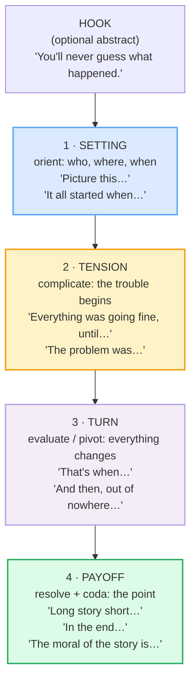

# Storytelling Structures

> **Phase 4 · discourse · bundle #74 · Days 147–148.**
> *Setting → tension → turn → payoff.*
>
> 🔗 This is the **structure / arc layer**. The **chunks themselves** (past
> tenses, "So then…", "The funny thing is…") live in
> [ANECDOTES](../speech_acts/ANECDOTES.md) (Phase 1 · speech_acts · bundle #25).
> That bundle teaches *which words to use* inside a story; **this** bundle
> teaches *how to shape the whole story* — the four-move skeleton every native
> English anecdote follows, and why a Vietnamese learner's stories can sound
> "flat" or "pointless" even when the grammar is right. Read them as a pair:
> anecdotes = the bricks, storytelling_structure = the blueprint.

---

## Why this is a discourse bundle (read this first)

A Vietnamese learner who has perfect grammar and good vocabulary can still tell
an English story that **feels wrong** to a native ear — not because of errors,
but because of **shape**. Vietnamese narrative tends toward **circular /
indirect** movement: context first, the point arrives late, the teller circles
the centre before landing on it. This is a legitimate rhetorical tradition (high-
context cultures value it). But English storytelling expects the opposite: a
**clear linear arc** with **rising tension** and a **turn** the listener can feel.

The result is a mismatch the learner cannot hear in themselves:

- They tell a story **without a tension build** — a flat list of events with no
  drama, so the listener does not know *why* they are being told this.
- They tell a story **without a hook** — no opening that says "pay attention,
  this is going somewhere."
- They **bury the point** — the punchline / lesson arrives so late, or so softly,
  that the listener has already disengaged.

This bundle fixes that with **four moves** that map onto two well-documented
frameworks: **Labov's (1972) narrative schema** and **the Story Spine** (Kenn
Adams / Pixar). Master the skeleton and *any* set of chunks fits inside it.

---

## 1. The four-arc spine: setting → tension → turn → payoff

Every native English anecdote, from a 30-second "you'll never guess what
happened" to a five-minute dinner story, walks the same four moves. Skip one and
the story breaks:

> From `storytelling_structure_corpus.md`:
>
> | Setting | Tension | Turn | Payoff |
> |---|---|---|---|
> | **Picture this…** | **Everything was going fine, until…** | **That's when…** | **Long story short…** |
> | It all started when… | The problem was… | And then, out of nowhere… | In the end… |
> | So, this one time… | Things got complicated when… | Suddenly… | The moral of the story is… |

**Why each move is non-negotiable:**

- **Setting (orientation).** Without it, the listener cannot *picture* the scene
  and the rest lands in a vacuum. One sentence of who/where/when is enough.
- **Tension (complicating action).** This is the move Vietnamese learners skip
  most often. A story with no tension is a *report* ("I went, I saw, I came
  back"). The tension chunk is what makes a listener lean in.
- **Turn (evaluation).** The pivot — the moment everything changes. This is
  Labov's *evaluation*: the clause that says "so what? *this* is why it
  mattered." `That's when…` is the single most common English turn-marker.
- **Payoff (resolution + coda).** The resolution plus, optionally, the lesson or
  the compression ("long story short"). A story without a payoff feels like it
  trailed off.

---

## 2. Labov's schema and the Story Spine — the two maps

These two frameworks are the evidence that the four-arc spine is not an
invention but the **consensus model** of English oral narrative.

### Labov (1972) — the linguist's six-part schema

William Labov, studying oral narratives from inner-city New York, found that a
"fully formed" personal story has up to six stages. They map cleanly onto our
four moves:

| Labov stage | What it does | = our arc |
|---|---|---|
| **Abstract** | one-line summary / hook before the story | (pre-hook) |
| **Orientation** | who, what, when, where | **Setting** |
| **Complicating action** | the events that build trouble | **Tension** |
| **Evaluation** | "so what?" — why it matters | **Turn** |
| **Resolution** | what finally happened | **Payoff** |
| **Coda** | returns to the present; the lesson | **Payoff** |

### The Story Spine (Kenn Adams / Pixar) — the improvisor's skeleton

A six-line template taught in film and improv, popularised by Pixar's
storytelling rules. Same four moves:

| Story Spine line | = our arc |
|---|---|
| Once upon a time… / Every day… | **Setting** |
| But one day… | **Tension** |
| Because of that… (×several) | **Tension** |
| Until finally… | **Turn** |
| And ever since that day… / And the moral of the story is… | **Payoff** |

> From `storytelling_structure_corpus.md` (§E): both frameworks reduce to the
> same skeleton. **Setting → tension → turn → payoff** is not a style choice; it
> is how English-speaking listeners expect a story to *move*.

---

## 3. The anchor chunks, by arc-stage

### 3a. Setting — the launchpad

> From `storytelling_structure_corpus.md`:
>
> - **So, this one time…** /soʊ ðɪs wʌn taɪm/ — casual opener, signals "I'm
>   telling a story now."
> - **It all started when…** /ɪt ɔːl ˈstɑːrtɪd wen/ — narrative launch, marks
>   the first event.
> - **Picture this…** /ˈpɪk.tʃər ðɪs/ — vivid-scene opener; Cambridge: *"Picture
>   the scene — the crowds of people and animals, the noise, the dirt."*

The job: orient the listener in **one or two sentences**. Who, where, when.
`Picture this…` is the strongest — it hands the listener a mental image to hold
before the trouble starts.

### 3b. Tension — the complication

> From `storytelling_structure_corpus.md`:
>
> - **Everything was going fine, until…** /ˈev.ri.θɪŋ wəz ˈɡoʊ.ɪŋ faɪn ʌnˈtɪl/ —
>   states the baseline, then `until` flips it. **(pinned)**
> - **The problem was…** /ðə ˈprɒb.ləm wəz/ — names the obstacle directly.
> - **Things got complicated when…** /θɪŋz ɡɒt ˈkɒm.plɪ.keɪ.tɪd wen/ — signals
>   the situation turned difficult.

The job: introduce the **trouble**. `Everything was going fine, until…` is the
canonical English tension-builder — the word `until` is a hinge that promises a
reversal. A learner who never uses this family of chunks tells stories that sound
like a diary entry.

### 3c. Turn — the pivot

> From `storytelling_structure_corpus.md`:
>
> - **That's when…** /ðæts wen/ — pivot marker: "at that moment, the key event
>   happened."
> - **And then, out of nowhere…** /ænd ðen aʊt əv ˈnoʊ.wer/ — the unexpected
>   event arrives.
> - **Suddenly…** /ˈsʌd.ən.li/ — the turning-point adverb (Cambridge: *"I was
>   just dozing off when suddenly I heard a scream from outside."*)

The job: make the listener feel the **climax**. `That's when…` is the single
most useful turn-marker in spoken English — it points directly at the moment
everything changed.

### 3d. Payoff — the resolution + coda

> From `storytelling_structure_corpus.md`:
>
> - **And you'll never guess what happened** — suspense payoff.
> - **Long story short…** /lɑːŋ ˈstɔːr.i ʃɔːrt/ — Cambridge idiom (C1): "used
>   when you do not tell all the details." **(pinned)**
> - **In the end…** /ɪn ði end/ — Cambridge phrase (B1): "finally, after
>   everything is considered."
> - **The moral of the story is…** /ðə ˈmɔːr.əl əv ðə ˈstɔːr.i ɪz/ — Cambridge:
>   *"And the moral of the story is that honesty is always the best policy."*

The job: deliver the **point**. `Long story short…` compresses a long middle
into one beat; `In the end…` marks the final outcome; `The moral of the story
is…` states the lesson outright (the coda, Labov's final stage).

---

## 4. The two pinned chunks (sanity-check these)

These two are the bundle's load-bearing attestation. If they are real, the
bundle is trustworthy; if either is invented, the whole thing is suspect.

> From `storytelling_structure_corpus.md`:
>
> | pinned chunk | IPA | source |
> |---|---|---|
> | **Everything was going fine, until…** | /ˈev.ri.θɪŋ wəz ˈɡoʊ.ɪŋ faɪn ʌnˈtɪl/ US · /ˈev.ri.θɪŋ wəz ˈɡəʊ.ɪŋ faɪn ʌnˈtɪl/ UK | YouGlish + Cambridge (`everything` /ˈev.ri.θɪŋ/, `going` /ˈɡoʊ.ɪŋ/·/ˈɡəʊ.ɪŋ/, `until` /ʌnˈtɪl/) |
> | **Long story short…** | /lɑːŋ ˈstɔːr.i ʃɔːrt/ US · /lɒŋ ˈstɔː.ri ʃɔːt/ UK | Cambridge idiom entry (C1) — https://dictionary.cambridge.org/dictionary/english/long-story-short |

---

## 5. Cheat sheet — the ≤8 survival chunks

The Pareto set. Drill these eight aloud until each one triggers automatically at
its arc-stage. (Every row is a corpus attestation above.)

| # | Chunk | IPA | Arc-stage |
|---|---|---|---|
| 1 | **Picture this…** | /ˈpɪk.tʃər ðɪs/ | Setting |
| 2 | **Everything was going fine, until…** | /ˈev.ri.θɪŋ wəz ˈɡoʊ.ɪŋ faɪn ʌnˈtɪl/ | Tension |
| 3 | **That's when…** | /ðæts wen/ | Turn |
| 4 | **Long story short…** | /lɑːŋ ˈstɔːr.i ʃɔːrt/ | Payoff |
| 5 | **It all started when…** | /ɪt ɔːl ˈstɑːrtɪd wen/ | Setting |
| 6 | **The problem was…** | /ðə ˈprɒb.ləm wəz/ | Tension |
| 7 | **In the end…** | /ɪn ði end/ | Payoff |
| 8 | **The moral of the story is…** | /ðə ˈmɔːr.əl əv ðə ˈstɔːr.i ɪz/ | Payoff |

> Open [`storytelling_structure.html`](./storytelling_structure.html) to drill
> these as flip cards, play the story role-play, shadow, and write a structured
> anecdote.

---

## 6. Vietnamese → English L1 pitfalls table

The "expert payoff." These are the specific structural interference traps a
Vietnamese speaker hits when telling a story in English — they are about
**narrative shape**, not pronunciation or grammar (those live in earlier
bundles). Extend, don't replace, the seed rows from the spec.

| Vietnamese trap (what you do) | English fix (what to do instead) |
|---|---|
| **Circular / indirect structure** — context first, the point arrives late, you circle the centre before landing on it (high-context rhetoric) | Switch to **linear arc**: state the setting, build the tension, hit the turn, deliver the payoff — in that order. The listener wants to feel the shape, not infer it. |
| **No tension build** — a flat list of events ("I went, I saw her, we talked, I came home") with no complication | Insert a **tension chunk**: *"Everything was going fine, until…"* / *"The problem was…"*. A story without tension is a report; the tension is what makes it a story. |
| **No hook / no opening** — starts narrating cold, mid-event, with no signal that a story is coming | Open with a **setting chunk**: *"So, this one time…"* / *"It all started when…"* / *"Picture this…"*. One sentence that says "pay attention, this is going somewhere." |
| **Buries the point** — the punchline / lesson arrives so late or so softly the listener has disengaged | **Front the payoff** or mark it clearly: *"Long story short…"* / *"In the end…"* / *"That's when I realised…"*. The English listener expects a visible resolution, not an implied one. |
| **Missing the turn** — jumps from tension straight to resolution with no pivot, so the listener cannot feel the climax | Use a **turn-marker**: *"That's when…"* / *"And then, out of nowhere…"*. The turn is the clause that says "so what? *this* is why it mattered" (Labov's *evaluation*). |
| **No tense anchoring** — Vietnamese has no past morphology, so the story drifts between time frames ambiguously | Anchor the narrative in **past simple** (main events) + **past continuous** (background). 🔗 See [ANECDOTES](../speech_acts/ANECDOTES.md) §D for the three narrative tenses and [NARRATIVE TENSES](./NARRATIVE_TENSES.md) (bundle #80). |
| **Over-explains the moral** — states the lesson at length, or moralises where a native speaker would let the story imply it | Either **compress** with *"Long story short…"* or state the lesson in **one line**: *"The moral of the story is: always call ahead."* Let the story do the work; the coda is short. |
| **Tells the whole backstory** — loads the setting with so much context that the tension never arrives | Cap the setting at **1–2 sentences** (who/where/when). The Story Spine rule: "Once upon a time… Every day…" is *one line each*, not a paragraph. |

---

## How to practise this bundle (the daily 20 min)

1. **READ** (5 min) — this guide, §1–§4. Memorise the four moves.
2. **SHADOW** (7 min) — open `storytelling_structure.html`, drill the 8 flip
   cards + the story role-play **aloud**, hitting each arc-stage clearly.
3. **PRODUCE** (8 min) — the writing task: structure a short anecdote using
   **setting + tension + turn + payoff** (one chunk per stage). Read it aloud;
   check the listener can feel each move.

---

## Sources

- Cambridge Advanced Learner's Dictionary — `picture` (verb, "to imagine") UK
  /ˈpɪk.tʃər/ · US /ˈpɪk.tʃɚ/ —
  https://dictionary.cambridge.org/dictionary/english/picture_1
- Cambridge — `problem` UK /ˈprɒb.ləm/ · US /ˈprɑː.bləm/ —
  https://dictionary.cambridge.org/dictionary/english/problem
- Cambridge — `complicated` UK /ˈkɒm.plɪ.keɪ.tɪd/ · US /ˈkɑːm.plə.keɪ.tɪd/ —
  https://dictionary.cambridge.org/dictionary/english/complicated
- Cambridge — `suddenly` /ˈsʌd.ən.li/ —
  https://dictionary.cambridge.org/dictionary/english/suddenly
- Cambridge — `nowhere` (idiom `from/out of nowhere`) —
  https://dictionary.cambridge.org/dictionary/english/nowhere
- Cambridge — `long story short` idiom (C1) —
  https://dictionary.cambridge.org/dictionary/english/long-story-short
- Cambridge — `in the end` phrase (B1) —
  https://dictionary.cambridge.org/dictionary/english/in-the-end
- Cambridge — `moral` (noun, MESSAGE) UK /ˈmɒr.əl/ · US /ˈmɔːr.əl/ —
  https://dictionary.cambridge.org/dictionary/english/moral
- Merriam-Webster — `moral` ("a lesson learned from a story") —
  https://www.merriam-webster.com/dictionary/moral
- Labov, W. (1972). *Language in the Inner City* — six-part narrative schema.
- Labov, W. *Some Further Steps in Narrative Analysis* (Penn Linguistics) —
  https://www.ling.upenn.edu/~wlabov/sfs.html
- Sage Methods — *Labovian Narrative Analysis* —
  https://methods.sagepub.com/book/edvol/doing-narrative-research/chpt/narratives-events-labovian-narrative-analysis-its
- Davis teaching PDF, *Labov's narrative model* (UNC Charlotte) —
  https://webpages.charlotte.edu/~bdavis/LabovHymes.pdf
- The Story Spine (Kenn Adams / Pixar) — Khan Academy Pixar-in-a-Box, Plottr,
  Indie Editorial, Aerogramme Studio.
- Schiffrin, D. *Discourse Markers* (CUP, 1987) — `so`, `then` as story-opening
  frame markers.
- British Council LearnEnglish — narrative-tenses pages.
- Frequency methodology: wordfrequency.info (spoken sub-corpus) —
  https://www.wordfrequency.info/
- Native audio: YouGlish — https://youglish.com/pronounce/{chunk}/english/us?
