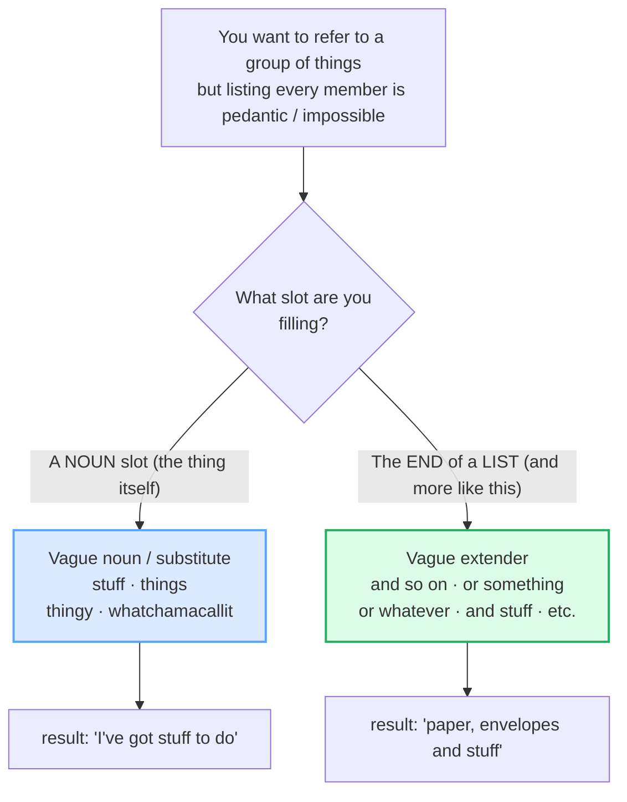
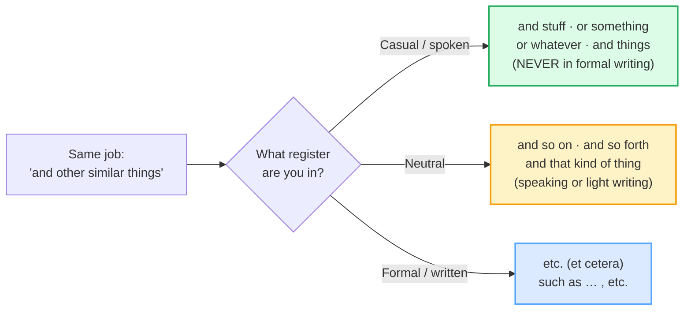

# Vague Language

> **Phase 4 · discourse · bundle #77 · Days 153–154.**
> *'stuff', 'things', 'and so on' — natural vagueness.*
>
> 🔗 This bundle is the **lexical / category** dimension of vagueness — vague
> *nouns* (*stuff*, *things*, *what-d'you-call-it*) and vague *extenders* (*and
> so on*, *or something*, *or whatever*). Its sister bundle
> [HEDGING & VAGUENESS](./HEDGING_VAGUENESS.md) (#66) covers the *softener*
> dimension — *kind of*, *a bit*, *-ish*, *around*. And in writing mode,
> [EDITING: HEDGING & TONE](../writing/EDITING_HEDGING.md) calibrates the formal
> end. Read all three as the "sounds native, not rigid" layer.

---

## Why this is bundle #77 (read this first)

A Vietnamese learner who has reached Phase 4 is intelligible, can handle the
speech acts, and writes the genres. What still makes them sound *foreign* — even
*stiff* — is that they are **too precise**. Asked what they did at the weekend,
they produce an exhaustive list: *"I cleaned my room, washed the dishes, watered
the plants, ironed my shirts, went to the supermarket, and cooked dinner."* Every
item named. Nothing wrong — except a native speaker in the same spot says *"Oh, I
just had a bunch of **stuff** to do — cleaning **and so on**."* One vague noun,
one vague extender, and the talk suddenly sounds **warm, casual, and human.**

English uses vagueness as a **social tool**. It signals *"the details don't
matter, we both know what I mean"* — the shared-understanding solidarity that
Channell (1994) and Jucker, Smith & Lüge (2003) call **relational / interactive**.
It is the opposite of laziness: it is *not over-specifying when precision is not
needed*. The catch — and this is the L1 trap — is **register**. *stuff* and
*and stuff* are informal; they belong in speech, never in a formal email or essay.
So the fluent speaker does two things a textbook never taught: be vague **on
purpose** in casual talk, and switch **back** to precise language in writing.

This bundle is spoken-first: the role-play is primary, the writing task is a
"three vague sentences, then flag the ones too casual for formal writing" drill.

---

## 1. The mechanism: two families, one social job

All vague-language items let the speaker **refer to a category without listing
every member**. The literature (Channell 1994; Jucker, Smith & Lüge 2003) splits
them by *where* the vagueness sits:

| Family | What it does | Members | Example |
|---|---|---|---|
| **Vague nouns / substitutes** | stand in for a thing, person, or group when the exact name/list is not needed | stuff · things · thingy · whatchamacallit · what-d'you-call-it | "We did some really interesting **stuff** today." |
| **Vague extenders** (general extenders) | tack onto a list/claim to mean "and other similar things" — so the speaker does not enumerate everything | and so on · etc. · or something · or whatever · and stuff · and that kind of thing · and things (like that) | "She works for a bank **or something**." |

> From `vague_language_corpus.md` (the two families, verbatim):
>
> - **Vague nouns** → `stuff` /stʌf/, `things` /θɪŋz/, `thingy` /ˈθɪŋ.i/,
>   `whatchamacallit` /ˈwɒtʃ.ə.məˌkɔːl.ɪt/ (UK) · /ˈwɑː.tʃə.məˌkɑːlɪt/ (US)
> - **Vague extenders** → `and so on` /ən səʊ ˈɒn/, `et cetera` (etc.)
>   /ɪt ˈset̬.ɚ.ə/ (US), `or something` /ɔːr ˈsʌmθɪŋ/ (US), `or whatever`,
>   `and stuff`, `and that kind of thing`

---

## 2. The vague noun: *stuff* (the workhorse)

`stuff` is, in Cambridge's own words, *"one of the most common nouns in
speaking."* It is **uncountable** and **informal** — it packs "things, matter,
activities, possessions" into one warm, general word. Cambridge's grammar note is
the rule a learner must memorise:

> *Stuff is one of the most common nouns in speaking. It is **more informal than
> thing**. It is **not at all common in writing.***
> — Cambridge Dictionary, *stuff* entry

> From `vague_language_corpus.md` (verbatim Cambridge example):
>
> - **We did some really interesting stuff today.**

**The Vietnamese trap:** there is no single Vietnamese word with this exact
"general warm mass" feel — *đồ đạc / thứ / chuyện* are each narrower. So the
learner either avoids *stuff* (sounds stiff: *"I performed several interesting
activities"*) or treats it as countable (*"many stuffs"* — wrong: *stuff* is
uncountable, so *"a lot of stuff"*, never *"many stuffs"*).

---

## 3. The vague extenders: *or something / and so on / etc.*

These tags end a list or an example so the speaker stays loosely committed. The
pragmatics literature (Jucker, Smith & Lüge 2003) shows their real job is
**interactive**: `or something` *invites* the listener to fill in the rest —
*"you know what I mean"* — which is the solidarity that makes speech sound native.

> From `vague_language_corpus.md` (verbatim Cambridge examples):
>
> - **She works for a bank or something.**
> - **This is the drawer where I keep paper and envelopes and stuff.**
> - **Why don't you go to a movie or something?**

But — and this is the L1 trap again — **register climbs as the list goes more
formal**. The same job ("and other similar things") has a ladder:

🔗 This is the spoken-side companion to
[FORMAL VS CASUAL REGISTER](../writing/FORMAL_CASUAL_REGISTER.md) — that bundle
teaches the *writing* register ladder; this one drills the *vague-language*
items that live on its casual rung.

---

## 4. The placeholder family: *thingy / whatchamacallit / what-d'you-call-it*

When you genuinely cannot remember a name, English has dedicated informal
placeholders. They signal *"the word's gone, but we both know the object"* and
keep the conversation flowing instead of freezing.

> From `vague_language_corpus.md` (verbatim Cambridge examples):
>
> - **Can you pass me that thingy - you know, that clip thing for holding papers together.**
> - **I need a - a whatchamacallit - one of those things that you can caramelize sugar with.**

The Vietnamese reflex is usually to **stop and search** ("Ờ… cái gì nhỉ…"), which
breaks fluency. The fix is the placeholder: say *thingy* / *whatchamacallit*,
describe it in one clause, and keep going — that is exactly what a native speaker
does.

---

## 5. Cheat sheet — the ≤8 survival chunks

The Pareto set. Drill these aloud until each one drops into casual speech without
thinking — *and* until you can name which are too casual for formal writing.

| # | Chunk | IPA | Why it's here |
|---|---|---|---|
| 1 | **stuff** | /stʌf/ | the workhorse vague noun — informal, uncountable |
| 2 | **things** | /θɪŋz/ | the neutral vague plural (safe in more registers) |
| 3 | **or something** | /ɔːr ˈsʌmθɪŋ/ US | vague extender — "an example / not certain" (informal) |
| 4 | **and so on** | /ən soʊ ˈɑːn/ US | list extender — neutral (speaking *and* writing) |
| 5 | **etc.** (et cetera) | /ɪt ˈset̬.ɚ.ə/ US | written list extender — formal |
| 6 | **or whatever** | /ɔːr wɑːˈt̬ev.ɚ/ US | list extender — casual, "the exact thing doesn't matter" |
| 7 | **and stuff** | /ən stʌf/ | list extender — very informal (spoken only) |
| 8 | **whatchamacallit** | /ˈwɑː.tʃə.məˌkɑːlɪt/ US | placeholder for a forgotten name (informal) |

> Open [`vague_language.html`](./vague_language.html) to drill these as flip
> cards, hear native clips, play the role-play, shadow, and write.

---

## 6. Vietnamese → English L1 pitfalls table

The "expert payoff." These are the specific interference traps a Vietnamese
speaker hits on vague language — extend, don't replace, the seed rows from the
spec.

| Vietnamese trap (what you do) | English fix (what to do instead) |
|---|---|
| **Over-specifies — exhaustive lists** ("I cleaned my room, washed the dishes, watered the plants, ironed my shirts…") because the classroom trained you to always be precise | Drop to a vague extender when precision is *not* needed: *"I had a bunch of stuff to do — cleaning **and so on**."* Warmth beats completeness in casual talk. |
| **Never uses *stuff*** — reaches for stiff equivalents ("items", "objects", "possessions", "activities") | Treat *stuff* as the default casual general noun. Cambridge: it is *"one of the most common nouns in speaking."* Say *"I've got stuff to do,"* not *"I have tasks to perform."* |
| **Treats *stuff* as countable** → *"many stuffs"*, *"a stuff"* | *stuff* is **uncountable** — *"a lot of stuff"*, *"much stuff"*, never *"stuffs"*. Vietnamese has no count/uncountable split, so this is a silent error. |
| **Uses casual vague language in the WRONG register** → *"and stuff"* / *"or whatever"* in a formal email or essay | Switch to the formal rung: *etc.* (et cetera), *such as*, *and so forth*. *stuff*/*and stuff* are spoken-only — Cambridge flags *stuff* as *"not at all common in writing."* |
| **Avoids vagueness trying to always be exact** → sounds robotic / textbook | Learn to be **vague on purpose**. Overstreet (2011): the function is *"interpreted locally in context"* — when the listener knows the category, name the category, not every member. |
| **Freezes when a word won't come** ("ờ… cái gì nhỉ…") instead of using a placeholder | Plug the gap with **thingy / whatchamacallit / what-d'you-call-it** + a one-clause description, then keep going. Fluency survives a forgotten word. |
| **Maps Vietnamese *vân vân* → *etc.*** everywhere, even in speech | *etc.* is **mostly written / formal**. In casual speech prefer ***and so on***, ***and stuff***, or ***or whatever***. The 1:1 translation over-formalises your talk. |
| **Uses *Whatever.* (flat, one word) as a neutral "anything"** → sounds rude/dismissive | *"Whatever."* (flat tone, no continuation) signals **disrespect / indifference** (Cambridge lists it under "disrespect"), not "anything is fine." For "anything is fine" say *"whatever you like / either is fine."* |

---

## How to practise this bundle (the daily 20 min)

1. **READ** (5 min) — this guide, §1–§4.
2. **SHADOW** (7 min) — open `vague_language.html`, drill the 8 flip cards +
   the role-play **aloud**, aiming for casual warmth, not textbook precision.
3. **PRODUCE** (8 min) — the writing task: write **3 casual sentences** using
   vague extenders naturally, then **flag which are too casual for formal
   writing** (and rewrite those in the formal register).

---

## Sources

- Cambridge Advanced Learner's Dictionary — *stuff* — https://dictionary.cambridge.org/dictionary/english/stuff (grammar note: *"one of the most common nouns in speaking… not at all common in writing"*; dedicated informal sub-entry **and stuff**)
- Cambridge — *thing* — https://dictionary.cambridge.org/dictionary/english/thing
- Cambridge — *thingy* — https://dictionary.cambridge.org/dictionary/english/thingy
- Cambridge — *whatchamacallit* — https://dictionary.cambridge.org/dictionary/english/whatchamacallit
- Cambridge — *or something (like that)* — https://dictionary.cambridge.org/dictionary/english/or-something
- Cambridge — *et cetera* — https://dictionary.cambridge.org/dictionary/english/et-cetera
- Cambridge — *whatever* (incl. the dismissive informal *Whatever.*) — https://dictionary.cambridge.org/dictionary/english/whatever
- Cambridge — *and* (sub-entry **and so on / and so forth**, A2) — https://dictionary.cambridge.org/dictionary/english/and
- Channell, J. (1994). *Vague Language*. Oxford University Press — vague additive categories. Cited via https://tidsskrift.dk/her/article/download/97426/146603/200281
- Jucker, A.H., Smith, S.W. & Lüge, T. (2003). "Interactive aspects of vagueness in conversation." *Journal of Pragmatics* 35:1737–1769 — extenders as interactive/relational resources. https://www.researchgate.net/publication/222649442
- Overstreet, M. (2011). "Vague language and interpersonal communication" — *"the particular function of a vague expression has to be interpreted locally in context"* (2011:308). https://www.sciencedirect.com/science/article/abs/pii/S0378216618308166
- "Vague Language and Its Social Role," *Issues in Language Studies* (Academy Publication). https://www.academypublication.com/issues2/tpls/vol07/02/05.pdf
- "Vague language as a means of avoiding controversy," *RUDN Journal of Language Studies*. https://rudn.tlcjournal.org/archive/2%282%29/2%282%29-03.pdf
- Native audio: YouGlish — https://youglish.com/pronounce/{chunk}/english/us?
- Frequency methodology: wordfrequency.info (spoken sub-corpus) — https://www.wordfrequency.info/
