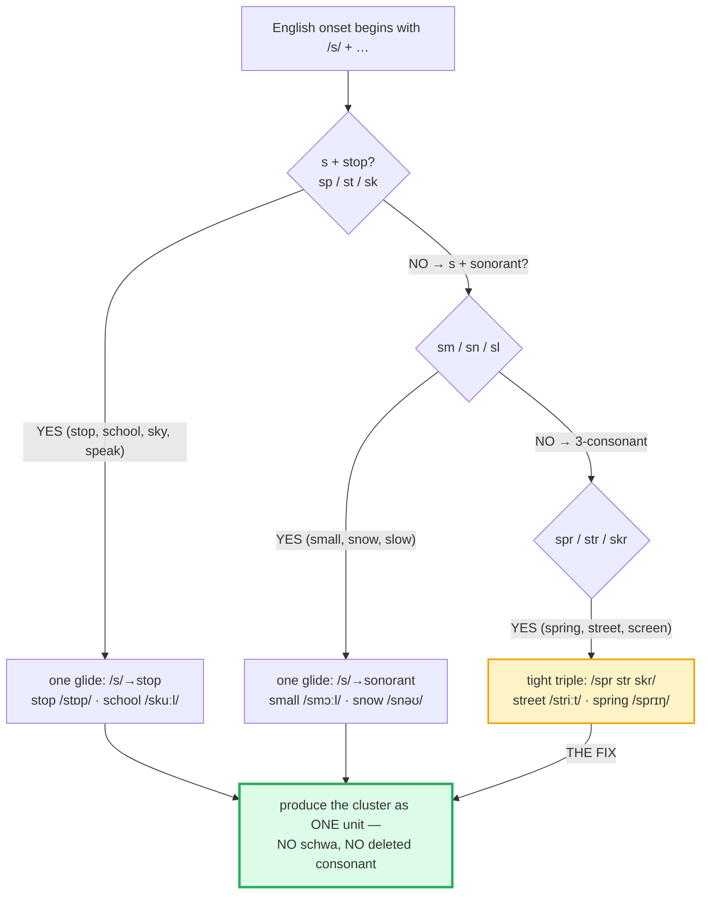

# Consonant Clusters

> **Phase 0 · pronunciation · bundle #03 · Days 5–6.**
> *No inserted vowel ("gro-serry"); keep clusters tight.*
>
> 🔗 Builds directly on [FINAL CONSONANTS](./FINAL_CONSONANTS.md) (bundle #01 —
> a single dropped final flips a word; here the final is a *stack* of two or
> three). Then feeds [LINKING](./LINKING.md) (a tight final cluster glues
> cleanly to the next vowel) and [VOWEL LENGTH](./VOWEL_LENGTH.md) (length
> lives right next to the cluster — *sheep/ship*, *food/good*).

---

## Why this is bundle #03 (read this first)

Bundle #01 fixed the **single** final consonant. The next intelligibility wall
is the **cluster** — two or three consonants produced with **no vowel between
them**: *str*eet, *sm*all, *st*op, de*sk*, wo*rld*, ne*kst*.

Vietnamese syllables are built on a strict **CV / CVC** skeleton with **no
onset clusters and no coda clusters** (the coda is a single sound from
/p t k m n ŋ/ at most). So the moment English demands two consonants in a row
at the edge of a syllable, the Vietnamese mouth does one of two things — and
both mark the speaker instantly as non-native:

1. **Inserts a schwa** to "open" the cluster into CV syllables it can say:
   *street* → "sə-tree", *small* → "sə-mall", *grocery* → "gro-ser-ry".
2. **Deletes** a consonant to leave a single onset/coda it can produce:
   *stop* → "top", *desk* → "de", *world* → "wo", *play* → "pay".

The fix is one rule, drilled until automatic: **produce the cluster as a single
unit — no vowel, no deletion, tongue gliding from consonant to consonant.**
That rule, applied to the ~20 highest-frequency cluster words, removes most of
the "sorry, what?" a Vietnamese speaker hears on clusters.

---

## 1. The mechanism: why Vietnamese learners break clusters

| | Vietnamese (L1) | English (target) |
|---|---|---|
| Onset clusters (start of syllable) | **None** (CV, CVC only) | Common (*sp, st, sk, sm, sn, sl, pl, gr, tr, str, spr, skr*) |
| Coda clusters (end of syllable) | **None** (single coda only) | Common (*-st, -ld, -mp, -nd, -kt, -kst, -mpt*) |
| Coda inventory | **6**: /p t k m n ŋ/ (+ glides) | ~24 consonants + their clusters |
| 3-consonant onsets | **Impossible** | /str spr skr skw/ — *street, spring, screen, square* |

So when an English word begins or ends in a stack, the L1 mouth reaches for the
only repair it knows — **epenthesis** (insert a vowel) or **deletion** (drop a
consonant). Both destroy intelligibility:

> From `consonant_clusters_corpus.md`:
>
> | grocery ❌ "groserry" | grocery ✓ |
> |---|---|
> | /ɡrəˈseri/ (schwa inserted inside /gr-/) | /ˈɡrəʊsəri/ UK · /ˈɡroʊsəri/ US |
>
> The learner's mouth opens the cluster into three CV syllables it can say.
> The native form keeps the /gr-/ onset tight and puts the vowel *after* it.

---

## 2. Initial s-clusters: the highest-frequency trap

English has a special family of onsets that **start with /s/** — /sp st sk sm
sn sl/ and the three-consonant /spr str skr/. They are among the most frequent
words in the language (*stop, school, small, street, spring, sky, snow*). The
/s/ glides directly into the next consonant with **no vowel** between.

> From `consonant_clusters_corpus.md` (the three branches, verbatim):
>
> - **s + stop** → **stop** /stɒp/–/stɑːp/, **school** /skuːl/, **sky** /skaɪ/,
>   **speak** /spiːk/, **stand** /stænd/
> - **s + sonorant** → **small** /smɔːl/, **snow** /snəʊ/–/snoʊ/,
>   **slow** /sləʊ/–/sloʊ/
> - **3-consonant** → **street** /striːt/, **spring** /sprɪŋ/,
>   **strong** /strɒŋ/–/strɔːŋ/

**The Vietnamese trap:** *street* comes out "sə-tree" (schwa before the
cluster) or "tree" (/s/ deleted). *small* comes out "sə-mall". Both sound
wrong; the schwa version is the more common repair and the harder one to
unlearn, because the learner genuinely cannot *hear* the inserted vowel at
first.

---

## 3. Initial non-s clusters: deletion, not schwa

For onsets that do **not** start with /s/ — /pl gr tr gl fl br/ — Vietnamese
speakers favour the **deletion** repair over epenthesis: *play* → "pay",
*green* → "geen", *train* → "rain". The /s/-clusters get a schwa because the
/s/ is high-frequency and salient; the non-s clusters lose their first
consonant because the second is the louder one.

> From `consonant_clusters_corpus.md`:
>
> - **play** /pleɪ/, **green** /ɡriːn/, **train** /treɪn/,
>   **glass** /ɡlɑːs/–/ɡlæs/, **fly** /flaɪ/

🔗 The fix is the same drill — hold the **first** consonant contact, then
glide into the second — but learners often need it pointed out that they are
*deleting* the consonant, since deletion is harder to self-hear than insertion.

---

## 4. Final clusters: the coda stack

Vietnamese has **no final clusters at all**. English stacks two or three
consonants at the end of the syllable routinely: *desk* (-sk), *world* (-rld),
*last* (-st), *cold* (-ld), *jump* (-mp), *next* (-kst). The L1 repair is
almost always **deletion**: *desk* → "de", *world* → "wo", *next* → "ne".

| Coda pattern | Example | IPA |
|---|---|---|
| **-st** | last, just, cost | last /lɑːst/–/læst/, just /dʒʌst/ |
| **-ld** | cold, world, old | cold /kəʊld/–/koʊld/, world /wɜːld/–/wɜːrld/ |
| **-mp** | jump, lamp, camp | jump /dʒʌmp/ |
| **-nd** | hand, stand, find | (cf. *stand* /stænd/ §2) |
| **-kt** | walked, asked, fact | (cf. [FINAL_CONSONANTS](./FINAL_CONSONANTS.md) §3 — /kt/ past) |
| **-kst** | next, six, text | next /nekst/ |

> From `consonant_clusters_corpus.md`:
>
> - **desk** /desk/, **world** /wɜːld/–/wɜːrld/, **last** /lɑːst/–/læst/,
>   **cold** /kəʊld/–/koʊld/, **jump** /dʒʌmp/, **next** /nekst/,
>   **just** /dʒʌst/, **left** /left/

🔗 This is the direct sequel to [FINAL CONSONANTS](./FINAL_CONSONANTS.md) —
bundle #01 drilled releasing the *single* final; here the final is a *stack*
and the rule is the same: **hold the cluster tight, release only the last
sound.**

---

## 5. Cheat sheet — the ≤8 survival chunks

The Pareto set. Drill these eight aloud until every cluster is tight — no
schwa, no deletion. (Every row is a corpus attestation above.)

| # | Chunk | IPA | Why it's here |
|---|---|---|---|
| 1 | **street** | /striːt/ | 3-consonant onset /str/; classic schwa error "sə-tree" |
| 2 | **stop** | /stɒp/ UK · /stɑːp/ US | s+stop /st/; pinned Cambridge example |
| 3 | **school** | /skuːl/ | s+stop /sk/; deletion error "kool" |
| 4 | **small** | /smɔːl/ | s+sonorant /sm/; schwa error "sə-mall" |
| 5 | **spring** | /sprɪŋ/ | 3-consonant onset /spr/ |
| 6 | **desk** | /desk/ | final cluster /-sk/; deletion error "de" |
| 7 | **world** | /wɜːld/ UK · /wɜːrld/ US | final cluster /-rld/; deletion error "wo" |
| 8 | **grocery** | /ˈɡrəʊsəri/ UK · /ˈɡroʊsəri/ US | the epenthesis word — keep /gr-/ tight, not "gro-ser-ry" |

> Open [`consonant_clusters.html`](./consonant_clusters.html) to drill these as
> flip cards, hear native clips, play the role-play, shadow, and write.

---

## 6. Vietnamese → English L1 pitfalls table

The "expert payoff." These are the specific interference traps a Vietnamese
speaker hits on consonant clusters — extend, don't replace, the seed rows from
the spec and from bundle #01.

| Vietnamese trap (what you do) | English fix (what to do instead) |
|---|---|
| **No onset clusters** → inserts a schwa before the cluster: *street* → "sə-tree", *small* → "sə-mall", *stop* → "sə-top" | Glide /s/ **straight into** the next consonant — no vowel. Practise *ssss-t* → *ssss-t* → *stop*, tightening until there is no gap. |
| **No onset clusters** → deletes the first consonant: *stop* → "top", *play* → "pay", *green* → "geen" | Hold the **first** consonant's contact a beat longer, then release into the second. Record yourself — if "play" sounds like "pay", you deleted. |
| **3-consonant onsets are impossible** → *street* → "tree" or "sit-tree", *spring* → "sing" or "sə-pring" | Drill the triple as one shape: tongue at /s/, curl to /r*, place /t* — *strrrrreeet*. Slow → fast, never inserting a vowel. |
| **No final clusters** → deletes the whole coda stack: *desk* → "de", *world* → "wo", *next* → "ne" | Stack the finals: hold each consonant contact, release only the last. *deee-s-k*, *worrr-l-d* → *desk*, *world*. |
| **No final clusters** → inserts a schwa to open them: *text* → "te-kəs", *jump* → "cham-puh" | End on the **consonant**, no trailing vowel. Closed-syllable drill from [FINAL_CONSONANTS](./FINAL_CONSONANTS.md) applies doubled here. |
| **Confuses /spr str skr/** → *spring* sounds like *string*, *street* like *screen* | Minimal-pair drill on the **middle** consonant: *sp*-ring / *st*-ring / *sk*-reen. The /p t k* is the clue. |
| **Releases finals the Vietnamese way** (unreleased /p t k/) so a final cluster collapses to one sound | In English, let a tiny puff out of the **last** consonant of the cluster before a pause: *des**k***, *las**t***, *nex**t***. |
| **Epenthesis inside an onset** on high-frequency words (*grocery* → "gro-ser-ry") | Keep the onset consonant sequence **tight**, then the vowel: /ɡr-ou-sri/. The vowel goes *after* the cluster, never *inside* it. |

---

## How to practise this bundle (the daily 20 min)

1. **READ** (5 min) — this guide, §1–§4.
2. **SHADOW** (7 min) — open `consonant_clusters.html`, drill the 8 flip cards
   + the role-play **aloud**. Exaggerate the tightness of every cluster first
   (no schwa, no deletion), then relax to a natural speed.
3. **PRODUCE** (8 min) — the writing task: list **5 items with clusters**
   (school, desk, …). Read them aloud, recording yourself; check every cluster
   is intact — no inserted vowel, no dropped consonant.

---

## Sources

- Cambridge Advanced Learner's Dictionary — https://dictionary.cambridge.org/dictionary/english/{word} (entries for *stop, stand, story, school, sky, speak, small, snow, slow, street, spring, strong, play, green, train, glass, fly, desk, world, last, cold, jump, next, just, left, grocery*)
- Cambridge Pronunciation page (audio + IPA) — https://dictionary.cambridge.org/pronunciation/english/{word}
- Collins Dictionary (English pronunciations) — https://www.collinsdictionary.com/dictionary/english-pronunciations/stop (`through street` θruː striːt corroborates /striːt/).
- IOSR *English Consonant Pronunciation Errors* PDF — `/sm/ small /smɔːl/, spring /sprɪŋ/`.
- Anbar *Unit Two: How the Speech Organs Work* PDF — `small /smɔːl/`, `glass` dark-/l/.
- Dinleme & Schwa *British Accent* pronunciation PDFs — `spring /sprɪŋ/`, `school`, `sky`, `world /wɜːld/`, `desk /desk/`.
- dokumen.pub *English Phonetics and Pronunciation Practice* — `spring sprɪŋ, string strɪŋ, strong strɒŋ`, `desk desk`, `world wɜːld`.
- Unindra *Phonological Analysis* PDF — RP `street [striːt]`.
- "Problems in the Pronunciation of English Consonant Clusters — A Case Study of English-Majored Students at a Vietnamese University" (IJSSHR v8i9) — https://ijsshr.in/v8i9/Doc/77.pdf
- "Common mistakes in pronouncing English consonant clusters: A case study of Vietnamese learners" (Can Tho University Journal) — https://ctujs.ctu.edu.vn/index.php/ctujs/article/download/448/610/3089
- "Difficulties for Vietnamese when pronouncing English: Final Consonants" (Diva-Portal) — https://www.diva-portal.org/smash/get/diva2:518290/FULLTEXT01.pdf
- Nguyen, "The systematic reduction of English syllable-final consonants" (GMU Linguistics Club) — https://orgs.gmu.edu/lingclub/WP/texts/6_Nguyen.pdf
- "Vietnamese Phonology: A Complete Guide" (Remitly) — https://www.remitly.com/blog/education/vietnamese-phonology-guide/
- Native audio: YouGlish — https://youglish.com/pronounce/{chunk}/english/us?
- Frequency methodology: wordfrequency.info (spoken sub-corpus) — https://www.wordfrequency.info/
