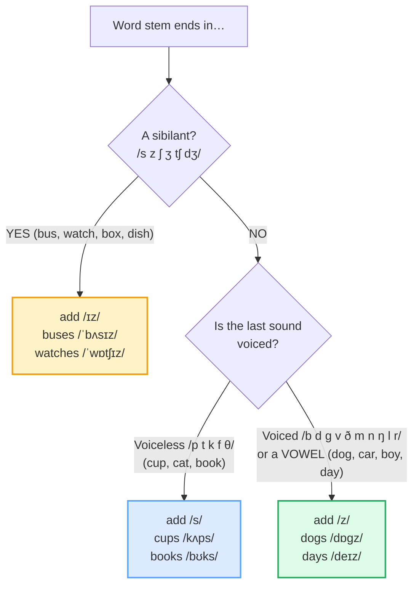

# Final Consonants & Endings

> **Phase 0 · pronunciation · bundle #01 · Days 1–2.**
> *Fix the #1 Vietnamese intelligibility issue: dropped finals + `-s`/`-ed`.*
>
> 🔗 This is the **style anchor** — the first bundle shipped. Later pronunciation
> bundles build on it: [CONSONANT CLUSTERS](./CONSONANT_CLUSTERS.md) (keep the
> whole cluster, not just the last sound), [VOWEL LENGTH](./VOWEL_LENGTH.md)
> (length is a final-C neighbor — *sheep/ship*), [LINKING](./LINKING.md) (a final
> consonant often glues to the next vowel).

---

## Why this is bundle #01 (read this first)

If a Vietnamese speaker is ever asked *"sorry, what?"* in English, the cause is
almost never grammar or vocabulary — it is a **dropped or distorted final
consonant**. Vietnamese is built from **single, open-feeling syllables** with a
coda inventory of only six sounds — /p t k m n ŋ/ (plus glides) — and **no
consonant clusters at all**. English packs finals and clusters everywhere
(*went*, *just*, *books*, *walked*, *sixths*). The two sound systems collide at
the end of the syllable, and the casualty is the final consonant.

This single fix — **release every final consonant and every `-s`/`-ed` ending** —
does more for intelligibility than any vocabulary list. It is why it is Day 1.

---

## 1. The mechanism: why Vietnamese learners drop finals

Vietnamese and English disagree on what a syllable is allowed to *end* with:

| | Vietnamese (L1) | English (target) |
|---|---|---|
| Final consonants allowed | **6**: /p t k m n ŋ/ (+ glides) | ~24 consonants |
| Consonant clusters | **None** (CV, CVC only) | Common (*-st, -kt, -mps, -ŋkθs*) |
| Rhythm | Syllable-timed (each beat equal) | Stress-timed (reduces grammar words) |
| Final stops | **Unreleased** — made, not burst | Often released/audible |

So when an English word ends in a sound Vietnamese has no slot for (/θ ð f v s z
tʃ dʒ l/ …) or in a cluster (*went* = CVC**C**), the learner's mouth does one of
three things — all of them break intelligibility:

1. **Omits** the final: *went* → "wen", *just* → "jus", *think* → "thing".
2. **Adds a schwa** (parasitic vowel) to "open" the cluster: *finished* →
   "finishe*", *looked* → "look-uh".
3. **Substitutes** a permitted coda: *dock* → "dog" (k→ɡ), *this* → "dis"
   (ð→s), *bath* → "bat" (θ→t).

> From `final_consonants_corpus.md`:
>
> | dog | dock |
> |---|---|
> | /dɒɡ/ UK · /dɑːɡ/ US | /dɒk/ UK · /dɑːk/ US |
>
> One unreleased or substituted final and *dock* (a place for boats) becomes
> *dog* (the animal). The vowel is identical — only the **final consonant**
> carries the meaning.

---

## 2. The `-s` ending is three sounds: /s/ /z/ /ɪz/

The plural / 3rd-person suffix spelled `-s`/`-es` is **not** one sound. It is
**three**, and the rule is mechanical — look only at the **sound** (never the
spelling) immediately before the `-s`:

> From `final_consonants_corpus.md` (the three branches, verbatim):
>
> - /s/ after voiceless non-sibilants → **cups** /kʌps/, **cats** /kæts/,
>   **books** /bʊks/
> - /z/ after voiced non-sibilants + vowels → **dogs** /dɒɡz/, **cars** /kɑːz/,
>   **boys** /bɔɪz/, **days** /deɪz/
> - /ɪz/ after sibilants → **buses** /ˈbʌsɪz/, **watches** /ˈwɒtʃɪz/,
>   **boxes** /ˈbɒksɪz/, **dishes** /ˈdɪʃɪz/

**The Vietnamese trap:** learners either drop the `-s` entirely ("two book") or
attach one blanket sound to everything. The high-frequency error is the *missing
plural* — because Vietnamese does not mark plural on the noun. So "two book"
sounds fine to a Vietnamese ear but signals broken English to a native one.

---

## 3. The `-ed` ending is three sounds: /t/ /d/ /ɪd/

Symmetric rule, same logic — the spelling `-ed` is never "e-d"; the past suffix
is one of three sounds decided by the verb's final sound:

| Verb ends in… | Add | Example |
|---|---|---|
| /t/ or /d/ (want, need, decide) | **/ɪd/** | wanted /ˈwɒntɪd/, needed /ˈniːdɪd/ |
| other voiceless (walk, watch, laugh) | **/t/** | walked /wɔːkt/, laughed /lɑːft/–/læft/ |
| other voiced / vowel (play, call, use) | **/d/** | played /pleɪd/, called /kɔːld/, used /juːzd/ |

> From `final_consonants_corpus.md`:
>
> - /t/ → **walked** /wɔːkt/, **watched** /wɒtʃt/, **laughed** /lɑːft/
> - /d/ → **played** /pleɪd/, **called** /kɔːld/, **used** /juːzd/
> - /ɪd/ → **wanted** /ˈwɒntɪd/, **needed** /ˈniːdɪd/, **decided** /dɪˈsaɪdɪd/

**The Vietnamese trap:** Vietnamese has **no tense morphology at all** — past is
shown by a time word ("hôm qua" = yesterday), not by an ending. So the `-ed` is
either dropped ("Yesterday I walk") or over-pronounced with a full syllable
("walk-ed" /ˈwɔːk.ɛd/). Both mark the speaker instantly as non-native.

---

## 4. Final-cluster simplification (why *sixths* is a nightmare)

When the stem already ends in a consonant and the suffix adds another, English
stacks them: *six* + *th* + *s* = /sɪksθs/. Vietnamese has no clusters, so the
mouth simplifies — usually by **deleting the middle consonant(s)**:
*sixths* → "sixes" or "siks". The fix is not to pronounce every letter, but to
**hold the cluster tight** and release only the last sound.

🔗 This is the bridge to [CONSONANT CLUSTERS](./CONSONANT_CLUSTERS.md) — that
bundle drills keeping the whole cluster (*str*-, *-mpt*, *-kst*) instead of
inserting a vowel ("gro-serry") or deleting a member.

---

## 5. Cheat sheet — the ≤8 survival chunks

The Pareto set. Drill these eight aloud until every final is audible. (Every row
is a corpus attestation above.)

| # | Chunk | IPA | Why it's here |
|---|---|---|---|
| 1 | **went** | /went/ | dropped /t/ → "wen" — the classic error |
| 2 | **want to** | /ˈwɒntə/–/ˈwɑːnə/ | final /t/ + reduction (→ "wanna") |
| 3 | **I think** | /aɪ ˈθɪŋk/ | final /ŋk/ cluster + /θ/ onset |
| 4 | **books** | /bʊks/ | /s/ plural — voiceless stem |
| 5 | **dogs** | /dɒɡz/ | /z/ plural — voiced stem |
| 6 | **watches** | /ˈwɒtʃɪz/ | /ɪz/ plural — sibilant stem |
| 7 | **walked** | /wɔːkt/ | /t/ past — voiceless stem |
| 8 | **wanted** | /ˈwɒntɪd/ | /ɪd/ past — stem ends in /t/ |

> Open [`final_consonants.html`](./final_consonants.html) to drill these as flip
> cards, hear native clips, play the role-play, shadow, and write.

---

## 6. Vietnamese → English L1 pitfalls table

The "expert payoff." These are the specific interference traps a Vietnamese
speaker hits on final consonants and endings — extend, don't replace, the seed
rows from the spec.

| Vietnamese trap (what you do) | English fix (what to do instead) |
|---|---|
| **Drops final consonants** — "wen" for *went*, "thin" for *think*, "jue" for *just* | Exaggerate the final first, then relax. Hold the tongue on the final contact (/t/ on the ridge, /k/ at the back) and **release audibly** before the next word. |
| **No consonant clusters** → deletes or opens them: "fas" for *fast*, "finishe" for *finished* | Drill the cluster as one unit; **do not insert a schwa**. Practise *fast → fa-st* (tight), not *fa-suh-t*. |
| **Unreleased stops as default** (Vietnamese /p t k/ are made, not burst) | Switch to **released** finals in English — let a tiny puff out, especially before a pause: *stop*, *look ba**ck***. |
| **No plural marking** — "two book", "three dog" | Enforce the `-s` + choose the right allomorph (/s/ /z/ /ɪz/) — see §2. Pair every number >1 with an audible plural. |
| **No past-tense morphology** — "Yesterday I go" / "I walk-ed" (full syllable) | Enforce `-ed` and pick the right allomorph (/t/ /d/ /ɪd/) — see §3. Never say the "e" in `-ed` unless the stem ends in /t/ or /d/. |
| **Final /k/ → /ɡ/, /t/ → /d/** (voicing the coda) → *dock* sounds like *dog* | Minimal-pair drill: *dock/dog*, *cap/cab*, *seat/seed*. Keep finals **voiceless** when they should be. |
| **/θ/ → /t/, /ð/ → /d/ or /z/** at the end → *bath* → "bat", *smooth* → "smood" | Tongue-between-teeth for /θ ð/. 🔗 See [TH SOUNDS](./TH_SOUNDS.md). |
| **De-voices final /z/ → /s/** → *dogs* → "docks", *is* → "iss" | Keep the vocal cords **buzzing** through voiced finals. Touch your throat — it should vibrate on /z/, /d/, /ɡ/, /m/, /n/, /ŋ/. |
| **Adds a final vowel to "open" the syllable** → *it* → "i-tuh", *good* → "goo-duh" | Practise **closed** syllables: end on the consonant, no trailing schwa. Record and listen for the ghost vowel. |
| **Confuses /ŋ/ and /n/** at the end → *think* (/ŋk/) vs *thin* (/n/) | For /ŋ/, keep the tongue **back and low**; for /n/, tongue tip is **up on the ridge**. The two change meaning: *sin* vs *sing*. |

---

## How to practise this bundle (the daily 20 min)

1. **READ** (5 min) — this guide, §1–§4.
2. **SHADOW** (7 min) — open `final_consonants.html`, drill the 8 flip cards +
   the role-play **aloud**, exaggerating every final, then relaxing.
3. **PRODUCE** (8 min) — the writing task: write 2 past-tense sentences marking
   every `-ed`, and 2 sentences with plurals marking every `-s`. Read them
   aloud, recording yourself; check each final is audible.

---

## Sources

- Cambridge Advanced Learner's Dictionary — https://dictionary.cambridge.org/dictionary/english/{word} (entries for *dog, wind, went, want, win, dock, cup, cat, book, car, boy, day, bus, watch, box, dish, walk, laugh, play, call, use, need, decide, and, just, think, it*)
- Oxford Advanced Learner's Dictionary — https://www.oxfordlearnersdictionaries.com/definition/english/dog_1
- Brown, K. & Miller, J. *The Cambridge Dictionary of Linguistics* (CUP, 2013) — plural /s/ vs /z/ rule.
- Longman Pronunciation Dictionary (Wells) — /ɪz/ and US /ə/ variants, via Suan Sunandha Rajabhat University & Dhurakij Pundit University pronunciation-reference PDFs.
- *Mastering English Pronunciation* (DonNU library) — `win/went/wind` minimal-pair set.
- Nguyen, "The systematic reduction of English syllable-final consonants" (GMU Linguistics Club) — https://orgs.gmu.edu/lingclub/WP/texts/6_Nguyen.pdf
- "Difficulties for Vietnamese when pronouncing English: Final Consonants" (Diva-Portal) — https://www.diva-portal.org/smash/get/diva2:518290/FULLTEXT01.pdf
- "Vietnamese Phonology: A Complete Guide" (Remitly) — https://www.remitly.com/blog/education/vietnamese-phonology-guide/
- Native audio: YouGlish — https://youglish.com/pronounce/{chunk}/english/us?
- Frequency methodology: wordfrequency.info (spoken sub-corpus) — https://www.wordfrequency.info/
