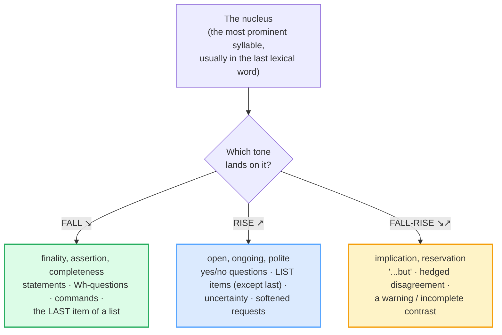

# Intonation

> **Phase 0 · pronunciation · bundle #09 · Days 17–18.**
> *Rising/falling; focus stress changes meaning.*
>
> 🔗 Builds on the pronunciation spine: [FINAL CONSONANTS](./FINAL_CONSONANTS.md)
> (intelligibility starts with the last sound), [WORD STRESS](./WORD_STRESS.md)
> and [SENTENCE STRESS](./SENTENCE_STRESS.md) (the *rhythm* — which syllables
> are strong). Intonation is the **melody on top of that rhythm**: the same
> words, stressed the same way, change meaning when the pitch goes up vs down.
> Ahead: [THOUGHT GROUPS](./THOUGHT_GROUPS.md) (where each intonation contour
> starts and stops).

---

## Why this is bundle #09 (read this first)

A Vietnamese learner can pronounce every word correctly and **still not be
understood** — or, worse, be **misunderstood** — because the **pitch of the
voice** does not match the message. Vietnamese is a **lexical-tone language**:
pitch lives **on each syllable** and distinguishes **words** (*ma* = ghost /
mother / but / tomb / rice seedling / horse, depending on one of **six tones**).
English does the **opposite** — pitch moves across a **whole phrase** and
distinguishes **functions** (statement vs question) and **focus** (which word is
the new information), not words.

So a Vietnamese speaker tends to produce **monotone English** (the sentence-level
melody is flattened by the per-syllable tone habit), or **carries Vietnamese
tones into English** (a rising word-tone lands on the wrong syllable and distorts
the intended contour). The result: a statement that **sounds unsure** (wrong
rise), a question that **sounds rude** (wrong fall), or a list that **sounds
unfinished** (no final fall). Intonation is the last 10% of intelligibility —
and the first thing a native ear notices when it's wrong.

---

## 1. The mechanism: Vietnamese tone vs English intonation

The two languages use pitch for **completely different jobs**:

| | Vietnamese (L1) | English (target) |
|---|---|---|
| What pitch does | marks **word** meaning (lexical tone) | marks **sentence** function + focus (intonation) |
| Where pitch lives | on **each syllable** (6 contrastive tones) | on the **nucleus** of the phrase (one main movement) |
| How many tones | 6 (ngang, huyền, sắc, hỏi, ngã, nặng) | 3 high-frequency nuclear tones: **fall ↘ · rise ↗ · fall-rise ↘↗** |
| A wrong pitch | changes the **word** (*ma* → *má*) | changes the **function** (statement → question) or the **focus** |

So the learner's mouth, trained to put a tone on every syllable, has to learn to
**let most of the sentence sit on a steady pitch and move it once**, on the
**nucleus** (the most prominent syllable, usually in the last lexical word).

> From `intonation_corpus.md` (the pinned minimal pair — corpus §A):
>
> | She's a teacher.↘ | She's a teacher?↗ |
> |---|---|
> | /ʃiːz ə ˈtiːtʃə↘/ — nuclear **fall** | /ʃiːz ə ˈtiːtʃə↗/ — nuclear **rise** |
>
> The **same five words**, stressed identically, are a **statement** (fall —
> "this is a fact") or a **question** (rise — "is that so?"). Nothing in the
> consonants, vowels, or stress changed — only the **pitch movement on the last
> prominent syllable**. That is the whole of intonation in one example.

---

## 2. The three nuclear tones and what they mean

English intonation is built on the **nucleus** — the syllable carrying the main
pitch movement — and **three** high-frequency tones on it (Wells 2006; Roach
2009). Learn these three and you cover ~90% of spoken English melody.

### 2.1 Fall ↘ — "I'm telling you / I'm done"

The default **settled** tone. Statements, Wh-questions, commands, and the last
item of a list all land on a fall. It signals the speaker considers the matter
closed.

> From `intonation_corpus.md` (corpus §B1):
>
> - **Where do you live?↘** /ˈweə də juː ˈlɪv↘/ — Wh-question, fall on "live"
> - **Leave it on the table.↘** /ˈliːv ɪt ɒn ðə ˈteɪbl↘/ — command, fall on "ta-"
> - **It's on the ↘table.** /ɪts ɒn ðə ˈteɪbl↘/ — statement, fall on "ta-"

**The Vietnamese trap:** because Vietnamese has no sentence-final "statement
fall," a learner may end statements on a **flat or rising** pitch — sounding
**unsure** or **as if still asking**. Drill the fall on the last content word of
every statement.

### 2.2 Rise ↗ — "over to you / there's more"

The rise keeps the floor **open**: it genuinely asks (yes/no question), signals
**more to come** (a list item), hedges (**uncertainty**), or **softens** a
request into politeness.

> From `intonation_corpus.md` (corpus §B2):
>
> - **Do you want coffee?↗** /duː juː wɒnt ˈkɒfi↗/ — yes/no question
> - **apples, ↗oranges, ↗bananas, and ↘grapes** — rise on every item **except the
>   last**, which falls (the fall says "that's everything")
> - **Could you help me?↗** /kʊd juː ˈhelp miː↗/ — request softened by a rise (a
>   fall here sounds blunt/like an order)
> - **See you ↗tomorrow?** /ˈsiː juː təˈmɒrəʊ↗/ — checking ("is that still ok?")

**The Vietnamese trap:** the opposite error of §2.1 — ending a **genuine
yes/no question** on a **fall** makes it sound like a **rude demand** or a
statement of fact ("You want coffee.↘" instead of "You want coffee?↗"). Pair
every yes/no question with a rise.

### 2.3 Fall-rise ↘↗ — "…but" (the implication tone)

The fall-rise says **"there's more to this than I'm saying."** It signals a
**reservation**, a **hedged disagreement**, or a **contrast the speaker leaves
unfinished**. Cambridge Grammar Today: *"We use fall-rise intonation at the end
of statements when we want to say [that something is true but…]"*.

> From `intonation_corpus.md` (corpus §B3):
>
> - **It's ↘good↗.** /ɪts ˈɡʊd ↘↗/ — implication: "…but [expensive / I have a
>   concern]." The withheld negative is the whole point.
> - **I ↘didn't↗.** /aɪ ˈdɪdnt ↘↗/ — contrast: "…I did **something else**."

**The Vietnamese trap:** learners usually **flatten this to a simple fall**
("It's good.↘") — which to a native ear **removes the reservation** and sounds
like unqualified praise. The fall-rise is *advanced* but it is what separates
"good English" from "native-like English" for hedging.

---

## 3. Focus / nuclear stress — moving the nucleus moves the meaning

The nucleus is **not fixed** to the last word. You can **shift it** to mark which
part of the sentence is the **new information**. Same words, different nucleus →
the sentence answers a **different question**. Wells (2006) calls this
**tonicity**.

> From `intonation_corpus.md` (corpus §C):
>
> - **I saw a ↘MAN in the garden.** — nucleus on *man* → answers **"Whom did you
>   see?"** (the man is the new info)
> - **I ↘SAW a man in the garden.** — nucleus on *saw* → answers **"Did you hear
>   a man…?"** (the *seeing* is the new info)

The rule of thumb: **put the nucleus on the new/contrastive word.** If the
listener already knows part of the sentence, **de-stress it** (flatten its pitch,
shorten its vowel) and **move the pitch movement** onto the part they don't know.

🔗 This is the bridge to [SENTENCE STRESS](./SENTENCE_STRESS.md): sentence stress
decides *which words are strong vs weak*; intonation decides *which strong
syllable carries the pitch movement*. The two work together.

---

## 4. Cheat sheet — the ≤8 survival chunks

The Pareto set. Drill these eight aloud, exaggerating the pitch movement first,
then relaxing. (Every row is a corpus attestation above.)

| # | Chunk | Tone | Why it's here |
|---|---|---|---|
| 1 | **She's a teacher.↘** | fall | statement — finality (pinned pair, §A) |
| 2 | **She's a teacher?↗** | rise | same words → yes/no question (§A) |
| 3 | **Where do you live?↘** | fall | Wh-questions fall (§B1) |
| 4 | **Do you want coffee?↗** | rise | yes/no questions rise (§B2) |
| 5 | **apples, ↗oranges, ↗bananas, and ↘grapes** | rise…rise…fall | listing: rise on each, fall on last (§B2) |
| 6 | **Could you help me?↗** | rise | rise softens a request → politeness (§B2) |
| 7 | **It's ↘good↗.** | fall-rise | implication / "…but" (§B3) |
| 8 | **I saw a ↘MAN** (vs **I ↘SAW**) | fall, shifted nucleus | focus stress moves the new info (§C) |

> Open [`intonation.html`](./intonation.html) to drill these as flip cards, hear
> native clips, play the tone-flip role-play, shadow, and write.

---

## 5. Vietnamese → English L1 pitfalls table

The "expert payoff." These are the specific interference traps a Vietnamese
speaker hits on intonation — extend, don't replace, the seed rows from the spec.

| Vietnamese trap (what you do) | English fix (what to do instead) |
|---|---|
| **Vietnamese is a lexical-tone language** — pitch lives on *each syllable* and distinguishes *words*; there is no sentence-level intonation system to transfer. | Re-train pitch as a **phrase-level** event: let most of the sentence ride a **steady** pitch, then make **one** movement (↘/↗) on the **nucleus** (the last prominent syllable). |
| **Monotone English** — the per-syllable tone habit flattens the sentence melody, so statements/questions sound the same. | Exaggerate the **fall** on statements and the **rise** on yes/no questions until the contrast is obvious; then relax. Record and listen for the pitch movement. |
| **Carry-over of Vietnamese tones** — a rising Vietnamese word-tone (e.g. *sắc/ngã*) lands on an English syllable and **distorts** the intended contour. | Treat English words as **tone-less** by default; assign tone only at the **phrase** level, on the nucleus. Drill minimal pairs: *"teacher"* said with no word-tone, only the sentence tone. |
| **Statement ends on a rise** → sounds unsure / like still asking. | End **statements** and **Wh-questions** on a **fall ↘**. The fall is the "I'm telling you" signal. |
| **Yes/no question ends on a fall** → sounds blunt / like a demand ("You want coffee.↘"). | End **yes/no questions** on a **rise ↗**. The rise is the "over to you" signal. |
| **No listing contour** — every list item gets the same flat tone → list sounds unfinished or ambiguous. | **Rise on each item except the last, fall on the last:** *apples ↗, oranges ↗, and grapes ↘*. The final fall is what says "that's the whole list." |
| **Requests delivered on a fall** → sound like commands / rude. | Soften requests with a **rise**: *Could you help me?↗*. A fall on a request reads as an order. |
| **No fall-rise (↘↗) for implication** — flattens *"It's good↗…"* to *"It's good.↘"*, removing the "…but" and sounding like full praise. | Learn the **fall-rise** as the "…but" tone: pitch **down then up** on the nucleus (*It's ↘good↗*). It is the core hedging/disagreement tool. |
| **Focus stress never moves** — nucleus always on the last word, so *"I saw a man"* can't distinguish "whom?" from "what happened?". | Practise **shifting the nucleus** to the new information: *I saw a ↘MAN* (whom?) vs *I ↘SAW a man* (what did you do?). De-stress everything the listener already knows. |
| **Surprise/echo not marked** — echoing *"She's a teacher?"* on a fall sounds like confirmation, not surprise. | An **echo question** takes a **rise** (often with widened pitch): *"She's a ↘TEACHER?↗"* = "really?!" Tone + focus together. |

---

## How to practise this bundle (the daily 20 min)

1. **READ** (5 min) — this guide, §1–§3.
2. **SHADOW** (7 min) — open `intonation.html`, drill the 8 flip cards + the
   tone-flip role-play **aloud**, exaggerating every ↘/↗/↘↗, then relaxing.
3. **PRODUCE** (8 min) — the writing task: mark ↘/↗ on 6 sentences and state the
   effect of each. Then **say** them aloud with the marked tone, recording
   yourself; check the pitch actually moves.

---

## Sources

- Cambridge Grammar Today, "Intonation" — https://dictionary.cambridge.org/us/grammar/british-grammar/intonation (falling / rising / fall-rise; statement vs yes/no question; listing; the politeness rise; the implication use of fall-rise).
- Wikipedia, *Intonation (linguistics)* — https://en.wikipedia.org/wiki/Intonation_(linguistics) (the four tone patterns; the six functions incl. grammatical + focusing; the *"He's going ↗home?"* statement→question example; the *"I saw a ↘man"* vs *"I ↘saw"* focus pair; citing Wells 2006, Roach 2009, Cruttenden 1997).
- Roach, P. *English Phonetics and Phonology: A Practical Course* (CUP, 3rd ed. 2009), ch. 15 "Intonation" (pp. 119–160) — the nucleus and the three nuclear tones. Glossary — https://www.peterroach.net/uploads/3/6/5/8/3658625/english-phonetics-and-phonology4-glossary_(1).pdf
- Wells, J. C. *English Intonation: An Introduction* (CUP, 2006) — tonicity (focus/nuclear-stress placement) and the three tones; the canonical reference.
- "A brief comparison of Vietnamese intonation and English intonation" (VNU Journal of Foreign Studies) — https://js.vnu.edu.vn/FS/article/view/2554/2336
- "The acquisition of question intonation by Vietnamese learners of English" (SFLEduc / Springer Open) — https://sfleducation.springeropen.com/articles/10.1186/s40862-018-0044-4
- "Investigating the variation of intonation contours in Northern Vietnamese tones" (Frontiers in Education) — https://www.frontiersin.org/journals/education/articles/10.3389/feduc.2024.1411660/full
- Native audio: YouGlish (phrase search) — https://youglish.com/pronounce/{phrase}/english/us?
- Frequency note: tone contours are prosody, not lexical items, so wordfrequency.info / COCA spoken ranks do not apply (`n/a (prosody)` in the corpus).
