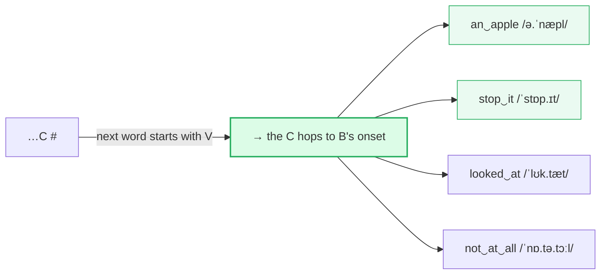
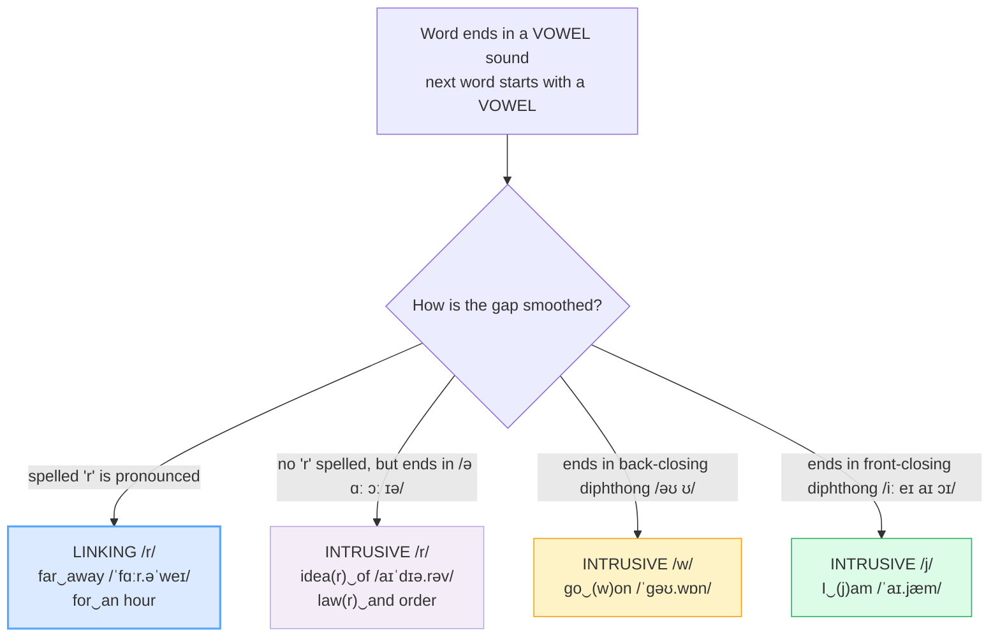

# Linking & Connected Speech

> **Phase 0 · pronunciation · bundle #07 · Days 13–14.**
> *Consonant–vowel and consonant–consonant linking.*
>
> 🔗 Builds on [FINAL CONSONANTS](./FINAL_CONSONANTS.md) — once you *release*
> every final consonant, the next step is to **glide it into the next word**.
> Sibling bundles: [SENTENCE STRESS](./SENTENCE_STRESS.md) (weak forms feed
> linking), [CONSONANT CLUSTERS](./CONSONANT_CLUSTERS.md) (clusters stay tight at
> the boundary), and forward to [REDUCTIONS](./REDUCTIONS.md) (gonna/wanna/
> "whaddya" are linking + reduction stacked).

---

## Why this is bundle #07 (read this first)

Up to bundle #06 you drilled **single words**. But no native speaker talks in
single words. They talk in a **continuous stream** where words melt together:
*"Can‿I have‿an‿apple‿and‿an‿orange?"* is not six separate islands — it is one
ribbon of sound. That melting is **linking** (also called connected speech), and
it is the single biggest gap between *"I know the words"* and *"I sound fluent."*

For a Vietnamese learner this is doubly hard, because Vietnamese is
**syllable-timed**: every syllable is a crisp, self-contained beat, and speakers
routinely insert a tiny **glottal stop** ([ʔ]) between words. So the Vietnamese
mouth's default is the *opposite* of linking — it **chops**. The result: even
with perfect grammar and vocabulary, Vietnamese-accented English sounds staccato,
word-by-word, and slightly angry. Linking is the fix — and it is also why, at
first, linking can **feel like slurring**. It is not lazy; it is the rhythm of
English.

---

## 1. The mechanism: why Vietnamese learners don't link

| | Vietnamese (L1) | English (target) |
|---|---|---|
| Rhythm | **Syllable-timed** — each syllable a crisp equal beat | **Stress-timed** — content words strong, grammar words squash together |
| Word boundary | **Glottal stop [ʔ]** often inserted; each word starts fresh | **Smoothed** — final C glides into the next vowel |
| Syllable shape | Self-contained (CV/CVC), no resyllabification | **Resyllabified** — boundaries move ("an apple" → /ə.ˈnæpl/) |
| Learner fear | — | Linking feels like **"slurring"** / mumbling |

So when a Vietnamese speaker says *"an apple"*, the L1 habit is to produce two
clean units: /ən/ … [ʔ] … /ˈæpəl/. A native speaker produces one unit:
/ə.ˈnæpl/ — the /n/ hops the boundary and becomes the **onset** of *apple*.
That hop is the whole game.

> From `linking_corpus.md`:
>
> | an apple | stop it |
> |---|---|
> | /əˈnæpl/ linked · /ən ˈæp.əl/ careful | /ˈstɒp.ɪt/ UK · /ˈstɑːp.ɪt/ US linked |
>
> Same vowel, same consonants — but in the linked form the final consonant
> **belongs to the next word**. There is no gap, no glottal stop.

---

## 2. Consonant-to-vowel (C-V) linking — the workhorse

When word A ends in a **consonant** and word B starts with a **vowel**, the final
consonant glides over to become the first sound of B. This is by far the most
common link, and it is the one that makes English flow.

> From `linking_corpus.md` (the C-V rows, verbatim):
>
> - **an apple** /əˈnæpl/ linked (the pinned example — `/n/` → onset of *apple*)
> - **stop it** /ˈstɒp.ɪt/–/ˈstɑːp.ɪt/ linked
> - **looked at** /ˈlʊk.tæt/ linked · /lʊkt ət/ careful
> - **not at all** /ˈnɒ.tə.tɔːl/–/ˈnɑː.tə.tɑːl/ linked (three links in a row!)

**The drill:** say the final consonant as if it **belongs to the next word**.
Practise *an‿apple, an‿orange, an‿egg* until the /n/ always hops. Add the ‿ link
mark under the paper so your eye trains your mouth.

---

## 3. Consonant-to-consonant (C-C) linking — merger & assimilation

When **two consonants** meet at the boundary, English does **not** double-articulate.
It simplifies in two ways:

### 3.1 Identical consonants merge (gemination)

Same consonant twice → **one long consonant**. *good day* is not /ɡʊd … deɪ/; the
two /d/s fuse into a single held /dː/.

> From `linking_corpus.md`:
>
> - **good day** /ɡʊˈdeɪ/ linked · /ɡʊd deɪ/ careful
> - **black cat** /ˌblækˈkæt/ linked (the two /k/s merge into one long /kː/)

### 3.2 Similar consonants assimilate — and yod-coalescence (/t/+/j/→/tʃ/)

When */t/ or /d/* meets a following **/j/** (the "y" sound, as in *you*), they
**coalesce** into a single affricate: /t/+/j/ → **/tʃ/** ("ch"), /d/+/j/ → **/dʒ/**
("j"). This is why *got you* becomes *gotcha* — it is not slang, it is phonology.

| careful | coalesced | spelling |
|---|---|---|
| /ˈɡɒt ju/ | /ˈɡɒtʃə/ | got you → **gotcha** |
| /ˈwʊd ju/ | /ˈwʊdʒu/ → /ˈwʊdʒə/ | would you |
| /wɒt du ju/ | /wəˈdʒə/ | what do you → **whaddya** 🔗 |

> From `linking_corpus.md`:
>
> - **got you → gotcha** /ˈɡɒtʃə/ UK · /ˈɡɑːtʃə/ US
> - **would you** /ˈwʊdʒu/ → /ˈwʊdʒə/ coalesced
> - **this shop** /ðɪˈʃɒp/–/ðɪˈʃɑːp/ linked (/s/+/ʃ/ → /ʃ/ — place assimilation)

> **Verification:** yod-coalescence producing *gotcha* /ˈɡɒtʃə/ and *whatcha*
> /ˈwɒtʃə/ is confirmed in *Practical Phonetics of the English Language* (UDPU)
> and *English Accents and Dialects* ("[ˈwʊdʒʊ] would you, or [ˈɡɒtʃə] got you").

---

## 4. Linking /r/ and intrusive /w/ /j/ /r/ — smoothing a vowel-to-vowel gap

Two vowels back-to-back make a **hiatus** — a tiny awkward gap. English hates
hiatus, so it fills it three ways:

> **Accents note:** **linking /r/** and **intrusive /r/** are features of
> **non-rhotic** accents (most of England, Wales, Australia, NZ). In a rhotic US
> accent, every spelled 'r' is pronounced anyway, so "linking /r/" is automatic —
> but **intrusive /r/** (idea-r-of, law-r-and order) still happens and is the
> part that surprises learners. Intrusive **/w/** and **/j/** happen in **all**
> accents.

> From `linking_corpus.md`:
>
> - **far away** /ˈfɑːr.əˈweɪ/ — linking /r/ (spelled 'r', pronounced before V)
> - **idea of** /aɪˈdɪə.rəv/ — intrusive /r/ (no 'r' spelled; often taught as
>   "linking /r/")
> - **go on** /ˈɡəʊ.wɒn/ UK · /ˈɡoʊ.wɑːn/ US — intrusive /w/
> - **I am** /ˈaɪ.jæm/ — intrusive /j/
> - **law and order** /ˈlɔː.rən.dɔː.də/ UK — intrusive /r/ (the "Laura Norder"
>   effect)

---

## 5. Cheat sheet — the ≤8 survival chunks

The Pareto set. Drill these aloud until each link is automatic — glide the final
consonant, merge the twin consonants, coalesce the /t/+/j/, smooth the vowel gap.
(Every row is a corpus attestation above.)

| # | Chunk | IPA | Why it's here |
|---|---|---|---|
| 1 | **an‿apple** | /əˈnæpl/ | C-V: the /n/ hops to the next vowel (pinned) |
| 2 | **stop‿it** | /ˈstɒp.ɪt/–/ˈstɑːp.ɪt/ | C-V: the /p/ hops to the next vowel |
| 3 | **good‿day** | /ɡʊˈdeɪ/ | C-C: identical /d/ merges into one |
| 4 | **got you → gotcha** | /ˈɡɒtʃə/–/ˈɡɑːtʃə/ | /t/+/j/ coalesces to /tʃ/ |
| 5 | **idea(r)‿of** | /aɪˈdɪə.rəv/ | intrusive /r/ between two vowels |
| 6 | **go‿(w)on** | /ˈɡəʊ.wɒn/–/ˈɡoʊ.wɑːn/ | intrusive /w/ after /əʊ/ |
| 7 | **I‿(j)am** | /ˈaɪ.jæm/ | intrusive /j/ after /aɪ/ |
| 8 | **what do you → whaddya** | /wəˈdʒə/ | full reduction + coalescence 🔗 |

> Open [`linking.html`](./linking.html) to drill these as flip cards, hear native
> clips, play the linked-speech role-play, shadow, and mark link points.

---

## 6. Vietnamese → English L1 pitfalls table

The "expert payoff." These are the specific interference traps a Vietnamese
speaker hits on linking and connected speech — extend, don't replace, the seed
rows from the spec.

| Vietnamese trap (what you do) | English fix (what to do instead) |
|---|---|
| **Inserts a glottal stop [ʔ] between words** → every word starts crisply, speech sounds **chopped/robotic** | Drop the glottal stop. Let the final consonant **glide** into the next vowel: *an‿apple* /əˈnæpl/, not /ən/ [ʔ] /ˈæpəl/. Practise with the ‿ mark on paper. |
| **Treats each syllable as a self-contained unit** (syllable-timed L1) → no resyllabification, word boundaries are hard walls | Resyllabify: the final consonant **belongs to the next word**. Say *stop‿it* as if it were spelled *sto-pit*. |
| **Linking feels like "slurring" / mumbling** → learner deliberately separates words to "speak clearly" | Reframe: linking **is** clear English. Unlinked speech sounds broken and effortful to a native ear. Link to sound fluent, not sloppy. |
| **Holds each word's final consonant separately** → *good day* said as /ɡʊd … deɪ/ with a double tap | Merge identical consonants into **one long consonant** (gemination): *good day* /ɡʊˈdeɪ/, *black cat* /ˌblækˈkæt/. One /d/, one /k/ — held longer. |
| **Never coalesces /t/+/j/** → says *got you* as /ɡɒt ju/ (sounds stilted) | Let /t/+/j/ fuse to /tʃ/: *gotcha* /ˈɡɒtʃə/, *would you* /ˈwʊdʒu/. Same for /d/+/j/→/dʒ/. This is standard, not slang. |
| **Leaves a gap between two vowels** → *I am* as /aɪ … æm/, *go on* as /ɡəʊ … ɒn/ | Smooth with intrusive glides: *I am* /ˈaɪ.jæm/ (intrusive /j/), *go on* /ˈɡəʊ.wɒn/ (intrusive /w/). |
| **Doesn't use linking/intrusive /r/** → *idea of* /aɪˈdɪə … ɒv/ (two awkward gaps) | In non-rhotic UK style, link with /r/: *idea(r) of* /aɪˈdɪə.rəv/. (Rhotic US speakers: still useful to recognise.) |
| **Over-links inside words but not across boundaries** → smooth within a word, choppy between words | Train the **boundary** specifically. The link you need is the *cross-word* one — that's what fluency lives on. |
| **Cannot parse fast linked speech** → natives sound like they're swallowing words | Reverse-engineer it: when a native says /wəˈdʒə/, hear *what do you*. Shadow native clips to map sound→spelling. 🔗 [REDUCTIONS](./REDUCTIONS.md) |

---

## How to practise this bundle (the daily 20 min)

1. **READ** (5 min) — this guide, §1–§4.
2. **SHADOW** (7 min) — open `linking.html`, drill the 8 flip cards + the
   role-play **aloud**, exaggerating each link first (hold the ‿), then relaxing.
3. **PRODUCE** (8 min) — the writing task: take 3 sentences, **draw the ‿ link
   mark** at every boundary, then read them aloud recording yourself; check each
   link is smooth and there is **no glottal stop**.

---

## Sources

- Cambridge Advanced Learner's Dictionary — https://dictionary.cambridge.org/dictionary/english/{word} (entries for *apple, an, stop, look, not, at, good, day, black, gotcha, would, this, far, idea, go, on, be, law, can, orange, cup, of, that, whaddya*)
- Oxford Advanced Learner's Dictionary — https://www.oxfordlearnersdictionaries.com/definition/english/go_1
- Roach, P. "Linking, intrusive, and rhotic /r/ in pronunciation models," *Journal of the International Phonetic Association* (Cambridge JIPA) — https://www.cambridge.org/core/journals/journal-of-the-international-phonetic-association/article/linking-intrusive-and-rhotic-r-in-pronunciation-models/DC9E08529A27B017E5BD3DC6BD1BE2F9
- *Linking and intrusive R* (overview citing Wells 1982, Gimson, Jones) — https://en.wikipedia.org/wiki/Linking_and_intrusive_R
- *English Accents and Dialects* (library text) — yod-coalescence: "[ˈwʊdʒʊ] would you, or [ˈɡɒtʃə] got you".
- *Practical Phonetics of the English Language* (UDPU) — "gotcha /ˈɡɒtʃə/ (for got you /ˈɡɒtju/)" and "whatcha /ˈwɒtʃə/".
- Nguyen, "The systematic reduction of English syllable-final consonants" (GMU Linguistics Club) — https://orgs.gmu.edu/lingclub/WP/texts/6_Nguyen.pdf
- "Difficulties for Vietnamese when pronouncing English: Final Consonants" (Diva-Portal) — https://www.diva-portal.org/smash/get/diva2:518290/FULLTEXT01.pdf
- "Vietnamese Phonology: A Complete Guide" (Remitly) — https://www.remitly.com/blog/education/vietnamese-phonology-guide/
- Native audio: YouGlish — https://youglish.com/pronounce/{chunk}/english/us?
- Frequency methodology: wordfrequency.info (spoken sub-corpus) — https://www.wordfrequency.info/
