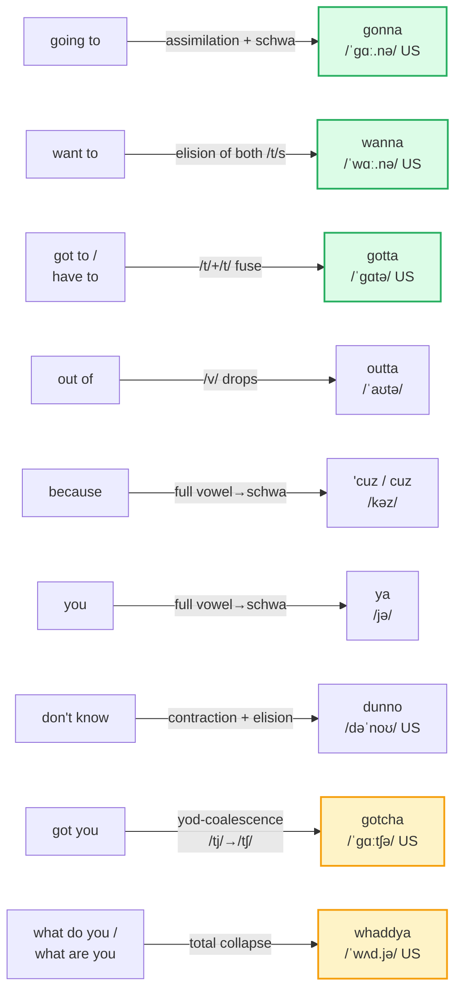
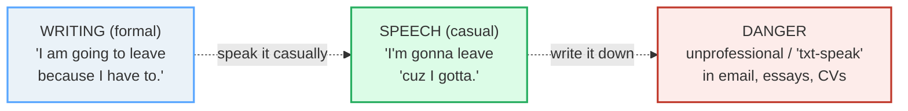

# Reductions

> **Phase 0 · pronunciation · bundle #08 · Days 15–16.**
> *gonna, wanna, "Whaddya", "d'ya".*
>
> 🔗 Builds on three earlier pronunciation bundles: [FINAL CONSONANTS](./FINAL_CONSONANTS.md)
> (a reduction is really a final consonant that assimilates or drops),
> [LINKING](./LINKING.md) (reductions only sound natural once consonants link
> across word boundaries), and [SENTENCE STRESS](./SENTENCE_STRESS.md)
> (reductions are the extreme end of weak-form grammar words). Forward link:
> [INTONATION](./INTONATION.md) — a reduced *whaddya* with a rising tone is a
> real question; flat, it is a statement.

---

## Why reductions are not "lazy" speech (read this first)

A Vietnamese learner's first instinct on hearing *gonna* or *whaddya* is that
the native speaker is being **sloppy** — and that copying them is "bad English."
The opposite is true. English is a **stress-timed** language: the rhythm is
carried by the *content* words, and the grammar words in between are **crushed**
to keep the beat even. Vietnamese is **syllable-timed** — every syllable gets
near-equal weight — so a Vietnamese speaker who says every word fully
("What do you want to do?") sounds stiff, formal, and slightly robotic to a
native ear. The reductions *are* the rhythm.

This bundle does two jobs at once. **For listening:** without reductions you
cannot decode fast native speech — a learner who knows every word in "Whaddya
gonna do?" still hears gibberish the first time. **For speaking:** used in the
right register (casual, spoken), reductions make you sound fluent, not broken.
The one hard line: **reductions are for speech, not formal writing.** Cambridge
itself flags `gonna` and `wanna` as *"not standard"* and notes *"in written
English 'gonna' is usually used to report or approximate speech."*

---

## 1. The mechanism: why English crushes its function words

| | Vietnamese (L1) | English (target) |
|---|---|---|
| Rhythm | **Syllable-timed** (each beat ~equal) | **Stress-timed** (content beats far apart; grammar crushed) |
| Function words | Pronounced fully | Reduced to schwa /ə/ or a single consonant |
| Word boundaries | Kept separate | **Assimilated & linked** (/t/+/j/ → /tʃ/, etc.) |
| *to* / *you* | — | /tu/ → /tə/ → /də/; /juː/ → /jə/ → /ə/ |

Three phonological processes do the crushing (all confirmed in the phonetics
references in the corpus):

1. **Weak-form vowels** — every grammar word has a "strong" form (used when
   stressed) and a "weak" form (used ~90% of the time). *To* /tuː/ → /tə/;
   *you* /juː/ → /jə/; *of* /ɒv/ → /əv/.
2. **Assimilation** — a consonant changes to match its neighbour. *Got to*
   /ɡɒt tu/ → the two /t/s fuse and the first voices → /ˈɡɒtə/ (*gotta*).
3. **Elision** — a sound drops entirely. *Want to* → *wanna* (the /t/ of
   *want* and the /t/ of *to* both go); *out of* → *outta* (the /v/ of *of*
   drops).

> From `reductions_corpus.md`:
>
> | gonna | wanna | gotta |
> |---|---|---|
> | /ˈɡə.nə/ UK · /ˈɡɑː.nə/ US | /ˈwɒn.ə/ UK · /ˈwɑː.nə/ US | /ˈɡɒtə/ UK · /ˈɡɑtə/ US |
>
> All three: a two-word auxiliary + *to*, crushed into one chunk by
> assimilation + elision + schwa. Cambridge lists `gonna` and `wanna` as full
> headwords — they are that frequent in speech.

---

## 2. The reduction map — full form → spoken form

> From `reductions_corpus.md` (the map, verbatim rows):
>
> - **gonna** = *going to* — /ˈɡə.nə/ UK · /ˈɡɑː.nə/ US (stressed form often /ˈɡʌnə/)
> - **wanna** = *want to* / *want a* — /ˈwɒn.ə/ UK · /ˈwɑː.nə/ US
> - **gotta** = *have got to* / *got a* — /ˈɡɒtə/ UK · /ˈɡɑtə/ US
> - **outta** = *out of* — /ˈaʊtə/
> - **'cuz** / **cuz** = *because* — /kʌz/ strong · /kəz/ weak
> - **ya** = *you* — /jə/
> - **'em** = *them* — /əm/ (historic, from Old English *hem* — the *th-* was never there)
> - **dunno** = *don't know* — /dəˈnoʊ/ US
> - **gotcha** = *got you* — /ˈɡɒtʃə/ UK · /ˈɡɑːtʃə/ US
> - **whaddya** = *what do you* / *what are you* — /ˈwʌd.jə/ US · /ˈwɒd.jə/ UK

---

## 3. Yod-coalescence: why *got you* → *gotcha*

The single mechanism behind `gotcha`, `whaddya`/`whatcha`, `didja`, `meetcha`:
when a **/t/ or /d/** meets a following **/j/** (the *y* sound of *you*), they
fuse into **/tʃ/ (ch)** or **/dʒ/ (j)**. Documented in *Practical Phonetics of
the English Language* (UDPU) and *English Accents and Dialects* as the textbook
case of **cross-word yod-coalescence**:

- *got* + *you* /ɡɒt ju/ → **gotcha** /ˈɡɒtʃə/
- *what are* + *you* → **whatcha** /ˈwɒtʃə/
- *did* + *you* → **didja** /ˈdɪdʒə/
- *meet* + *you* → **meetcha** /ˈmiːtʃə/

> From `reductions_corpus.md`:
>
> > "the colloquial *gotcha* /ˈɡɒtʃə/ (for *got you* /ˈɡɒtju/)"
> > — *Practical Phonetics of the English Language* (UDPU)

**The Vietnamese trap:** learners either (a) refuse to coalesce and say "got
you" with a hard gap — sounds unnatural — or (b) mis-hear *gotcha* as a
separate vocabulary word they don't know, freezing comprehension. It is not a
new word; it is two words you already know, glued.

---

## 4. The register line: speech vs writing (do not cross it)

Reductions are the clearest **register marker** in English. Crossing the line
the wrong way is the fastest way to sound either stiff or unprofessional:

| Context | Use reductions? | Example |
|---|---|---|
| Talking to a friend | ✅ Yes, expected | "Whaddya wanna do?" |
| Casual phone/video call | ✅ Yes | "I gotta go." |
| Job interview (speaking) | ⚠️ Sparingly — full forms safer | "I am going to…" |
| Email to a colleague | ❌ No | "I am going to…" not "I'm gonna…" |
| Essay / CV / report | ❌ Never | full forms only |

> Cambridge on `gonna`: *"not standard … in written English 'gonna' is usually
> used to report or approximate speech."* The writing task in the player drills
> exactly this line: rewrite a formal sentence *into* casual spoken English, and
> note the spoken-only rule.

---

## 5. Cheat sheet — the ≤8 survival chunks

The Pareto set. Drill these eight aloud until the reduction feels natural in
your mouth, not like slang. (Every row is a corpus attestation above.)

| # | Chunk | IPA | Why it's here |
|---|---|---|---|
| 1 | **gonna** | /ˈɡɑː.nə/ US · /ˈɡə.nə/ UK | *going to* — the #1 reduction; Cambridge headword |
| 2 | **wanna** | /ˈwɑː.nə/ US · /ˈwɒn.ə/ UK | *want to* / *want a* — Cambridge headword |
| 3 | **gotta** | /ˈɡɑtə/ US · /ˈɡɒtə/ UK | *have got to* / *have to* — obligation, casual |
| 4 | **dunno** | /dəˈnoʊ/ US · /ˈdʌnəʊ/ UK | *don't know* — the filler that buys time |
| 5 | **whaddya** | /ˈwʌd.jə/ US · /ˈwɒd.jə/ UK | *what do you* / *what are you* — opens a casual question |
| 6 | **gotcha** | /ˈɡɑːtʃə/ US · /ˈɡɒtʃə/ UK | *got you* / "I understand" — yod-coalescence case study |
| 7 | **outta** | /ˈaʊtə/ | *out of* — "I'm outta here" |
| 8 | **'cuz** | /kəz/ weak · /kʌz/ strong | *because* — casual cause |

> Open [`reductions.html`](./reductions.html) to drill these as flip cards,
> hear native clips, play the role-play, shadow, and do the register-switch
> writing task.

---

## 6. Vietnamese → English L1 pitfalls table

The "expert payoff." These are the specific interference traps a Vietnamese
speaker hits on reductions — extend, don't replace, the seed rows from the spec.

| Vietnamese trap (what you do) | English fix (what to do instead) |
|---|---|
| **Over-enunciates every word** (syllable-timed L1) → "What-do-you-want-to-do?" sounds stiff/robotic | Let the grammar words crush: content words strong, function words weak. Practise *"Whaddya wanna do?"* as **three** beats, not six. |
| **Avoids reductions** because they feel "lazy/wrong/slang" → sounds unnaturally formal in casual chat | Reductions are **the rhythm of English**, not slang. Use them in casual speech; reserve full forms for writing/formal speech. Drill the register line (§4). |
| **Cannot decode fast native speech** even when every word is known → "whaddya" heard as one unknown word | Learn reductions as **listening units**: *whaddya* = *what do you*; *gonna* = *going to*. Loop YouGlish clips at 0.75× until the mapping is instant. |
| **Treats `gonna`/`wanna` as a new vocabulary word** and memorises it in isolation | Learn the **full→reduced pair** together: *going to → gonna*. You're not learning a new word, you're learning how a word you know *sounds*. |
| **Writes reductions in formal contexts** — "I'm gonna send the report" in a client email | Hard rule: **speech only.** In email/essays/CVs write *going to*, *want to*, *because*. The writing task in the player drills this boundary. |
| **Inserts a vowel / breaks the chunk** — "go-ing to" (full syllables) where a native says one chunk | Say the reduction as **one syllable blob**: *gonna* /ˈɡʌnə/ is one beat, not *go-ing-to* (three). Tap the table on each beat. |
| **Hears `'em` and assumes the speaker dropped `/θ/` "lazily"** (the /θ/→zero error from FINAL_CONSONANTS) | `'em` /əm/ is the **historic** form (Old English *hem*) — the *th-* was never there. It is correct casual English, not a final-consonant error. 🔗 [FINAL CONSONANTS](./FINAL_CONSONANTS.md) |
| **Refuses to coalesce** → says "got...you" with a gap instead of *gotcha* | Let /t/ + /j/ fuse into /tʃ/. Practise *got you → gotcha*, *did you → didja*, *meet you → meetcha* as single units. 🔗 [LINKING](./LINKING.md) |
| **Mis-stresses the reduction** — puts weight on the wrong syllable ("gon-NA") | Stress the **first** syllable: **GON**-na, **WAN**-na, **GOT**-ta, **DUN**-no. The second syllable is always a weak schwa /ə/. |
| **Applies the American flap-T inconsistently** — *gotta* /ˈɡɑtə/ vs [ˈɡɑɾə] | In US English, a /t/ between vowels flaps to [ɾ] (sounds like a quick *d*): *gotta* [ˈɡɑɾə], *outta* [ˈaʊɾə]. It is correct, not sloppy. 🔗 [LINKING](./LINKING.md) |

---

## How to practise this bundle (the daily 20 min)

1. **READ** (5 min) — this guide, §1–§4. Internalise the one rule: reductions
   are the rhythm of English, **speech only**.
2. **SHADOW** (7 min) — open `reductions.html`, drill the 8 flip cards **aloud**,
   then play the role-play as both Person A and B. Aim for *three beats*, not
   six, on "Whaddya wanna do?"
3. **PRODUCE** (8 min) — the writing task: take one formal sentence ("I am
   going to leave because I have to") and rewrite it as casual **spoken**
   English ("I'm gonna leave 'cuz I gotta"). Read it aloud. Then write one
   **email** version using full forms only — to lock the register line.

---

## Sources

- Cambridge Advanced Learner's Dictionary — https://dictionary.cambridge.org/dictionary/english/{word} (entries for *gonna* UK /ˈɡə.nə/ · US /ˈɡɑː.nə/, *wanna* UK /ˈwɒn.ə/ · US /ˈwɑː.nə/, *ya* /jə/; Cambridge flags both as *"not standard … used to report or approximate speech"*).
- Cambridge Academic Content Dictionary (American) — variants *gonna* /ˌɡɔ·nə, ˌɡɑn·ə, ɡən·ə/, *wanna* /ˈwɑn·ə, ˈwʌn·ə, ˈwɔ·nə/.
- Wiktionary — https://en.wiktionary.org/wiki/{word} (*gonna* stressed /ˈɡʌnə/, *gotta* /ˈɡɒtə/–/ˈɡɑtə/, *dunno* /dəˈnoʊ/, *outta* /ˈaʊtə/, *cuz* /kʌz/–/kəz/, *'em* /əm/).
- *Practical Phonetics of the English Language* (UDPU) — cross-word yod-coalescence: *gotcha* /ˈɡɒtʃə/, *whatcha* /ˈwɒtʃə/ — http://dspace.udpu.edu.ua/bitstreams/bf478127-6ac2-4f87-89a3-bef6d10c90dc/download
- *English Accents and Dialects* (cur.ac.rw library) — yod-coalescence: [ˈɡɒtʃə] *got you*, [ˈwʊdʒʊ] *would you* — https://www.cur.ac.rw/mis/main/library/documents/book_file/digital-65cf242a6081a9.45577942.pdf
- Demirezen, M. (2020), "The place of pronunciation spelling in English", *ERIC* — reductions list (*betcha, gotcha, sposta, dunno, howdy*) — https://files.eric.ed.gov/fulltext/EJ1244306.pdf
- UB Graz reductions reference (Diplomarbeit) — *gimme* /gɪmi/, *lemme*, *gotcha*, *dunno* /də'noʊ/ — https://unipub.uni-graz.at/obvugrhs/content/titleinfo/206364/full.pdf
- ResearchGate, "Re-syllabification: A Qualitative Inquiry into Informal English Contractions" — IPA table of contractions — https://www.researchgate.net/publication/374913542
- Cambridge English (official) — reductions explainer (*gonna, wanna, dunno, gotcha, coulda*) — https://www.facebook.com/CambridgeEnglish/posts/1489031276602408
- Native audio: YouGlish — https://youglish.com/pronounce/{chunk}/english/us?
- Frequency methodology: wordfrequency.info (spoken sub-corpus) — https://www.wordfrequency.info/
