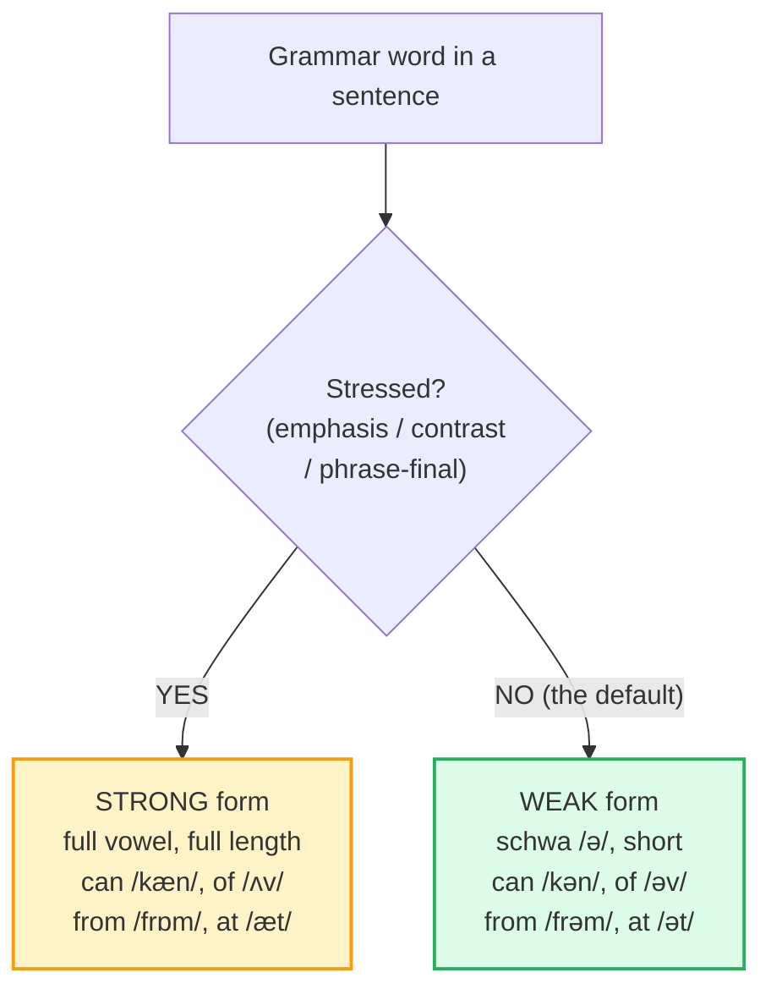

# Sentence Stress & Weak Forms

> **Phase 0 · pronunciation · bundle #06 · Days 11–12.**
> *The rhythm: content words strong, grammar words weak.*
>
> 🔗 Builds on the style anchor [FINAL CONSONANTS](./FINAL_CONSONANTS.md) (the
> word-level intelligibility fix) and [WORD STRESS](./WORD_STRESS.md) (stress
> inside a single word). This bundle scales that rule up to the **sentence**:
> which words get the beat and which collapse. Sibling:
> [LINKING](./LINKING.md) (a weak `can` /kən/ only sounds natural once the /n/
> glues to the next vowel) and [REDUCTIONS](./REDUCTIONS.md) (where weak forms
> push further into *gonna / wanna*).

---

## Why this is bundle #06 (read this first)

A Vietnamese learner can nail every final consonant, every vowel length, every
word stress — and still sound **staccato and unnatural**. The reason is not the
sounds; it is the **rhythm**. Vietnamese is **syllable-timed**: every syllable
gets roughly equal time and weight, like a metronome. English is **stress-
timed**: the *stressed* beats fall at roughly equal intervals, and everything
between them is squashed. A native speaker compresses *What do you want to do?*
into four beats — WHAT … WANT … DO — and throws the grammar words away.

This single contrast — **content words strong, grammar words weak** — is what
separates "understood" from "sounds English." Get it right and your speech
suddenly flows; ignore it and you sound like a robot reading a word list, no
matter how perfect each word is. It is why it sits at the midpoint of Phase 0.

---

## 1. The mechanism: stress-timed vs syllable-timed

English and Vietnamese disagree on what a "beat" is:

| | Vietnamese (L1) | English (target) |
|---|---|---|
| Rhythm type | **Syllable-timed** — each syllable equal | **Stress-timed** — stressed beats equal |
| Grammar words (of, to, and, can) | Full, clear vowel, full length | **Reduced** to a weak form (/ə/) |
| Content words (noun, verb, adj) | Same weight as everything else | **Pushed** — louder, longer, higher |
| The schwa /ə/ | Rare / not a default vowel | **The default vowel** of unstressed syllables |
| Effect when mis-applied | (correct for VN) | sounds robotic, hard to follow, "fast" |

So when an English sentence flows past, the learner's mouth does one of two
things — both of them break the rhythm:

1. **Over-pronounces every word** — "I **can** **of** **to** **the**…" with full
   vowels on every grammar word → flat, staccato, effortful.
2. **Stresses the wrong words** — gives equal beat to "the" and "coffee", so
   the listener can't find the meaning peaks.

> From `sentence_stress_corpus.md`:
>
> | I can do it | a cup of tea |
> |---|---|
> | /aɪ kən ˈduː ɪt/ | /ə ˈkʌp əv ˈtiː/ |
>
> In *I can do it*, `can` is unstressed → **/kən/** (not /kæn/). In *a cup of
> tea*, `of` is unstressed → **/əv/** (not /ʌv/). The vowel that carries the
> meaning is the **content** word; the grammar word collapses to a schwa. That
> collapse *is* the rhythm of English.

---

## 2. The weak-form set: the grammar words that reduce

About 40–50 high-frequency grammar words have two shapes — a **strong form**
(used only under stress / emphasis / phrase-final) and a **weak form** (the
spoken default, built on /ə/). Master this handful and your rhythm transforms.
The weak form is **not** lazy or sloppy speech — it is how the language actually
works. Cambridge transcribes both.

> From `sentence_stress_corpus.md` (the core set, verbatim):
>
> - **can** /kən/ weak · /kæn/ strong — *"I can do it"* → can = /kən/
> - **of** /əv/ weak · /ɒv/ UK · /ʌv/ US strong — *"a cup of tea"* → of = /əv/
> - **to** /tə/ weak · /tuː/ strong — *"I want to go"* → to = /tə/
> - **from** /frəm/ weak · /frɒm/ UK · /frʌm/ US strong — *"I'm from Spain"*
> - **and** /ən/ weak · /ənd/ weak · /ænd/ strong — *"bread and butter"*
> - **for** /fər/ US · /fə/ UK weak · /fɔːr/ strong — *"this is for you"*
> - **at** /ət/ weak · /æt/ strong — *"see you at noon"*
> - **was** /wəz/ weak · /wɒz/ UK · /wʌz/ US strong — *"He was happy"*

**The rhythm rule in one line:** nouns, main verbs, adjectives, adverbs,
question words, negative auxiliaries = **stressed**; articles, prepositions,
pronouns, auxiliary verbs, conjunctions = **weak**.

---

## 3. When the weak form flips back to strong

The same word does not reduce forever. There are three — and only three —
places a grammar word snaps back to its **strong form**. Knowing these keeps
you from reducing a word that the listener *needs* to hear clearly.

| Environment | Example | Form |
|---|---|---|
| **Phrase-final** (preposition stranded at the end) | "Where are you **from**?" | /frɒm/, not /frəm/ |
| **Contrast / emphasis** | "This is **for** you, not **from** you." | /fɔːr/, not /fər/ |
| **Stressed modal** (positive assertion) | "You **can** do it!" | /kæn/, not /kən/ |

> From `sentence_stress_corpus.md`:
>
> - `from` phrase-final → /frɒm/ UK · /frʌm/ US (strong)
> - `at` phrase-final → /æt/ (strong) — *"What are you looking at?"*
> - `can` stressed → /kæn/ (strong)
> - `for` contrastive → /fɔːr/ US · /fɔː/ UK (strong)

> **The modal trap:** `can` /kən/ vs `can't` /kænt/ differ in **vowel** (/ə/
> vs /æ/), not just the final /t/. A Vietnamese ear hears both as "can" — so
> *"I can do it"* and *"I can't do it"* blur. 🔗 Cross-ref [FINAL CONSONANTS]
> for the /t/, but the real tell is the **vowel**: stressed /æ/ = negative,
> reduced /ə/ = positive.

---

## 4. The two-step practice: stress the content, squash the grammar

The fix is mechanical, drilled in two moves until automatic:

1. **Mark the sentence** — underline the content words (the meaning peaks),
   cross out or hum the grammar words. The underlined words get the beat.
2. **Schwa the rest** — let every crossed-out word fall to /ə/, short and low.
   Do not articulate them; let them melt into the neighbour.

> From `sentence_stress_corpus.md` (the role-play focus lines, verbatim):
>
> - **WHAT** do you **WANT** to **DO**? — *do* /də/, *to* /tə/
> - We **CAN** **GRAB** a **CUP** of **COFFEE**. — *can* /kən/, *of* /əv/
> - I **WAS** there **LAST** **WEEK**. — *was* /wəz/
> - Let's **MEET** at the **LIBRARY**. — *at* /ət/, *the* /ðə/

🔗 This is the bridge to [LINKING](./LINKING.md) — once `of` is /əv/, the /v/
glues straight into the next consonant (*cup of coffee* → /kʌv kɒfi/), and to
[REDUCTIONS](./REDUCTIONS.md), where the weak forms push further into *gonna,
wanna, whaddaya*.

---

## 5. Cheat sheet — the ≤8 survival chunks

The Pareto set. Drill these eight aloud until the weak form is automatic and
the strong form only appears under stress. (Every row is a corpus attestation
above.)

| # | Chunk | IPA | Why it's here |
|---|---|---|---|
| 1 | **can** | /kən/ weak · /kæn/ strong | the modal every learner over-says — *"I can do it"* |
| 2 | **of** | /əv/ weak · /ʌv/ US strong | the preposition that melts — *"a cup of tea"* |
| 3 | **to** | /tə/ weak · /tuː/ strong | the particle before every verb — *"I want to go"* |
| 4 | **from** | /frəm/ weak · /frɒm/ strong | weak mid-sentence, strong phrase-final |
| 5 | **and** | /ən/ weak · /ænd/ strong | the conjunction that disappears — *"bread and butter"* |
| 6 | **for** | /fər/ weak · /fɔːr/ strong | weak by default, strong under contrast |
| 7 | **at** | /ət/ weak · /æt/ strong | stranded at the end → strong (*"looking at"*) |
| 8 | **was** | /wəz/ weak · /wʌz/ US strong | the past auxiliary melts — *"He was happy"* |

> Open [`sentence_stress.html`](./sentence_stress.html) to drill these as flip
> cards, hear native clips, play the role-play, shadow, and write.

---

## 6. Vietnamese → English L1 pitfalls table

The "expert payoff." These are the specific interference traps a Vietnamese
speaker hits on sentence stress and weak forms — extend, don't replace, the
seed rows from the spec.

| Vietnamese trap (what you do) | English fix (what to do instead) |
|---|---|
| **Syllable-timed default** — every syllable equally full, long, and clear | Switch to stress-timed: **push** content words (louder, longer, higher) and **squash** grammar words. Hum the unstressed ones on /ə/. |
| **Over-pronounces grammar words** — "I **can** **of** **to** **the**…" with full vowels | Let articles, prepositions, auxiliaries, pronouns collapse to their **weak form** (/ə/, /kən/, /əv/, /tə/). The weak form is correct, not lazy. |
| **No schwa habit** — Vietnamese has no default reduced vowel, so learners avoid /ə/ | Drill /ə/ as the **rest position**: short, relaxed, central. "a-bout, a-go, a-head" — the unstressed vowels are all /ə/. |
| **Stresses the wrong words** — gives "the" and "coffee" equal weight | Mark the sentence first: underline content words (noun/verb/adj/adv), cross out grammar words. Only the underlined get the beat. |
| **Hears `can` /kən/ as `can't`** — Vietnamese ear latches onto the consonant, misses the vowel | Listen for the **vowel**: /ə/ = positive (can), /æ/ = negative (can't). The vowel, not the /t/, is the tell. |
| **Strong form everywhere OR weak form everywhere** — doesn't know the flip rule | Remember the three strong environments: **phrase-final**, **contrast**, **emphasised modal** ("Where are you **from**?"). Otherwise weak. |
| **Reads word-by-word** — each word a separate beat, no compression | Practise **chunks**, not words: "a-cup-of-tea" = one wave with one peak (CUP). Retrieve the multi-word pattern, don't spell it out. |
| **Speeds up to sound "fluent"** but keeps every word full → still staccato, just faster | Speed comes from **reduction**, not from talking faster. Drop the grammar words' weight first; the flow follows. |
| **Copies written spelling into speech** — pronounces the "o" in *of*, the "a" in *and* | Trust the **sound**, not the spelling. `of` = /əv/, `and` = /ən/. The letters lie; the schwa tells the truth. |

---

## How to practise this bundle (the daily 20 min)

1. **READ** (5 min) — this guide, §1–§4.
2. **SHADOW** (7 min) — open `sentence_stress.html`, drill the 8 flip cards +
   the role-play **aloud**, exaggerating the content-word stress and melting the
   grammar words into /ə/, then relaxing.
3. **PRODUCE** (8 min) — the writing task: take 3 sentences, mark every
   stressed word in **CAPS** and every weak word in lowercase, then read them
   aloud recording yourself; check the content words pop and the grammar words
   reduce.

---

## Sources

- Cambridge Advanced Learner's Dictionary — https://dictionary.cambridge.org/dictionary/english/{word} (entries for *can, of, to, from, and, for, at, was, coffee, library, tonight, happy*; US `can` = `/kæn, kən/`).
- Perfect English Grammar — "List of common English words that have weak forms" (PDF) — https://www.perfect-english-grammar.com/support-files/weak-forms-list.pdf (`from /frəm/`, `to /tə/`, `of /əv/`, `and /ən(d)/`).
- Learn English Sounds — "The Weak-Forms Rule: How To, For, From, Of, and And Hide in Natural English" — https://www.learnenglishsounds.com/en/blog/weak-forms-prepositions-to-for-from-of-and-rule-natural-rhythm (the strong-form-return rule; `bread and butter /ˈbred ən ˈbʌtər/`).
- "The Speech Rhythm of Vietnamese Speakers of English" (ASSTA SST-96) — https://assta.org/proceedings/sst/SST-96/cache/SST-96-Chapter15-1-p63.pdf
- "Pronunciation and Accent Clarity for Vietnamese Speakers of English" (WellSaid Coaching) — https://www.wellsaidcoaching.com/blog/pronunciation-and-accent-clarity-for-vietnamese-speakers-of-english
- Style anchor cross-ref: [`final_consonants_corpus.md`](./final_consonants_corpus.md) §D — `and` three-stage weakening /ænd/ → /ənd/ → /ən/.
- Native audio: YouGlish — https://youglish.com/pronounce/{chunk+phrase}/english/us? (all player links verified HTTP 200, 2026-06-23).
- Frequency methodology: wordfrequency.info (spoken sub-corpus) — https://www.wordfrequency.info/
