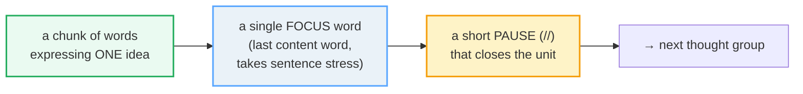

# Thought Groups & Pausing

> **Phase 0 · pronunciation · bundle #10 · Days 19–20.**
> *Chunk speech into meaning units; breathe between.*
>
> 🔗 This is the capstone of Phase 0's rhythm work. It leans on
> [SENTENCE STRESS](./SENTENCE_STRESS.md) (the focus word = the last content word
> of each group) and [LINKING](./LINKING.md) (inside a group you glue words
> together; the pause belongs **between** groups). It feeds forward into
> [INTONATION](./INTONATION.md) (your voice falls or rises at each group's edge)
> and into every Phase 1+ bundle — a request like *"Could you // send me the
> file?"* lands far better chunked than run-on.

---

## Why this is bundle #10 (read this first)

A learner can fix every final consonant, nail word stress, and link cleanly
**and still be hard to follow** — because they deliver one long, breathless
string with no pauses. Native English is **not** a stream; it is a train of
short "packages," each carrying one idea, each closed by a tiny pause and one
stressed **focus word**. These packages are **thought groups**.

> From `thought_groups_corpus.md`:
>
> (the definition — three independent sources agreeing:)
>
> - "groups of words that make up a single idea" — CUNY Baruch (Grant, 2010)
> - "groups of words that form phrases, clauses, or sentences" — KU Ch.4
> - "a group of words that convey a message" — San Diego Voice & Accent

The single highest-leverage habit in this bundle: **pause at grammatical
boundaries.** That one rule turns run-on speech into comprehensible English — and
it is the rule Vietnamese learners break most, because pausing *feels* like
failure to them (see §5). It is the opposite: pausing is what fluent speakers
*do*.

---

## 1. The mechanism: one idea, one focus word, one pause

A thought group has three signatures — and all three must be present or the group
collapses:

> From `thought_groups_corpus.md`:
>
> (canonical attested examples, pausing marked with `//`:)
>
> - **The short little dog** // **in the corner** // **is eating my new shoes.**
>   — 3 groups: noun phrase // prepositional phrase // verb phrase (KU Ch.4)
> - **First** // check to make **sure** // that your seat belt is **secure**. —
>   3 groups, focus words *First / sure / secure* (CUNY Baruch)
> - why would you go to **SCHOOL** // when you could **WORK** // and earn
>   **MON**ey — 3 groups (Elemental English, via KU Ch.4)

Notice each group above is glued together internally (no mid-phrase pause) and
separated from the next by `//`. Inside = link; between = pause. Get that
division right and English rhythm falls into place.

---

## 2. Where to pause: the grammatical-boundary rule

Pauses are **not** random and they are **not** only "where you run out of air."
They fall at **grammatical boundaries** — exactly the spots where writing would
put a comma, semicolon, or period:

| Boundary type | Pause here | Example |
|---|---|---|
| Clause // clause | between two clauses | Before you leave // could you send me the file? |
| Long subject // verb | after a long subject phrase | The report I sent you yesterday // needs a signature. |
| Fronted adverbial // main | after a leading time/if/when phrase | If you take care of the accounts // I'll handle the meeting. |
| Main clause // tail phrase | before a trailing time/condition | I'll call you tomorrow // around three // if that works. |
| Punctuation | at every comma / period | (commas in writing ≈ pauses in speech) |

> From `thought_groups_corpus.md`:
>
> (the pinned real examples:)
>
> - **Before you leave** // **could you send me the file?** — fronted dependent
>   clause // main request; the `//` lands where a comma would be.
> - **I'll call you tomorrow** // **around three** // **if that works.** — a
>   longer turn chunked into three: main clause // time phrase // conditional
>   tail. Three breath points, three meaning units.
> - **If you take care of the accounts** // **I'll handle the meeting.** and
>   **My new phone is acting up** // **so could you email me instead?** — both
>   verbatim from CUNY Baruch's practice set.

> **Punctuation → pause.** You have read English your whole life with commas and
> full stops. Use that knowledge: **a comma is a pause, a period is a longer
> pause.** If you can read it, you can speak it — honour the punctuation you
> already see.

---

## 3. Where NOT to pause: the 3 mechanical rules

Just as important as knowing where to pause is knowing where a pause **breaks**
the group and sounds broken. San Diego Voice & Accent gives three rules; break
any of them and the listener stumbles.

> From `thought_groups_corpus.md`:
>
> (the 3 rules, verbatim from SDVA:)
>
> - **Rule #1 — no pause inside determiner + noun.** Keep *the store*, *at
>   school*, *my daughter* glued. Do **not** say "the // store."
> - **Rule #2 — keep infinitives together.** *to go*, *to eat*, *to drive* — no
>   pause between *to* and the verb.
> - **Rule #3 — a new phrase starts with the conjunction.** Say **"Do you want
>   coffee // or tea?"**, not "Do you want coffee or // tea?"

Pausing *inside* one of these units is the classic non-native error (§5). The
conjunction rule in particular is why *"… // so could you email me instead?"*
sounds right and *"… so // could you email me instead?"* sounds wrong.

---

## 4. Pausing changes meaning (the disambiguation proof)

Thought groups are not decoration — they **carry** meaning. Move the pause and
the meaning moves with it:

> From `thought_groups_corpus.md`:
>
> (SDVA disambiguation example, verbatim:)
>
> | Pausing | Who is asleep? |
> |---|---|
> | **Maria said,** // "the student is asleep." | the **student** |
> | **Maria,** // said the student, // "is asleep." | **Maria** |
>
> Same words, opposite meaning — only the pauses differ. CUNY Baruch makes the
> same point with *"Woman without her man is nothing"* (read it two ways and the
> sentence flips). **The pause is part of the grammar.**

---

## 5. Cheat sheet — the ≤8 survival chunks

The Pareto set. Drill these aloud with the `//` honoured as a real (short)
pause, and the focus word stressed. (Every row is a corpus attestation above.)

| # | Chunk (with pausing) | Focus word IPA | Why it's here |
|---|---|---|---|
| 1 | **Before you leave** // could you send me the **file**? | /faɪl/ | fronted clause // main — the pinned example |
| 2 | I'll call you **tomorrow** // **around three** // if that **works**. | /təˈmɒrəʊ/–/təˈmɑːroʊ/ | a long turn chunked into 3 |
| 3 | **First** // make **sure** // your seat belt is **secure**. | /fɜːst/ | 3 groups, public-speaking rhythm |
| 4 | The short little **dog** // **in the corner** // is eating my **shoes**. | /dɒɡ/–/dɑːɡ/ | NP // PP // VP — the structure |
| 5 | Do you want **coffee** // **or tea**? | /ˈkɒfi/–/ˈkɑːfi/ | conjunction starts the new group |
| 6 | If you take care of the **accounts** // I'll handle the **meeting**. | /əˈkaʊnts/ | conditional // main clause |
| 7 | My phone is acting **up** // so could you email me **instead**? | /ɪnˈsted/ | main // *so*-clause |
| 8 | why would you go to **school** // when you could **work** | /skuːl/ | question // contrast clause |

> Open [`thought_groups.html`](./thought_groups.html) to drill these as flip
> cards, hear native clips, play the chunked-vs-run-on role-play, shadow, and
> insert pausing into a run-on paragraph.

---

## 6. Vietnamese → English L1 pitfalls table

The "expert payoff." These are the specific interference traps a Vietnamese
speaker hits on pausing and chunking — extend, don't replace, the seed rows.

| Vietnamese trap (what you do) | English fix (what to do instead) |
|---|---|
| **Run-on, breathless delivery** — no pauses at all, because Vietnamese is **syllable-timed** (every beat equal) and pausing was never a meaning-tool in L1 | Insert `//` at every grammatical boundary (clause edge, comma, period). Read your commas aloud — a comma **is** a pause. |
| **Pausing feels like "not fluent"** — so you avoid it, racing through to sound "smooth" (the opposite of the truth) | Reframe: pausing **is** fluency. Native speakers pause constantly. A 0.3-second silence at a clause boundary signals control, not weakness. |
| **Pauses in the wrong place** — splitting mid-phrase ("the // store", "to // go") because L1 has no determiner/infinitive grouping instinct | Apply the 3 rules (§3): never inside *the+noun*, *to+verb*, or before a conjunction. Pause only at boundaries. |
| **No breath plan** — runs out of air mid-clause, then gasps awkwardly inside a word | Plan breaths at clause boundaries. "Before you leave ↑(breathe) // could you send me the file?" The pause doubles as a breath. |
| **Equal stress on every word** (syllable-timed L1) → no focus word, so groups don't "close" audibly | Stress the **last content word** of each group (the focus word) and let the voice fall/rise there. The focus word + the pause = the group's edge. 🔗 [SENTENCE STRESS](./SENTENCE_STRESS.md). |
| **Monotone across a long turn** — one flat intonation, so the listener can't tell where one idea ends and the next begins | Drop the pitch slightly at the end of a final group (falling = "I'm done"); rise slightly mid-sentence (rising = "more coming"). 🔗 [INTONATION](./INTONATION.md). |
| **Translates word-by-word and reads it flat** — each word retrieved separately, so no chunking emerges | Memorize **chunks**, not words. Retrieve "could you send me" as one unit; the pause then falls naturally after the unit. 🔗 [LINKING](./LINKING.md). |
| **Over-pauses at every word** (the opposite extreme) — choppy, robotic, one-word groups | Group **bigger**: aim for 3–7 words per group. One-word groups are rare (used for emphasis/drama), not the default. |

> The peer-reviewed anchor for the L1 trap: Phillips, Aguilar, Alt & Darcy (2022)
> found that non-native speakers "split clauses unpredictably or skip" pauses,
> which **lowers** the listener's ease of processing — see
> `thought_groups_corpus.md` §E. Your job is to pause at the *right* places, not
> to pause less.

---

## How to practise this bundle (the daily 20 min)

1. **READ** (5 min) — this guide, §1–§4.
2. **SHADOW** (7 min) — open `thought_groups.html`, drill the 8 flip cards **with
   the `//` as a real pause**, then play the chunked-vs-run-on role-play aloud.
   Exaggerate the pause first, then shorten it to natural.
3. **PRODUCE** (8 min) — the writing task: take the run-on paragraph, insert `//`
   at every grammatical boundary, then **read it aloud** recording yourself;
   check each pause lands at a clause/comma edge, not mid-phrase.

---

## Sources

- CUNY Baruch, Tools for Clear Speech — "Thought Groups and Pausing" (cites Grant, 2010) — https://tfcs.baruch.cuny.edu/thought-groups/
- Berardo & Greene, *A Short Introduction to English Pronunciation*, Ch.4 "Thought Groups and Sentence Stress" (KU Open Textbooks, CC BY 4.0) — https://opentext.ku.edu/amenglishpronunciation/chapter/thought-groups-and-sentence-stress/
- San Diego Voice & Accent — "3 Rules to Using Thought Groups in American English" — https://sandiegovoiceandaccent.com/american-english-intonation/3-rules-to-using-thought-groups-in-american-english
- Phillips, S.E., Aguilar, A., Alt, H., & Darcy, I. (2022). *Pause for thought (groups): non-native pausing behavior and ease of processing of L2 speech.* Proceedings of the 12th PSLLT. DOI: 10.31274/psllt.13355 — https://www.iastatedigitalpress.com/psllt/article/id/13355/
- Cambridge Advanced Learner's Dictionary — https://dictionary.cambridge.org/dictionary/english/{word} (focus-word IPA: *leave, file, tomorrow, work, school, dog, coffee, tea, accounts, meeting, instead, sure, secure*)
- Native audio: YouGlish — https://youglish.com/pronounce/{phrase}/english/us?
- Frequency methodology: wordfrequency.info (spoken sub-corpus) — https://www.wordfrequency.info/
