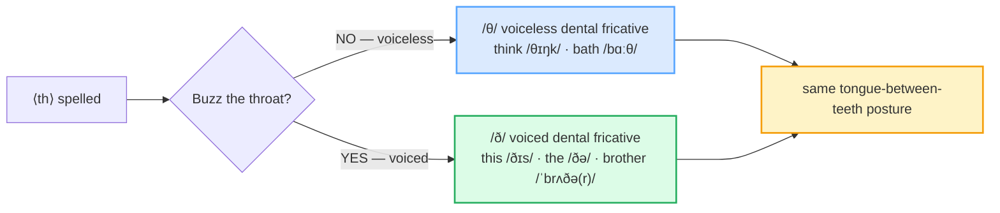

# The "th" Sounds /θ/ /ð/

> **Phase 0 · pronunciation · bundle #02 · Days 3–4.**
> *Tongue-between-teeth; stop substituting /t/ /d/ /z/.*
>
> 🔗 Builds on the style anchor [FINAL CONSONANTS](./FINAL_CONSONANTS.md) — the
> `/θ ð/ → /t d z/` row of its pitfalls table is this bundle's whole job. Later
> pronunciation bundles lean on it: [CONSONANT CLUSTERS](./CONSONANT_CLUSTERS.md)
> (the /θr-/ in *three*, the /-ŋkθs/ in *sixths*), [LINKING](./LINKING.md) (the
> weak /ðə/ of *the* only glues naturally once *the* itself is clean).

---

## Why this is bundle #02 (read this first)

If a Vietnamese speaker says *"I tink she is dere"*, a native hears *"I think
she is there"* — *usually*. But the moment the context is noisier, the phone
line worse, or the word rarer (*three* vs *tree*, *thin* vs *sin*, *mouth* vs
*mouse*), the substitution **flips meaning**. And the substitute /t/ /d/ /z/ is
the single most recognisable "Vietnamese accent" marker there is — a one-sound
shibboleth.

The cause is structural: **Vietnamese has no dental fricatives at all.** Its
stops /t/ and /ɗ/ are made on the alveolar ridge (just behind the upper teeth),
tongue tip **never** protruding. English /θ/ and /ð/ demand the **opposite** —
tongue tip **between** or **behind** the upper teeth with audible friction. The
two mouth postures do not exist in the L1, so the learner reaches for the nearest
permitted sound: /θ/→/t/ (or /s/), /ð/→/z/ (or /d/).

This bundle is one physical habit — **tongue between the teeth, air leaking
out** — applied to the ~15 highest-frequency ⟨th⟩ words. Fix the posture and
both phonemes arrive at once.

---

## 1. The mechanism: two phonemes, one posture

English spells **⟨th⟩** for **two phonemes**, and they are made with the
**identical tongue posture** — only voicing differs:

| | /θ/ voiceless | /ð/ voiced |
|---|---|---|
| Tongue | tip **between** or **behind** upper teeth | same |
| Air | hisses out (no buzz) | hisses out **+ vocal cords buzz** |
| Hand test | a steady cool stream on your hand | a cool stream **+ throat vibration** |
| Example | **th**ink /θɪŋk/, ba**th** /bɑːθ/ | **th**is /ðɪs/, **th**e /ðə/, bro**th**er /ˈbrʌðə(r)/ |

> From `th_sounds_corpus.md` (§A, verbatim headwords):
>
> | think | this |
> |---|---|
> | /θɪŋk/ | /ðɪs/ |
>
> These two are the pinned sanity-check pair. `think` /θɪŋk/ is the canonical
> /θ/ content word; `this` /ðɪs/ is the canonical /ð/ demonstrative. Both
> confirmed in the Cambridge pronunciation pages and the Wikipedia *Pronunciation
> of English ⟨th⟩* article. If your mouth makes *think* as /tɪŋk/ or *this* as
> /dɪs/ /zɪs/, you have not yet built the posture this bundle teaches.

---

## 2. Where each phoneme lives (position rules)

/θ/ and /ð/ are **not** free — their position in the word predicts which one
appears. This is why rote memorisation of "every th-word" fails and why a
position-rule is faster:

| Position | /θ/ voiceless | /ð/ voiced |
|---|---|---|
| **Initial** | almost all content words: *think, three, thin, thick* | only a closed set of function words: *the, this, that, these, those, they, them, their, there, then, than, thus, though* |
| **Medial** (between vowels) | Greek/loan words: *author, method, anthem*; + suffixes *-th, -thing* | native words: *mother, brother, other, father, together, weather, whether* |
| **Final** | nouns/adjectives: *bath, mouth, tooth, cloth, health* | verbs (often silent -e): *bathe, breathe, clothe, soothe*; + *with* (either) |

> From `th_sounds_corpus.md` (the position distribution, verbatim from §B/§C):
>
> - **Initial /θ/** → *think* /θɪŋk/, *three* /θriː/, *thin* /θɪn/, *thick* /θɪk/
> - **Initial /ð/** (function words) → *the* /ðə/, *this* /ðɪs/, *that* /ðæt/,
>   *there* /ðeə(r)/, *they* /ðeɪ/
> - **Medial /ð/** → *mother* /ˈmʌðə(r)/, *brother* /ˈbrʌðə(r)/, *other*
>   /ˈʌðə(r)/, *together* /təˈɡeðə(r)/
> - **Final /θ/** → *bath* /bɑːθ/–/bæθ/; **final /ð/** → *with* /wɪð/

**The Vietnamese trap:** learners attach *one* sound to the spelling "th" —
usually /t/ (because that is the closest stop) — and apply it everywhere. So
*the* /ðə/ becomes "te", *think* /θɪŋk/ becomes "tink", *brother* /ˈbrʌðə(r)/
becomes "bro-ter". The fix is the position-rule above **plus** the posture drill
in §3 — the rule tells you *which* phoneme, the posture tells you *how*.

---

## 3. The posture drill (tongue-between-teeth)

This is the whole physical skill. Practise it once, slowly, in front of a
mirror, then drop the exaggeration:

1. **Place** the very tip of your tongue **between** your upper and lower teeth
   (or lightly against the back of the upper teeth). You should *see* the tip.
2. **/θ/** — push air out steadily. No throat buzz. Hand test: a cool, even
   stream on your palm. Say *think* /θɪŋk/ — hold the hiss a half-second before
   the vowel.
3. **/ð/** — same posture, now **add voice** (hum). Throat test: fingers on your
   throat must feel vibration through the /ð/. Say *this* /ðɪs/ — buzz, then the
   vowel.
4. **Minimal-pair flip** — alternate without moving the tongue: *think* /θɪŋk/
   ↔ *sink* /sɪŋk/; *this* /ðɪs/ ↔ *dis* /dɪs/. The tongue stays out for the
   left column, pulls back for the right.

> From `th_sounds_corpus.md` (§D minimal pairs — real words that flip):
>
> - *think* /θɪŋk/ ↔ *sink* /sɪŋk/
> - *thick* /θɪk/ ↔ *sick* /sɪk/
> - *thin* /θɪn/ ↔ *sin* /sɪn/
> - *mouth* /maʊθ/ ↔ *mouse* /maʊs/
>
> One wrong posture and *mouth* (the face opening) becomes *mouse* (the rodent).

---

## 4. Cheat sheet — the ≤8 survival chunks

The Pareto set. Drill these eight aloud with tongue-between-teeth until every
one hisses/buzzes correctly. (Every row is a corpus attestation in §B/§C.)

| # | Chunk | IPA | Why it's here |
|---|---|---|---|
| 1 | **think** | /θɪŋk/ | the #1 /θ/ content word; *tink* error is the stereotype |
| 2 | **this** | /ðɪs/ | the #1 /ð/ demonstrative; *dis/zis* error flips meaning |
| 3 | **the** | /ðə/ weak · /ðiː/ strong | the most frequent word in English — and it's /ð/ |
| 4 | **with** | /wɪð/ | high-freq function word; final /ð/ coda Vietnamese drops to /d/ |
| 5 | **there** | /ðeə(r)/–/ðer/ | initial /ð/ function word; *dere* breaks "is she there?" |
| 6 | **something** | /ˈsʌmθɪŋ/ | medial /θ/; the *somting* error is pervasive |
| 7 | **brother** | /ˈbrʌðə(r)/–/ˈbrʌðɚ/ | medial /ð/ between vowels; *broder* is the classic tell |
| 8 | **three** | /θriː/ | initial /θr-/ cluster; *tree* confuses the number |

> Open [`th_sounds.html`](./th_sounds.html) to drill these as flip cards, hear
> native clips, play the role-play, shadow, and write.

---

## 5. Vietnamese → English L1 pitfalls table

The "expert payoff." These are the specific interference traps a Vietnamese
speaker hits on /θ/ and /ð/ — extend, don't replace, the seed rows from the spec.

| Vietnamese trap (what you do) | English fix (what to do instead) |
|---|---|
| **/θ/ → /t/** — *think* → "tink", *three* → "tree", *bath* → "bat" | Put the tongue tip **between the teeth** (you will see it). Hiss air out, no buzz. Drill *think/tink*, *three/tree* alternately. |
| **/θ/ → /s/** (register/style variant) — *thick* → "sick", *thin* → "sin" | Pull the tongue **forward** to the teeth; /s/ is tongue-behind-teeth on the ridge. Minimal pair: *thick/sick*, *thin/sin*. |
| **/ð/ → /z/** — *this* → "zis", *they* → "zey", *with* → "wiz" | Same posture as /θ/, **then add voice** (throat buzz). Touch your throat — it must vibrate on /ð/. |
| **/ð/ → /d/** (often implosive /ɗ/) — *this* → "dis", *brother* → "broder" | Tongue **between teeth** + hum. *Dis/dís* (Vietnamese implosive) uses the ridge; *this* /ðɪs/ uses the teeth. |
| **No dental fricatives in L1 at all** → default to nearest stop /t/ /d/ everywhere | Learn the **position-rule** (§2): initial content word = /θ/; function word = /ð/; medial native word = /ð/; final noun = /θ/. Don't attach one sound to "th". |
| **Tongue never protrudes in Vietnamese stops** → posture feels wrong/childish | Practise in a mirror until you see the tongue tip. Exaggerate first, then relax to a light contact. The "lisp" feeling is the target. |
| **Drops final /θ/** → *bath* → "ba", *with* → "wi" (parallels dropped finals) | 🔗 See [FINAL CONSONANTS](./FINAL_CONSONANTS.md). Hold the tongue on the teeth and release the hiss audibly before the next word. |
| **De-voices /ð/ → /θ/** — *the* /ðə/ said as /θə/ (no buzz) | Keep the throat **buzzing** the whole time. *The* without buzz sounds archaic/whispered; buzz makes it natural. |
| **Confuses /θ/ and /ð/** as the "same th" → *think* buzzed, *this* not | The **hand test** (/θ/ = cool air only) vs **throat test** (/ð/ = cool air + vibration). Alternate *think/this* until the voicing contrast is automatic. |

---

## How to practise this bundle (the daily 20 min)

1. **READ** (5 min) — this guide, §1–§3. Do the posture drill in front of a
   mirror once.
2. **SHADOW** (7 min) — open `th_sounds.html`, drill the 8 flip cards + the
   role-play **aloud**, tongue visibly between the teeth. Record yourself on the
   shadowing lane and compare to the native clips.
3. **PRODUCE** (8 min) — the writing task: **write 3 sentences using
   think/this/with**, then read them aloud, checking every ⟨th⟩ hisses or buzzes.

---

## Sources

- Cambridge Advanced Learner's Dictionary — https://dictionary.cambridge.org/dictionary/english/{word} (entries for *think, this, the, that, there, they, with, brother, mother, other, together, something, nothing, both, three, bath, thin, thick, sink, sick, sin, mouth, mouse*)
- Cambridge pronunciation pages — https://dictionary.cambridge.org/us/pronunciation/english/think · https://dictionary.cambridge.org/us/pronunciation/english/this
- Oxford Advanced Learner's Dictionary — https://www.oxfordlearnersdictionaries.com/definition/english/think_1
- UC Berkeley Linguistics — Small Pronouncing Dictionary — https://linguistics.berkeley.edu/~kjohnson/English_Phonetics/small_pronouncing_dictionary.html
- "Pronunciation of English ⟨th⟩", Wikipedia — https://en.wikipedia.org/wiki/Pronunciation_of_English_%E2%9F%A8th%E2%9F%A9 (phoneme description, position distribution, minimal-pair list, the *with* /θ/–/ð/ US poll).
- "The problem of pronouncing the English th sounds /θ/ and /ð/ of Vietnamese learners" (ResearchGate) — https://www.researchgate.net/publication/382345322_The_problem_of_pronouncing_the_English_th_sounds_th_and_d_of_Vietnamese_learners
- "The problem of pronouncing the English th sounds /θ/ and /ð/ of Vietnamese learners" (Academia.edu mirror) — https://www.academia.edu/99988415/The_problem_of_pronouncing_the_English_th_sounds_%CE%B8_and_%C3%B0_of_Vietnamese_learners
- "Pronunciation of consonants /ð/ and /θ/ by adult Vietnamese EFL learners" (SciSpace) — https://scispace.com/pdf/pronunciation-of-consonants-d-and-th-by-adult-vietnamese-efl-2mquuj2l81.pdf
- "Difficulties in pronouncing some English consonants" (Dalat University, Scholar DLU) — https://scholar.dlu.edu.vn/thuvienso/bitstream/DLU123456789/213451/1/CTv178V191S152018087.pdf
- "Vietnamese Phonology: A Complete Guide" (Remitly) — https://www.remitly.com/blog/education/vietnamese-phonology-guide/
- Native audio: YouGlish — https://youglish.com/pronounce/{chunk}/english/us?
- Frequency methodology: wordfrequency.info (spoken sub-corpus) — https://www.wordfrequency.info/
