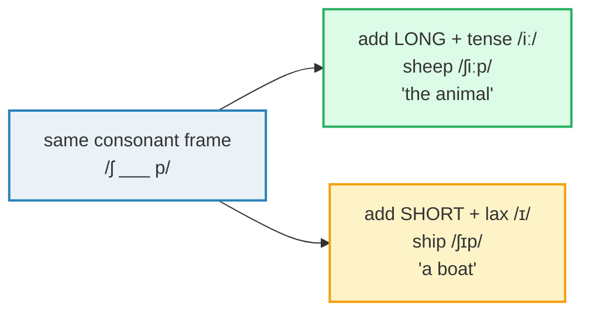

# Long vs Short Vowels

> **Phase 0 · pronunciation · bundle #04 · Days 7–8.**
> *sheep/ship, pull/pool — length changes meaning.*
>
> 🔗 Builds directly on the style anchor
> [FINAL CONSONANTS](./FINAL_CONSONANTS.md) — a final consonant that is *released*
> only matters if the vowel before it is the *right length*. Next-door bundles:
> [WORD STRESS](./WORD_STRESS.md) (the long vowel is almost always the stressed
> one), [LINKING](./LINKING.md) (a long vowel glides smoothly into the next
> consonant), [SENTENCE STRESS](./SENTENCE_STRESS.md) (weak forms shrink to
> schwa /ə/ — the short half of this very contrast).

---

## Why this is bundle #04 (read this first)

If a Vietnamese speaker says *"I live in a sheep"* and a native hears *"ship"*,
the cause is **not** a missing consonant — it is **vowel length**. English uses
length (plus a tiny tense/lax quality difference) to **separate meanings**:
`/iː/` vs `/ɪ/`, `/uː/` vs `/ʊ/`. Vietnamese has **no tense/lax vowel contrast
at all** and treats length as a side-effect of stress, not as a meaning-carrier.
So the two vowels in *sheep/ship* land on the same Vietnamese vowel, and one
word becomes the other.

This bundle is the vowel-side companion to
[FINAL CONSONANTS](./FINAL_CONSONANTS.md): where that bundle fixed what the
mouth does at the **end** of a syllable, this one fixes what the tongue does
**through** the vowel — tense vs lax, long vs short. Get both right and the two
biggest Vietnamese intelligibility failures are gone.

---

## 1. The mechanism: why Vietnamese learners collapse tense vs lax

English and Vietnamese disagree on what a vowel is *for*:

| | Vietnamese (L1) | English (target) |
|---|---|---|
| Tense vs lax pairs (/iː/-/ɪ/, /uː/-/ʊ/) | **None** — one quality per vowel letter | Several — and they change meaning |
| Vowel length | Carried by stress/tone, **not phonemic** | **Phonemic** — `/ː/` is a real letter in the sound |
| /æ/ (as in *bad*) | **No /æ/ phoneme** | Common; contrasts with /e/ |
| Schwa /ə/ weak forms | No reduction — every syllable is clear | Grammar words shrink to /ə/ unstressed |
| Monophthongs | Steady, equal-length | Long vowels are ~1.5× a short vowel |

So when an English word uses a tense/lax vowel, the learner's mouth does one of
three things — all of them break intelligibility:

1. **Collapses to one quality** — both *sheep* and *ship* become /iip/, *"live
   in a sheep"* meaning *ship*.
2. **Ignores the length mark** — treats /iː/ and /ɪ/ as the same vowel, so
   *leave* and *live* are homophones.
3. **Replaces the missing phoneme** — Vietnamese has no /æ/, so *bad* → *bed*
   (the closest Vietnamese vowel).

> From `vowel_length_corpus.md`:
>
> | sheep | ship |
> |---|---|
> | /ʃiːp/ | /ʃɪp/ |
>
> Identical consonant frame `/ʃ ___ p/`. The **only** difference is the vowel —
> long + tense vs short + lax — and that one difference is the whole meaning.
> Length is not decoration; it is a letter in the word.

---

## 2. Length is phonemic: the same consonants, different word

The decisive idea: in English, vowel length is a **phoneme**, not a style. Swap
it and you get a different word — exactly the way swapping /p/ for /b/ does.

> From `vowel_length_corpus.md` (the four flagship pairs, verbatim):
>
> - /iː/ vs /ɪ/ → **sheep** /ʃiːp/ vs **ship** /ʃɪp/, **feel** /fiːl/ vs
>   **fill** /fɪl/, **leave** /liːv/ vs **live** /lɪv/
> - /uː/ vs /ʊ/ → **pool** /puːl/ vs **pull** /pʊl/, **fool** /fuːl/ vs
>   **full** /fʊl/
> - /æ/ vs /e/ → **bad** /bæd/ vs **bed** /bed/

**The Vietnamese trap:** learners hear *sheep* and *ship* as the same word,
because in Vietnamese a length difference never changes meaning. So they produce
one vowel for both — and the listener has to guess from context, or asks *"sorry,
a what?"*.

---

## 3. The pairs in detail

### 3.1 /iː/ vs /ɪ/ — "sheep" vs "ship" (the flagship)

| LONG + tense /iː/ | SHORT + lax /ɪ/ |
|---|---|
| sheep /ʃiːp/ | ship /ʃɪp/ |
| feel /fiːl/ | fill /fɪl/ |
| leave /liːv/ | live /lɪv/ |

**How to make /iː/:** lips spread, tongue high and **forward**, held **long**
(~1.5× a short vowel). Smile slightly.
**How to make /ɪ/:** tongue slightly lower and more **central**, relaxed, short.
Do **not** round or hold it.

### 3.2 /uː/ vs /ʊ/ — "pool" vs "pull"

| LONG + tense /uː/ | SHORT + lax /ʊ/ |
|---|---|
| pool /puːl/ | pull /pʊl/ |
| fool /fuːl/ | full /fʊl/ |

**How to make /uː/:** lips **rounded and pushed forward**, tongue high and back,
held long.
**How to make /ʊ/:** lips loosely rounded, tongue relaxed, short — like a quick,
lazy "uh" with slight lip rounding.

### 3.3 /æ/ vs /e/ — "bad" vs "bed"

| Open, longer /æ/ | Closer, shorter /e/ |
|---|---|
| bad /bæd/ | bed /bed/ |

**How to make /æ/:** jaw drops **more**, mouth opens wider than for /e/; it
sounds like a short "a" with an English openness Vietnamese has no slot for.
**How to make /e/:** jaw mid, mouth relaxed, closer than /æ/.

### 3.4 /ɜː/ vs /ə/ — strong vs weak (length = stress)

The long central /ɜː/ and the schwa /ə/ share a **quality** — they differ only
in **length and stress**. /ɜː/ is the stressed, long form (e.g. **bird** /bɜːd/,
**her** strong /hɜː/); /ə/ is the reduced, short form (**her** weak /hə/).

> From `vowel_length_corpus.md`:
>
> | her (strong) | her (weak) |
> |---|---|
> | /hɜː/ | /hə/ |
>
> Same vowel quality — the length and the stress are what change. This is the
> engine of natural English rhythm. 🔗 See
> [SENTENCE STRESS](./SENTENCE_STRESS.md) for the full weak-form system.

---

## 4. Cheat sheet — the ≤8 survival chunks

The Pareto set. Drill these eight aloud as **pairs** — say the long one, then
the short one, and feel the length flip. (Every row is a corpus attestation
above.)

| # | Chunk | IPA | Why it's here |
|---|---|---|---|
| 1 | **sheep** | /ʃiːp/ | long + tense /iː/ — the animal |
| 2 | **ship** | /ʃɪp/ | short + lax /ɪ/ — a boat |
| 3 | **pool** | /puːl/ | long + tense /uː/ — swimming |
| 4 | **pull** | /pʊl/ | short + lax /ʊ/ — to pull |
| 5 | **feel** | /fiːl/ | long /iː/ — perceive |
| 6 | **fill** | /fɪl/ | short /ɪ/ — make full |
| 7 | **leave** | /liːv/ | long /iː/ — depart |
| 8 | **live** | /lɪv/ | short /ɪ/ — reside |

> Open [`vowel_length.html`](./vowel_length.html) to drill these as flip cards,
> hear native clips, play the confusion-driven role-play, shadow, and write.

---

## 5. Vietnamese → English L1 pitfalls table

The "expert payoff." These are the specific interference traps a Vietnamese
speaker hits on vowel length and the tense/lax contrast — extend, don't replace,
the seed rows from the spec.

| Vietnamese trap (what you do) | English fix (what to do instead) |
|---|---|
| **No tense/lax contrast** → collapses /iː/ and /ɪ/ to one vowel; *sheep* and *ship* sound identical, *"I live in a sheep"* meaning *ship* | Drill the pair as **two different words**. Hold /iː/ long + spread-lipped; make /ɪ/ short + relaxed. Record yourself saying both — the **length** must differ. |
| **Ignores the length mark `/ː/`** → reads `/iː/` and `/ɪ/` as the same symbol; *leave* and *live* become homophones | Treat `/ː/` as a real letter. Long vowels are **~1.5×** a short vowel. Time yourself: *sheeeep* vs *ship*. |
| **No /ʊ/-/uː/ contrast** → *pool* and *pull* collapse to one back rounded vowel | Round the lips **forward** for /uː/ (long, tense, pushed out); keep /ʊ/ short with loose lips. Pair drill: *pool/pull*, *fool/full*. |
| **No /æ/ phoneme** → substitutes /e/ (the closest Vietnamese vowel); *bad* → *bed* | Open the jaw **wider** for /æ/ than for /e/. Minimal-pair drill: *bad/bed*, *man/men*, *sat/set*. The mouth shape is the signal. |
| **Treats all vowels as equal-length monophthongs** (Vietnamese is syllable-timed, every vowel steady) | Switch to **stress-timed** length: long vowels stretch, short vowels + schwas shrink. Content words get the long vowel; grammar words reduce. |
| **Never reduces to schwa /ə/** — stresses every grammar word fully; *"I want to go"* with full vowels everywhere | Let unstressed grammar words shrink to /ə/: *"I want tə go"*. 🔗 See [SENTENCE STRESS](./SENTENCE_STRESS.md) and [LINKING](./LINKING.md). |
| **/ɜː/ has no Vietnamese equivalent** → replaced by /e/ or /ə/; *bird* → "bed" or "bud" | For /ɜː/, centre the tongue (mid, neutral, **unrounded**), lips relaxed, and hold it **long**. Pair: *bird* /bɜːd/ vs *bed* /bed/. |
| **Copies spelling instead of length** → sees "live" and "leave" both with "i/e" and gives them the same vowel | Trust the **dictionary IPA**, not the spelling. Look up the length mark every time until the contrast is automatic. |
| **Diphthongizes a long vowel** (adds a glide) → *sheep* → "shee-yip" | Keep /iː/ a **steady** monophthong, held long, no off-glide. Hold the smile, hold the vowel, release the /p/. |

---

## How to practise this bundle (the daily 20 min)

1. **READ** (5 min) — this guide, §1–§3.
2. **SHADOW** (7 min) — open `vowel_length.html`, drill the 8 flip cards **as
   pairs** (long then short) + the confusion-driven role-play aloud. Exaggerate
   the length first, then relax.
3. **PRODUCE** (8 min) — the writing task: write 2 minimal-pair sentences
   (e.g. *"I **feel** fine"* / *"Please **fill** this"*), then read them aloud
   recording yourself; check the long vowel is clearly longer than the short one.

---

## Sources

- Cambridge Advanced Learner's Dictionary — https://dictionary.cambridge.org/dictionary/english/{word} (entries for *sheep, ship, feel, fill, leave, live, pool, pull, fool, full, bad, bed, her, were, bird*)
- Oxford Advanced Learner's Dictionary — https://www.oxfordlearnersdictionaries.com/definition/english/sheep
- BBC Learning English — minimal-pairs lesson confirming `ship /ʃɪp/` vs `sheep /ʃiːp/`.
- Cambridge Dictionary social post — "Listen to this pair: ship /ʃɪp/ sheep /ʃiːp/. The only difference is the vowel length."
- Wikipedia, *English-language vowel changes before historical /l/* — fill–feel and pull–pool merger notes — https://en.wikipedia.org/wiki/English-language_vowel_changes_before_historical_/l/
- EnglishClub, *Minimal Pairs* — the `/æ/ and /e/ bad bed` pair — https://www.englishclub.com/pronunciation/minimal-pairs.php
- Nguyen & others, "Selected Pronunciation Issues of South Vietnamese English" (SCIRP) — https://www.scirp.org/journal/paperinformation?paperid=116899
- Pham, *A contrastive analysis of Vietnamese and English vowel phonemes* (Journal of Science, UD) — https://jst-ud.vn/jst-ud/article/download/10405/6903
- Cao, *English and Vietnamese Vowels: A Contrastive Analysis* (Academia.edu).
- "Vietnamese Phonology" (Wikipedia) — https://en.wikipedia.org/wiki/Vietnamese_phonology
- "Vietnamese Phonology: A Complete Guide" (Remitly) — https://www.remitly.com/blog/education/vietnamese-phonology-guide/
- Native audio: YouGlish — https://youglish.com/pronounce/{chunk}/english/us?
- Frequency methodology: wordfrequency.info (spoken sub-corpus) — https://www.wordfrequency.info/
