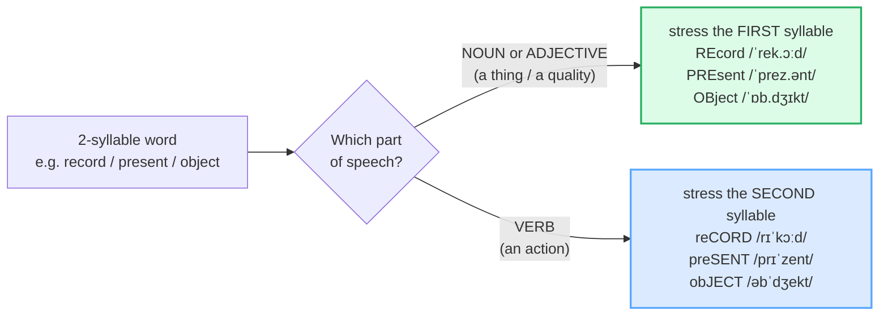

# Word Stress

> **Phase 0 · pronunciation · bundle #05 · Days 9–10.**
> *2-syllable rules; noun vs verb (REcord/reCORD).*
>
> 🔗 Builds on the style anchor [FINAL CONSONANTS](./FINAL_CONSONANTS.md) — once
> your finals are audible, the next thing a native ear listens for is **which
> syllable you stress**. This bundle pairs with [VOWEL LENGTH](./VOWEL_LENGTH.md)
> (an unstressed vowel shrinks to a schwa), [SENTENCE STRESS](./SENTENCE_STRESS.md)
> (word stress is the unit sentence stress is built from), and
> [REDUCTIONS](./REDUCTIONS.md) (every reduction is a stress decision).

---

## Why this is bundle #05 (read this first)

A Vietnamese speaker can pronounce every consonant perfectly and still be asked
*"sorry, what?"* — because they put the **stress on the wrong syllable**, and
English treats that as **a different word**. *DEsert* (a dry region) and
*deSSERT* (the sweet course) share almost every sound; only stress separates
them.

The reason is structural. **Vietnamese is monosyllabic and tonal**: each syllable
is a word, and meaning rides on **lexical tone** (pitch contour), not on stress.
There is, in fact, **no consensus that Vietnamese has word stress at all** — so
the whole concept of "this syllable is stronger than that one, *inside one word*"
has no analogue in a Vietnamese learner's ear. The instinct is to **flatten**
every syllable to equal weight. Flattened English is the English natives find
hardest to decode: the words are technically "right" but the signal that tells
them apart is missing.

This single fix — **hit the right syllable, and let the other one shrink** — does
more for being recognized than another hundred vocabulary words. It is why it
sits right after finals and vowel length.

---

## 1. The mechanism: what stress actually *is*

Lexical stress is not "saying it louder." It is **three acoustic things at once**,
all on the stressed syllable, and the absence of all three on the unstressed one:

| | Stressed syllable | Unstressed syllable |
|---|---|---|
| Length | **longer** | shorter |
| Loudness | **louder** (more energy) | weaker |
| Pitch | **higher** | lower / level |
| Vowel | **full** quality (clear) | **reduced** — often a schwa /ə/ |

So stress = **longer + louder + higher + a clear vowel**, and the unstressed
syllable pays for it by shrinking — its vowel often collapses to /ə/ (schwa).
That vowel reduction is the feature Vietnamese learners most often miss: they
keep both vowels "full" and equal, which is exactly the flattening natives hear
as foreign.

> From `word_stress_corpus.md` (the pinned example):
>
> | record (noun) | record (verb) |
> |---|---|
> | /ˈrek.ɔːd/ | /rɪˈkɔːd/ |
>
> Same spelling — opposite stress. As a **noun**, the first syllable carries
> the clear vowel /rek/ and the stress ˈ; as a **verb**, the first syllable
> collapses to /rɪ/ and the stress jumps to /ˈkɔːd/. Say the noun flat and a
> native hears the verb (and vice versa).

---

## 2. The noun–verb stress shift (the one rule to own)

For a large family of 2-syllable words, **the part of speech decides the stress**:

> From `word_stress_corpus.md` (Section A, the shift pairs verbatim):
>
> - **record** noun /ˈrek.ɔːd/ · verb /rɪˈkɔːd/
> - **present** noun /ˈprez.ənt/ · verb /prɪˈzent/
> - **object** noun /ˈɒb.dʒɪkt/ · verb /əbˈdʒekt/
> - **permit** noun /ˈpɜː.mɪt/ · verb /pəˈmɪt/
> - **produce** noun /ˈprɒd.juːs/ · verb /prəˈdjuːs/
> - **project** noun /ˈprɒdʒ.ekt/ · verb /prəˈdʒekt/

**The Vietnamese trap:** learners default to one frozen pronunciation per
spelling (usually whatever they met first), so *"I'll reCORD it"* comes out as
*"I'll REcord it"* — and the listener waits for a noun that never arrives. The
fix is to **decide the stress from the grammar**, not from memory: noun/adj →
front, verb → back.

---

## 3. The general tendency (when there's no shift)

Strip the shift away and the underlying tendency is the same: **most 2-syllable
nouns and adjectives stress the first syllable; most 2-syllable verbs stress the
second.** This is a tendency, not a law (there are many exceptions — *hoTEL*,
*maCHINE*, *oPEN*), but it predicts the majority of the high-frequency
2-syllable vocabulary.

> From `word_stress_corpus.md` (Section C, the rule illustrations):
>
> - Nouns/adjectives, first syllable → **PAper** /ˈpeɪ.pər/, **HAPpy**
>   /ˈhæp.i/, **MOther** /ˈmʌð.ər/
> - Verbs, second syllable → **beGIN** /bɪˈɡɪn/, **reLAX** /rɪˈlæks/,
>   **deCIDE** /dɪˈsaɪd/

> When you meet a new 2-syllable word and don't know its stress, this is your
> best first guess — then confirm in a dictionary. Guessing **flips** the stress
> is the expensive error; guessing it flat is even worse.

---

## 4. Wrong stress = wrong word (the minimal pairs)

Some pairs aren't a part-of-speech shift — they're **two different words** that
differ only by stress. Flatten them and you say the wrong word:

| Word | Stress | IPA | Meaning |
|---|---|---|---|
| **DE**sert | first | /ˈdez.ət/ | a dry, sandy region |
| de**SERT** | second | /dɪˈzɜːt/ | the sweet course of a meal (also: *desert* the verb = abandon) |
| **CON**tent | first | /ˈkɒn.tent/ | the material/substance inside something |
| con**TENT** | second | /kənˈtent/ | happy / satisfied |
| **RE**fuse | first | /ˈref.juːs/ | rubbish / garbage |
| re**FUSE** | second | /rɪˈfjuːz/ | to say you will not do something |

> From `word_stress_corpus.md` (Section B): *desert* /ˈdez.ət/ vs *dessert*
> /dɪˈzɜːt/; *content* /ˈkɒn.tent/ vs /kənˈtent/; *refuse* /ˈref.juːs/ vs
> /rɪˈfjuːz/. "DEsert has one 's' and stresses DE-; dessERT has two 's' and
> stresses -SERT" (Cambridge English).

🔗 This is the doorway to [SENTENCE STRESS](./SENTENCE_STRESS.md) — once a word's
*own* stress is reliable, you can start weakening the grammar words around it and
the English rhythm falls into place.

---

## 5. Cheat sheet — the ≤8 survival chunks

The Pareto set. Drill these four noun–verb pairs aloud until the stress is
automatic. (Every row is a corpus attestation above.)

| # | Chunk | IPA | Why it's here |
|---|---|---|---|
| 1 | **REcord** (n) | /ˈrek.ɔːd/ | noun → first syllable; the pinned example |
| 2 | **reCORD** (v) | /rɪˈkɔːd/ | verb → second syllable; vowel reduces to /ɪ/ |
| 3 | **PREsent** (n) | /ˈprez.ənt/ | noun → first syllable (a gift) |
| 4 | **preSENT** (v) | /prɪˈzent/ | verb → second syllable (to show/give) |
| 5 | **OBject** (n) | /ˈɒb.dʒɪkt/ | noun → first syllable (a thing / a goal) |
| 6 | **obJECT** (v) | /əbˈdʒekt/ | verb → second syllable (to oppose) |
| 7 | **PERmit** (n) | /ˈpɜː.mɪt/ | noun → first syllable (an official document) |
| 8 | **perMIT** (v) | /pəˈmɪt/ | verb → second syllable (to allow) |

> Open [`word_stress.html`](./word_stress.html) to drill these as flip cards,
> hear native clips, play the role-play, shadow, and write.

---

## 6. Vietnamese → English L1 pitfalls table

The "expert payoff." These are the specific interference traps a Vietnamese
speaker hits on word stress — extend, don't replace, the seed rows from the spec.

| Vietnamese trap (what you do) | English fix (what to do instead) |
|---|---|
| **Vietnamese has no word stress** — meaning rides on **lexical tone**, not on a stronger syllable. So you flatten every syllable to equal weight. | Pick **one** syllable and make it **longer + louder + higher**. The unstressed syllable must shrink. Practise the contrast, not the individual word. |
| **Keeps both vowels "full"** — no schwa reduction, so *record* sounds like "RE-CORD" with two clear vowels. | Let the unstressed vowel **collapse to /ə/ or /ɪ/**. REcord /ˈrek.əd/ (not /ˈrek.ɔːd/ on both), reCORD /rɪˈkɔːd/ (the /rɪ/ is tiny). |
| **Frozen first-syllable habit** — whatever stress you learned first, you use for every part of speech: *"I'll REcord it"* (noun stress on a verb). | **Read the grammar first.** Noun/adj → front, verb → back. Decide stress from POS, not from memory. |
| **Wrong stress = wrong word** — *DEsert/deSSERT*, *CONtent/conTENT* flattened into one form, so you say "desert" when you mean the sweet course. | Drill the **minimal pair** as opposites: DEsert (sandbox) vs deSSERT (cake). Treat them as two different words — because to a native they are. |
| **Tone carries over as a stress substitute** — you rise/fall on the wrong syllable (using pitch like a tone) and natives hear odd intonation, not stress. | Stress is pitch **plus** length **plus** loudness. Don't only raise the pitch — also **stretch** the stressed vowel in time. |
| **Adds a full vowel to the unstressed syllable** ("RE-cor-duh") to keep syllables even, because Vietnamese likes open, evenly-timed syllables. | English is **stress-timed**: the unstressed syllable is supposed to be smaller and faster. Shorten it; do not add a trailing vowel. |
| **Carries Vietnamese level pitch onto both syllables** → every 2-syllable word sounds like two equal monosyllables ("RE - CORD"), blurring the stress cue. | Exaggerate the length ratio first: make the stressed syllable **twice as long** as the unstressed one. Then relax to natural. |
| **Doesn't reduce grammar/function syllables** in a word → *about* /əˈbaʊt/ said as /æˈbaʊt/, *today* said with a full first vowel. | Reduce the unstressed vowel to schwa: **a**bout /əˈbaʊt/, to**day** /təˈdeɪ/. 🔗 See [REDUCTIONS](./REDUCTIONS.md) + [SENTENCE STRESS](./SENTENCE_STRESS.md). |

---

## How to practise this bundle (the daily 20 min)

1. **READ** (5 min) — this guide, §1–§4.
2. **SHADOW** (7 min) — open `word_stress.html`, drill the 8 flip cards + the
   role-play **aloud**, exaggerating the stressed syllable (longer + louder +
   higher) and shrinking the unstressed one, then relaxing.
3. **PRODUCE** (8 min) — the writing task: write **5 noun–verb stress pairs**
   with the stressed syllable marked (e.g. `REcord (n) / reCORD (v)`). Then say
   each pair aloud, recording yourself; check the unstressed vowel actually
   shrank.

---

## Sources

- Cambridge Advanced Learner's Dictionary — https://dictionary.cambridge.org/dictionary/english/{word} (entries for *record, present, object, permit, produce, project, desert, dessert, content, refuse, paper, happy, mother, begin, relax, decide*)
- Cambridge pronunciation page — https://dictionary.cambridge.org/pronunciation/english/record (noun /ˈrek.ɔːd/ vs verb /rɪˈkɔːd/)
- Oxford Advanced Learner's Dictionary — https://www.oxfordlearnersdictionaries.com/definition/english/record_1
- BBC Learning English — "*record* (noun) → /ˈrek.ɔːd/, *record* (verb) → /rɪˈkɔːd/."
- Vancová, *Phonetics and Phonology: A Practical Introduction* (Trnava University, 2016) — noun/verb stress pairs side by side.
- Cambridge English video, "desert vs dessert" — desert stress on DE-, dessert stress on -SERT.
- Nguyen & Ingram, "Vietnamese Acquisition of English Word Stress" (ResearchGate) — https://www.researchgate.net/publication/264685636_Vietnamese_Acquisition_of_English_Word_Stress
- "Vietnamese EFL Learners' Production of English Lexical Stress" (IJSMS, 2024) — Vietnamese tone influences English lexical-stress production.
- "Influences of particles on Vietnamese tonal co-articulation" (ACL Anthology) — https://aclanthology.org/W12-5014.pdf — "Vietnamese is a monosyllabic and tonal language."
- Brunelle, "Stress and phrasal prominence in tone languages" (Semantic Scholar) — no consensus on the existence of Vietnamese word stress.
- Native audio: YouGlish — https://youglish.com/pronounce/{chunk}/english/us?
- Frequency methodology: wordfrequency.info (spoken sub-corpus) — https://www.wordfrequency.info/
