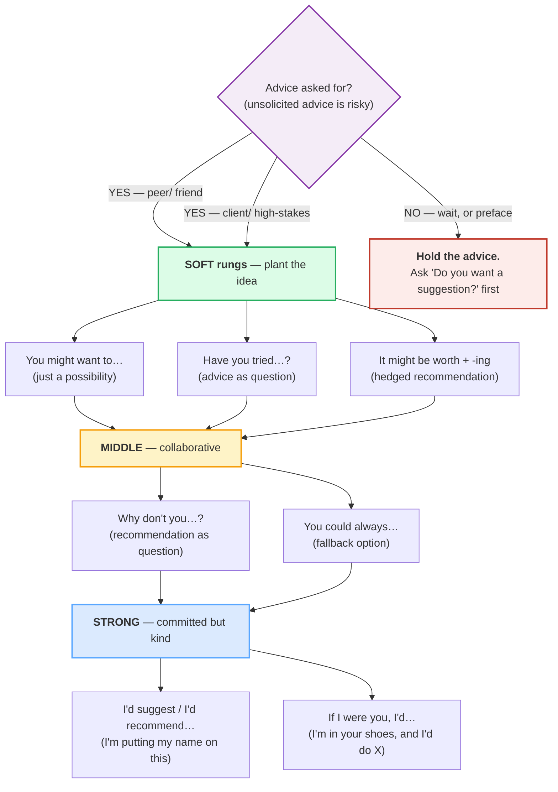

# Giving Advice & Suggestions

> **Phase 1 · speech_acts · bundle #23 · Days 45–46.**
> *"You might want to…" / "Have you tried…?"*
>
> 🔗 The **commitment ladder** partner of [HEDGED OPINIONS](./OPINIONS_HEDGED.md)
> (#20 — *I'd say…* / *Correct me if I'm wrong…* softens a *belief*; this bundle
> softens a *recommendation*). Builds on [REQUESTING & OFFERING](./REQUESTING_OFFERING.md)
> (#15 — *Could you…?* / *Shall I…?* share the same modal-softening muscle) and
> on [SYMPATHY & CONCERN](./SYMPATHY.md) (#24 — *"I'm so sorry to hear that"* is
> the empathy step that must **precede** advice or the advice lands as cold).
> Anticipates [FEEDBACK GIVING](../workplace/FEEDBACK_GIVING.md) (#36 — SBI
> feedback *is* professional advice, dressed in observation-impact-request) and
> [CONDITIONALS SPOKEN](../discourse/CONDITIONALS_SPOKEN.md) (#79 — the
> *If I were you* frame unpacked across all four conditional types).

---

## Why this is bundle #23 (read this first)

Giving advice is the speech act a Vietnamese learner most often performs
**too directly** — not because the chunks are missing, but because the L1 and
the target disagree on what counts as *polite* advice. Vietnamese advice-giving
runs on **hierarchy + directness**: a senior (parent, teacher, older friend)
advises a junior with a bare imperative — *"đi khám đi"* ("go see the doctor") —
or the modal *nên* ("should") — *"em nên nghỉ ngơi"* ("you should rest"). Both
are normal, even caring, in Vietnamese. Both **transfer verbatim** into English
as *You should…* / *Go rest* — and to an Anglo ear, both sound like a **lecture,
an order, or a parent talking to a child**.

English runs on the **opposite assumption** for advice between equals. An
unsolicited *You should…* reads as presumptuous (who appointed you the expert on
my life?); even a **solicited** *You should…* can land as bossy. The native
repair is a **softening layer**: modals (*might, could*), conditionals
(*I'd… = I would…*, *If I were you, I'd…*), and question-frames (*Why don't
you…?* / *Have you tried…?*). The softener is not weakness — it is the politeness
that lets the listener **keep ownership of the decision**. Drop it and you sound
like you are giving orders; keep it and you sound like a friend.

This bundle is built around the **soft→strong ladder** — five rungs, from the
softest (*You might want to…*) to the strongest still-polite (*If I were you,
I'd…*). Own the ladder and you own the act: pick the rung that fits the
relationship, the stakes, and whether the advice was asked for.

---

## 1. The soft→strong ladder (one picture)

Advice is not a single act — it is a **gradient of commitment**. The bottom
rungs *float an idea* and let the listener dismiss it without losing face; the
top rungs *commit the adviser* but still leave the final call to the listener.
The rung you pick encodes **how much authority you claim** — get it wrong and
the advice misfires (too soft = the listener misses it; too strong = the
listener resents it).

> From `advising_corpus.md` (the ladder, rung by rung):
>
> - **R1 — softest:** **You might want to…** /juː maɪt ˈwɒnt tə/ UK · /juː maɪt
>   ˈwɑːnt tə/ US — *"it could be a good idea to"* (no pressure at all)
> - **R2:** **Have you tried…?** /həv juː traɪd/ — *"consider this option (you
>   may already have)"* (advice as a question)
> - **R3:** **It might be worth + -ing** /ɪt maɪt biː wɜːθ/ UK · /ɪt maɪt biː
>   wɜːrθ/ US — *"this could pay off"* (hedged recommendation of an action)
> - **R4:** **Why don't you…?** /waɪ ˈdəʊnt juː/ UK · /waɪ ˈdoʊnt juː/ US —
>   *"I recommend that you…"* (collaborative; never a lecture)
> - **R5:** **You could always…** /juː kʊd ˈɔːlweɪz/ — *"this option remains
>   available"* (soft fallback)
> - **R6:** **I'd suggest / I'd recommend…** /aɪd səˈdʒest/ · /aɪd ˌrekəˈmend/
>   — *"my advice is"* (committed, but `I'd` is a conditional, not a command)
> - **R7 — strongest polite:** **If I were you, I'd…** /ɪf aɪ wɜː juː aɪd/ UK ·
>   /ɪf aɪ wər juː aɪd/ US — *"in your shoes, this is what I would do"*

**The Vietnamese trap:** there is no ladder in L1 advice — there is direct
(*nên* = "should") and more-direct (bare imperative). So the learner reaches for
*You should…* as the **default** and uses it in every register, from a text to a
friend to an email to a client. But *You should…* is **rung 8** — above the
entire ladder, in plain-order territory. It claims authority the speaker may not
have, and it removes the listener's ownership of the decision. Drill the seven
rungs until *You should…* feels as heavy to you as it does to a native ear.

---

## 2. The soft rungs (R1–R3 — plant the idea)

The safest tier. The adviser does not tell the listener what to do — they
**float a possibility** and let the listener pick it up or let it pass. The
softeners are mechanical: *might* (a modal of possibility, not certainty),
*tried* (a past-tense question that frames the advice as something the listener
may already have considered), and *be worth* (an adjective that judges the
**action**, not the listener). Use these rungs when the advice is **unsolicited**,
when the stakes are **low**, or when the listener is **sensitive**.

| Chunk | When it fits |
|---|---|
| **You might want to…** /juː maɪt ˈwɒnt tə/ UK · /juː maɪt ˈwɑːnt tə/ US | the gentlest possible flag — use when the listener might bristle at any stronger form; the *might* makes it easy to ignore |
| **Have you tried…?** /həv juː traɪd/ | advice dressed as curiosity — implies "you've probably already thought of this", which protects the listener's competence |
| **It might be worth + -ing** /ɪt maɪt biː wɜːθ/ UK · /ɪt maɪt biː wɜːrθ/ US | recommends an **action** without recommending it for **this person** — the most face-safe of the three |

> From `advising_corpus.md`:
>
> | You might want to… | Have you tried…? |
> |---|---|
> | /juː maɪt ˈwɒnt tə/ UK · /juː maɪt ˈwɑːnt tə/ US | /həv juː traɪd/ |
>
> Cambridge's *might* modal entry defines it as *"used to express the
> possibility that something will happen or be done."* That **possibility** is
> the politeness: *You might want to…* never claims the advice is right, only
> that it is *possible* the listener would want it. *Have you tried…?* uses the
> Oxford *try* entry (verb sense "to use, do or test something in order to see
> if it works") — the present-perfect question form is what makes it advice
> rather than a literal inquiry; the listener hears *"consider this option"*.
>
> - **It might be worth + -ing** is the Oxford *worth* adjective (sense 2:
>   *"used to recommend the action mentioned because you think it may be
>   useful"*), with the verbatim examples *"It's worth making an appointment
>   before you go"* and *"This idea is well worth considering."* The *worth +
>   -ing* frame is the face-safe recommendation: it judges the **action**,
>   not the person.
> - **You could always…** is the Oxford *always* adverb (sense 5, explicitly
>   labelled *"can/could always… used to suggest a possible course of action"*),
>   verbatim example *"If it doesn't fit, you can always take it back."* The
>   *always* signals *"this option is still on the table if the others fail"* —
>   a fallback, not a first choice.

**The Vietnamese trap:** the learner who wants to say *"em nên thử…"* ("you
should try…") reaches for *You should try…* — rung 8. The native equivalent at
this gentleness is *You might want to try…* (rung 1) or *Have you tried…?* (rung
2). The *might* and the *Have you* are not decoration — they are the difference
between a friend and a lecturer.

---

## 3. The strong rungs (R6–R7 — commit, but stay kind)

When the advice is **asked for**, the stakes are **real**, or the listener is
**floundering**, the soft rungs can feel evasive — the listener wants a real
recommendation, not a hedge. The strong rungs **commit** ("this is what I would
do") but still soften with two devices: (1) **`I'd`** (the contracted *I would*
— a **conditional**, not *I do*; it signals "this is my hypothetical
recommendation, not a command"), and (2) **If I were you** (the second
conditional, which puts the adviser **inside the listener's situation** rather
than above it).

| Chunk | What the softener does |
|---|---|
| **I'd suggest (that)…** /aɪd səˈdʒest/ | the `I'd` (conditional) + *suggest* (the helpful verb — see Oxford's synonym note below) = committed but not bossy |
| **I'd recommend + -ing / that…** /aɪd ˌrekəˈmend/ | slightly more authoritative than *suggest*; *recommend* claims expertise but the `I'd` keeps it advisory |
| **If I were you, I'd…** /ɪf aɪ wɜː juː aɪd/ UK · /ɪf aɪ wər juː aɪd/ US | the strongest still-polite form — "in your shoes" framing makes it empathy + advice, not authority |

> From `advising_corpus.md`:
>
> - **I'd suggest…** uses the Oxford *suggest* verb sense 1, with the verbatim
>   Express Yourself example *"I suggest you have another look at the house
>   before you make a decision."* The *I'd* (I would) is the conditional softener
>   — bare *"I suggest you…"* is noticeably more direct.
> - **I'd recommend…** uses the Oxford *recommend* verb sense 2 ("to advise a
>   particular course of action"), verbatim Express Yourself example *"I'd
>   recommend waiting a few months."* Oxford's own synonym note is the key
>   attestation:
>
> > *"Advise is a stronger word than recommend… I advise you… can suggest that
> > you know better than the person you are advising: this may cause offence if
> > they are your equal or senior to you. I recommend… mainly suggests that you
> > are trying to be helpful and is less likely to cause offence."*
>
> That note is the whole bundle in one paragraph: **advise/recommend/suggest**
> form their own commitment ladder, and *should* sits above all of them.
> - **If I were you, I'd…** is the **second conditional**, documented in the
>   Cambridge Grammar *Conditionals: if* entry (structure: *If + past simple, …
>   would/wouldn't + infinitive*). Cambridge's verbatim example: *"I wouldn't
>   ask my parents for a loan if I were you."* The **were** (not *was*) is the
>   prescribed advice form — *"If I was you"* is heard in casual speech but
>   marked as non-standard; in writing and in careful advice, use *were*.

**The Vietnamese trap:** *nên* ("should") is the L1 word for advice, and it
maps cleanly onto *should* — which is exactly the trap. *You should…* claims
**moral authority** in English that *nên* does not in Vietnamese. The repair is
to swap *should* for a **conditional**: *I'd suggest…* / *If I were you, I'd…*.
The conditional does the same advice work without the authority claim. Drill the
swap until *You should…* feels like a last resort, not a default.

---

## 4. The question rungs (R4–R5 — advice dressed as inquiry)

A native speaker's favourite move: **ask a question whose answer is the
advice**. *Why don't you…?* is not a real question — it is a recommendation
phrased as inquiry, which is why it never sounds like a lecture. The
question-frame hands the decision back to the listener even as it points them at
the answer. Vietnamese has the exact same device (*sao em không…?* = "why don't
you…?"), so this is the **cleanest L1→English transfer** in the bundle — drill
it first.

> From `advising_corpus.md`:
>
> - **Why don't you…?** /waɪ ˈdəʊnt juː/ UK · /waɪ ˈdoʊnt juː/ US — the Oxford
>   *suggest* entry's **Making suggestions** block attests it verbatim: *"Why
>   don't you try calling him again?"*
> - **Why not + verb…?** /waɪ nɒt/ UK · /waɪ nɑːt/ US — the compressed form,
>   same block: *"Why not just wait until they come back?"*
> - **How about + -ing / noun?** /ˈhaʊ əˈbaʊt/ — same block: *"How about going
>   out for a walk on Saturday?"*

**The Vietnamese trap:** *sao em không…?* transfers so cleanly that learners
often stop here and never learn the soft/strong rungs. That is fine for casual
chat, but *Why don't you…?* alone sounds **too breezy for high-stakes advice**
(a friend deciding whether to quit a job wants *If I were you, I'd…*, not *Why
don't you just quit?*). Own the question rungs **and** the commitment rungs;
mix them by register.

---

## 5. The unsolicited-advice rule (the move learners skip)

The single biggest advice-pragmatics failure is **giving advice that was not
asked for**. In Vietnamese culture, offering advice unsolicited is often a
**caring act** (an older friend *"khuyên"* you = they care); in English, it is
frequently read as **presumption or criticism** ("you think I can't figure this
out myself?"). The native repair is a **preflight check**: ask permission before
advising, then pick a soft rung.

> From `advising_corpus.md` + sibling bundles:
>
> - **Do you want a suggestion?** / **Want some advice?** — the preflight. If
>   the listener says *no*, **stop**. If *yes*, you have been invited and the
>   advice lands as help, not intrusion.
> - Preface with empathy first: *"That sounds really tough."* (🔗
>   [SYMPATHY](./SYMPATHY.md) #24) → *then* the advice. Empathy-without-advice
>   feels warm; advice-without-empathy feels cold.

**The Vietnamese trap:** the learner jumps straight to *You should…* the moment
they hear a problem — the L1 caring reflex. The English-speaking listener hears
it as *"here is what you are doing wrong."* Train a **two-beat pause**: empathy
first (*"That sounds rough"*), then a **preflight** (*"Do you want a
suggestion?"*), then the advice on a soft rung. The two beats are the difference
between a friend and a fixer.

---

## 6. Cheat sheet — the ≤8 survival chunks

The Pareto set. Drill these eight aloud — two soft, two question, three strong,
plus the opener — until the **rung** (soft / question / strong) is automatic.
(Every row is a corpus attestation above.)

| # | Chunk | IPA | Rung |
|---|---|---|---|
| 1 | **You might want to…** | /juː maɪt ˈwɒnt tə/ UK · /juː maɪt ˈwɑːnt tə/ US | soft (gentlest) |
| 2 | **Have you tried…?** | /həv juː traɪd/ | soft (question) |
| 3 | **It might be worth + -ing** | /ɪt maɪt biː wɜːθ/ UK · /ɪt maɪt biː wɜːrθ/ US | soft (hedged) |
| 4 | **Why don't you…?** | /waɪ ˈdəʊnt juː/ UK · /waɪ ˈdoʊnt juː/ US | question (collaborative) |
| 5 | **You could always…** | /juː kʊd ˈɔːlweɪz/ | question (fallback) |
| 6 | **I'd suggest…** | /aɪd səˈdʒest/ | strong (helpful) |
| 7 | **I'd recommend…** | /aɪd ˌrekəˈmend/ | strong (expert) |
| 8 | **If I were you, I'd…** | /ɪf aɪ wɜː juː aɪd/ UK · /ɪf aɪ wər juː aɪd/ US | strong (committed, kind) |

> Open [`advising.html`](./advising.html) to drill these as flip cards, hear
> native clips, play the two-register role-play (casual ↔ committed), shadow,
> and write an advice email line.

---

## 7. Vietnamese → English L1 pitfalls table

The "expert payoff." These are the specific interference traps a Vietnamese
speaker hits on giving advice — extend, don't replace, the seed rows from the
spec.

| Vietnamese trap (what you do) | English fix (what to do instead) |
|---|---|
| **Transfers *nên* ("should") as *You should…*** — the default L1 advice word, used in every register from text to client | Swap *should* for a **conditional**: *I'd suggest…* / *If I were you, I'd…*. The conditional does the same advice work without the authority claim. *You should…* is rung 8 — reserve it for genuine authority (a doctor, a parent, a manager) or genuine urgency. |
| **Uses the bare imperative** (*"đi khám đi"* = "go see the doctor") — caring in Vietnamese, an **order** in English | Soften with a modal or question: *You might want to see a doctor.* / *Have you seen a doctor?* / *Why don't you see a doctor?* The bare imperative (*Go see a doctor.*) is only acceptable from a very close relation or in an emergency. |
| **Gives unsolicited advice** — the L1 *"khuyên"* (to advise) caring reflex; offers *You should…* the moment a problem is mentioned | **Preflight first**: *Do you want a suggestion?* / *Want some advice?* If yes → soft rung. If no → empathy only (*"That sounds rough"*). Unsolicited *You should…* reads as *"you can't figure this out yourself."* 🔗 See [SYMPATHY](./SYMPATHY.md). |
| **Skips the empathy step** — goes straight from *"I hear your problem"* to *"You should…"*, which lands as cold/fixer energy | Two-beat pause: **empathy first** (*"That sounds really tough"*) → then the advice on a soft rung. Advice-without-empathy = criticism; empathy-then-advice = care. |
| **Uses *should* for high-stakes advice** (quitting a job, ending a relationship) — too blunt for the weight of the decision | Step up to **If I were you, I'd…** — the second conditional. It commits the adviser (*"I would do X"*) while keeping the listener's ownership (*"in your shoes"*). *You should quit* sounds like a command; *If I were you, I'd quit* sounds like a friend. |
| **Says *If I was you*** (transferring the regular past) instead of *If I were you* | Use **were** for the second conditional in advice: *If I were you, I'd…*. *Was* is heard in casual speech but marked non-standard; in writing and careful advice, *were* is the prescribed form (Cambridge Grammar). |
| **Drops the *-ing* after *worth*** → *"It might be worth try"* / *"It's worth consider"* | *worth* takes the **-ing form**: *It might be worth try**ing**.* / *It's worth consider**ing**.* (Oxford *worth* sense 2). No exceptions — *worth + -ing* is the frame. |
| **Drops the *-ing* / uses *to* after *suggest* and *recommend*** → *"I suggest to go"* / *"I recommend to read it"* | *suggest/recommend* take **-ing** or a **that-clause**, never *to*: *I'd suggest go**ing**.* / *I'd suggest **that** we go.* / *I'd recommend read**ing** it.* (Oxford *suggest/recommend* entries.) |
| **Drops finals on the advice itself** → *"You migh' want to"*, *"I'd sugges'"*, *"Why don' you"*, *"If I were you, I'"* | Release every final. The /t/ in *might*, the /tʃ/→/st/ in *suggest*, the /t/ in *don't*, the /d/ in *I'd* carry the chunk's meaning. 🔗 Drill [FINAL CONSONANTS](../pronunciation/FINAL_CONSONANTS.md). |
| **Vietnamese /θ/ → /t/, /ð/ → /z/** in *worth* /wɜːθ/ → "wut", *that* → "dat" | *worth* ends in /θ/ — tongue between teeth. The /t/-substitution flips *worth* toward *word*/*wart*. 🔗 See [TH SOUNDS](../pronunciation/TH_SOUNDS.md). |
| **Stresses *re-COM-mend* on the wrong syllable** (transfer of Vietnamese even-syllable rhythm) | *recommend* is stressed on the **final** syllable: /ˌrekəˈ**mend***/ (Oxford). Drill it against the YouGlish clip; wrong stress is more audible than wrong sounds. |
| **Uses *advise* where *suggest/recommend* fits** — *advise* claims authority and *"may cause offence if [the listener] is your equal or senior"* (Oxford synonym note) | Default to *suggest* (helpful, low authority) or *recommend* (helpful, mild expertise). Reserve *advise* for genuine professional authority (lawyer, doctor, financial adviser). |

---

## How to practise this bundle (the daily 20 min)

1. **READ** (5 min) — this guide, §1–§5 (the ladder, the soft rungs, the strong
   rungs, the question rungs, the unsolicited-advice rule).
2. **SHADOW** (7 min) — open `advising.html`, drill the 8 flip cards + the
   two-register role-play **aloud**. Pay attention to the **rung**: when you're
   Person A (adviser), start on a soft rung in Dialog 1 (casual), then step up
   to a strong rung in Dialog 2 (committed). Feel the *should*-to-*conditional*
   swap.
3. **PRODUCE** (8 min) — the writing task: write **one advice email line**
   starting with *You might want to…* (the softest rung). Then rewrite it three
   more times, stepping up the ladder: *Have you tried…?* → *Why don't you…?* →
   *If I were you, I'd…*. Same advice, four rungs — feel the commitment climb.

---

## Sources

- Oxford Advanced Learner's Dictionary —
  https://www.oxfordlearnersdictionaries.com/definition/english/{word}
  (entries for *suggest* [verb sense 1 → Express Yourself *"I suggest you have
  another look at the house…"* / *"How about going out for a walk on Saturday?"*
  / *"Why don't you try calling him again?"* / *"Why not just wait until they
  come back?"*], *recommend_1* [verb sense 2 "to advise a particular course of
  action" → Express Yourself *"I'd recommend waiting a few months"*; synonym
  note *"I recommend… mainly suggests that you are trying to be helpful and is
  less likely to cause offence"*], *worth_1* [adjective sense 2 "used to
  recommend the action mentioned" → *"It's worth making an appointment before
  you go"* / *"This idea is well worth considering"*], *always* [adverb sense 5
  "can/could always… used to suggest a possible course of action" → *"If it
  doesn't fit, you can always take it back"*], *try_1*, *should*, *tough_1*).
- Cambridge Advanced Learner's Dictionary —
  https://dictionary.cambridge.org/dictionary/english/{word}
  (cross-checked IPA for *might*, *want*, *suggest*, *recommend*, *worth*,
  *always*, *were*; *might* modal attestation "used to express the possibility
  that something will happen or be done").
- Cambridge Grammar, *Conditionals: if* —
  https://dictionary.cambridge.org/us/grammar/british-grammar/conditionals-if
  (second conditional *If + past simple, … would/wouldn't + infinitive*; verbatim
  *"I wouldn't ask my parents for a loan if I were you."* — the canonical *If I
  were you* advice frame attestation; *were* as the prescribed form).
- YouSpeak Plus, *Giving Advice with 'If I were you' — Second Conditional Deep
  Dive* —
  https://youspeakplus.com/ysp-grammar-investigations/giving-advice-with-if-i-were-you-second-conditional-deep-dive-part-5-of-9/
  (*"When giving advice using the second conditional, 'If I were you' is the
  standard and most formal way to express suggestions"*).
- British Council, *Second Conditional made simple* —
  https://www.britishcouncil.in/blog/second-conditional-english
  (structure corroboration for *If I were you, I'd*).
- Tran & Nguyen, *A Pragmatic Study of Advice Giving in Vietnamese and American
  English* (Vietnam National University Hanoi, Journal of Science) —
  https://js.vnu.edu.vn/llih/article/view/4395
  (Vietnamese advice via bare imperatives / *n SHOULD* modal transfers as
  English *You should…* / imperative and reads as authoritative/lecturing;
  English softens with hedges, modals, and conditionals — the core *should*-
  bluntness trap).
- Le, P. T. *Transnational Variation in Linguistic Politeness in Vietnamese*
  (VUIR) — https://vuir.vu.edu.au/17945/1/Phuc_Thien_Le.pdf
  (Vietnamese hierarchy-sensitive politeness: senior-to-junior advice is
  expected to be direct; the English hedge-softening feels evasive to a
  Vietnamese ear — the reverse mismatch).
- Nguyen et al., *A Pragmatic Study of Vietnamese Students' Apology Strategies*
  (Journal of Language Teaching and Research) —
  https://jltr.academypublication.com/index.php/jltr/article/download/10828/8885/34970
  (the Vietnamese face / politeness framework the *should*-bluntness and
  unsolicited-advice traps sit inside).
- Wells, *Longman Pronunciation Dictionary* (via pronunciation-reference PDFs
  cited in the style anchor) — UK/US vowel splits for *want*, *worth*, *don't*,
  *were*.
- Native audio: YouGlish — https://youglish.com/pronounce/{chunk}/english/us?
  (all links verified final HTTP 200 on 2026-06-23).
- Frequency methodology: wordfrequency.info (spoken sub-corpus) —
  https://www.wordfrequency.info/.
