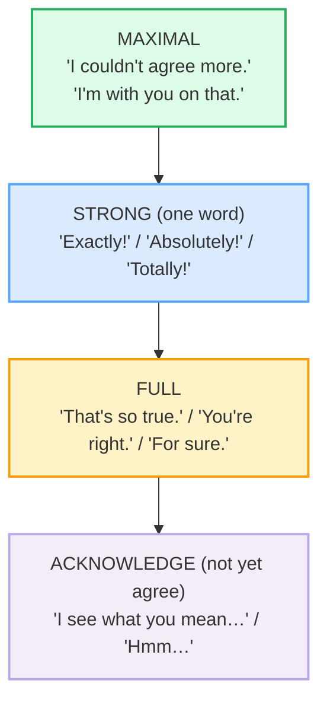
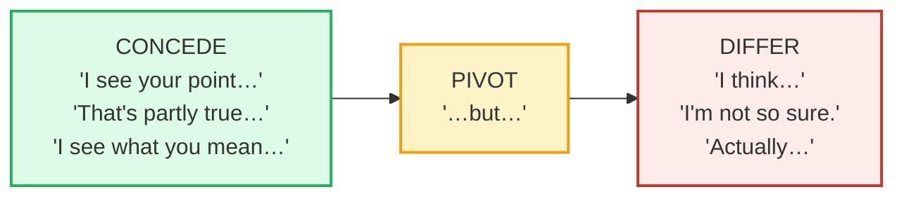

# Agreeing & Disagreeing (casual)

> **Phase 1 · speech_acts · bundle #16 · Days 31–32.**
> *"Exactly!" / "Not sure I agree, actually."*
>
> 🔗 Builds on [FINAL CONSONANTS](../pronunciation/FINAL_CONSONANTS.md) — the
> dropped final /z/ in *"reviews"* or the /t/ in *"Exactly!"* is what makes a
> Vietnamese learner's agreement sound broken before the *word choice* is even
> heard. Fix the finals, then fix the chunk. Later, [DIPLOMATIC
> DISAGREEMENT](../workplace/DIPLOMATIC_DISAGREEMENT.md) climbs this register
> ladder into the workplace.

---

## Why this is a Day-31 fix (read this first)

A Vietnamese learner can usually say *"Yes"* and *"No."* What they cannot yet do
is the **social work** that surrounds agreeing and disagreeing in English — and
that work is almost entirely about **face**. Vietnamese culture treats direct
disagreement as a face-threatening act, so the L1 instinct is to stay quiet, nod,
or soften with a vague *"thấy cũng được"* ("seems okay"). But the moment a
learner tries to disagree in English, two failure modes appear at once:

1. **Over-softening** — they say *"Yes"* when they mean *"I hear you, but…"*, so
   the partner thinks they agree when they don't.
2. **Over-bluntness** — swinging the other way and dropping a *"You're wrong."* /
   *"No."* that sounds aggressive to an English ear, because English softens with
   a **hedge** (*actually*, *I think*, *I'm not so sure*) that the learner never
   learned.

The fix is a small set of **chunks** and one rhythm: **agree first (even
partially), then pivot on *but***. This single move is what separates an
intermediate who sounds rude or evasive from a fluent speaker who can disagree
warmly.

---

## 1. The agreeing ladder — three strengths

English agreement is not binary. There is a ladder, and climbing it deliberately
is what sounds native:

The trap is confusing **L4 (acknowledge)** with **L2/L3 (agree)**. Vietnamese
*vâng* / *đúng* often functions as acknowledgment ("I heard you"), but the English
**"Yes"** reads as *agreement*. Say *"Yes"* to acknowledge and your partner will
be confused when you then disagree.

> From `agreeing_disagreeing_corpus.md`:
>
> - **MAXIMAL** → *"I couldn't agree more."* /aɪ ˈkʊd.ənt əˈɡriː mɔːr/ — OED
>   (attested 1939–: *"I am in complete agreement"*)
> - **STRONG** → *"Exactly!"* /ɪɡˈzæktli/ — Oxford sense 3 ("used as a reply,
>   agreeing with what somebody has just said")
> - **STRONG** → *"Absolutely!"* /ˈæb.sə.luːt.li/ — Oxford sense 4 ("used to
>   emphasize that you agree with somebody")
> - **STRONG** → *"Totally!"* /ˈtəʊ.təl.i/ UK · /ˈtoʊ.t̬əl.i/ US — Oxford
>   "(especially N. American English, informal) 'She's so cute!' 'Totally!' (=
>   I agree)"

Note the **negative-polarity idiom** at the top: *"I **couldn't** agree **more**"*
is syntactically negative but means *maximal* agreement. Do not translate the
words — retrieve the chunk whole.

---

## 2. The disagreeing rhythm: concede → pivot → differ

This is the single most important pragmatic pattern in casual disagreement.
English almost **never** opens a disagreement with the disagreement. It opens
with a **concession** (a partial agreement), pivots on **but**, and *then*
introduces the differing view:

> From `agreeing_disagreeing_corpus.md` (the concede-pivot chunks, verbatim):
>
> - *"I see what you mean, but…"* /aɪ ˌsiː wɒt juː ˈmiːn bət/
> - *"I see your point, but…"* /aɪ ˌsiː jɔːr ˈpɔɪnt bət/
> - *"That's partly true, but…"* /ðæts ˌpɑːt.li ˈtruː bət/
> - *"That's a good point, but…"* /ðæts ə ˈɡʊd ˈpɔɪnt bət/

**The Vietnamese trap:** the L1 instinct is to skip the concession (it feels
insincere — *"why agree if you disagree?"*) and jump straight to the difference.
To an English ear, that sounds like *"You're wrong."* The concession is not
insincerity — it is the social lubricant that lets the disagreement land.

---

## 3. The hedge: *actually* — the one word that saves you

If you learn only one softener, learn **actually**. It does three jobs, all of
them face-saving (Oxford `actually` senses 3 & 4, web-fetched):

1. **Corrects politely** — *"We're not American, actually. We're Canadian."*
2. **Introduces a contrast gently** — *"Actually, I'll be a bit late home."*
3. **Softens a disagreement** — *"Not sure I agree, actually."*

> From `agreeing_disagreeing_corpus.md`:
>
> | Actually, I think… | Not sure I agree, actually. |
> |---|---|
> | /ˈæktʃuəli aɪ ˈθɪŋk/ | /ˌnɒt ˈʃʊər aɪ əˈɡriː ˈæktʃuəli/ |
>
> Both are corpus rows. The **actually** (sense 3: "used to correct somebody in a
> polite way") is what turns a flat *"I don't agree"* into something a friend can
> hear. Without it, the same words sound like an attack.

**Pronunciation note:** *actually* /ˈæktʃuəli/ has the /tʃ/ affricate and three
syllables — Vietnamese has no /tʃ/, so learners often reduce it to *"ak-ly"* (two
syllables, dropped /tʃ/). Drill all three syllables. 🔗 See
[TH SOUNDS](../pronunciation/TH_SOUNDS.md) is not the right link here — the
relevant anchor is [FINAL CONSONANTS](../pronunciation/FINAL_CONSONANTS.md) for
the dropped medial consonant, and the /tʃ/ cluster is drilled in
[CONSONANT CLUSTERS](../pronunciation/CONSONANT_CLUSTERS.md).

---

## 4. What to never say (and what to say instead)

| ❌ Too blunt (sounds rude) | ✓ Natural (softened) | Why the fix works |
|---|---|---|
| "You're wrong." | "I'm not so sure about that." / "I don't think that's quite right." | *I think* + *quite* mark it as a personal take, not a verdict |
| "No." (flat) | "Hmm, I'm not so sure." / "Actually…" | The hedge buys time and lowers the face-threat |
| "I disagree." (in casual chat) | "I don't really agree." / "I'm not sure I agree." | *really* + *not sure* downtone the bare *disagree* |
| "Yes." (when you mean "I hear you") | "I see what you mean." / "Right, but…" | *Yes* reads as agreement; *I see what you mean* reads as acknowledgment |

> From `agreeing_disagreeing_corpus.md`:
>
> - *"I don't really agree."* /aɪ dəʊnt ˈrɪə.li əˈɡriː/ — *really* is the
>   downtoner
> - *"I'm not sure I agree."* /aɪm nɒt ˈʃʊər aɪ əˈɡriː/ — *not sure* is the hedge
> - *"I don't think that's quite right."* /aɪ dəʊnt ˈθɪŋk ðæts kwaɪt ˈraɪt/ —
>   *think* + *quite* soften the correction

---

## 5. Cheat sheet — the ≤8 survival chunks

The Pareto set. Drill these eight aloud until the rhythm (concede → *but* →
differ) is automatic. (Every row is a corpus attestation above.)

| # | Chunk | IPA | Why it's here |
|---|---|---|---|
| 1 | **Exactly!** | /ɪɡˈzæktli/ | the #1 one-word strong agreement |
| 2 | **Absolutely!** | /ˈæb.sə.luːt.li/ | emphatic agreement (reply stress /ˌæbsəˈluːtli/) |
| 3 | **I couldn't agree more.** | /aɪ ˈkʊd.ənt əˈɡriː mɔːr/ | maximal agreement — negative-polarity idiom |
| 4 | **I'm with you on that.** | /aɪm wɪð juː ɒn ðæt/ | warm, full agreement ("on your side") |
| 5 | **Hmm, I'm not so sure.** | /ˌaɪm nɒt səʊ ˈʃʊər/ | soft disagreement opener — the hedge |
| 6 | **Actually, I think…** | /ˈæktʃuəli aɪ ˈθɪŋk/ | the one-word softener before a contrast |
| 7 | **I see your point, but…** | /aɪ ˌsiː jɔːr ˈpɔɪnt bət/ | concede-then-pivot — the core rhythm |
| 8 | **That's partly true, but…** | /ðæts ˌpɑːt.li ˈtruː bət/ | partial agreement before disagreeing |

> Open [`agreeing_disagreeing.html`](./agreeing_disagreeing.html) to drill these
> as flip cards, hear native clips, play the role-play, shadow, and write.

---

## 6. Vietnamese → English L1 pitfalls table

The "expert payoff." These are the specific interference traps a Vietnamese
speaker hits on agreeing and disagreeing — extend, don't replace, the seed rows
from the spec.

| Vietnamese trap (what you do) | English fix (what to do instead) |
|---|---|
| **Direct disagreement is face-threatening in Vietnamese** → you stay silent or nod when you disagree, then the partner thinks you agreed | Use a **soft chunk**: *"Hmm, I'm not so sure."* / *"Actually, I think…"*. Disagreeing politely in English is *expected*, not rude — silence reads as confusion or consent. |
| **Over-compensate and swing to blunt English** → *"You're wrong."* / *"No."* (flat) sounds aggressive to an English ear | Replace with *"I don't think that's quite right."* / *"I'm not sure I agree."*. The **hedge** (*I think* + *quite* / *not sure*) marks it as a personal take, not an attack. |
| **Skips the partial agreement before "but"** → jumps straight to the difference, which sounds abrupt | Drill the **concede → pivot** rhythm: *"I see your point, **but**…"* / *"That's partly true, **but**…"*. Agree *something* first, always. |
| **Overuses "Yes" to mean "I hear you"** → Vietnamese *vâng* / *đúng* often functions as acknowledgment, but English **"Yes"** reads as *agreement* | Say *"I see what you mean."* / *"Right, but…"* to **acknowledge without agreeing**. Reserve *"Yes"* / *"Exactly"* for actual agreement. |
| **Translates "đúng vậy" as "You're right" everywhere** → overuses *"You're right"* where a one-word *"Exactly!"* / *"Absolutely!"* is more native | Learn the **one-word strong replies** (*Exactly! Absolutely! Totally!*) — they sound more fluent than the full *"You're right"* and are the native default. |
| **Drops the "actually" hedge** → *"I don't agree"* sounds harsh without it | Add **actually**: *"Actually, I don't really agree."* — the single word that saves the tone. Pronounce all three syllables /ˈæktʃuəli/, not *"ak-ly"*. |
| **Negative-polarity idiom is untranslatable** → *"I couldn't agree more"* feels like it should mean *I can't agree*, so learners avoid it | Retrieve it as a **fixed chunk**: it means *maximal* agreement. Drill it whole — /aɪ ˈkʊd.ənt əˈɡriː mɔːr/. |
| **Drops the final /z/ in "reviews" or /t/ in "Exactly"** → the agreement is inaudible before the word choice is even judged | Release every final consonant. 🔗 See [FINAL CONSONANTS](../pronunciation/FINAL_CONSONANTS.md). *reviews* /rɪˈvjuːz/ — keep the buzzing /z/. |

---

## How to practise this bundle (the daily 20 min)

1. **READ** (5 min) — this guide, §1–§4.
2. **SHADOW** (7 min) — open `agreeing_disagreeing.html`, drill the 8 flip cards
   + the casual-debate role-play **aloud**. Pay attention to the **concede → but
   → differ** rhythm; exaggerate the *actually*, then relax.
3. **PRODUCE** (8 min) — the writing task: write **1 agree** sentence (pick a
   strength from the ladder) + **1 soft-disagree** sentence (concede → *but* →
   differ). Read them aloud; check the *actually* has all three syllables.

---

## Sources

- Oxford Advanced Learner's Dictionary — https://www.oxfordlearnersdictionaries.com/definition/english/{word}
  (entries for *exactly* sense 3, *absolutely* sense 4, *actually* senses 3 & 4,
  *totally* — all quoted verbatim in the guide)
- Cambridge Advanced Learner's Dictionary — https://dictionary.cambridge.org/dictionary/english/{word}
  (entries for *for-sure*, *true*, *with*, *right*, *sure*, *mean*, *point*,
  *partly*, *agree*, *movie*, *trailer*, *review*, *expectation*)
- Oxford English Dictionary, `say, v.¹` — https://www.oed.com/dictionary/say_v1
  ("I couldn't agree more", attested 1939–)
- ICAME, "Negative polarity idioms in Modern English" — https://icame.info/icame_static/ij23/npime.pdf
- OpenWA *Empower*, "Agreeing and Disagreeing Politely in English" — https://openwa.pressbooks.pub/empower/chapter/agreeing-and-disagreeing-politely-in-english/
- Nguyen, "The systematic reduction of English syllable-final consonants" (GMU) — https://orgs.gmu.edu/lingclub/WP/texts/6_Nguyen.pdf
- "Vietnamese Phonology: A Complete Guide" (Remitly) — https://www.remitly.com/blog/education/vietnamese-phonology-guide/
- Native audio: YouGlish — https://youglish.com/pronounce/{chunk}/english/us?
- Frequency methodology: wordfrequency.info (spoken sub-corpus) — https://www.wordfrequency.info/
