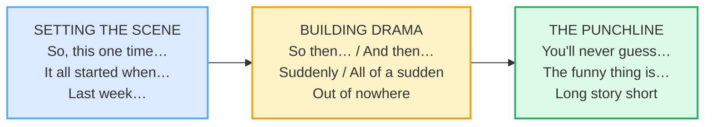

# Telling Anecdotes (past narrative)

> **Phase 1 · speech_acts · bundle #25 · Days 49–50.**
> *Past tenses + "So then…" / "The funny thing is…"*
>
> 🔗 Builds on [FINAL CONSONANTS](../pronunciation/FINAL_CONSONANTS.md) — the
> `-ed` endings on every past verb (`walked`, `started`, `happened`) are
> exactly the finals Vietnamese learners drop; you can't tell a past story if
> the past tense vanishes. Also links to
> [PAST CONTINUOUS vs PAST SIMPLE](#) grammar and, later, to
> [STORYTELLING STRUCTURES](../discourse/STORYTELLING_STRUCTURES.md) and
> [NARRATIVE TENSES](../discourse/NARRATIVE_TENSES.md) in Phase 4.

---

## Why this bundle matters (read this first)

Telling a short, funny story — an **anecdote** — is one of the highest-value
social skills in English. It is how friends bond, how interviews answer "tell me
about a time…", and how a meeting warms up. But a good anecdote is **not** a
flat list of facts ("I went home. I saw a dog. I ran."). It is a *performance*
with three engines:

1. **Tense layering** — past simple + past continuous + past perfect weave a
   background, a main action, and a "what had already happened."
2. **Story glue** — `So then…`, `And then…` connect the beats so the listener
   never loses the thread.
3. **Drama markers** — `Suddenly`, `Out of nowhere`, `The funny thing is…` make
   the listener *lean in*.

Vietnamese has **none** of these engines. There is **no past tense morphology**
at all (time is shown by a word like "hôm qua", not a verb ending), **no
perfect-vs-simple contrast**, and the storytelling register is built on
different particles. So a Vietnamese learner's English anecdote tends to come
out flat, tense-inconsistent, and glued with silence. This bundle fixes all
three.

---

## 1. The narrative arc (the spine of any anecdote)

Every good anecdote walks the same arc — **scene → drama → punchline**. The
chunks in this bundle sit at fixed points on that arc:

Miss any stage and the story breaks: skip the **scene** and the listener is
disoriented; skip the **drama** and it reads like a report; skip the
**punchline** and there is no payoff — just an awkward "…yeah, that's it."

---

## 2. The three narrative tenses and their jobs

English layers **three** past tenses in a story. Vietnamese has **zero** verb
tense marking, so this layering is the single hardest habit to acquire — and
the one that most clearly separates a flat retelling from a fluent anecdote.

| Tense | Form | Job in a story | Example |
|---|---|---|---|
| **Past simple** | `walked`, `heard`, `came` | the **main events**, in order | *"…when suddenly I **heard** a scream."* |
| **Past continuous** | `was/were + -ing` | the **background** — what was already in progress | *"I **was just dozing off**…"* |
| **Past perfect** | `had + past participle` | the **earlier event** — what had happened *before* | *"…the thief **had escaped**."* |

> From `anecdotes_corpus.md` (the two anchor sentences, verbatim):
>
> - *"I **was just dozing off** when suddenly I **heard** a scream from
>   outside."* — past continuous (background) **interrupted** by past simple (the
>   event). [Cambridge, `suddenly`]
> - *"When the police **arrived**, the thief **had escaped**."* — past simple
>   (the later event) + past perfect (the event that happened **first**).
>   [British Council, *Past perfect*]

**The rule of thumb:** the **past continuous is the stage** (what was going on),
the **past simple is the actor** (what happened), and the **past perfect is the
flashback** (what had already happened before all of it).

---

## 3. Setting the scene (the opening chunks)

The opener signals "story mode" and anchors the listener in time. Without one,
your anecdote sounds like you're answering a question, not telling a tale.

> From `anecdotes_corpus.md` (verbatim):
>
> - **So, this one time…** /soʊ ðɪs wʌn taɪm/ — the casual, colloquial opener.
>   The `So…` marks a discourse shift into narrative; `one time` fixes a single
>   occasion.
> - **It all started when…** /ɪt ɔːl ˈstɑːrtɪd wen/ — the classic narrative
>   launch; marks the **first event** of the story (often paired with past
>   simple).
> - **Last week…** /læst wiːk/ — the time-adverbial anchor; a bare time phrase
>   that sets the whole story in the past.

---

## 4. Building drama (the turning-point chunks)

This is where Vietnamese learners go silent. A native speaker sprinkles
**sequencers** (`So then…`, `And then…`) and **sudden-event markers** between
every beat, so the listener feels the momentum. These chunks *are* the drama.

> From `anecdotes_corpus.md` (verbatim):
>
> - **So then…** /soʊ ðen/ — story glue; moves to the next event.
> - **Suddenly** /ˈsʌd.ən.li/ — "quickly and unexpectedly"; the turning-point
>   adverb. (Cambridge's own example: *"I was just dozing off when **suddenly**
>   I heard a scream."*)
> - **All of a sudden** /ɑːl əv ə ˈsʌd.ən/ — the more colloquial idiom twin of
>   *suddenly*.
> - **Out of nowhere** /aʊt əv ˈnoʊ.wer/ — "appearing suddenly and
>   unexpectedly" (Cambridge: *"The car came **out of nowhere**."*)

> 🔗 The `suddenly` example is **past continuous + past simple** in one breath —
> the exact pattern from §2. Drill the whole sentence, not just the adverb.

---

## 5. The punchline / wrap-up (the payoff)

The payoff chunk hands the listener the point — the irony, the surprise, or the
compressed ending. It is what makes the story *worth telling*.

> From `anecdotes_corpus.md` (verbatim):
>
> - **The funny thing is…** /ðə ˈfʌn.i θɪŋ ɪz/ — highlights the ironic /
>   surprising twist. (Oxford's own example: *"**The funny thing is** it never
>   happened again after that."*)
> - **You'll never guess (what happened)** /juːl ˈnev.ɚ ɡes/ — a suspense
>   builder; flags that a surprise is coming.
> - **Long story short** /lɑːŋ ˈstɔːr.i ʃɔːrt/ — "to cut to the end / get to
>   the point" (Cambridge idiom). UK full form: **To cut a long story short**.

---

## 6. Cheat sheet — the 8 survival chunks

The Pareto set. Drill these eight aloud until the arc is automatic — open with
#1–2, drive with #3–5, land with #6–8. (Every row is a corpus attestation
above.)

| # | Chunk | IPA | Why it's here |
|---|---|---|---|
| 1 | **So, this one time…** | /soʊ ðɪs wʌn taɪm/ | casual story opener — signals "story mode" |
| 2 | **It all started when…** | /ɪt ɔːl ˈstɑːrtɪd wen/ | narrative launch — marks the first event |
| 3 | **So then…** | /soʊ ðen/ | story glue — moves to the next beat |
| 4 | **Suddenly** | /ˈsʌd.ən.li/ | the turning-point adverb — builds drama |
| 5 | **Out of nowhere** | /aʊt əv ˈnoʊ.wer/ | "appeared unexpectedly" — the surprise |
| 6 | **You'll never guess…** | /juːl ˈnev.ɚ ɡes/ | suspense builder — flags a surprise |
| 7 | **The funny thing is…** | /ðə ˈfʌn.i θɪŋ ɪz/ | the ironic punchline highlight |
| 8 | **Long story short** | /lɑːŋ ˈstɔːr.i ʃɔːrt/ | compress the ending / get to the point |

> Open [`anecdotes.html`](./anecdotes.html) to drill these as flip cards, hear
> native clips, play the role-play, shadow, and write your own anecdote.

---

## 7. Vietnamese → English L1 pitfalls table

The "expert payoff." These are the specific interference traps a Vietnamese
speaker hits when telling an anecdote in English — extend, don't replace, the
seed rows from the spec.

| Vietnamese trap (what you do) | English fix (what to do instead) |
|---|---|
| **No past tense morphology** — Vietnamese shows past by a time word ("hôm qua"), not a verb ending → "Yesterday I **go** to the park." | Enforce the `-ed`/irregular past on **every** narrative verb. Pair a time anchor ("Last week…") with audible past forms. 🔗 [FINAL CONSONANTS](../pronunciation/FINAL_CONSONANTS.md) drills the `-ed` endings. |
| **No past-perfect-vs-past-simple contrast** → everything is one flat past, so the flashback/background layer is lost | Use **past continuous for the background** (`I was walking…`) and **past perfect for the earlier event** (`…I had forgotten my keys`). See §2. |
| **Tells the story in the present** ("So I **walk** home, and then I **see** a dog…") — the "historical present" is fine for natives but signals low level from a learner | Default to **past tenses** for anecdotes. Only switch to the dramatic present once your past forms are flawless. |
| **Tense drift mid-story** — starts in past, slips into present, slips back | Pick one time frame and **hold it**. Re-read your anecdote and circle every verb; they should all sit in the past family. |
| **No "story glue"** — beats are separated by silence or "and… and…" instead of `So then…` / `And then…` | Insert a **sequencer** between every major beat: `So then…`, `And then…`, `Suddenly…`. These chunks *are* the rhythm of an English anecdote. |
| **Missing drama/engagement markers** — tells the story flatly, no `Suddenly`, no `You'll never guess`, no `The funny thing is…` | Add **one drama marker per turning point** and **one punchline marker** at the payoff. A flat report becomes a story. |
| **Drops the `-ed` / final cluster** → `started` → "star", `happened` → "happen" — the past tense literally vanishes | Exaggerate the `-ed` release (`start**ed**`, `happen**ed**`); 🔗 [FINAL CONSONANTS](../pronunciation/FINAL_CONSONANTS.md) §3. |
| **No punchline / trails off** — ends with "…yeah, that's all" instead of landing the point | Land with **The funny thing is…** or **Long story short…** so the listener gets the payoff. |
| **Calques Vietnamese storytelling particles** ("Khác gì đâu…") as literal English | Learn the English **chunks** as wholes (`Out of nowhere`, `All of a sudden`); do not translate word-by-word. |

---

## How to practise this bundle (the daily 20 min)

1. **READ** (5 min) — this guide, §1–§5.
2. **SHADOW** (7 min) — open `anecdotes.html`, drill the 8 flip cards + the
   role-play **aloud**, exaggerating every past `-ed` and the drama markers.
3. **PRODUCE** (8 min) — the writing task: write a **4-sentence anecdote** using
   past simple + past continuous + past perfect (one of each). Read it aloud,
   recording yourself; check every verb sits in the past family and the arc
   (scene → drama → punchline) is there.

---

## Sources

- Cambridge Advanced Learner's Dictionary — `suddenly` /ˈsʌd.ən.li/ (US/UK), with
  the example *"I was just dozing off when suddenly I heard a scream."* —
  https://dictionary.cambridge.org/dictionary/english/suddenly
- Cambridge — `nowhere` (idiom `from/out of nowhere`), attested *"The car came
  out of nowhere."* —
  https://dictionary.cambridge.org/dictionary/english/nowhere
- Cambridge — `sudden` (idiom `all of a sudden`) —
  https://dictionary.cambridge.org/dictionary/english/sudden
- Cambridge — `long story short` idiom —
  https://dictionary.cambridge.org/dictionary/english/long-story-short
- Cambridge — `to make a long story short` (US) / `to cut a long story short`
  (UK) —
  https://dictionary.cambridge.org/dictionary/english/to-make-a-long-story-short
- Cambridge — word-level IPA (`so`, `then`, `start`, `last`, `guess`, `story`,
  `short`) — https://dictionary.cambridge.org/dictionary/english/{word}
- Oxford Advanced Learner's Dictionary — `funny`, attested *"The funny thing is
  it never happened again after that."* —
  https://www.oxfordlearnersdictionaries.com/definition/english/funny
- Cambridge Grammar — *Past continuous or past simple?* —
  https://dictionary.cambridge.org/grammar/british-grammar/past-continuous-or-past-simple
- Cambridge Grammar — *Past continuous (I was working)* —
  https://dictionary.cambridge.org/grammar/british-grammar/past-continuous-i-was-working
- Cambridge Grammar — *Past perfect simple (I had worked)* —
  https://dictionary.cambridge.org/grammar/british-grammar/past-perfect-simple-i-had-worked
- British Council LearnEnglish — *Past perfect* ("When the police arrived, the
  thief had escaped.") —
  https://learnenglish.britishcouncil.org/free-resources/grammar/b1-b2/past-perfect
- Schiffrin, D. *Discourse Markers* (CUP, 1987) — `so`/`then` as narrative-frame
  markers. Fraser, B. (2009) — `so then`/`and then` as sequencing markers.
- Native audio: YouGlish — https://youglish.com/pronounce/{chunk}/english/us?
- Frequency methodology: wordfrequency.info (spoken sub-corpus) —
  https://www.wordfrequency.info/
