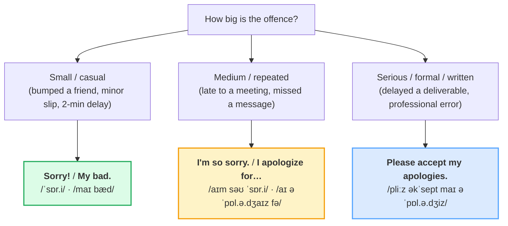

# Apologizing & Responding

> **Phase 1 · speech_acts · bundle #14 · Days 27–28.**
> *"My bad" → "I apologize for"; graceful acceptance.*
>
> 🔗 Builds on [THANKING](./THANKING.md) (the sibling speech act — a thanks
> expects a "you're welcome" the same way an apology expects an acceptance) and
> on [FINAL CONSONANTS](../pronunciation/FINAL_CONSONANTS.md) (the /t/ in
> *late*, the /d/ in *bad*, the cluster in *texted* — drop these and the apology
> itself sounds broken). Anticipates [INTERRUPTING](./INTERRUPTING.md) (#17,
> where *Sorry to interrupt…* / *Excuse me* split apart in full) and
> [APOLOGY EMAILS](../writing/APOLOGY_EMAILS.md) (#49, the written-mode upgrade
> of the formal chunks here).

---

## Why this is bundle #14 (read this first)

Vietnamese has a single phrase — **xin lỗi** — that does every apology job: a
small bump, a serious mistake, a polite interruption, asking forgiveness. English
**splits that one phrase into a ladder of weight**: *Sorry* / *My bad* at the
bottom, *I apologize for…* / *Please accept my apologies* at the top, and a
separate word — *Excuse me* — that is **not an apology at all** but a
"get-attention / interrupt / pass-through" signal. Two failures follow from this
for a Vietnamese learner:

1. **Over-use *sorry* (or *excuse me*) at every weight.** Saying *"I'm sorry for
   the delay in delivering the report"* to a client sounds child-like; the
   register should climb to *"I apologize for the delay."* Saying *"Excuse me
   for breaking your cup"* sounds wrong — *excuse me* doesn't apologise for
   harm, it asks for attention.
2. **Forget to verbally accept.** In Vietnamese culture, an apology is often
   accepted with silence, a small nod, or a dismissive gesture — that is polite.
   In English, **silence after an apology reads as cold or unforgiving**. The
   acceptance chunk (*No problem. / That's OK. / Don't worry about it.*) is not
   optional filler; it is the second half of the speech act.

This bundle teaches the **ladder**, the **excuse-me/sorry split**, and the
**acceptance half** — so a Vietnamese learner's apologies land at the right
weight and actually close.

---

## 1. The register ladder: match the weight to the offence

The ladder is the whole bundle in one picture: the **same intent** (I did wrong)
is expressed by **different chunks** as the weight climbs. Vietnamese *xin lỗi*
sits at every level at once; English forces you to pick.

> From `apologizing_corpus.md` (the three rungs, verbatim):
>
> - Casual → **Sorry!** /ˈsɒr.i/ UK · /ˈsɔːr.i/ US, **My bad.** /maɪ bæd/,
>   **Whoops!** /wʊps/
> - Medium/formal → **I apologize for…** /aɪ əˈpɒl.ə.dʒaɪz fə(r)/ UK ·
>   /aɪ əˈpɑː.lə.dʒaɪz fɔːr/ US
> - Very formal / written → **Please accept my apologies.**
>   /pliːz əkˈsept maɪ əˈpɒl.ə.dʒiz/, **Forgive me.** /fəˈɡɪv miː/

**The Vietnamese trap:** learners default to *sorry* for everything because it
maps cleanly to *xin lỗi*. But *"Sorry for the delay in shipping your order"* in
a business email under-performs — the register is too low for the context. The
fix is to **practise the ladder as three separate chunks**, not one word with
three feelings.

---

## 2. *Excuse me* is NOT an apology (the #1 confusion)

This is the single highest-value distinction in the bundle. *Excuse me* and
*sorry* both translate back to *xin lỗi*, but they do **different jobs** in
English:

| Function | English | NOT |
|---|---|---|
| Get a stranger's attention | **Excuse me**, does this bus go to…? | ~~Sorry, does this bus…?~~ |
| Squeeze past someone | **Excuse me**, could I just…? | ~~Sorry, could I…?~~ |
| Interrupt a conversation | **Sorry, can I just…?** / **Excuse me…** | (both work here — *sorry* softens) |
| Apologise for a bump | **Oh, I'm sorry!** / **Excuse me, I didn't see you there.** | (both work for a *bump*) |
| Apologise for real harm | **I'm so sorry.** / **I apologize for…** | ~~Excuse me for breaking your laptop.~~ |

> From `apologizing_corpus.md`:
>
> | Excuse me. | Sorry! |
> |---|---|
> | /ɪkˈskjuːz miː/ — get attention / pass / interrupt | /ˈsɒr.i/ UK · /ˈsɔːr.i/ US — apologise for harm |
>
> The two only **overlap** for a minor bump ("Oh, excuse me!" / "Oh, sorry!").
> For any real offence, *excuse me* is the wrong word. Oxford Learner's lists
> six distinct functions of *excuse me* — none of them is "apologise for
> serious harm."

🔗 This split gets its own bundle at
[INTERRUPTING](./INTERRUPTING.md) (#17), where *Sorry to interrupt…* /
*If I could just…* / *Excuse me* are drilled as floor-management tools.

---

## 3. Responding to an apology — the missing half

An English apology is a **two-part act**: the apology (Part 1) expects a verbal
acceptance (Part 2). Vietnamese culture often completes the act with silence or
a small gesture — which, in English, reads as "I'm still upset." The acceptance
chunk is how you signal **the matter is closed**.

> From `apologizing_corpus.md` (the acceptance set, verbatim):
>
> - **No problem.** /nəʊ ˈprɒbləm/ UK · /noʊ ˈprɑːbləm/ US — casual (US-led)
> - **That's OK.** /ðæts ˌəʊˈkeɪ/ UK · /ðæts oʊˈkeɪ/ US — casual (US; UK prefers
>   *That's all right.*)
> - **Don't worry about it.** /dəʊnt ˈwʌri əˌbaʊt ɪt/ UK · /doʊnt ˈwɜːri əˌbaʊt
>   ɪt/ US — warm casual
> - **No harm done.** /nəʊ hɑːm dʌn/ UK · /noʊ hɑːrm dʌn/ US — after a bump/spill
> - **It happens.** /ɪt ˈhæpənz/ — reassurance ("forget it, normal")
> - **That's quite all right.** /ðæts kwaɪt ɔːl ˈraɪt/ — polite / slightly
>   formal (UK-led)

**The Vietnamese trap:** after receiving an apology, the L1 instinct is a small
smile or silence — *"không sao"*/"không có chi" stays **inside the head**, not
in the mouth. In English, **say it out loud**. Even a quick *"No problem"* or
*"Don't worry about it"* transforms the interaction from cold to warm.

---

## 4. Cheat sheet — the ≤8 survival chunks

The Pareto set. Drill these eight aloud until the register choice is automatic.
(Every row is a corpus attestation above.)

| # | Chunk | IPA | Why it's here |
|---|---|---|---|
| 1 | **Sorry!** | /ˈsɒr.i/ UK · /ˈsɔːr.i/ US | the universal casual apology |
| 2 | **My bad.** | /maɪ bæd/ | owning a small mistake (informal) |
| 3 | **I'm so sorry.** | /aɪm səʊ ˈsɒr.i/ UK · /aɪm soʊ ˈsɔːr.i/ US | stronger casual — felt regret |
| 4 | **I apologize for…** | /aɪ əˈpɒl.ə.dʒaɪz fə(r)/ UK · /aɪ əˈpɑː.lə.dʒaɪz fɔːr/ US | formal spoken/written — the climb |
| 5 | **Please accept my apologies.** | /pliːz əkˈsept maɪ əˈpɒl.ə.dʒiz/ | very formal / email opener |
| 6 | **Excuse me.** | /ɪkˈskjuːz miː/ | get attention / interrupt (NOT a real apology) |
| 7 | **No problem.** | /nəʊ ˈprɒbləm/ UK · /noʊ ˈprɑːbləm/ US | accept an apology (casual) |
| 8 | **Don't worry about it.** | /dəʊnt ˈwʌri əˌbaʊt ɪt/ UK · /doʊnt ˈwɜːri əˌbaʊt ɪt/ US | accept (warm — closes the act) |

> Open [`apologizing.html`](./apologizing.html) to drill these as flip cards,
> hear native clips, play the running-late role-play, shadow, and write the
> formal apology email opener.

---

## 5. Vietnamese → English L1 pitfalls table

The "expert payoff." These are the specific interference traps a Vietnamese
speaker hits on apologizing and responding — extend, don't replace, the seed
rows from the spec.

| Vietnamese trap (what you do) | English fix (what to do instead) |
|---|---|
| **One phrase *xin lỗi* for every weight** → uses *sorry* for a serious professional error too | Climb the ladder (§1): *Sorry / My bad* → *I'm so sorry* → *I apologize for…* → *Please accept my apologies.* Match the chunk to the offence. |
| **Confuses *excuse me* with *sorry*** → *"Excuse me for breaking your cup"* (wrong — *excuse me* gets attention, doesn't apologise for harm) | Use *excuse me* only for attention/pass/interrupt; use *sorry* for harm. They overlap only for a minor bump (§2). |
| **Silence after an apology** (VN polite = small smile, no words; "không sao" stays in the head) → reads cold/unforgiving in English | Always say the acceptance out loud: *No problem.* / *That's OK.* / *Don't worry about it.* / *No harm done.* (§3). |
| **Over-uses *excuse me* as a universal polite word** → *"Excuse me, you dropped this"* (fine) bleeds into *"Excuse me, I'm late"* (should be *Sorry I'm late*) | Reserve *excuse me* for attention/pass/interrupt; switch to *Sorry (I'm late)* for an actual delay. |
| **Drops the /t/ in *late*, /d/ in *bad*, /-kt/ in *texted*** → *"Sorry I'm lay"*, *"My ba"* | Release every final consonant. 🔗 Drill [FINAL CONSONANTS](../pronunciation/FINAL_CONSONANTS.md) — the /t/ in *late* and the /d/ in *bad* carry the apology's meaning. |
| **Translates *xin lỗi* literally as *excuse me*** in "sorry to interrupt" contexts → *"Excuse me, can I say something?"* is fine but *"Sorry, can I just…?"* is softer and more native | Practise *Sorry, can I just…?* / *Sorry to interrupt…* as the softer interrupt (🔗 #17). |
| **Uses *no problem* too early/formally** → *"No problem"* to a senior client's serious apology sounds dismissive | Match the acceptance to the weight too: serious apology → *That's quite all right* / *I appreciate the apology*; casual → *No problem* / *Don't worry about it.* |
| **Says *It doesn't matter*** as a direct translation of *không sao* → sounds blunt/curt in English | Prefer *Don't worry about it.* / *No harm done.* / *It happens.* — *It doesn't matter* can read as "I don't care." |
| **/θ/ in nothing here, but /v/ vs /w/ and final /z/** → *"sor-ry"* with a Vietnamese /r/ (tap or trill) instead of the English approximant | Drill the English /r/ (no tongue trill; tongue tip curled back, lips rounded). Spot-check against the YouGlish clip for *sorry*. |
| **Forgets the modal-perfect in owning it** → *"Sorry, I should text"* instead of *"I should've texted"* | Own the slip with the modal perfect: *I should've left earlier.* / *I shouldn't have done that.* (🔗 narrative tenses in Phase 4.) |

---

## How to practise this bundle (the daily 20 min)

1. **READ** (5 min) — this guide, §1–§3 (the ladder, the *excuse me* split, the
   acceptance half).
2. **SHADOW** (7 min) — open `apologizing.html`, drill the 8 flip cards + the
   running-late role-play **aloud**, exaggerating the register gap between *My
   bad* and *I apologize for…*.
3. **PRODUCE** (8 min) — the writing task: write **1 formal apology email
   opener** (*Please accept my apologies for…*). Say it aloud at the formal end
   of the ladder; then say the same idea at the casual end (*Sorry about…*) and
   feel the climb.

---

## Sources

- Cambridge Advanced Learner's Dictionary —
  https://dictionary.cambridge.org/dictionary/english/{word} and
  https://dictionary.cambridge.org/pronunciation/english/{word}
  (entries/pronunciation for *sorry, apologize, forgive, bad* [→ idiom *my bad*],
  *oops, problem, OK, worry, harm, happen, all right, no-problem*).
- Oxford Advanced Learner's Dictionary —
  https://www.oxfordlearnersdictionaries.com/definition/english/excuse_2
  (the six functions of *excuse me*, incl. the North-American "apology for a
  bump" use).
- Oxford University Press, *Learning English with Oxford* — "How to write the
  perfect email in English" —
  https://learningenglishwithoxford.oup.com/2021/03/18/write-perfect-email-english/
  (*Please accept my apologies* as a standard formal apology opener).
- Oxford Online English — *Ways to say sorry* —
  https://www.oxfordonlineenglish.com/ways-to-say-sorry
  (the formal ladder: *I apologise* → *Please accept my apologies* → *my
  sincerest apologies*).
- VUS CEFR B1 vocabulary list — *forgive* /fəˈɡɪv/ ("Can you forgive me for
  being late?") — Cambridge-aligned IPA cross-check.
- Le, P. T. *Transnational Variation in Linguistic Politeness in Vietnamese*
  (VUIR) — https://vuir.vu.edu.au/17945/1/Phuc_Thien_Le.pdf
  (the *excuse me* vs *sorry* vs *xin lỗi* mapping — the core L1 pitfall).
- Vu (1997), *The Influence of Vietnamese Native Language and Culture* —
  https://core.ac.uk/download/pdf/216988808.pdf
  (*Xin lỗi, anh làm ơn…* ↔ *Excuse me, could you…?*).
- Nguyen et al., *A Pragmatic Study of Vietnamese Students' Apology Strategies*
  (Journal of Language Teaching and Research) —
  https://jltr.academypublication.com/index.php/jltr/article/download/10828/8885/34970
  (*Xin lỗi nha. Lỗi tui thiệt.* ↔ *Sorry. That was my fault.*).
- Native audio: YouGlish — https://youglish.com/pronounce/{chunk}/english/us?
  (all links verified final HTTP 200 on 2026-06-23).
- Frequency methodology: wordfrequency.info (spoken sub-corpus) —
  https://www.wordfrequency.info/.
