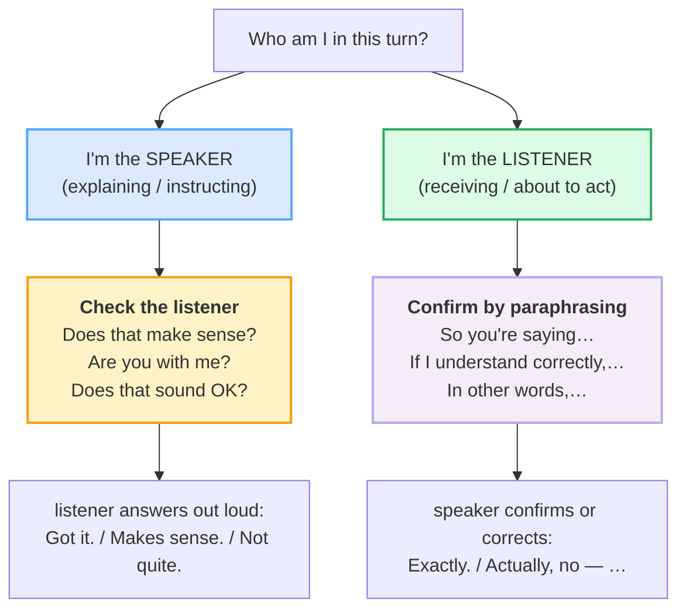

# Checking & Confirming

> **Phase 1 · speech_acts · bundle #18 · Days 35–36.**
> *"Does that make sense?" / "So you're saying…"*
>
> 🔗 Builds on [INTERRUPTING](./INTERRUPTING.md) (#17 — *Sorry to interrupt…*
> is how you take the floor; *Does that make sense?* is how you check it landed)
> and on [FINAL CONSONANTS](../pronunciation/FINAL_CONSONANTS.md) (the /s/ in
> *sense*, the /t/ in *right?*, the cluster in *correctly* — drop these and the
> check itself becomes the thing the listener can't parse). Anticipates
> [CLARIFYING](./CLARIFYING.md) (#19 — the listener's "Sorry, I didn't catch
> that" side of the same exchange) and [EXPLAINING SIMPLY](../workplace/EXPLAINING_SIMPLY.md)
> (#43 — the speaker side, where every explanation needs these checks built in).

---

## Why this is bundle #18 (read this first)

Vietnamese has a clean listener-affirmation system: the listener says **vâng**
or **dạ** and nods, and that single token means *"I hear you, I'm paying
respect, you can keep going."* It does **not** necessarily mean *"I understood."*
And in Vietnamese culture that is fine — face is preserved on both sides: the
listener never has to admit they got lost, and the speaker never has to imply
the listener might be lost.

English runs on the **opposite assumption**. An English speaker does **not**
trust a silent nod or a bare *"yes."* To be confident the listener followed, the
English speaker **asks explicitly** (*Does that make sense?* / *Are you with
me?*) — and the English listener **proves** they understood by **paraphrasing**
(*So you're saying…* / *If I understand correctly,…*). Two predictable failures
follow from the L1 mismatch:

1. **The Vietnamese listener nods "yes" without understanding.** In a Vietnamese
   room this is polite (saving face); in an English room it reads as *"I didn't
   understand but I'm too embarrassed to say so"* — so the speaker barrels on
   and the misunderstanding compounds. The fix is to **paraphrase to confirm**
   (§3): *So you're saying…* gives the speaker a chance to correct you, which a
   nod never does.
2. **The Vietnamese speaker never checks.** They explain to the end and move on,
   assuming *vâng / dạ* covered it. The English listener was lost at step two
   and never said so. The fix is for the **speaker** to insert explicit checks
   (§1–§2): *Does that make sense?* every few sentences.

This bundle trains **both sides** of the act — the speaker's check and the
listener's paraphrase — because fluency here is a **two-turn contract**, not a
single phrase.

---

## 1. The two directions of the act (one picture)

Checking understanding is **directional**. The speaker checks **downward** (are
you following?); the listener confirms **upward** (here's what I heard). Get the
direction wrong and you'll use a speaker-check when you should paraphrase, or
paraphrase when you should be the one explaining.

> From `checking_understanding_corpus.md` (the two halves, verbatim):
>
> - **Check the listener (speaker side):** **Does that make sense?**
>   /ˌdʌz ðæt ˌmeɪk ˈsens/, **Are you with me?** /ɑː juː ˈwɪð miː/ UK ·
>   /ɑːr juː ˈwɪθ miː/ US, **Does that sound OK?** /dʌz ðæt ˌsaʊnd ˌəʊˈkeɪ/ UK
>   · /dʌz ðæt ˌsaʊnd oʊˈkeɪ/ US, **Are we on the same page?** /ɑː wiː ɒn ðə
>   ˌseɪm ˈpeɪdʒ/ UK · /ɑːr wiː ɑːn ðə ˌseɪm ˈpeɪdʒ/ US
> - **Confirm by paraphrasing (listener side):** **So you're saying…**
>   /səʊ jʊə ˈseɪ.ɪŋ/ UK · /soʊ jʊr ˈseɪ.ɪŋ/ US, **If I understand correctly,…**
>   /ɪf aɪ ˌʌndəˈstænd kəˈrektli/ UK · /ɪf aɪ ˌʌndərˈstænd kəˈrektli/ US,
>   **In other words,…** /ɪn ˈʌð.ər ˈwɜːdz/ UK · /ɪn ˈʌð.ɚ ˈwɜːrdz/ US

**The Vietnamese trap:** learners reach for *right?* (the only check they
remember) and use it in **both directions** — as a speaker-check *and* as a
listener-confirm. But *Right?* is a **speaker tag**, not a paraphrase. The
listener who wants to confirm must **restate the content** (*So you're saying
the meeting moved to 3?*), not just echo *Right?* — otherwise the speaker can't
tell whether the listener actually understood or is just nodding along.

---

## 2. Checking the listener (you're explaining — insert pauses)

The high-frequency speaker-checks, by weight. Note the **register climb**: the
short forms are classroom / pair-programming / standup speed; the full forms are
meeting / client / instruction speed.

| Register | Chunk | When |
|---|---|---|
| fast / informal | **Make sense?** /ˌmeɪk ˈsens/ · **Right?** /raɪt/ | mid-flow, talking to a peer, one-to-one |
| neutral | **Does that make sense?** /ˌdʌz ðæt ˌmeɪk ˈsens/ · **Are you with me?** /ɑː juː ˈwɪð miː/ | explaining a process step, a few sentences in |
| slightly formal | **Does that sound OK?** /dʌz ðæt ˌsaʊnd ˌəʊˈkeɪ/ · **Does that sound right?** /dʌz ðæt ˌsaʊnd ˈraɪt/ | proposing a plan, asking for buy-in |
| meeting / workplace | **Are we on the same page?** /ɑː wiː ɒn ðə ˌseɪm ˈpeɪdʒ/ UK · /ɑːr wiː ɑːn ðə ˌseɪm ˈpeɪdʒ/ US | aligning a team before action |

> From `checking_understanding_corpus.md`:
>
> | Does that make sense? | Are you with me? |
> |---|---|
> | /ˌdʌz ðæt ˌmeɪk ˈsens/ — "was that clear?" | /ɑː juˏ ˈwɪð miː/ UK · /ɑːr juˏ ˈwɪθ miː/ US — "are you following?" |
>
> Cambridge's entry for *be with someone* attests *Are you with me?* verbatim:
> "to understand what someone is saying: You look puzzled — are you with me?
> I'm sorry, I'm not with you." Note the **UK /wɪð/ vs US /wɪθ/** split — the
> most mis-transcribed word in this bundle. Drill both.

**The Vietnamese trap:** in fast speech the speaker often **drops the check
entirely** — because the L1 listener's *vâng / dạ* was already doing the job,
so the speaker learned to trust the silence. The fix is a **discipline**, not a
phrase: insert a check **every 3–4 sentences** when you explain. The chunk is
short (*Make sense?*); the habit is the hard part.

---

## 3. Confirming by paraphrasing (you're listening — reflect back)

This is the half Vietnamese learners skip. The L1 instinct: nod, say *vâng *,
and move on. The English expectation: **restate the speaker's point in your own
words** so they can confirm or correct. The paraphrase is not redundancy — it is
the **proof of understanding** that a nod can never provide.

| Chunk | Weight / tone |
|---|---|
| **So you're saying…** /səʊ jʊə ˈseɪ.ɪŋ/ UK · /soʊ jʊr ˈseɪ.ɪŋ/ US | neutral, conversational — the workhorse |
| **If I understand correctly,…** /ɪf aɪ ˌʌndəˈstænd kəˈrektli/ UK · /ɪf aɪ ˌʌndərˈstænd kəˈrektli/ US | slightly formal / careful — meetings, instructions |
| **In other words,…** /ɪn ˈʌð.ər ˈwɜːdz/ UK · /ɪn ˈʌð.ɚ ˈwɜːrdz/ US | rephrasing to test your own restatement |
| **Let me make sure I understand…** /let mi ˌmeɪk ˈʃʊər aɪ ˌʌndəˈstænd/ UK · /let mi ˌmeɪk ˈʃʊr aɪ ˌʌndərˈstænd/ US | slowing down — when getting it wrong is costly |
| **So, to clarify,…** /səʊ tə ˈklærəfaɪ/ UK · /soʊ tə ˈklerəfaɪ/ US | slightly formal — workplace / client |

> From `checking_understanding_corpus.md`:
>
> - **So you're saying…** is the canonical paraphrase opener, attested across
>   Pearson ("I see. So, you're saying…"), LinkedIn Learning's *Effective
>   Listening* ("So you're saying that…"), and BBC Learning English ("So,
>   you're saying the meeting is tomorrow at 10 AM, right?").
> - **If I understand correctly,…** hedges the paraphrase so the speaker can
>   correct you without losing face on either side — the *correctly* does
>   politeness work that the L1 *vâng* does silently.

🔗 The listener who **didn't** understand has a different bundle:
[CLARIFYING](./CLARIFYING.md) (#19) — *"Sorry, I didn't catch that"* / *"What
do you mean by…?"*. That is the failure path; this bundle is the **success**
path (you understood — now prove it).

---

## 4. Close the loop — answer out loud when you're checked

The third turn, easily forgotten: when the speaker asks *"Does that make
sense?"*, the listener must **answer out loud**. A Vietnamese listener's silent
smile reads as *"I'm being polite"* at home but as *"I didn't understand but
I'm too embarrassed to say so"* in English. One word closes the loop:

> From `checking_understanding_corpus.md` (the response set, verbatim):
>
> - **Got it.** /ˈɡɒt ɪt/ UK · /ˈɡɑːt ɪt/ US — yes, understood
> - **Makes sense.** /ˌmeɪks ˈsens/ — yes, that's clear
> - **I'm with you.** /aɪm ˈwɪð juː/ UK · /aɪm ˈwɪθ juː/ US — yes, following
> - **Not quite.** /nɒt kwaɪt/ UK · /nɑːt kwaɪt/ US — polite: didn't fully
>   follow → then paraphrase what you *did* get

**The Vietnamese trap:** the instinct is to say *"Yes"* to any check — because
*vâng* is the all-purpose affirmative and saying *"no, I didn't understand"* is
a face loss. But *"Yes"* to *Does that make sense?* with a blank expression is
exactly the false-positive the English speaker is checking for. If you didn't
follow, the **face-saving move in English is the opposite**: say ***Not quite***
and paraphrase — that *shows competence*, not failure.

---

## 5. Cheat sheet — the ≤8 survival chunks

The Pareto set. Drill these eight aloud — four speaker-checks, four
listener-paraphrases — until the **direction** is automatic. (Every row is a
corpus attestation above.)

| # | Chunk | IPA | Direction |
|---|---|---|---|
| 1 | **Does that make sense?** | /ˌdʌz ðæt ˌmeɪk ˈsens/ | speaker → listener |
| 2 | **Are you with me?** | /ɑː juˏ ˈwɪð miː/ UK · /ɑːr juˏ ˈwɪθ miː/ US | speaker → listener |
| 3 | **Are we on the same page?** | /ɑː wiˏ ɒn ðə ˌseɪm ˈpeɪdʒ/ UK · /ɑːr wiˏ ɑːn ðə ˌseɪm ˈpeɪdʒ/ US | speaker → listener (meeting) |
| 4 | **Make sense?** | /ˌmeɪk ˈsens/ | speaker → listener (fast) |
| 5 | **So you're saying…** | /səʊ jʊə ˈseɪ.ɪŋ/ UK · /soʊ jʊr ˈseɪ.ɪŋ/ US | listener → speaker |
| 6 | **If I understand correctly,…** | /ɪf aɪ ˌʌndəˈstænd kəˈrektli/ UK · /ɪf aɪ ˌʌndərˈstænd kəˈrektli/ US | listener → speaker |
| 7 | **In other words,…** | /ɪn ˈʌð.ər ˈwɜːdz/ UK · /ɪn ˈʌð.ɚ ˈwɜːrdz/ US | listener → speaker |
| 8 | **Got it.** | /ˈɡɒt ɪt/ UK · /ˈɡɑːt ɪt/ US | listener → speaker (answer) |

> Open [`checking_understanding.html`](./checking_understanding.html) to drill
> these as flip cards, hear native clips, play the schedule-change role-play,
> shadow, and write a paraphrase-confirm line.

---

## 6. Vietnamese → English L1 pitfalls table

The "expert payoff." These are the specific interference traps a Vietnamese
speaker hits on checking and confirming understanding — extend, don't replace,
the seed rows from the spec.

| Vietnamese trap (what you do) | English fix (what to do instead) |
|---|---|
| **One token *vâng / dạ* signals attention, not comprehension** → nods "yes" through an explanation without following, and the speaker barrels on | Insert an explicit **speaker-check** every 3–4 sentences: *Does that make sense?* / *Are you with me?* Don't trust the nod — ask. |
| **Nods "yes" to *Does that make sense?* without understanding** (face-saving; saying "no" feels like admitting failure) | The face-saving move in English is the **opposite**: say ***Not quite*** and paraphrase what you *did* get (*So you're saying… but I lost you at X*). That shows competence, not failure. |
| **Skips paraphrasing to confirm** → says *"Yes, I understand"* instead of restating the content | Confirm by **paraphrasing the content**, not by claiming understanding: *So you're saying the deadline moved to Friday?* — gives the speaker a chance to correct you, which *Yes* never does. |
| **Uses *Right?* in both directions** as speaker-check *and* listener-confirm | *Right?* is a **speaker tag** only. As a listener, restate: *So, in other words,…* / *If I understand correctly,…*. |
| **Translates *đúng không?* as *right?*** and expects it to carry the whole act | *Right?* only asks "is this correct?" — it does **not** prove the listener understood. Pair it with a paraphrase for the confirm half. |
| **Says *"Yes, yes"* rapidly** to signal "stop explaining, I get it" (the L1 impatience/face marker) | English hears *"Yes, yes"* as **rude dismissal**. If you got it, say ***Got it*** or ***Makes sense*** once, calmly. If you want them to stop, ***I'm with you, thanks.*** |
| **Drops finals on the check itself** → *"Does that make sens?"* (no /s/), *"Are you with me so fa?"* (no /r/), *"If I understand correcly"* (no /t/ in the cluster /-ktli/) | Release every final. The /s/ in *sense*, the /t/ in *right?*, the /-ktli/ in *correctly* carry the check's meaning. 🔗 Drill [FINAL CONSONANTS](../pronunciation/FINAL_CONSONANTS.md). |
| **Vietnamese /r/ (tap/trill) in *right?*** instead of the English approximant /raɪt/ | Drill the English /r/: tongue tip curled back, no trill. Spot-check against the YouGlish clip for *right*. |
| **Vietnamese /θ/ → /t/, /ð/ → /z/** in *with me* /wɪð/ → "wit me" / "wiz me" | Tongue-between-teeth for /ð/ in *with*. 🔗 See [TH SOUNDS](../pronunciation/TH_SOUNDS.md). Minimal pair: *with* /wɪð/ vs *wit* /wɪt/. |
| **Confuses *Does that make sense?* (speaker) with *Make sense?* (you understood)** — same words, opposite direction | Learn them as **two different chunks** by direction. *Does that make sense?* = **you** ask them. *Makes sense.* = **they** confirm. |
| **Silence after a paraphrase** — waits for the speaker to keep going without confirming the paraphrase was right | Always **tag the paraphrase**: *So you're saying… **is that right?*** — then the speaker can say *Exactly* / *Actually, no — …*. The tag closes the loop. |
| **Over-uses *Are we on the same page?*** (learned it as "the business phrase") in casual chat → sounds stiff | Reserve *same page* for meetings / alignment. In casual chat, use *Does that make sense?* / *You know what I mean?* |

---

## How to practise this bundle (the daily 20 min)

1. **READ** (5 min) — this guide, §1–§4 (the two directions, the speaker-checks,
   the paraphrase-confirm half, the close-the-loop answers).
2. **SHADOW** (7 min) — open `checking_understanding.html`, drill the 8 flip
   cards + the schedule-change role-play **aloud**. Pay attention to the
   **direction**: when you're Person A (explaining), drill the speaker-checks;
   when you're Person B (listening), drill the paraphrase-confirms.
3. **PRODUCE** (8 min) — the writing task: write **one paraphrase-confirm line**
   (*So you're saying…* / *If I understand correctly,…*). Say it aloud; then
   flip roles and write the **speaker-check** version of the same idea
   (*Does that make sense?*) and feel the direction flip.

---

## Sources

- Cambridge Advanced Learner's Dictionary —
  https://dictionary.cambridge.org/dictionary/english/{word}
  and https://dictionary.cambridge.org/dictionary/english/{idiom}
  (entries/idioms for *make-sense*, *be-with* [→ *Are you with me?*],
  *page* [→ *on the same page*], *word* [→ *in other words*], *sense*,
  *sound*, *with*, *understand*, *correctly*, *sure* [→ *make sure*],
  *clarify*, *say* [→ *saying*], *right*, *quite*, *get/got*, *far* [→ *so
  far*], *OK/okay*).
- Collins English Dictionary —
  https://www.collinsdictionary.com/dictionary/english/make-sense
  (corroborates *make sense* = "you can understand it").
- Pearson PTE Languages, *7 essential phrases for easier conversations in
  English* —
  https://www.pearson.com/languages/en-nz/community/blogs/phrases-for-easier-english-conversations-3-25.html
  (*So, you're saying…* listed as phrase #4 for confirming understanding).
- LinkedIn Learning, *Effective Listening — Paraphrasing what was said* —
  https://www.linkedin.com/learning/effective-listening-with-audio-descriptions/paraphrasing-what-was-said
  (*So you're saying that…* as the canonical paraphrase opener).
- BBC Learning English —
  https://www.facebook.com/bbclearningenglish.multimedia/
  (*So, you're saying the meeting is tomorrow at 10 AM, right?* as a
  clarification check).
- Wells, *Longman Pronunciation Dictionary* (via pronunciation-reference PDFs
  cited in the style anchor) — UK/US vowel splits for *with*, *other*,
  *clarify*, *far*.
- Le, P. T. *Transnational Variation in Linguistic Politeness in Vietnamese*
  (VUIR) — https://vuir.vu.edu.au/17945/1/Phuc_Thien_Le.pdf
  (the *vâng / dạ* = attention/deference, not comprehension; face-saving
  silence — the core L1 pitfall).
- Vu (1997), *The Influence of Vietnamese Native Language and Culture* —
  https://core.ac.uk/download/pdf/216988808.pdf
  (Vietnamese listener-affirmation system vs the English explicit-check
  expectation).
- Nguyen et al., *A Pragmatic Study of Vietnamese Students' Apology Strategies*
  (Journal of Language Teaching and Research) —
  https://jltr.academypublication.com/index.php/jltr/article/download/10828/8885/34970
  (the Vietnamese politeness / face framework this trap sits inside).
- Native audio: YouGlish — https://youglish.com/pronounce/{chunk}/english/us?
  (all links verified final HTTP 200 on 2026-06-23).
- Frequency methodology: wordfrequency.info (spoken sub-corpus) —
  https://www.wordfrequency.info/.
