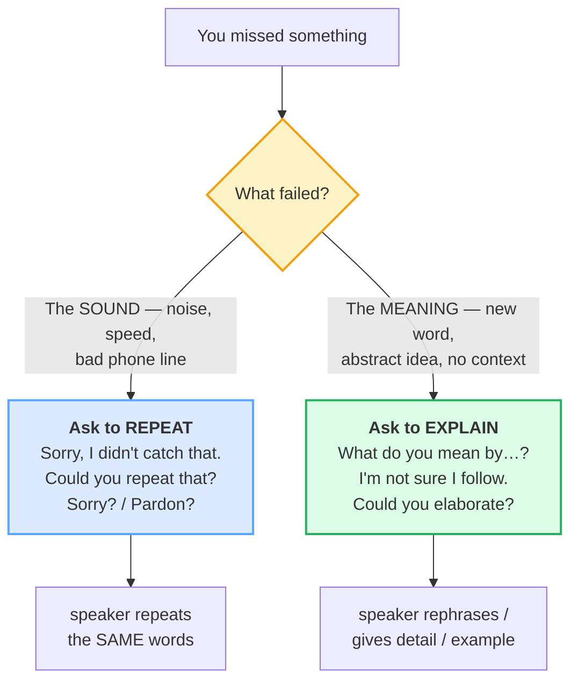

# Asking for Clarification

> **Phase 1 · speech_acts · bundle #19 · Days 37–38.**
> *"Sorry, I didn't catch that." / "What do you mean by…?"*
>
> 🔗 The **failure-path partner** of [CHECKING UNDERSTANDING](./CHECKING_UNDERSTANDING.md)
> (#18 — *Does that make sense?* is the speaker's check; *Sorry, I didn't catch
> that* is the listener's rescue). Builds on [INTERRUPTING](./INTERRUPTING.md)
> (#17 — *Sorry* is the same politeness particle, now fronting a repeat-request)
> and on [FINAL CONSONANTS](../pronunciation/FINAL_CONSONANTS.md) (the /tʃ/ in
> *catch*, the /t/ in *repeat*, the /st/ in *lost* — drop these and the
> clarification itself becomes unclear). Anticipates [EXPLAINING SIMPLY](../workplace/EXPLAINING_SIMPLY.md)
> (#43 — the speaker side that *triggers* these requests) and [SELF-CORRECTION](../capstone/SELF_CORRECTION.md)
> (#87 — *"Sorry, what I meant was…"*, the speaker's repair).

---

## Why this is bundle #19 (read this first)

Asking for clarification is the speech act a Vietnamese learner **most often
fails to perform** — not because the chunks are hard, but because performing them
**feels like a defeat**. In Vietnamese culture, to say *"tôi không hiểu"* ("I
don't understand") in front of a speaker is a **face loss on both sides**: the
listener looks incompetent, and the speaker is made to feel they explained
badly. So the Vietnamese listener's default rescue is the **smile-and-nod** —
*vâng / dạ* + a polite smile — which the L1 system reads as *"I'm following,
keep going."*

English runs on the **opposite assumption**. An English speaker who is
misunderstood and finds out **later** is far more annoyed than one interrupted
**now**. The face-saving move in English is the **early clarification**, not the
late reveal. Two predictable failures follow from the L1 mismatch:

1. **The learner fakes understanding.** They smile, nod, say *"Ah, yes,"* and the
   conversation moves on — until the misunderstanding surfaces five minutes
   later (or five days, in a work task). The fix is to **ask immediately**: the
   repeat-request (*Sorry, I didn't catch that*) for a hearing problem, the
   explain-request (*What do you mean by…?*) for a meaning problem.
2. **The learner reaches for *"What?"*** — the blunt transfer of the L1 *"cái
   gì?"* — which English hears as **rude or impatient**. The native repair is
   the **politeness-particle fronted** form: *Sorry?* / *Pardon?* / *Could you
   repeat that?* — the *sorry* does the face work that the L1 smile does silently.

This bundle splits the act in two — **repeat** (you didn't *hear*) vs **explain**
(you didn't *understand*) — because the chunks are different and the learner who
mixes them sounds confused. Own the split and you own the act.

---

## 1. The two halves of the act (one picture)

Clarification is **diagnosed before it is requested**. First decide: did the
sound not arrive (noise, speed, bad line), or did the meaning not land (new
word, abstract idea, missing context)? Then pick the chunk from the matching
half. Get the diagnosis wrong and you'll ask to *repeat* something you actually
need *explained* — and the speaker will just say it again, louder, and you'll
still be lost.

> From `clarifying_corpus.md` (the two halves, verbatim):
>
> - **Ask to repeat (hearing):** **Sorry, I didn't catch that.** /ˈsɒri aɪ
>   ˈdɪdnt kætʃ ðæt/ UK · /ˈsɑːri aɪ ˈdɪdnt kætʃ ðæt/ US, **Could you repeat
>   that?** /kʊd juː rɪˈpiːt ðæt/, **Sorry?** /ˈsɒri/ UK · /ˈsɑːri/ US,
>   **Pardon?** /ˈpɑːdn/ UK · /ˈpɑːrdn/ US
> - **Ask to explain (meaning):** **What do you mean by…?** /ˈwɒt duː juː ˈmiːn
>   baɪ/ UK · /ˈwɑːt duː juː ˈmiːn baɪ/ US, **I'm not sure I follow.** /aɪm nɒt
>   ʃɔːr aɪ ˈfɒləʊ/ UK · /aɪm nɑːt ʃʊr aɪ ˈfɑːləʊ/ US, **Could you elaborate?**
>   /kʊd juː ɪˈlæbəreɪt/

**The Vietnamese trap:** learners reach for *"What?"* (the L1 *"cái gì?"*
transfer) and use it for **both halves** — a hearing failure and a meaning
failure. But *"What?"* on its own is **blunt** in English; it sounds like a
challenge or impatience. The native repair always **fronts a politeness
particle** (*Sorry?*) or a **hedged modal** (*Could you…?*). Drill the fronted
forms until *"What?"* feels as bare to you as it does to a native ear.

---

## 2. Ask to repeat (the hearing half)

You didn't **hear** it — the sound was masked by noise, speed, or a bad line.
The request is for the speaker to **say the same words again**, not to rephrase.
Note the **register climb**: *Sorry?* is one-to-one fast; *Could you repeat
that?* is meeting / client speed.

| Register | Chunk | When |
|---|---|---|
| one-to-one, fast | **Sorry?** /ˈsɒri/ UK · /ˈsɑːri/ US (rising) | casual, peer, mid-conversation — the workhorse |
| one-to-one, fast (UK-leaning) | **Pardon?** /ˈpɑːdn/ UK · /ˈpɑːrdn/ US | chiefly British; slightly dated in US |
| neutral | **Sorry, I didn't catch that.** /ˈsɒri aɪ ˈdɪdnt kætʃ ðæt/ | the all-purpose, anywhere-safe repeat-request |
| neutral (alt.) | **Could you say that again?** /kʊd juː ˈseɪ ðæt əˈɡen/ | polite, slightly softer than *repeat* |
| slightly formal | **Could you repeat that?** /kʊd juː rɪˈpiːt ðæt/ | meeting / client / phone — the safe default |
| informal idiom | **Could you run that by me again?** /kʊd juː ˈrʌn ðæt baɪ miː əˈɡen/ | friendly, peer — "say/ explain it once more" |

> From `clarifying_corpus.md`:
>
> | Sorry, I didn't catch that. | Could you repeat that? |
> |---|---|
> | /ˈsɒri aɪ ˈdɪdnt kætʃ ðæt/ — "I didn't hear/understand what you said" | /kʊd juː rɪˈpiːt ðæt/ — "please say it again" |
>
> Oxford's *catch* entry attests the collocation verbatim: *"Sorry, I didn't
> quite catch what you said."* — the sense is "to hear or understand something."
> Oxford's *repeat* entry carries the verbatim example *"I'm sorry—could you
> repeat that?"* Note the **UK /ɒ/ vs US /ɑː/** split in *sorry* and *pardon*,
> and the /tʃ/ in *catch* — the TH-adjacent cluster Vietnamese often distorts.

**The Vietnamese trap:** the instinct is to say *"What?"* — a direct transfer of
the L1 *"cái gì?"* / *"gì?"*. In Vietnamese that is a normal clarification
request; in English it reads as **rude or impatient** (like *"What do you
want?"*). The fix is mechanical: **always front a politeness particle**. *Sorry?*
(one syllable) does 90% of the work; *Could you…?* does the rest. Train yourself
to hear bare *"What?"* as a warning buzzer.

---

## 3. Ask to explain (the meaning half)

You **heard** the words but the **meaning** didn't land — a new term, an
abstract idea, missing context. This is the harder half, because admitting it
feels like admitting ignorance. The native move is a **hedged request**: the
*not sure* / *could you* softens the admission, and the *by…* / *elaborate*
specifies exactly what to rephrase. The speaker then **rephrases or gives an
example** — different words, not the same ones louder.

| Chunk | Weight / tone |
|---|---|
| **What do you mean by…?** /ˈwɒt duː juː ˈmiːn baɪ/ UK · /ˈwɑːt duː juː ˈmiːn baɪ/ US | neutral, direct — the workhorse (pin a specific word after *by*) |
| **I'm not sure I follow.** /aɪm nɒt ʃɔːr aɪ ˈfɒləʊ/ UK · /aɪm nɑːt ʃʊr aɪ ˈfɑːləʊ/ US | hedged — "I'm losing the thread" (lets speaker re-route) |
| **Could you elaborate?** /kʊd juː ɪˈlæbəreɪt/ | slightly formal — meetings, written, client |
| **Sorry, you've lost me.** /ˈsɒri juːv lɒst miː/ UK · /ˈsɑːri juːv lɑːst miː/ US | informal idiom — "I stopped following" (peer / casual) |
| **I didn't quite catch what you meant by…** /aɪ ˈdɪdnt kwaɪt kætʃ wɒt juː ment baɪ/ | hedged — bridges repeat + explain (polite, careful) |

> From `clarifying_corpus.md`:
>
> - **What do you mean by…?** is the canonical explain-request, built from the
>   Oxford *mean* verb (sense 1: "to intend to say something") + the *by*
>   preposition. Pin a **specific word** after *by* (*What do you mean by
> 'scalable'?*) — a bare *"What do you mean?"* is blunter and can sound like a
>   challenge.
> - **I'm not sure I follow.** uses the Oxford *follow* sense "understand" —
>   the entry gives the verbatim *"Sorry, I don't follow."* / *"Do you follow
>   me?"* The *not sure* hedge is what makes it polite; *"I don't follow"* alone
>   is blunter.
> - **Could you elaborate?** is the Oxford *elaborate* verb (sense 1: "to
>   explain or describe something in a more detailed way"), example *"Let me
>   briefly elaborate on this."* Use in meetings / emails; *Could you elaborate
>   on…?* with a topic is the written form.

**The Vietnamese trap:** the learner who didn't understand often **says *"Yes"*
anyway** — the *vâng* reflex (see [CHECKING UNDERSTANDING](./CHECKING_UNDERSTANDING.md)
#18). The face-saving move in English is the **opposite**: ask early. A native
speaker who hears *"Could you elaborate on that last point?"* thinks *"good
question, they're engaged"* — not *"they're incompetent."* Asking is the
**competent** move; faking it is the one that loses face later.

🔗 The speaker who is **asked** to clarify has a different bundle:
[EXPLAINING SIMPLY](../workplace/EXPLAINING_SIMPLY.md) (#43) — *"Think of it
like…"* / analogy-first explanations — and [SELF-CORRECTION](../capstone/SELF_CORRECTION.md)
(#87) — *"Sorry, what I meant was…"*. This bundle is the **listener's** rescue;
those are the **speaker's** repair.

---

## 4. The paraphrase-check (the move learners skip)

Before asking the speaker to repeat, native listeners often **try to paraphrase
first** — *"So you mean…?"* — and let the speaker confirm or correct. This is
the move that proves engagement *and* pinpoints exactly where understanding
broke. It is the bridge between this bundle and [CHECKING UNDERSTANDING](./CHECKING_UNDERSTANDING.md)
#18 (the paraphrase-confirm half).

> From `clarifying_corpus.md` + `checking_understanding_corpus.md`:
>
> - **So, you mean…?** (paraphrase-check) — *"So you mean the whole meeting is
>   on Zoom?"* → speaker: *"Right."* / *"No — just the first hour."*
> - If the paraphrase is **right**, no repeat is needed. If **wrong**, the
>   speaker now knows exactly where you lost them and can target the repair.

**The Vietnamese trap:** learners skip the paraphrase-check and go straight to
*"I don't understand"* (too broad) or *"Yes"* (fake-it). The targeted
paraphrase-check is **more efficient** than either — it narrows the gap. Drill
it after the bare repeat/explain requests; it is the fluent listener's signature
move.

---

## 5. Cheat sheet — the ≤8 survival chunks

The Pareto set. Drill these eight aloud — four repeat-requests, four
explain-requests — until the **diagnosis** (hear vs understand) is automatic.
(Every row is a corpus attestation above.)

| # | Chunk | IPA | Half |
|---|---|---|---|
| 1 | **Sorry, I didn't catch that.** | /ˈsɒri aɪ ˈdɪdnt kætʃ ðæt/ UK · /ˈsɑːri aɪ ˈdɪdnt kætʃ ðæt/ US | repeat (hearing) |
| 2 | **Could you repeat that?** | /kʊd juː rɪˈpiːt ðæt/ | repeat (hearing) |
| 3 | **Sorry?** | /ˈsɒri/ UK · /ˈsɑːri/ US | repeat (fast) |
| 4 | **Could you run that by me again?** | /kʊd juː ˈrʌn ðæt baɪ miː əˈɡen/ | repeat (informal) |
| 5 | **What do you mean by…?** | /ˈwɒt duː juː ˈmiːn baɪ/ UK · /ˈwɑːt duː juː ˈmiːn baɪ/ US | explain (meaning) |
| 6 | **I'm not sure I follow.** | /aɪm nɒt ʃɔːr aɪ ˈfɒləʊ/ UK · /aɪm nɑːt ʃʊr aɪ ˈfɑːləʊ/ US | explain (hedged) |
| 7 | **Could you elaborate?** | /kʊd juː ɪˈlæbəreɪt/ | explain (formal) |
| 8 | **Sorry, you've lost me.** | /ˈsɒri juːv lɒst miː/ UK · /ˈsɑːri juːv lɑːst miː/ US | explain (informal) |

> Open [`clarifying.html`](./clarifying.html) to drill these as flip cards,
> hear native clips, play the quick-instruction role-play, shadow, and write a
> clarification email line.

---

## 6. Vietnamese → English L1 pitfalls table

The "expert payoff." These are the specific interference traps a Vietnamese
speaker hits on asking for clarification — extend, don't replace, the seed rows
from the spec.

| Vietnamese trap (what you do) | English fix (what to do instead) |
|---|---|
| **Fakes understanding to save face** — smiles, nods, says *"vâng / dạ"* (the L1 attention/deference token) instead of admitting they didn't follow; the misunderstanding surfaces later | Ask **immediately**. The face-saving move in English is the **early** clarification (*Sorry, I didn't catch that*), not the late reveal. Faking it loses *more* face later. |
| **Uses *"What?"*** (transfer of L1 *"cái gì?"*) as the all-purpose clarification — sounds **rude / impatient** in English | **Always front a politeness particle**: *Sorry?* (one syllable) or a hedged modal *Could you…?*. Treat bare *"What?"* as a warning buzzer — it reads as *"What do you want?"* |
| **Says *"Yes"* to look competent** when checked (*"Does that make sense?"* → *"Yes"* with a blank face) — the *vâng* reflex | The competent move is the **opposite**: *Not quite — could you elaborate on…?* Asking shows engagement; fake-yes shows the gap. 🔗 See [CHECKING UNDERSTANDING](./CHECKING_UNDERSTANDING.md). |
| **Skips the paraphrase-check** — goes straight to *"I don't understand"* (too broad) or *"Yes"* (fake) | Try a **targeted paraphrase-check** first: *So you mean…?* It narrows the gap and lets the speaker repair exactly the broken part — more efficient than a blanket *"what?"*. |
| **Mixes repeat and explain** — asks *"Could you repeat that?"* when the problem was the **meaning**, so the speaker just says it again (still unclear) | **Diagnose first**: hearing failure → *Sorry, I didn't catch that* (same words again); meaning failure → *What do you mean by…?* (different words / example). |
| **Reaches for *"Pardon?"* in US English** (learned from UK textbooks) — sounds stiff / dated to a US ear | *Pardon?* is **chiefly UK**. In US English, default to *Sorry?* or *Could you repeat that?*. Save *I beg your pardon?* for formal/UK contexts. |
| **Drops finals on the request itself** → *"Sorry, I didn't ca' that"* (no /tʃ/), *"Could you repea' that?"* (no /t/), *"you've lo' me"* (no /st/ cluster) | Release every final. The /tʃ/ in *catch*, the /t/ in *repeat*, the /st/ in *lost* carry the request's meaning. 🔗 Drill [FINAL CONSONANTS](../pronunciation/FINAL_CONSONANTS.md). |
| **Vietnamese /θ/ → /t/, /ð/ → /z/** in *catch* /kætʃ/ → "cetch"/"cak" and *that* /ðæt/ → "dat" | The /tʃ/ in *catch* is an affricate (t + sh), not a plain /t/. The /ð/ in *that* is TH — tongue-between-teeth. 🔗 See [TH SOUNDS](../pronunciation/TH_SOUNDS.md). |
| **Vietnamese /r/ (tap/trill) in *repeat* / *run*** instead of the English approximant | Drill the English /r/: tongue tip curled back, no trill. Spot-check against the YouGlish clip for *repeat*. |
| **Says *"What do you mean?"* with no *by…*** — blunter, can sound like a challenge or skepticism | Pin a **specific word** after *by*: *What do you mean by 'scalable'?* The *by* softens it and shows exactly what to rephrase. |
| **Asks *"Could you elaborate?"* in casual chat** (learned as "the polite phrase") → sounds overly formal among friends | Reserve *elaborate* for meetings / emails / client. In casual chat, use *What do you mean by…?* / *I'm not sure I follow*. |
| **Silence after the clarification request** — waits, frozen, afraid of looking incompetent | Own the request: say it, **then wait calmly**. The silence after a well-formed *Could you elaborate?* is the speaker's turn, not yours. |

---

## How to practise this bundle (the daily 20 min)

1. **READ** (5 min) — this guide, §1–§4 (the two halves, the repeat set, the
   explain set, the paraphrase-check).
2. **SHADOW** (7 min) — open `clarifying.html`, drill the 8 flip cards + the
   quick-instruction role-play **aloud**. Pay attention to the **diagnosis**:
   when you're Person B (listener), drill the repeat-request for the *moved-to-3*
   line, the explain-request for the *on-Zoom* line. Front every request with
   *Sorry* or *Could you*.
3. **PRODUCE** (8 min) — the writing task: write **one clarification email
   line** (*Could you elaborate on…* / *I'm not sure I follow*). Then flip and
   write the **repeat-request** version for the same situation (*Could you run
   that by me again?*) and feel the half flip.

---

## Sources

- Oxford Advanced Learner's Dictionary —
  https://www.oxfordlearnersdictionaries.com/definition/english/{word}
  (entries for *catch* [sense "hear/understand" → *"Sorry, I didn't quite catch
  what you said."*], *repeat* [example *"I'm sorry—could you repeat that?"*],
  *again*, *sorry* [example *"I'm terribly sorry. I didn't catch your name."*],
  *pardon_1* [exclamation → *Pardon?*], *pardon_2* [noun → *I beg your pardon*
  idiom "used to ask somebody to repeat what they have just said because you did
  not hear"], *run_2* [phrasal *run something by somebody* = "to explain or
  tell somebody something"], *mean_1* [verb sense 1], *follow* [sense
  "understand" → *"Sorry, I don't follow."*], *elaborate_2* [verb sense 1 →
  *"Let me briefly elaborate on this."*], *lose_1* [→ *you've lost me*]).
- Cambridge Advanced Learner's Dictionary —
  https://dictionary.cambridge.org/dictionary/english/{word}
  (cross-checked IPA for *sorry*, *catch*, *repeat*, *pardon*, *follow*,
  *elaborate*; idiom attestation for *run something by someone*).
- Pearson PTE Languages, *7 essential phrases for easier conversations in
  English* —
  https://www.pearson.com/languages/en-nz/community/blogs/phrases-for-easier-english-conversations-3-25.html
  (*Sorry, I didn't catch that* / *Could you say that again?* as repeat-request
  frames).
- Learn English Today, *Clarifying information: asking for clarification* —
  https://www.facebook.com/learnenglishtodayonline/posts/clarifying-information-asking-for-clarificationmore-useful-phrases-here/975051841503769/
  (*What do you mean by that?*, *Can you say that again?*, *Wait, can you run
  that by me again?* as a clarification set).
- English Language Learners Stack Exchange —
  https://ell.stackexchange.com/questions/101367/can-you-run-them-by-me-now
  (corroborates *run that by me again* = "to explain something to someone again;
  to say something to someone again").
- Wells, *Longman Pronunciation Dictionary* (via pronunciation-reference PDFs
  cited in the style anchor) — UK/US vowel splits for *sorry*, *pardon*,
  *follow*, *lose/lost*.
- Le, P. T. *Transnational Variation in Linguistic Politeness in Vietnamese*
  (VUIR) — https://vuir.vu.edu.au/17945/1/Phuc_Thien_Le.pdf
  (the *vâng / dạ* = attention/deference, not comprehension; smile-and-nod face
  strategy — the core *fake-it* pitfall).
- Vu (1997), *The Influence of Vietnamese Native Language and Culture* —
  https://core.ac.uk/download/pdf/216988808.pdf
  (Vietnamese learners avoid admitting non-understanding to save face;
  competence anxiety that blocks clarification requests).
- Nguyen et al., *A Pragmatic Study of Vietnamese Students' Apology Strategies*
  (Journal of Language Teaching and Research) —
  https://jltr.academypublication.com/index.php/jltr/article/download/10828/8885/34970
  (the Vietnamese face / politeness framework the *fake-it* + *What?*-transfer
  traps sit inside).
- Native audio: YouGlish — https://youglish.com/pronounce/{chunk}/english/us?
  (all links verified final HTTP 200 on 2026-06-23).
- Frequency methodology: wordfrequency.info (spoken sub-corpus) —
  https://www.wordfrequency.info/.
