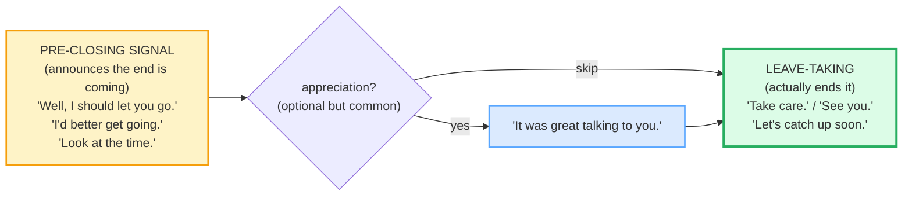

# Closing Conversations

> **Phase 1 · speech_acts · bundle #22 · Days 43–44.**
> *"I should let you go." / "Let's catch up soon."*
>
> 🔗 This bundle is the **exit door** — the mirror of
> [GREETINGS & INTROS](./GREETINGS_INTROS.md). Where that bundle teaches you to
> open, this one teaches you to close. It leans on
> [SMALL TALK](./SMALL_TALK.md) (you close after the chat has run its course)
> and previews [PHONE & VIDEO](./PHONE_VIDEO.md) (closings on calls are even
> more scripted). Later, [DISCOURSE MARKERS](../discourse/DISCOURSE_MARKERS.md)
> drills the *"Well…"* / *"Anyway"* pre-closing tokens used here.

---

## Why this is bundle #22 (read this first)

A Vietnamese speaker can open a conversation politely (after Phase 1 #11) and
keep it going (small talk, agreeing, checking understanding). But **how you
leave is what the other person remembers last.** Vietnamese L1 has two failure
modes at the exit:

1. **Too abrupt** — the learner simply stops talking and says *"bye"* or even
   just walks off. To a native ear this reads as rude, bored, or angry.
2. **Too prolonged** — the learner feels the abrupt exit is impolite, so they
   over-compensate with endless *"ok… so… yeah… ok… bye… bye… bye"*, looping
   the farewell.

Native English splits the difference with a **two-step close**: a
**pre-closing signal** ("I should let you go") that *announces* the end is
coming, then a **leave-taking** ("Take care") that actually ends it. This bundle
drills that two-step until it is automatic.

---

## 1. The mechanism: the two-step close

The single most important idea in this bundle. A native close is almost never
one turn — it is **signal → farewell**:

The pre-closing does **two jobs at once**: it warns the other person ("we're
wrapping up") *and* it offers them a graceful acceptance turn ("yeah, me too,
take care"). Skip it and the leave-taking lands like a door slamming.

> From `closings_corpus.md`:
>
> | "It's been great talking to you. I'll have to let you go now." |
> |---|
> | /ɪts biːn ɡreɪt ˈtɔː.kɪŋ tə juː. aɪl hæf tə let juː ɡəʊ naʊ/ |
>
> This verbatim pair is the **anchor attestation** of the two-step close —
> appreciation + polite release, back to back — from the Macmillan *In Company
> 3.0* Upper-Int phrase bank (Unit 1).

---

## 2. Pre-closing signals — "we're winding down"

These are the turns that **announce** the conversation is ending *before* the
goodbye. They are the chunk a Vietnamese learner most often skips.

| Chunk | When to use it | Pragmatic note |
|---|---|---|
| **Well, I should let you go.** | The other person seems busy, or you want to release them politely | Reframes *your* intent to leave as *consideration for them*. Pinned example. |
| **I'd better get going.** | You are the one who needs to leave | Owns the exit; informal. Cambridge `get going` = "to start to go or move." |
| **I won't keep you.** | The other person was doing you a favor / giving time | "I won't take up more of your time" — gracious. |
| **Look at the time.** | The hour is genuinely late; a soft, indirect exit | Idiomatic; the *time itself* is the excuse, not the speaker. |
| **Anyway,…** | Discourse marker that returns to / wraps the thread before closing | Almost always followed by a signal or farewell. |

> From `closings_corpus.md`:
>
> - **Well, I should let you go.** /wel aɪ ʃʊd let juː ɡəʊ/ UK · /wel aɪ ʃʊd let juː ɡoʊ/ US
> - **I'd better get going.** /aɪd ˈbet.ər ɡet ˈɡəʊ.ɪŋ/ UK · /aɪd ˈbet.ɚ ɡet ˈɡoʊ.ɪŋ/ US
> - **I won't keep you.** /aɪ wəʊnt kiːp juː/ UK · /aɪ woʊnt kiːp juː/ US
> - **Look at the time.** /lʊk ət ðə taɪm/

**The Vietnamese trap:** there is no obligatory pre-closing slot in casual
Vietnamese — you can signal the end with a tone shift or simply stop. In English
the pre-closing is *expected*; its absence reads as rudeness or boredom.

---

## 3. Leave-taking — the goodbye itself

These follow the pre-closing signal. Note the **register ladder**:

| Chunk | Register | Note |
|---|---|---|
| **Goodbye.** | Neutral → formal | The "safe default," but sounds stiff in casual speech. |
| **Take care.** | Warm, all-register | Cambridge: *"Bye, Melissa." "Goodbye Rozzie, take care."* |
| **See you. / See ya.** | Casual | Cambridge `see you (later)` = "goodbye." |
| **Talk to you later.** | Casual | Hints at future contact. |
| **Talk soon.** | Casual, warm | Shorter cousin of "talk to you later." |
| **It was great talking to you.** | Appreciation turn | Often *precedes* the farewell — the bridge between signal and goodbye. |
| **Let's catch up soon.** | Future-plan + farewell | Cambridge `catch up` = "to talk to someone you have not seen for a while." Pinned example. |

> From `closings_corpus.md`:
>
> - **Take care.** /teɪk keər/ US · /teɪk keə/ UK — Cambridge-attested verbatim
>   with *"Bye, Melissa." "Goodbye Rozzie, take care."*
> - **See you.** /ˈsiː juː/ · /ˈsiː.jə/ — Cambridge `see you (later)` = "goodbye."
> - **Let's catch up soon.** /lets kætʃ ʌp suːn/ — Cambridge `catch up` phrasal verb.

**The Vietnamese trap:** the word-level translation of *"tạm biệt"* is
*"goodbye"*, and learners default to it everywhere. But *"goodbye"* is **too
formal** for casual chat — natives say *"see you"*, *"take care"*, *"talk
soon"*. Using *"goodbye"* with a friend sounds distant or even final (as if you
will never meet again).

---

## 4. Pronunciation & delivery notes

- **Weak forms matter.** In *"I should let you go"*, the function words reduce:
  *should* → /ʃʊd/, *you* → /jə/ weak, *to* → /tə/. A word-by-word *"aɪ juː
  ʃʊd let juː tuː ɡoʊ"* sounds robotic. 🔗 Drill the weak forms in
  [SENTENCE STRESS](../pronunciation/SENTENCE_STRESS.md).
- **Linking.** *let you* → /letʃu/ or /let̬ju/ (American flap); *catch up* →
  /kæˈtʃʌp/ (the /tʃ/ glues to /ʌ/). 🔗 See [LINKING](../pronunciation/LINKING.md).
- **Final consonants.** *"great"* /ɡreɪt/ drops its /t/ at your peril —
  *"It was great talking to you"* with a missing /t/ sounds unfinished. 🔗 See
  [FINAL CONSONANTS](../pronunciation/FINAL_CONSONANTS.md).
- **Intonation.** Pre-closing signals fall at the end (*"I should let you
  go."* ↘); leave-takings can have a slight rise-warmth (*"Take care."* ↗↘).
  A flat *"take care"* reads as cold.
- **"Anyway" as a wrap marker.** Stress the first syllable: /ˈen.i.weɪ/. It is
  the most common discourse marker before a close.

---

## 5. Cheat sheet — the ≤8 survival chunks

The Pareto set. Drill these eight until the two-step close is automatic. (Every
row is a corpus attestation above.)

| # | Chunk | IPA | Why it's here |
|---|---|---|---|
| 1 | **I should let you go.** | /aɪ ʃʊd let juː ɡəʊ/–/ɡoʊ/ | the #1 polite pre-closing — pinned |
| 2 | **I'd better get going.** | /aɪd ˈbet.ər ɡet ˈɡəʊ.ɪŋ/ | owns your own exit; informal |
| 3 | **Look at the time.** | /lʊk ət ðə taɪm/ | indirect "it's late" exit |
| 4 | **It was great talking to you.** | /ɪt wəz ɡreɪt ˈtɔː.kɪŋ tə juː/ | the appreciation bridge |
| 5 | **Let's catch up soon.** | /lets kætʃ ʌp suːn/ | future-plan farewell — pinned |
| 6 | **Take care.** | /teɪk keər/–/teɪk keə/ | warm, all-register goodbye |
| 7 | **See you. / See ya.** | /ˈsiː juː/–/ˈsiː.jə/ | the casual default |
| 8 | **Talk soon.** | /tɔːk suːn/–/tɑːk suːn/ | short, warm, hints at next contact |

> Open [`closings.html`](./closings.html) to drill these as flip cards, hear
> native clips, play the role-play, shadow, and write.

---

## 6. Vietnamese → English L1 pitfalls table

The "expert payoff." These are the specific interference traps a Vietnamese
speaker hits when closing a conversation — extend, don't replace, the seed rows
from the spec.

| Vietnamese trap (what you do) | English fix (what to do instead) |
|---|---|
| **Skips the pre-closing** — stops and says *"bye"* abruptly, or just trails off | Always run **signal → farewell**. Lead with *"Well, I should let you go"* or *"Anyway, I'd better get going"* *before* the goodbye. |
| **Over-loops the farewell** — *"ok… ok… bye… bye… bye"* to avoid seeming rude | One signal + one farewell. Don't stack goodbyes; a single *"Take care"* then go. |
| **Defaults to *"goodbye"* everywhere** (word-for-word *"tạm biệt"*) | In casual chat use *"see you"*, *"take care"*, *"talk soon"*. Reserve *"goodbye"* for formal/neutral. |
| **Misses the appreciation turn** — never says *"It was great talking to you"* | Slot in the appreciation after the signal: *"Well, it was great talking to you. Take care."* |
| **Drops final consonants** → *"I should let you go"* sounds like *"I should leh you go"* | Release the /t/ in *let* and the /d/ in *should*. 🔗 [FINAL CONSONANTS](../pronunciation/FINAL_CONSONANTS.md). |
| **Flat intonation on *"take care"*** → reads as cold/dismissive | Add slight rise-warmth (↗↘); *"Take care."* is warm, not robotic. 🔗 [INTONATION](../pronunciation/INTONATION.md). |
| **Translates *"gặp lại sau"* as *"see you again"*** (stiff) | Native default is *"see you"* or *"see ya"*, not *"see you again"*. Cambridge glosses `see you (later)` = "goodbye." |
| **No discourse marker before close** (Vietnamese tone-shift does the job) | Use *"Well,…"* or *"Anyway,…"* as the audible wrap marker before the signal. |
| **Says *"I will go now"* (word-for-word *"tôi đi đây"*)** | Unidiomatic. Say *"I'd better get going"* or *"I should get going"* — the `get going` idiom is the native way. |
| **Forgets the future-plan closer** with friends — ends flat | Add *"Let's catch up soon"* / *"Talk soon"* to signal warmth + continuity. |

---

## How to practise this bundle (the daily 20 min)

1. **READ** (5 min) — this guide, §1–§3. Internalize the **two-step close**.
2. **SHADOW** (7 min) — open `closings.html`, drill the 8 flip cards + the
   role-play **aloud**, exaggerating the pre-closing signal before each
   farewell.
3. **PRODUCE** (8 min) — the writing task: write **one pre-closing line + one
   leave-taking line** for three different scenarios (a casual chat with a
   friend, a call with a colleague, leaving a party). Read them aloud; check
   each has the signal → farewell shape.

---

## Sources

- Cambridge Advanced Learner's Dictionary — https://dictionary.cambridge.org/dictionary/english/{word} (entries for *let, go, get, keep, look, at, time, anyway, talk, great, catch, up, soon, later, see, you, take, care, good, bye, should, better, now*)
- Cambridge `take care (of yourself)` — https://dictionary.cambridge.org/dictionary/english/take-care-of-yourself (sense "used when saying goodbye to someone"; verbatim example *"Bye, Melissa." "Goodbye Rozzie, take care."*)
- Cambridge `see you (later)` — https://dictionary.cambridge.org/dictionary/english/see-you-later (= "goodbye")
- Cambridge `catch up` (phrasal verb) — https://dictionary.cambridge.org/dictionary/english/catch-up
- Cambridge `get going/moving` (C2 informal) — https://dictionary.cambridge.org/dictionary/english/get ("to start to go or move: We'd better get moving or we'll be late.")
- Cambridge Grammar: "Greetings and farewells" — https://dictionary.cambridge.org/us/grammar/british-grammar/greetings-and-farewells-hello-goodbye-happy-new-year
- Oxford Advanced Learner's Dictionary — https://www.oxfordlearnersdictionaries.com/definition/english/care_1 (cross-check `take care`)
- Macmillan *In Company 3.0* Upper-Int, Unit 1 phrase bank — http://rdc-cdn.lms.macmillaneducation.com/wp-content/uploads/sites/9/2014/02/IC3_Upp-Int_Phrase-banks.pdf (verbatim two-step close: *"It's been great talking to you. I'll have to let you go now."*)
- Ask a Manager (2020), "How to politely end phone calls" — https://www.askamanager.org/2020/06/employee-wont-let-go-of-a-mistake-i-made-how-to-politely-end-phone-calls-and-more.html (glosses *"I should let you go"* as a polite closing signal)
- Native audio: YouGlish — https://youglish.com/pronounce/{chunk}/english/us?
- Frequency methodology: wordfrequency.info (spoken sub-corpus) — https://www.wordfrequency.info/
