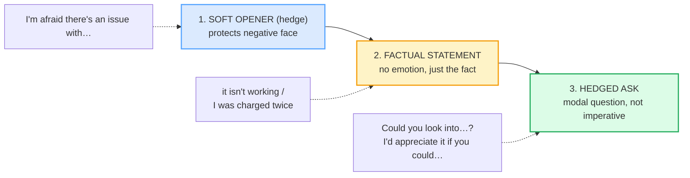
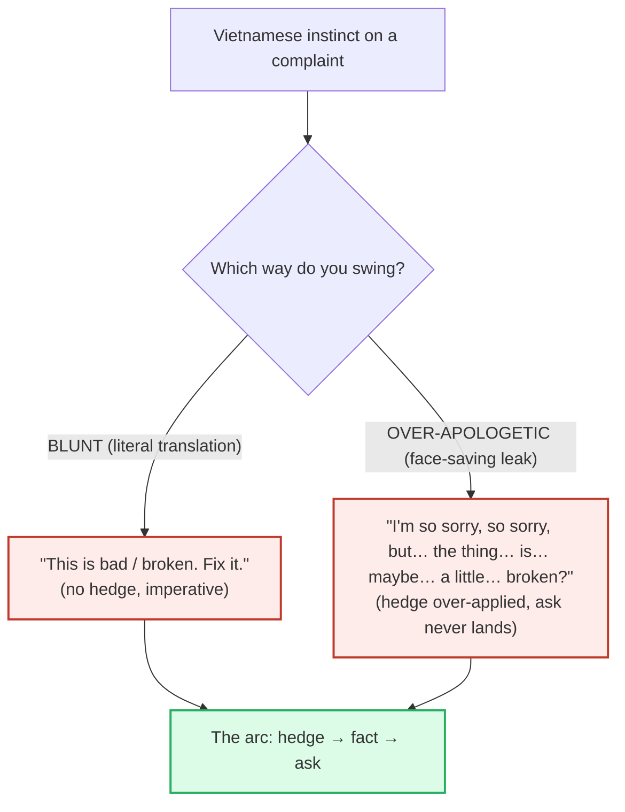

# Complaining Politely

> **Phase 1 · speech_acts · bundle #29 · Days 57–58.**
> *"I'm afraid there's an issue with…"*
>
> 🔗 Builds on [APOLOGIZING](./APOLOGIZING.md) (#14 — the agent half of this
> act: *I'm so sorry about that. I'll look into it.* is the standard response to
> a polite complaint) and on [REQUESTING & OFFERING](./REQUESTING_OFFERING.md)
> (#15 — *Could you…?* is the same modal-hedge, reused as a soft ask). Leans on
> [OPINIONS, HEDGED](./OPINIONS_HEDGED.md) (#20 — *seems to be / I'd say* are
> the same hedge family). Anticipates the written-mode upgrades
> [WRITTEN COMPLAINTS / DISPUTES](../writing/COMPLAINTS_WRITTEN.md) (#64, firm
> but factual, no emotion-leak) and [REQUESTS & REMINDERS](../writing/REQUESTS_REMINDERS.md)
> (#48, *Just a gentle nudge on…*). Pronunciation side:
> [FINAL CONSONANTS](../pronunciation/FINAL_CONSONANTS.md) (#01 — the /t/ in
> *sort this ou**t***, the /d/ in *afraid* — drop these and the complaint itself
> sounds broken).

---

## Why this is bundle #29 (read this first)

A complaint is, by definition, **a face-threatening act**. In Brown & Levinson's
politeness theory, complaining imposes on the hearer's **negative face** — their
"want to have their freedom of action unhindered." Unhedged, a complaint reads
as an attack. Vietnamese culture handles this threat two ways, and **both fail
in English**:

1. **Suppression to save face.** Vietnamese face-saving culture (*thể diện*)
   often **suppresses** a complaint entirely — swallow it, say nothing, avoid
   confrontation. The waiter never hears the food was cold; the seller never
   hears the product was wrong. In English service culture, **silence is not
   politeness** — the problem goes unfixed, the relationship stays stuck.
2. **Literal translation when forced.** When a Vietnamese learner *does*
   complain, the instinct is to translate *cái này hỏng rồi, sửa đi* almost
   word-for-word: **"this is broken, fix it."** That imperative, with no hedge,
   maximises the imposition on the hearer's negative face. It sounds blunt,
   aggressive, or childish to a native ear — even though the *intent* is neutral.

English threads this needle with a **three-move arc**: a **soft hedge opener**
(*I'm afraid there's an issue with…* / *There seems to be a problem with…*) → a
**factual statement of the problem** (*it isn't working / I was charged twice*) →
a **hedged request for resolution** (*Could you look into…?* / *I'd appreciate
it if you could…*). The hedge does the softening; the statement does the
reporting; the ask is a modal question, never an imperative. This bundle teaches
that arc as **three retrievable chunks**, not a feeling.

> From `complaining_politely_corpus.md` (the pinned must-have attestations):
>
> - **"I'm afraid there's an issue with…"** — Cambridge glosses *I'm afraid* as
>   *"used to politely introduce bad news or disagreement"*
>   (<https://dictionary.cambridge.org/dictionary/english/i-m-afraid>). IPA:
>   *afraid* /əˈfreɪd/, *issue* /ˈɪʃuː/.
> - **"There seems to be a problem with…"** — Cambridge documents the
>   impersonal *"there seems to be"* pattern for distancing a complaint from
>   blame (<https://dictionary.cambridge.org/dictionary/english/seem>). IPA:
>   *seem* /siːm/, *problem* /ˈprɒbləm/ UK · /ˈprɑːbləm/ US.

---

## 1. The three-move arc: hedge → fact → ask

The arc is the whole bundle in one picture. The **same complaint** ("my laptop
is broken") is delivered by three different chunks at three different moments.
Skip the opener → you sound aggressive. Skip the ask → you sound like you're
just venting. The arc is what makes the complaint **actionable and polite at
once**.

> From `complaining_politely_corpus.md` (the three moves, verbatim):
>
> - **Opener** → *I'm afraid there's an issue with…* / *There seems to be a
>   problem with…* / *I hate to bring this up, but…* / *I'm not entirely
>   satisfied with…*
> - **Fact** → *it isn't working* / *it hasn't arrived yet* / *I was charged
>   twice* / *there's a mistake on the invoice*
> - **Ask** → *Could you look into…?* / *Could you sort this out?* / *I'd
>   appreciate it if you could…*

**The Vietnamese trap:** learners collapse the arc into one move — the **bare
fact** ("this is broken, fix it") or the **bare ask** ("give me refund"). Both
skip the hedge, so both read as attacks. The fix is to **practise the arc as
three slots** you fill in sequence, every time.

---

## 2. Why *afraid* doesn't mean "scared" here

The single highest-value word in the bundle is **afraid**, and it is *not* the
emotion word. In *I'm afraid there's an issue with…*, **afraid** is a **hedge
marker** — a conventional signal meaning *"I'm sorry to have to say this, but…"*
Cambridge lists it separately from the emotion sense:

> From `complaining_politely_corpus.md`:
>
> | afraid (emotion) | I'm afraid… (hedge) |
> |---|---|
> | /əˈfreɪd/ — "feeling fear" | /əˈfreɪd/ — "used to politely introduce bad news or disagreement" |
> | *Don't be afraid.* | *There are no tickets left, I'm afraid.* |

The two share a spelling and an IPA; only the **function** differs. A Vietnamese
learner who knows only the emotion sense will hear *"I'm afraid there's an
issue…"* as *"I am terrified there is an issue"* — and will be afraid (emotion)
to use it. It is, in fact, the **most polite complaint opener in the language**,
and it is not scary at all.

🔗 The same hedge family — *afraid / seems to be / appears to be / I'd say* —
is drilled in [OPINIONS, HEDGED](./OPINIONS_HEDGED.md) (#20). Once you feel the
family, one member unlocks the rest.

---

## 3. The request half: modal questions, never imperatives

The third move is where Vietnamese learners most often break the arc. The L1
instinct (*sửa đi / đổi đi / trả tiền lại đi*) is **imperative** — a direct
command. English service complaints almost never use an imperative; they use a
**modal question** (*Could you…?*) or **conditional gratitude** (*I'd appreciate
it if you could…*). The reason is negative face again: an imperative *maximises*
the imposition; a modal question *minimises* it.

| L1 instinct (VN imperative) | English (hedged modal) | Why the difference |
|---|---|---|
| *Sửa đi.* → "Fix it." | **Could you fix it?** / **Could you look into it?** | imperative = max imposition; modal Q = redressive |
| *Đổi cái khác.* → "Give me another one." | **Could you replace it?** | same — modal Q protects the hearer's autonomy |
| *Trả tiền lại.* → "Refund me." | **Could I get a refund?** / **I'd appreciate a refund.** | noun-stress shift: *refund* (n) /ˈriːfʌnd/ vs (v) /rɪˈfʌnd/ |
| *Giải quyết nhanh lên.* → "Sort it out fast." | **Could you sort this out when you get a chance?** | + "when you get a chance" minimises the imposition further |

> From `complaining_politely_corpus.md`:
>
> | Could you look into…? | I'd appreciate it if you could… |
> |---|---|
> | /kʊd juː lʊk ˈɪntə/ UK · /kʊd juː lʊk ˈɪntuː/ US | /aɪd əˈpriːʃieɪt ɪt ɪf juː kʊd/ |
> | the standard soft ask (Cambridge *look into*) | conditional-gratitude hedge — strong but soft (Cambridge *appreciate*) |

**The Vietnamese trap:** the imperative feels *efficient* and *honest* in
Vietnamese. In English it feels *rude*. The modal question (*Could you…?*) feels
*roundabout* to a Vietnamese learner — but it is the **single most important
redressive move** in the bundle. Drill *Could you…?* until it is automatic.

---

## 4. The two failure modes: blunt vs. over-apologetic

Vietnamese learners of English swing between **two opposite errors** on
complaints. Naming them is the first step to fixing them:

1. **Blunt.** *Cái này hỏng rồi, sửa đi* → *"This is broken, fix it."* No hedge,
   imperative ask. The hearer's negative face takes the full hit. Reads as
   aggressive or childish. **Fix:** prepend *I'm afraid there's an issue with…*
   and convert the ask to *Could you…?*
2. **Over-apologetic / passive-aggressive.** Face-saving culture leaks out as
   **excessive apology on the wrong side** — *"I'm so sorry to bother you, I
   really am, but the thing is, it might possibly be, you know, a little bit not
   working?"* The complaint never lands; the ask is buried. Reads as
   passive-aggressive (the hearer feels blamed *through* the apology). **Fix:**
   cut the apology (it isn't yours to make), state the fact plainly, make the
   ask explicitly.

> From `complaining_politely_corpus.md`:
>
> The middle path is the arc: **"I'm afraid there's an issue with [the laptop] —
> it isn't working. Could you look into it?"** One hedge, one fact, one modal
> ask. No emotion adjective, no apology for a fault that isn't yours.

🔗 The over-apologetic failure is the mirror of
[APOLOGIZING](./APOLOGIZING.md) #14 — there, the apology is *yours* because the
fault is yours. Here, the fault is *the seller's*, so the apology is theirs
(*I'm so sorry about that. I'll look into it.*). Don't steal their line.

---

## 5. Cheat sheet — the ≤8 survival chunks

The Pareto set. Drill these eight aloud until the arc is automatic. (Every row
is a corpus attestation above.)

| # | Chunk | IPA | Why it's here |
|---|---|---|---|
| 1 | **I'm afraid there's an issue with…** | /aɪm əˈfreɪd ðeəz ən ˈɪʃuː wɪð/ UK · /aɪm əˈfreɪd ðerz ən ˈɪʃuː wɪð/ US | the #1 polite complaint opener (pinned) |
| 2 | **There seems to be a problem with…** | /ðeə ˈsiːmz tə biː ə ˈprɒbləm wɪð/ UK · /ðer ˈsiːmz tə biː ə ˈprɑːbləm wɪð/ US | distancing hedge — no blame (pinned) |
| 3 | **I hate to bring this up, but…** | /aɪ heɪt tə brɪŋ ðɪs ʌp bʌt/ | reluctant-opener (awkward / colleague context) |
| 4 | **I'm not entirely satisfied with…** | /aɪm nɒt ɪnˈtaɪəli ˈsætɪsfaɪd wɪð/ UK · /aɪm nɑːt ɪnˈtaɪərli ˈsætɪsfaɪd wɪð/ US | hedged dissatisfaction (formal / written) |
| 5 | **it isn't working** | /ɪt ˈɪznt ˈwɜːkɪŋ/ UK · /ɪt ˈɪznt ˈwɜːrkɪŋ/ US | factual statement (no emotion) |
| 6 | **Could you look into…?** | /kʊd juː lʊk ˈɪntə/ UK · /kʊd juː lʊk ˈɪntuː/ US | the soft ask (modal, not imperative) |
| 7 | **I'd appreciate it if you could…** | /aɪd əˈpriːʃieɪt ɪt ɪf juː kʊd/ | conditional-gratitude ask (strong but soft) |
| 8 | **Could you sort this out?** | /kʊd juː sɔːt ðɪs aʊt/ UK · /kʊd juː sɔːrt ðɪs aʊt/ US | resolve it (informal but common) |

> Open [`complaining_politely.html`](./complaining_politely.html) to drill these
> as flip cards, hear native clips, play the customer-service role-play, shadow,
> and write the polite complaint email opener.

---

## 6. Vietnamese → English L1 pitfalls table

The "expert payoff." These are the specific interference traps a Vietnamese
speaker hits on complaining politely — extend, don't replace, the seed rows from
the spec.

| Vietnamese trap (what you do) | English fix (what to do instead) |
|---|---|
| **Suppresses the complaint to save face** (VN *thể diện* culture → say nothing, swallow it) → the problem never gets fixed | In English service culture, **silence is not politeness**. Use the arc: hedge → fact → ask. A polite complaint is *expected*, not rude. |
| **Literal translation of the imperative** → *"This is broken, fix it"* / *"Give me refund"* (from *cái này hỏng rồi, sửa đi*) | Convert to the modal question: *"Could you fix it?"* / *"Could I get a refund?"* The imperative maximises the imposition; the modal minimises it. |
| **Swings blunt OR over-apologetic** — no middle gear | Practise the **arc** as three slots (§1, §4): one hedge, one fact, one modal ask. Never bare fact; never apology-buried ask. |
| **Over-apologises for a fault that isn't theirs** → *"I'm so sorry, so sorry, but… maybe… it is a little broken?"* (face-saving leak) → reads passive-aggressive | Cut the apology (the fault is the seller's). State the fact plainly: *"I'm afraid there's an issue with… it isn't working."* Let the *agent* apologise. |
| **Drops the hedge entirely** → *"There is a problem with this."* (sounds like an accusation) | Keep the hedge slot filled: *"There **seems to be** a problem…"* / *"**I'm afraid** there's an issue…"* The hedge is what makes it a complaint, not an attack. |
| **/θ/ → /t/ or /d/** on *there's* → *"dere's an issue"* | Tongue-between-teeth for /ð/ in *there's* /ðeəz/. 🔗 Drill [TH SOUNDS](../pronunciation/TH_SOUNDS.md). |
| **/ʃ/ → /s/** on *issue* → *"iss-yoo"* (Vietnamese has no /ʃ/) | Drill *issue* /ˈɪʃuː/ with the blade raised toward the palate. Minimal pair: *issue* /ˈɪʃuː/ vs *his use* /hɪz juːz/. |
| **Drops final /t/ in *sort this out*** → *"sort this ou"* | Release the final /t/ in *out*. 🔗 Drill [FINAL CONSONANTS](../pronunciation/FINAL_CONSONANTS.md) — the /t/ in *ou**t*** closes the request. |
| **Stress-shift on *refund* ignored** → *"I want a re-FUND"* (verb stress on a noun) | Noun: **REFUND** /ˈriːfʌnd/ ("I'd like a refund."); verb: re-**FUND** /rɪˈfʌnd/ ("Could you refund me?"). The shift is meaning-bearing. |
| **Uses *very bad / terrible / disgusting* as emotion adjectives** → *"This food is very bad!"* (sounds like a child's tantrum) | State the **fact**, not the feeling: *"This isn't warm."* / *"It hasn't arrived."* English service complaints are remarkably flat in tone — the hedge softens, the adjective is redundant. |
| **Confuses *problem* and *issue*** register → uses *problem* in every slot | *Issue* is softer/more diplomatic (modern business default); *problem* is more direct. Both are fine; *issue* is the safer hedge-word. |

---

## How to practise this bundle (the daily 20 min)

1. **READ** (5 min) — this guide, §1–§4 (the arc, *afraid* as hedge, modal asks,
   the two failure modes).
2. **SHADOW** (7 min) — open `complaining_politely.html`, drill the 8 flip cards
   + the customer-service role-play **aloud**, exaggerating the hedge on the
   opener and the modal on the ask, then relaxing.
3. **PRODUCE** (8 min) — the writing task: write **1 polite complaint email
   opener** (*I'm afraid there's an issue with…*). Then convert a blunt L1
   complaint (*"this is broken, fix it"*) into the full arc (hedge → fact → ask)
   and feel the climb.

---

## Sources

- Cambridge Advanced Learner's Dictionary —
  https://dictionary.cambridge.org/dictionary/english/{word} and
  https://dictionary.cambridge.org/pronunciation/english/{word}
  (entries/pronunciation for *afraid, i'm afraid, seem, sorry, satisfied,
  entirely, issue, problem, work, arrive, charge, mistake, look into, sort out,
  refund, appreciate, bring up*).
- Cambridge Learner's Dictionary —
  https://dictionary.cambridge.org/dictionary/learner-english/appreciate
  (/əˈpriːʃieɪt/).
- Oxford Advanced Learner's Dictionary —
  https://www.oxfordlearnersdictionaries.com/definition/english/issue_1
  (*issue* /ˈɪʃuː/ BrE/AmE; /ˈɪsjuː/ acceptable variant).
- Brown, P. & Levinson, S. *Politeness: Some Universals in Language Usage*
  (1987) — the face-threatening-act framework; **negative face** =
  "the want of every competent adult member that his actions be unimpeded by
  others." PDF via MPG.PuRe —
  https://pure.mpg.de/rest/items/item_64421/component/file_2225570/content
- Politeness theory overview — https://en.wikipedia.org/wiki/Politeness_theory
- *Linguistic Hedging in the Light of Politeness Theory* (European Proceedings) —
  https://www.europeanproceedings.com/article/10.15405/epsbs.2018.04.02.98
- ASCD, *Face-Threatening Acts and Politeness Theory* (Roberts, 1992) —
  https://files.ascd.org/staticfiles/ascd/pdf/journals/jcs/jcs_1992spring_roberts.pdf
- Miles, A. D. *100 Ways to Say It in Business English* —
  https://andymiles.com/wp-content/uploads/2024/11/100-ways-to-say-it-November-2024-Ready.pdf
  (*"I hate to bring this up, but…"*, *"I'm not entirely satisfied with…"*).
- *Skills for the TOEIC Test Speaking and Writing* —
  https://www.scribd.com/document/499411680/Skills-for-the-TOEIC-Test-Speaking-and-Writing
  (*"I'm afraid there's a problem with…"* + *"I'll look into it immediately"*).
- *Speak English 30 Days to Better English* (FIMSSchools phrasebook) —
  https://download.fimsschools.com/ebooks/Speak%20English%2030%20Days%20to%20Better%20English.pdf
- *Business Plus: TOEIC Student's Book 2* —
  https://www.scribd.com/document/749623151/business-plus-2
- Le, P. T. *Transnational Variation in Linguistic Politeness in Vietnamese*
  (VUIR) — https://vuir.vu.edu.au/17945/1/Phuc_Thien_Le.pdf
  (VN face-saving suppresses direct complaints; English redresses the FTA with
  hedges instead of silence).
- Vu (1997), *The Influence of Vietnamese Native Language and Culture* —
  https://core.ac.uk/download/pdf/216988808.pdf
  (the literal-translation trap: *cái này hỏng rồi, sửa đi* → *"this is broken,
  fix it"*).
- Native audio: YouGlish — https://youglish.com/pronounce/{chunk}/english/us?
  (all links verified final HTTP 200 on 2026-06-23).
- Frequency methodology: wordfrequency.info (spoken sub-corpus) —
  https://www.wordfrequency.info/.
