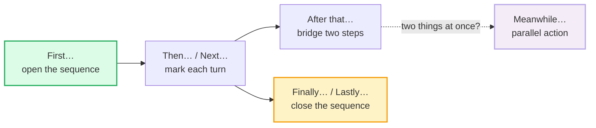

# Describing Processes / How-to

> **Phase 1 · speech_acts · bundle #26 · Days 51–52.**
> *"'First you…, then…, make sure to…'"*
>
> 🔗 Builds on the discourse-marker habits from
> [TOPIC TRANSITIONS](./TOPIC_TRANSITIONS.md) (sequencers are a sub-class of
> ordering discourse marker) and the final-consonant drill from
> [FINAL CONSONANTS](../pronunciation/FINAL_CONSONANTS.md) — `next` /nekst/,
> `lastly` /ˈlɑːstli/ live or die on their released finals. Fore-shadows the
> meeting-room signposting in [SHORT PRESENTATIONS](../workplace/SHORT_PRESENTATIONS.md)
> (Phase 2) and the written-procedure genres in Phase 3.

---

## Why this bundle (read this first)

Asking *"how do I…?"* and getting a wall of equally-weighted clauses is
exhausting to follow. The single skill that makes a how-to **intelligible** is
**signposting the order**: open with `First…`, mark each turn with `Then…` /
`Next…`, close with `Finally…`. This is not vocabulary — it is **load
management**. The sequencers carry the listener's working memory so the content
words don't have to.

Two things make this hard for a Vietnamese learner specifically:

1. **Vietnamese marks order lightly** — `đầu tiên` (first), `sau đó` (after
   that), `cuối cùng` (finally) exist but are *optional* and often dropped,
   because Vietnamese relies on context and clause order. Carry that habit into
   English and your steps blur into one run-on.
2. **Vietnamese has no imperative mood** and no tense morphology — an
   instruction is just a bare verb ("lấy trứng" = "take the egg"), which a
   learner translates as *"you take the egg"* or over-formalizes to *"one must
   first take the egg."* Neither sounds like a native how-to.

This bundle installs the **sequencer spine** + the **instruction chunks**
(`Make sure to…`, `Be careful not to…`) and the **register split** (spoken
`First, you…` vs written `The first step is…`).

---

## 1. The sequencer spine

A process is a list with an order. The sequencers are the **numbering**. Here is
the full set, in the order they appear in a typical spoken how-to:

> From `describing_processes_corpus.md` (the spine, verbatim):
>
> - **First…** /fɜːst/ UK · /fɜːrst/ US — "the step that begins the sequence"
> - **Then…** /ðen/ — "the step that follows (no fixed count)"
> - **Next…** /nekst/ — "the following step in an order"
> - **After that…** /ˈɑːftə ðæt/ UK · /ˈæftər ðæt/ US — "once the previous step is done"
> - **Meanwhile…** /ˈmiːnwaɪl/ — "at the same time / while that happens"
> - **Finally…** /ˈfaɪnəli/ — "the step that ends the sequence"
> - **Lastly…** /ˈlɑːstli/ UK · /ˈlæstli/ US — "the last item in a list"

**The rule of thumb:** `First` opens, `Finally`/`Lastly` closes, and the middle
is any mix of `Then`/`Next`/`After that`. `Then` is the **default spoken**
middle marker (shortest, most frequent); `Next` is slightly more deliberate
(good when each step deserves a beat); `After that` explicitly bridges two
linked steps. `Meanwhile` is the **only** sequencer that signals *parallel*
action — use it when two things happen at once ("*Meanwhile*, preheat the oven").

`Finally` vs `Lastly` is a real split, documented verbatim in Cambridge Grammar:
`Finally` ends a **process** (after effort/difficulty); `Lastly` ends a **list**
(the last item you're enumerating).

> From `describing_processes_corpus.md`:
>
> | Finally… | Lastly… |
> |---|---|
> | /ˈfaɪnəli/ — ends a process ("after a long time") | /ˈlɑːstli/ — ends a list ("the last item") |
>
> Cambridge Grammar attests: *Finally* → "There were no taxis and we **finally**
> got home at 2 pm." *Lastly* → "We need eggs, milk, sugar, bread and,
> **lastly**, we mustn't forget yoghurt for Dad."

---

## 2. The instruction chunks (care, warning, precondition)

Sequencers only mark *order*. Real how-tos also need to flag **what to be
careful about** and **what you must do before continuing**. These five chunks do
that — and they are the ones a Vietnamese learner most often drops, because
Vietnamese expresses caution by tone/context rather than a fixed chunk.

| Chunk | Job | When to use it |
|---|---|---|
| **Make sure to…** | emphasise a step that's easy to skip | before a step that, if missed, breaks everything |
| **Be careful not to…** | warn off a common mistake | before a step with a frequent error |
| **Once you've done that…** | bridge: previous step must finish first | when step B depends on step A being complete |
| **The next step is…** | name the following step (formal/written) | written procedures, formal instructions |
| **You'll need to…** | list prerequisites / what to gather | at the very start, before "First…" |

> From `describing_processes_corpus.md` (verbatim):
>
> - **Make sure to…** /ˌmeɪk ˈʃʊə(r) tə/ UK · /ˌmeɪk ˈʃʊr tə/ US — Cambridge
>   idiom `make sure`, "to take special care to do something"; attested
>   "**Make sure to** tell them I said 'hi.'"
> - **Be careful not to…** /bi ˈkeəfəl nɒt tə/ UK · /bi ˈkerfəl nɑːt tə/ US —
>   `careful` /ˈkeəfəl/–/ˈkerfəl/ (Cambridge) + warning.
> - **Once you've done that…** /wʌns juːv dʌn ðæt/ — `once` (Cambridge
>   conjunction "as soon as / when").
> - **The next step is…** /ðə nekst step ɪz/ — formal/written step naming.
> - **You'll need to…** /juːl niːd tə/ — prerequisite setup.

**The pattern to drill:** `First you [verb]. Then [verb]. Make sure to [verb].
Once you've done that, [verb]. Finally, [verb].` That skeleton carries any
how-to from boiling an egg to deploying an app.

---

## 3. Spoken how-to vs written how-to (the register split)

The **same** sequence changes skin between speech and writing. The trap for a
Vietnamese learner is to use **only one register everywhere** — stiff written
forms in casual speech ("one must first…", "the subsequent step is…"), or loose
spoken forms in a formal manual. Both mark you instantly as non-native.

| | Spoken how-to (casual, app/cooking help) | Written how-to (recipe, manual, procedure) |
|---|---|---|
| Step opener | `First, you…` / `Then…` (imperative + `you`) | `The first step is…` / `Step 1:` (noun phrase) |
| Sequencer weight | light: `then`, `next`, `after that` | heavier: `firstly`, `subsequently`, `finally` |
| Mood | bare imperative: `Mix it.`, `Tap here.` | passive or 3rd-person: `The mixture is stirred.` |
| Closing | `…and that's it.` / `Finally…` | `Lastly…` / `In conclusion…` |

> From `describing_processes_corpus.md`:
>
> | First, you… (spoken) | The first step is… (written) |
> |---|---|
> | /fɜːst juː/ — informal, addressee = "you" | /ðə fɜːst step ɪz/ — formal, names the step |
>
> Cambridge Grammar (*First, firstly or at first*): "We often use *first*,
> especially in writing, to show the order of the points we want to make." In
> **speech**, the bare `First, you…` is default; `Firstly`/`The first step is…`
> is the **written** climb in formality.

🔗 The written register is the bridge to [SHORT PRESENTATIONS](../workplace/SHORT_PRESENTATIONS.md)
(Phase 2) — meeting signposting is exactly this formal sequencer set under load.

---

## 4. Pronunciation / delivery notes

- **`Then` /ðen/** — the voiced /ð/ is a Vietnamese trap (/ð/ → /z/ or /d/). Keep
  the tongue between the teeth. 🔗 [TH SOUNDS](../pronunciation/TH_SOUNDS.md).
- **`Next` /nekst/** — the final cluster /kst/ is exactly the structure
  Vietnamese has no slot for; it blurs to "nes" or "next-uh". Hold the cluster
  tight, release the /t/. 🔗 [FINAL CONSONANTS](../pronunciation/FINAL_CONSONANTS.md).
- **`Lastly` /ˈlɑːstli/** — the /stl/ cluster + the released /li/ ending; a
  dropped /t/ turns it into "lasly" and the listener loses the list-closing cue.
- **`Finally` /ˈfaɪnəli/** — stress on **FI**; the weak `/nəli/` must stay light
  (not "FI-nal-lee"). Stress-timed rhythm: one strong beat, three weak.
- **`Make sure`** — link the /k/ of `make` into `sure`: /meɪk‿ʃʊə(r)/. The /k/
  is the joint Vietnamese learners drop, producing "may-sure".

---

## 5. Cheat sheet — the ≤8 survival chunks

The Pareto set. Drill these eight aloud until every sequencer and every released
final is audible. (Every row is a corpus attestation above.)

| # | Chunk | IPA | Why it's here |
|---|---|---|---|
| 1 | **First…** | /fɜːst/ UK · /fɜːrst/ US | opens the sequence — the anchor the listener grabs |
| 2 | **Then…** | /ðen/ | default spoken middle marker (shortest, most frequent) |
| 3 | **Next…** | /nekst/ | deliberate middle marker; /kst/ cluster is a VN trap |
| 4 | **After that…** | /ˈɑːftə ðæt/ UK · /ˈæftər ðæt/ US | explicit bridge between two linked steps |
| 5 | **Finally…** | /ˈfaɪnəli/ | closes a process — stress on FI, weak /nəli/ |
| 6 | **Make sure to…** | /ˌmeɪk ˈʃʊə(r) tə/ UK · /ˌmeɪk ˈʃʊr tə/ US | emphasise a can't-skip step |
| 7 | **Be careful not to…** | /bi ˈkeəfəl nɒt tə/ UK · /bi ˈkerfəl nɑːt tə/ US | warn off a common mistake |
| 8 | **Once you've done that…** | /wʌns juːv dʌn ðæt/ | bridge: "previous step must finish first" |

> Open [`describing_processes.html`](./describing_processes.html) to drill these
> as flip cards, hear native clips, play the role-play, shadow, and write.

---

## 6. Vietnamese → English L1 pitfalls table

The "expert payoff." These are the specific interference traps a Vietnamese
speaker hits when describing a process — extend, don't replace, the seed rows
from the spec.

| Vietnamese trap (what you do) | English fix (what to do instead) |
|---|---|
| **Drops sequencers** — VN `đầu tiên`/`sau đó`/`cuối cùng` are optional, so you carry the habit into English and your steps blur into a run-on | Force a sequencer on **every** step: `First… Then… Next… Finally…`. Even redundant sequencing beats none — the listener needs the scaffolding. |
| **No imperative mood** — VN instruction is a bare verb ("lấy trứng"), so you say *"you take the egg"* (statement) or *"one must take the egg"* (over-formal) | Use the **bare imperative**: `Take the egg.`, `Mix it.`, `Tap here.` Drop the subject in spoken how-to — `you` is implied, not named every time. |
| **Article/number errors in steps** — *"take egg"*, *"add two spoon of sugar"* | Enforce articles + plural: `Take **an** egg.`, `Add **two spoons** of sugar.` Plural the count noun; `a/an` for one, the count for many. |
| **Unclear ordering** — clauses chained with "and" so the listener can't tell which step is when | Number with sequencers, not `and`. `First…, then…, after that…` — never `…and…, and…, and…` for a sequence. |
| **Over-formal register** — *"Firstly, one is required to…", "The subsequent step ought to be…"* in casual speech | Match the spoken default: `First, you…`, `Then…`, `Finally…`. Save `Firstly`/`The next step is…` for **written** procedures. 🔗 §3. |
| **`then` /ðen/ → "den" or "zen"** — /ð/ has no VN equivalent, so it maps to /d/ or /z/ | Tongue-between-teeth for /ð/. Minimal pair: `then` /ðen/ vs `den` /den/. 🔗 [TH SOUNDS](../pronunciation/TH_SOUNDS.md). |
| **`next` /nekst/ → "nes" or "next-uh"** — the /kst/ cluster is dropped or opened with a schwa | Hold the cluster tight; release only the /t/: /neks**t**/. No trailing vowel. 🔗 [FINAL CONSONANTS](../pronunciation/FINAL_CONSONANTS.md). |
| **`Finally` /ˈfaɪnəli/ → "FI-nal-lee"** — three equal stresses (syllable-timed VN rhythm) | Stress only **FI**; keep `/nəli/` light and quick. English is stress-timed — one strong beat carries the word. |
| **`Meanwhile` /ˈmiːnwaɪl/ omitted** — VN marks parallel action by context, not a word | Use `Meanwhile…` any time two things happen at once. It's the **only** sequencer that flags parallel action. |
| **No tense on instruction verbs** — VN has no tense, so `"First you open, then you wait"` can drift into `"First you opened, then you waited"` (past) | Instructions use the **bare imperative / present** — no past tense. `Open it.`, `Wait five minutes.`, not `Opened it.` |

---

## How to practise this bundle (the daily 20 min)

1. **READ** (5 min) — this guide, §1–§3.
2. **SHADOW** (7 min) — open `describing_processes.html`, drill the 8 flip cards
   + the role-play **aloud**, marking every sequencer with a tiny pause.
3. **PRODUCE** (8 min) — the writing task: write **5 sequenced steps** for a
   simple process you know (a recipe, an app flow, your morning routine). Open
   with `First…`, mark each turn, close with `Finally…`. Add one `Make sure to…`
   and one `Be careful not to…`. Read it aloud, recording yourself; check every
   sequencer is audible.

---

## Sources

- Cambridge Advanced Learner's Dictionary — https://dictionary.cambridge.org/dictionary/english/{word} (entries for *then, next, after, meanwhile, careful, once, step, need, first*)
- Cambridge idiom `make sure` — https://dictionary.cambridge.org/dictionary/english/make-sure ("to take special care to do something"; "Make sure to tell them I said 'hi.'")
- Cambridge Grammar (*English Grammar Today*) — *First, firstly or at first?* — https://dictionary.cambridge.org/us/grammar/british-grammar/first-firstly-or-at-first
- Cambridge Grammar (*English Grammar Today*) — *Finally, at last, lastly or in the end?* — https://dictionary.cambridge.org/us/grammar/british-grammar/finally-at-last-lastly-or-in-the-end
- Cambridge Grammar (*English Grammar Today*) — *Imperative clauses (Be quiet!)* — instruction-mood reference.
- Oxford Advanced Learner's Dictionary — https://www.oxfordlearnersdictionaries.com/definition/english/once_1 (conjunction sense of `once`).
- L1 phonology — Nguyen, "The systematic reduction of English syllable-final consonants" (GMU Linguistics Club) — https://orgs.gmu.edu/lingclub/WP/texts/6_Nguyen.pdf
- L1 phonology — "Vietnamese Phonology: A Complete Guide" (Remitly) — https://www.remitly.com/blog/education/vietnamese-phonology-guide/
- Native audio: YouGlish — https://youglish.com/pronounce/{chunk}/english/us?
- Frequency methodology: wordfrequency.info (spoken sub-corpus) — https://www.wordfrequency.info/
