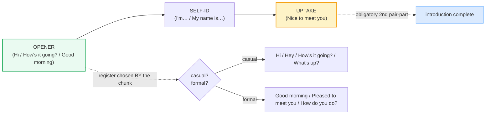

# Greetings & Introductions

> **Phase 1 · speech_acts · bundle #11 · Days 21–22.**
> *Casual + formal openings; "How's it going?" vs "Pleased to meet you."*
>
> 🔗 Built on Phase 0. To sound native on these chunks you also need
> [LINKING](../pronunciation/LINKING.md) ("How's_it_going?" glues consonant to
> vowel), [REDUCTIONS](../pronunciation/REDUCTIONS.md) ("Nice_tə_meet_yə"), and
> [FINAL CONSONANTS](../pronunciation/FINAL_CONSONANTS.md) (release the /t/ in
> *meet* or the uptake is lost). Next in Phase 1:
> [SMALL TALK](./SMALL_TALK.md) — these openers are the first 5 seconds; small
> talk is the next 5 minutes.

---

## Why this is bundle #11 (read this first)

You already "know" *hello*. The problem is that a Vietnamese learner's
*hello* sounds like a textbook, not a native. Real English greetings are
**chunks** — fixed multi-word strings retrieved as one unit (`How's it
going?`, `Nice to meet you`) — and they carry **register** in the choice of
chunk itself, not in extra politeness words. Two things break this for a
Vietnamese L1 speaker:

1. **Vietnamese encodes social hierarchy in the pronoun** (*anh/chị/em/,
   thầy/cô, ông/bà…*). You cannot greet anyone in Vietnamese without first
   placing them on the age/status ladder. **English drops the ladder.** `Hi`,
   `How's it going?`, and `How do you do?` all work for a CEO and a child —
   the *chunk* itself signals the register, not the pronoun. Learners freeze
   because the ladder they reflexively reach for is gone.
2. **Vietnamese "greetings" double as real questions** ("Anh đi đâu đấy?" =
   "Where are you going?" is a normal friendly greeting). Literal-translated
   into English, "Where are you going?" is **intrusive**, not friendly. And
   the Vietnamese literal "How are you?" gets answered with a full health
   report, because in Vietnamese you'd answer "Bạn khỏe không?" honestly.

This bundle gives you the **survival set**: the casual openers, the formal
openers, the self-ID chunks, the third-party introductions, and — the part
most learners skip — the **obligatory uptake** (`Nice to meet you`) that
closes an English introduction.

---

## 1. The function: an opener is a social key, not information

An English greeting rarely asks for information. `How's it going?` is **not**
a request for a status update — it's a social handshake. The expected answer
is a short, positive chunk (`Good, you?`, `Not bad.`, `Pretty good.`), then
*you ask it back*. Answering with a real health report is a Vietnamese-L1
tell.

The three moves — **opener → self-ID → uptake** — are the skeleton of *every*
first meeting. Memorize the skeleton, then plug in the register-appropriate
chunk for each slot.

---

## 2. Casual openers (the high-frequency fuel)

These open the overwhelming majority of informal encounters. Drill them as
**whole chunks** — never assemble them word by word.

> From `greetings_intros_corpus.md` (§A, verbatim):
>
> - **Hi** /haɪ/ — neutral default opener
> - **Hey** /heɪ/ — casual, between people who already know each other
> - **How are you?** /ˌhaʊ ɑː ˈjuː/ UK · /ˌhaʊ ɑːr ˈjuː/ US — standard
>   polite/casual
> - **How's it going?** /ˌhaʊz ɪt ˈɡəʊɪŋ/ UK · /ˌhaʊz ɪt ˈɡoʊɪŋ/ US — the US
>   workhorse (confirmed IPA in the SpanishDict IPA column + Cambridge
>   headwords)
> - **How are things?** /ˌhaʊ ə ˈθɪŋz/ — casual "how is life generally?"
> - **What's up?** /ˈwɒts ˈʌp/ UK · /ˈwʌts ˈʌp/ US — very casual "hi /
>   what's happening?" (Collins + Wiktionary: "a casual greeting with a
>   meaning similar to *hi*")

**The Vietnamese trap:** the literal "How are you?" gets a real answer
("I have a small headache and my back hurts…"). In English, the only
acceptable answers to a casual *How's it going?* are short, positive, and
bounced back: `Good, you?`, `Not bad.`, `Can't complain.`, `Pretty good,
thanks.` Then *you* ask it back. Anything longer sounds weird.

---

## 3. Formal openers (first meetings, professional, time-of-day)

Register climbs here. Notice `How do you do?` is **formulaic** — it is *not*
a question. The canonical reply is `How do you do?` (an echo), not "I'm
fine." This is the single most counter-intuitive formal chunk for a Vietnamese
learner.

> From `greetings_intros_corpus.md` (§B, verbatim):
>
> - **Good morning** /ɡʊd ˈmɔːnɪŋ/ UK · /ɡʊd ˈmɔːrnɪŋ/ US — formal
>   time-of-day greeting (Collins IPA verbatim)
> - **Good afternoon** /ɡʊd ˌɑːftəˈnuːn/ UK · /ɡʊd ˌæftərˈnuːn/ US
> - **How do you do?** /ˌhaʊ də juː ˈduː/ — formal, dated greeting used upon
>   being introduced (Wiktionary: alternatives are *how are you*, *pleased to
>   meet you*, *nice to meet you*)
> - **Pleased to meet you** /ˌpliːzd tə ˈmiːt juː/ — polite formula when
>   first introduced
> - **Nice to meet you** /ˌnaɪs tə ˈmiːt juː/ — polite formula (slightly
>   less formal than *pleased to meet you*; Wiktionary-attested synonym)

**The Vietnamese trap:** there is no "echo reply" tradition in Vietnamese —
greetings get answered. Learners therefore answer `How do you do?` with "I'm
fine, thank you," which marks them instantly as non-native in a formal UK
context. The correct reply is the echo: `How do you do?`

---

## 4. Self-introduction & the obligatory uptake

Two registers for naming yourself, then the **uptake** that closes the
introduction. Skipping the uptake is the #1 Vietnamese L1 failure here — in
Vietnamese the pronoun swap *is* the acknowledgement, so the explicit
`Nice to meet you` feels redundant and gets dropped.

> From `greetings_intros_corpus.md` (§C + §D-short, verbatim):
>
> - **I'm…** /aɪm/ — contracted self-ID (casual default)
> - **My name is…** /maɪ ˈneɪm ɪz/ — fuller self-ID (slightly more formal)
> - **Nice to meet you, I'm…** /ˌnaɪs tə ˈmiːt juː aɪm/ — combined uptake +
>   self-ID
> - **(It's) nice to meet you too.** /ˌnaɪs tə ˈmiːt juː ˈtuː/ — the reply to
>   *nice to meet you* (the uptake's own uptake)

🔗 The /t/ on the end of *meet* is the final consonant that carries the chunk
boundary — drop it (the Phase 0 habit) and the uptake is mush. See
[FINAL CONSONANTS](../pronunciation/FINAL_CONSONANTS.md). The weak form of
*to* (/tə/) and *you* (/jə/) is the
[REDUCTIONS](../pronunciation/REDUCTIONS.md) habit: natives say
"/ˌnaɪs tə ˈmiːtʃə/" not "/naɪs tuː miːt juː/".

---

## 5. Introducing others (the register ladder)

When you bring two people together, English gives you a **register ladder**.
Vietnamese has no equivalent because the pronoun hierarchy (*anh/chị/em*) is
built into the address itself; in English the hierarchy is dropped and the
**formula** carries the register.

| Rung | Chunk | When |
|---|---|---|
| Casual | **This is…** /ˈðɪs ɪz/ | friends, informal |
| Mid | **Have you met…?** /həv juː met/ | mixed company, soft intro |
| Formal | **I'd like you to meet…** /aɪd ˈlaɪk juː tə ˈmiːt/ | professional, clients, seniors |
| Very formal | May I introduce…? | ceremonies, very formal |

> From `greetings_intros_corpus.md` (§D, verbatim — first three rungs):
>
> - **This is…** /ˈðɪs ɪz/ — casual introducer
> - **Have you met…?** /həv juː met/ — mid-register (implies "not yet")
> - **I'd like you to meet…** /aɪd ˈlaɪk juː tə ˈmiːt/ — formal introducer

---

## 6. Cheat sheet — the ≤8 survival chunks

The Pareto set. Drill these eight aloud until each is one retrieval unit, not
a word-by-word assembly. (Every row is a corpus attestation above.)

| # | Chunk | IPA | Why it's here |
|---|---|---|---|
| 1 | **Hi, I'm…** | /haɪ aɪm/ | the default casual opener + self-ID |
| 2 | **How's it going?** | /ˌhaʊz ɪt ˈɡəʊɪŋ/–/ˈɡoʊɪŋ/ | the US casual workhorse |
| 3 | **What's up?** | /ˈwɒts ˈʌp/–/ˈwʌts ˈʌp/ | very casual "hi / what's happening?" |
| 4 | **Good morning** | /ɡʊd ˈmɔːnɪŋ/–/ˈmɔːrnɪŋ/ | formal time-of-day opener |
| 5 | **My name is…** | /maɪ ˈneɪm ɪz/ | fuller self-ID (slightly formal) |
| 6 | **Nice to meet you** | /ˌnaɪs tə ˈmiːt juː/ | obligatory uptake — the #1 skipped chunk |
| 7 | **This is…** | /ˈðɪs ɪz/ | casual introducer of a third person |
| 8 | **I'd like you to meet…** | /aɪd ˈlaɪk juː tə ˈmiːt/ | formal introducer |

> Open [`greetings_intros.html`](./greetings_intros.html) to drill these as
> flip cards, hear native clips, play the networking role-play, shadow, and
> write.

---

## 7. Vietnamese → English L1 pitfalls table

The "expert payoff." These are the specific interference traps a Vietnamese
speaker hits on greetings and introductions — extend, don't replace, the seed
rows from the spec.

| Vietnamese trap (what you do) | English fix (what to do instead) |
|---|---|
| **Pronoun hierarchy reflex** — reaches for *anh/chị/em* and freezes when English has no slot for it | English **drops the hierarchy**. Use `Hi`/`Hey`/`How's it going?` for anyone; the *chunk itself* signals register, not the pronoun. Stop translating the ladder. |
| **Literal "Where are you going?" as a greeting** ("Anh đi đâu đấy?" is friendly in VN) | This is **intrusive in English**, not friendly. Use `Hi` / `How's it going?` / `What's up?` instead. "Where are you going?" is a real question expecting a real answer. |
| **Answers "How are you?" with a health report** (VN "Bạn khỏe không?" gets an honest answer) | English casual openers are **social handshakes, not questions**. Reply short + positive + bounce back: `Good, you?` / `Not bad.` / `Can't complain.` Then ask it back. |
| **Skips the uptake `Nice to meet you`** (the VN pronoun swap *is* the acknowledgement) | The uptake is **obligatory** in English. Always close a first-meeting with `Nice to meet you` (casual) or `Pleased to meet you` (formal). Reply with `Nice to meet you too.` |
| **Answers `How do you do?` with "I'm fine, thank you"** | `How do you do?` is **formulaic, not a question**. The canonical reply is the echo: `How do you do?` (formal/UK). |
| **Drops the final /t/ in *meet*** → "Nice_tə_mee_(you)" | Release the /t/: /ˌnaɪs tə ˈmiːt juː/. The /t/ is the chunk boundary. 🔗 See [FINAL CONSONANTS](../pronunciation/FINAL_CONSONANTS.md). |
| **Over-formalizes casual openers** — "Good morning, Teacher" / "Hello, how are you today?" to a friend | Match the register. To a friend: `Hey, what's up?` To a colleague: `Hi, how's it going?` Reserve `Good morning` + title for genuinely formal settings. |
| **No contraction habit** → "I am… My name is…" (full forms) | Default to the contraction: `I'm…` Casual English *prefers* contractions. `My name is…` is slightly more formal, not more correct. |
| **Translates "được giới thiệu" word-for-word** when introducing others | Use the **ladder**: `This is…` (casual) → `Have you met…?` (mid) → `I'd like you to meet…` (formal). Pick the rung by context, not by literal translation. |
| **Stresses every word equally** in `How's it going?` (syllable-timed VN rhythm) | English is stress-timed: stress the **content** words — **HOW's** it **GO**ing? — and reduce the grammar. 🔗 See [SENTENCE STRESS](../pronunciation/SENTENCE_STRESS.md). |

---

## How to practise this bundle (the daily 20 min)

1. **READ** (5 min) — this guide, §1–§5.
2. **SHADOW** (7 min) — open `greetings_intros.html`, drill the 8 flip cards
   + the networking role-play **aloud**, exaggerating the stress on content
   words, then relaxing.
3. **PRODUCE** (8 min) — the writing task: write a 2-line self-introduction,
   one casual and one formal. Read both aloud, recording yourself; check the
   uptake (`Nice to meet you`) is there and the /t/ in *meet* is audible.

---

## Sources

- Cambridge Advanced Learner's Dictionary —
  https://dictionary.cambridge.org/dictionary/english/{word} (entries for
  *hi, hey, how are you, how's it going, how are things, this, name, like,
  base, meet, good afternoon, I'm*) + multiword entries
  (`how-s-it-going`, `how-are-you`, `how-are-things`, `pleased-to-meet-you`,
  `good-afternoon`, `i-m`).
- Collins English Dictionary / COBUILD —
  - *good morning* /ɡʊd ˈmɔːnɪŋ/ UK · /ɡʊd ˈmɔːrnɪŋ/ US —
    https://www.collinsdictionary.com/dictionary/english/good-morning
  - *what's up?* (informal) —
    https://www.collinsdictionary.com/dictionary/english/whats-up
- Wiktionary phrasebook —
  - *what's up* — https://en.wiktionary.org/wiki/what's_up
  - *nice to meet you* — https://en.wiktionary.org/wiki/nice_to_meet_you
  - *how do you do* — https://en.wiktionary.org/wiki/how_do_you_do
- SpanishDict IPA column (IPA corroboration, Cambridge-based) —
  https://www.spanishdict.com/pronunciation/how's%20it%20going →
  /haʊz ɪt ɡəʊ ɪŋ/
- OED — *how do you do?* (formal greeting, attested 1625+) —
  https://www.oed.com/dictionary/time_n
- Native audio: YouGlish —
  https://youglish.com/pronounce/{chunk}/english/us? (verified HTTP 200 for
  `how's it going`, `what's up`, `nice to meet you`, `pleased to meet you`,
  `good morning`, `how do you do`, `this is`, `how are you` on 2026-06-23)
- Frequency methodology: wordfrequency.info (spoken sub-corpus) —
  https://www.wordfrequency.info/
