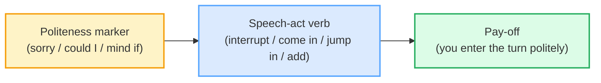
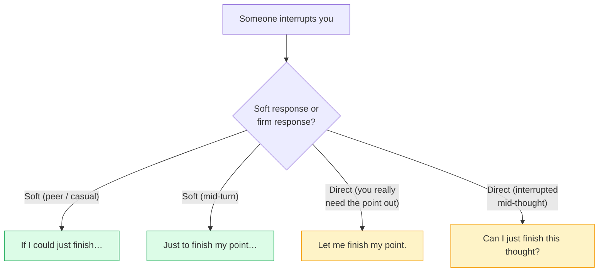

# Interrupting & Holding the Floor

> **Phase 1 · speech_acts · bundle #17 · Days 33–34.**
> *'Sorry to interrupt…' / 'If I could just finish.'*
>
> 🔗 Builds on [FINAL CONSONANTS](../pronunciation/FINAL_CONSONANTS.md) (every
> interrupt line ends in a /t/ or /ʃ/ a Vietnamese learner drops) and on
> [APOLOGIZING](./APOLOGIZING.md) — the word *sorry* is borrowed here as a
> **politeness marker before a face-threatening act**, not a real apology.
> Sibling: [AGREEING & DISAGREEING](./AGREEING_DISAGREEING.md) — disagreements
> in English ride in on the same polite interrupt opener.

---

## Why this is bundle #17 (read this first)

Vietnamese turn-taking is **hierarchical**: the older / higher-status speaker
holds the floor as long as they like, and the younger / lower-status listener
waits — **interrupting is rude**, silence is deference, and "khi nào người lớn
nói xong" (when the elder finishes) is the unspoken rule. English turn-taking
is the opposite: it is **collaborative**, turns are negotiated on the fly, and
**not** interrupting at all can read as disengaged, while interrupting
*bluntly* (no politeness marker) reads as aggressive. The Vietnamese learner
lands in one of two failure modes:

1. **Stays silent** through a long English turn → looks passive / lost / not
   contributing; the meeting moves on without them.
2. **Interrupts bluntly** ("I want to say…", "Stop, I talk") → sounds rude,
   because the L1 politeness hierarchy never taught them the **marker-first**
> structure.

This bundle teaches the structural fix: **a politeness marker BEFORE the
speech-act verb** (*Sorry to…*, *Could I…*, *Mind if I…*), and the symmetric
**hold-the-floor** chunk for when *you* are the one being interrupted
(*If I could just finish*, *Let me finish*, *As I was saying*).

---

## 1. The mechanism: turn-taking as a face game

English turn-taking is governed by what pragmatics calls **face** (Brown &
Levinson, 1987). To take the floor from someone is a **face-threatening act**
(FTA) — you are publicly taking their right to speak. To do an FTA *without*
softening reads as hostile. So English requires a **mitigator** before the act:

The same logic runs in reverse when someone interrupts **you**: their act
threatens *your* face, so you mitigate your defence too — *Let me **just**
finish*, *If I **could just**…*. The word **just** is doing the heavy lifting
here: it shrinks your demand so it sounds like a request, not a command.

> From `interrupting_corpus.md`:
>
> | Sorry to interrupt, but… | Could I add something? | Mind if I jump in? |
> |---|---|---|
> | /ˈsɒri tə ˌɪntəˈrʌpt bʌt/ UK | /kʊd aɪ æd ˈsʌmθɪŋ/ | /maɪnd ɪf aɪ dʒʌmp ɪn/ |
>
> All three are the same pragmatic move — **marker + verb + (optional)
> request**. Pick by register: *Sorry to interrupt* works in any meeting;
> *Mind if I jump in* is casual; *Could I add something* is formal and safe
> with senior colleagues.

---

## 2. The polite openers (curated set)

There are dozens of "polite interruption" phrases on the internet. These five
are the high-frequency survivors — verified in real transcripts, the Oxford
"Express Yourself" panel, and Business-English references.

| # | Chunk | When to use | Register |
|---|---|---|---|
| 1 | **Sorry to interrupt, but…** | the universal opener, any meeting | neutral |
| 2 | **Could I add something?** | you have a related point | formal |
| 3 | **Could I just come in here?** | you need to enter mid-discussion | formal |
| 4 | **(Do you) mind if I jump in?** | casual, American, friendly | casual |
| 5 | **May I interrupt you there?** | formal, slightly firmer — you really do need to break in | formal |

> From `interrupting_corpus.md` (verbatim attestations):
>
> - "Sorry to interrupt, but there's someone to see you." — Oxford Advanced
>   Learner's Dictionary, *interrupt* entry.
> - "Could I add something to that?" + "Can I just come in here on this
>   question about the…" — verbatim utterances by Dr Harris in the UK House of
>   Commons Select Committee transcript (DCMS / DIUS, 2008–09).
> - "Sorry, do you mind if I jump in?" — Talaera, *How to Join a Group
>   Conversation as a Non-Native Speaker*.
> - "May I interrupt you there? I don't think that's true." — Oxford Advanced
>   Learner's Dictionary, *Express Yourself: Interrupting* panel.

**The Vietnamese trap:** learners either skip the opener entirely ("I want to
say…") or translate the L1 hierarchy ("excuse me, can I speak?") which sounds
over-formal in a peer meeting. The fix is to drill the **marker + verb** as one
chunk — say "Sorry to interrupt" out loud 20 times until it leaves the mouth as
one unit, not three translated words.

---

## 3. Holding the floor when interrupted

Symmetric mechanism: when someone breaks into your turn, you have a **right to
finish** — but you also have to soften the defence so it doesn't sound hostile.
The canonical chunk is **"Let me finish"** (direct) softened by **"just"** →
**"Let me just finish"**, or reframed as a polite conditional → **"If I could
just finish."**

> From `interrupting_corpus.md` (verbatim from Speak Confident English,
> "How to Respond to Interruptions"):
>
> | If I could just finish… | Let me finish. | Let me finish my point. |
> |---|---|---|
> | /ɪf aɪ kʊd dʒʌst ˈfɪnɪʃ/ | /let miː ˈfɪnɪʃ/ | /let miː ˈfɪnɪʃ maɪ pɔɪnt/ |
>
> | Just to finish my point… | Can I just finish this thought? |
> |---|---|
> | /dʒʌst tə ˈfɪnɪʃ maɪ pɔɪnt/ | /kæn aɪ dʒʌst ˈfɪnɪʃ ðɪs θɔːt/ |

**The Vietnamese trap:** learners **freeze** when interrupted. The Vietnamese
deference reflex says "the elder / boss started talking, I must yield" — so
the learner stops, the senior person takes over, and the learner's point never
comes out. The English expectation is the opposite: a brief, polite floor-hold
("If I could just finish…") is **expected and respected**, not rude. Practise
the line as a reflex — when you hear yourself being cut off, the muscle memory
should fire "If I could just finish" before your brain decides to yield.

---

## 4. Re-entering after the interruption

If you were fully knocked off your turn (someone broke in, you stopped, the
conversation moved on), the canonical English resume line is **"As I was
saying…"** — a fixed expression so standard it is listed in the British Council
/ EAQUALS Core Inventory for General English and in Cambridge *English
Vocabulary in Use* as an "everyday fixed expression".

> From `interrupting_corpus.md` (verbatim attestations):
>
> | As I was saying… | As I was saying before I was interrupted… |
> |---|---|
> | /əz aɪ wəz ˈseɪɪŋ/ | /əz aɪ wəz ˈseɪɪŋ bɪˈfɔːr aɪ wəz ˌɪntəˈrʌptɪd/ |
>
> Both are real — the short one is the Core Inventory "Continuing" marker; the
> long one is a verbatim Hansard (UK Parliament) utterance. The long form is
> deliberately pointed: it names the interruption, so use it sparingly.

🔗 Sibling: this is the same family as **"Anyway…"** in
[TOPIC TRANSITIONS](./TOPIC_TRANSITIONS.md) — both are resumptive discourse
markers, but *As I was saying* specifically signals "I'm going back to *my*
unfinished turn", not just changing the subject.

---

## 5. Cheat sheet — the ≤8 survival chunks

The Pareto set. Drill these eight aloud until each one leaves the mouth as a
single chunk, not word-by-word translation. (Every row is a corpus attestation
above.)

| # | Chunk | IPA | Why it's here |
|---|---|---|---|
| 1 | **Sorry to interrupt** | /ˈsɒri tə ˌɪntəˈrʌpt/ | universal polite opener — marker + verb |
| 2 | **Could I add something?** | /kʊd aɪ æd ˈsʌmθɪŋ/ | formal, contribution request |
| 3 | **Mind if I jump in?** | /maɪnd ɪf aɪ dʒʌmp ɪn/ | casual, American joiner |
| 4 | **If I could just finish** | /ɪf aɪ kʊd dʒʌst ˈfɪnɪʃ/ | the polite floor-hold (bundle's pinned example) |
| 5 | **Let me finish my point.** | /let miː ˈfɪnɪʃ maɪ pɔɪnt/ | the direct floor-hold |
| 6 | **Can I just finish this thought?** | /kæn aɪ dʒʌst ˈfɪnɪʃ ðɪs θɔːt/ | mid-thought holder |
| 7 | **As I was saying…** | /əz aɪ wəz ˈseɪɪŋ/ | the resume-the-turn line |
| 8 | **Anyway, as I was saying…** | /ˈeniweɪ əz aɪ wəz ˈseɪɪŋ/ | casual resume with discourse marker |

> Open [`interrupting.html`](./interrupting.html) to drill these as flip cards,
> hear native clips, play the meeting role-play, shadow, and write.

---

## 6. Vietnamese → English L1 pitfalls table

The "expert payoff." These are the specific interference traps a Vietnamese
speaker hits on interrupting and holding the floor — extend, don't replace, the
seed rows from the spec.

| Vietnamese trap (what you do) | English fix (what to do instead) |
|---|---|
| **Stays silent when you should speak** — deference to elder/status means you wait for the senior to finish and never break in | Drill the **marker + verb** opener as one chunk ("Sorry to interrupt…") and **fire it within 2 seconds** of wanting to contribute. Silence is not respect in an English meeting — it reads as disengaged. |
| **Interrupts bluntly with no marker** — "I want to say", "Stop, I talk" — because Vietnamese doesn't require a politeness frame for entering a turn | Always prepend a marker: *Sorry to…* / *Could I…* / *Mind if I…*. The marker is **non-optional** in English; without it you sound rude even when your content is fine. |
| **Freezes when interrupted** — the senior person starts talking, the deference reflex makes you yield, your point is lost | Drill **"If I could just finish…"** as a muscle reflex. In English, a brief polite floor-hold is **expected**, not rude — the senior colleague wants to hear your point, not your silence. |
| **Translates L1 hierarchy over-literally** — "Excuse me, can I speak?" / "Please permit me to say…" — sounds weirdly formal in a peer meeting | Match the room. With peers: *Mind if I jump in?* With senior clients: *Could I add something?* The hierarchy is encoded in the **register of the chunk**, not in a permission ritual. |
| **Drops the final /t/ on `interrupt`** → "innerrup" | Hold the tongue on the /t/ ridge and release audibly before the next word. 🔗 See [FINAL CONSONANTS](../pronunciation/FINAL_CONSONANTS.md). |
| **/θ/ → /t/ in `thought`** → "I want to finish dis tot" | Tongue-between-teeth for /θ/. 🔗 See [TH SOUNDS](../pronunciation/TH_SOUNDS.md). |
| **Stresses the wrong syllable in `interrupt`** → "IN-ter-rupt" (L1 stress pattern mapped onto English) | Stress the **last** syllable: /ˌɪn·tə·**ˈrʌpt**/. Touch the table on the stressed beat. |
| **Translates "làm ơn" too heavily** → "If you please, allow me to interrupt" | Use **just** as the softener instead: *If I could **just** finish…*. "Just" is the English politeness particle, not a full clause of permission. |
| **Skips the discourse marker on resume** → "So, I talk about the budget…" | Always resume with **"As I was saying…"** — it signals "I'm reclaiming my turn", not starting a new topic. |
| **Misreads silence as agreement** — a long English pause is *not* a yield, but the Vietnamese learner treats it as "I should stop" | Watch for the breath-in / hand-raise cue as the real turn-yield signal. A 1-second pause is **not** an invitation to stop — keep going until someone takes the floor with a marker. |

---

## How to practise this bundle (the daily 20 min)

1. **READ** (5 min) — this guide, §1–§4.
2. **SHADOW** (7 min) — open `interrupting.html`, drill the 8 flip cards +
   the meeting role-play **aloud**. Pay special attention to the **marker +
   verb** chunk as one unit (no translating word-by-word in your head).
3. **PRODUCE** (8 min) — the writing task: write **one polite interruption
   line** (your choice of register) + **one hold-the-floor line**. Say each
   aloud into a recorder; check the final consonants on *interrupt* / *finish*
   / *point* are audible.

---

## Sources

- Oxford Advanced Learner's Dictionary, entry for *interrupt* —
  https://www.oxfordlearnersdictionaries.com/definition/english/interrupt
  (verbatim example sentences "Sorry to interrupt, but…" + "May I interrupt
  you there? I don't think that's true." from the *Express Yourself:
  Interrupting* panel; IPA /ˌɪntəˈrʌpt/ both UK and US forms.)
- Cambridge Advanced Learner's Dictionary —
  https://dictionary.cambridge.org/dictionary/english/{word} (entries for
  *interrupt*, *finish*, *point*, *thought*, *jump in*, *anyway*, plus weak-form
  notes for *to* /tə/, *was* /wəz/, *can* /kən/, *just* /dʒəst/.)
- Oxford 3000 Vocabulary List (B2 *interrupt*) — confirms /ˌɪntəˈrʌpt/.
- UK House of Commons Select Committee transcript (DCMS / DIUS, 2008–09) —
  verbatim "Could I add something?" + "Can I just come in here?" (Dr Harris).
  https://publications.parliament.uk/pa/cm200809/cmselect/cmdius/51/51ii.pdf
- Hansard, UK Parliament (1935) — verbatim resumptive "As I was saying when my
  right hon. Friend interrupted me…".
  https://hansard.parliament.uk/commons/1935-04-30/debates/52a63ee1-a833-452d-9ecd-02d481388908/NewClause—(SpecialProvisionAsToTheEducationServices)
- Speak Confident English, "How to Respond to Interruptions in English" —
  canonical floor-holding lines.
  https://www.speakconfidentenglish.com/respond-to-interruptions-in-english/
- Talaera, "How to Join a Group Conversation as a Non-Native Speaker" —
  "Sorry, do you mind if I jump in?".
  https://www.talaera.com/speaking/how-to-join-a-group-conversation/
- British Council / EAQUALS Core Inventory for General English — "As I was
  saying" in the Continuing discourse section.
  https://www.eaquals.org/wp-content/uploads/EAQUALS_British_Council_Core_Curriculum_April2011.pdf
- Cambridge *English Vocabulary in Use* (Upper-Intermediate, McCarthy &
  O'Dell) — "as I was saying" listed under Everyday fixed expressions.
- Nolasco & Arthur (1987), discussed in Íkala (2012), *Helping Business English
  learners improve discussion skills* — the "As I was saying" interruption
  activity.
  http://www.scielo.org.co/scielo.php?script=sci_arttext&pid=S0123-46412012000200009
- MHC Training, *English for Meetings and Teleconferences* — "Do you mind if I
  jump in / cut in here?" + "Anyway, where was I?" resume set.
  https://www.mhc-training.com/sites/default/files/mhc_english_meetings.pdf
- Talk Party, "Polite Interrupting, Turn Taking, and Repairing
  Misunderstandings" — "Let me finish this thought" holder.
  https://www.talkparty.app/en/blog/polite-interrupting-turn-taking-repairing-misunderstandings
- VNU Journal of Science, "Communication Across Cultures" — Vietnamese
  respect-for-elder / status hierarchy and turn-taking vs English.
  https://js.vnu.edu.vn/FS/article/view/2661/3237
- Cultural Atlas, "Vietnamese — Communication" — politeness, indirectness,
  respect-for-hierarchy norms.
  https://culturalatlas.sbs.com.au/vietnamese-culture/vietnamese-culture-communication
- Native audio: YouGlish —
  https://youglish.com/pronounce/{chunk_or_phrase_with_underscores}/english/us?
- Frequency methodology: wordfrequency.info (spoken sub-corpus) —
  https://www.wordfrequency.info/
