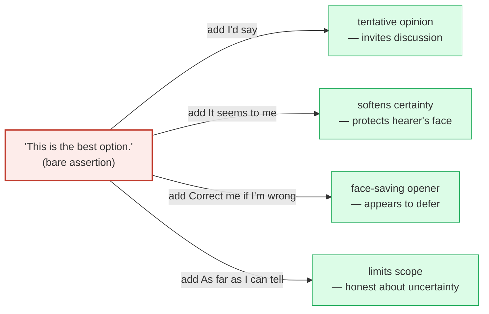
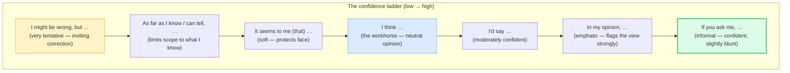

# Giving Hedged Opinions

> **Phase 1 · speech_acts · bundle #20 · Days 39–40.**
> *"I'd say…" / "Correct me if I'm wrong, but…"*
>
> 🔗 Builds directly on [AGREEING & DISAGREEING](./AGREEING_DISAGREEING.md) —
> that bundle teaches the *agree/disagree* axis; this one teaches the **soften
> the claim** axis that runs underneath every opinion. Together they are the
> whole "how to take a position politely" engine. Later, 🔗
> [DIPLOMATIC DISAGREEMENT](../workplace/DIPLOMATIC_DISAGREEMENT.md) climbs the
> same hedge ladder into formal workplace register, and 🔗
> [EDITING: HEDGING & TONE](../writing/EDITING_HEDGING.md) applies it to written
> prose.

---

## Why this bundle exists (read this first)

A Vietnamese speaker who has learned solid grammar and a big vocabulary can
*still* sound blunt, pushy, or arrogant in English — without ever being rude in
Vietnamese. The reason is almost always the same: **they state opinions as bare
facts.** Vietnamese politeness is carried by particles (*ạ, ạ*, *nhỉ*, *đi*) and
by register words (*dạ*, *vâng*); English politeness, in a meeting or a
discussion, is carried by **hedges** — little opener chunks that mark "this is my
view, not a certainty, and I'm open to you."

Drop the hedge and *"This is the best option"* sounds like a decree. Add
*"I'd say"* and it becomes a contribution. That single insertion — **a modal or
a softening phrase before the claim** — is the difference between sounding
confident-and-collaborative and sounding aggressive. It is the highest-leverage
pragmatic fix in this whole phase.

> From `opinions_hedged_corpus.md` (the contrast set, verbatim):
>
> | Bald (L1-influenced) | Hedged (native-like) |
> |---|---|
> | This is the best option. | **I'd say** this is the best option. |
> | He's wrong. | **It seems to me** he's wrong. |
> | The market will recover. | **As far as I can tell**, the market will recover. |
> | You're missing the point. | **Correct me if I'm wrong**, but I think you're missing the point. |
>
> Same content, four different tones. The hedge is *all* that changed.

---

## 1. The mechanism: what a hedge actually does

A **hedge** is a word or chunk that marks uncertainty, limits scope, or protects
face. In English it does three jobs at once:

| Job | Example | What it signals |
|---|---|---|
| **Marks subjectivity** | *I'd say …* / *In my opinion, …* | "what follows is my view, not a fact" |
| **Limits the claim** | *As far as I can tell, …* | "this is true only within what I can observe" |
| **Protects face** | *Correct me if I'm wrong, but …* | "I invite correction — please don't take offence" |

Vietnamese marks the first two (subjectivity, scope) with the particles *theo
tôi* ("in my view"), *theo tôi được biết* ("as far as I know") — but these are
**optional** and often dropped. In English the hedge is **near-mandatory** in any
professional or social discussion: omit it and the listener reads the claim as
either (a) an arrogant overstatement or (b) a disguised order. The learner's L1
tells them "the facts speak for themselves"; the target language says "frame
every claim as a view."

---

## 2. The core hedges — tentative vs strong

Not all hedges soften equally. There is a **ladder**, from the very tentative
(`I might be wrong`) to the fairly confident (`I'd say`). Knowing where on the
ladder a chunk sits lets you **calibrate** — pick the hedge that matches how sure
you actually are.

> From `opinions_hedged_corpus.md` (the four core openers, verbatim):
>
> - **I'd say** (…) — /aɪd ˈseɪ/ — *(tentative opinion / estimate) "I would say / I
>   think"* — Cambridge attestation in the `wicked` entry.
> - **I think** (…) — /aɪ ˈθɪŋk/ — *(opinion marker)* — Cambridge `think`.
> - **In my opinion,** (…) — /ɪn maɪ əˈpɪnjən/ — Oxford `opinion`.
> - **It seems to me** (that) (…) — /ɪt ˌsiːmz tə miː/ — Cambridge `seem`:
>   *"It seems to me (that) (= I think that)"*.

**The pragmatic trap:** `I think` is the **most overused** hedge by Vietnamese
learners — said before *every* sentence, it loses all force and starts to sound
hesitant rather than opinionated. Vary it: reach for `I'd say` when you're fairly
sure, `It seems to me` when softening, `As far as I can tell` when you're
limiting scope. A fluent speaker cycles through the ladder; a stuck learner
repeats `I think` on every line.

---

## 3. The "qualified" hedges — limit how much you claim

When you genuinely don't have all the facts, the honest move is a hedge that
**scopes the claim** to what you actually know. These are the chunks that make a
meeting contribution *trustworthy* — you're not overstating.

> From `opinions_hedged_corpus.md`:
>
> - **As far as I know,** (…) — /əz fɑːr əz aɪ nəʊ/ UK · /əz fɑːr əz aɪ noʊ/ US —
>   Cambridge (CEFR **B2**): *"used to say what you think is true, although you
>   do not know all the facts."*
> - **As far as I can tell,** (…) — /əz fɑːr əz aɪ kən tel/ — the *See also*
>   sister phrase in the same Cambridge entry.
> - **I might be wrong, but** (…) — /aɪ maɪt biː rɒŋ/ UK · /aɪ maɪt biː rɔːŋ/ US —
>   the soft hedge that explicitly invites correction.

These three are the **"I'm not overreaching"** hedges. They are also the cure for
the Vietnamese trap of stating a half-remembered fact as if it were certain:
swap *"The deadline is Friday"* (asserted) for *"As far as I know, the deadline
is Friday"* (scoped), and you've stopped yourself from being wrong *and* rude at
once.

---

## 4. The politeness hedges — face-saving openers

The most useful single chunk in this bundle, **"Correct me if I'm wrong, but…"**,
does something its literal wording hides: it **lets you state a strong view while
appearing to defer.** It is a textbook *negative-politeness* device.

> From `opinions_hedged_corpus.md` (pinned real example #2, verbatim sources):
>
> - **Correct me if I'm wrong, but** (…) — /kəˈrekt miː ɪf aɪm rɒŋ bət/ UK ·
>   /kəˈrekt miː ɪf aɪm rɔːŋ bət/ US — attested across:
>   - Yule, *The Study of Language* (CUP): *"Now, correct me if I'm wrong, but …"*
>   - The Cambridge CUP monograph *Lost in Automatic Translation*: *"A polite
>     phrase like 'correct me if I'm wrong' actually implies 'I'm right, don't
>     contradict me.'"*
>   - The Scielo pragmatics paper (Lima-Lopes): classified as a **negative
>     politeness strategy** "to avoid imposing his knowledge."
> - **If you ask me,** (…) — /ɪf juː ˈɑːsk miː/ UK · /ɪf juː ˈæsk miː/ US —
>   Cambridge (idiom, CEFR **C2**): *"said when giving your opinion on
>   something."*

**Why the pragmatics matter:** a learner who memorises *"Correct me if I'm
wrong"* literally thinks they're inviting a correction. They're not — they're
**asserting with a face shield on.** Understanding this stops you from using it
wrongly (e.g. when you *actually* want correction, where *"I might be wrong"* is
honest). `If you ask me` is the informal cousin — slightly blunter, fine among
friends, risky in a formal meeting.

---

## 5. Cheat sheet — the ≤8 survival chunks

The Pareto set. Drill these eight aloud until each one is automatic as an
**opener** — said *before* the claim, not after. (Every row is a corpus
attestation above.)

| # | Chunk | IPA | Why it's here |
|---|---|---|---|
| 1 | **I'd say** (…) | /aɪd ˈseɪ/ | moderately confident — the go-to tentative opinion |
| 2 | **I think** (…) | /aɪ ˈθɪŋk/ | the workhorse — neutral opinion marker |
| 3 | **In my opinion,** (…) | /ɪn maɪ əˈpɪnjən/ | emphatic — flags the view strongly |
| 4 | **It seems to me** (…) | /ɪt ˌsiːmz tə miː/ | soft — protects the hearer's face |
| 5 | **As far as I know,** (…) | /əz fɑːr əz aɪ nəʊ/ UK · /əz fɑːr əz aɪ noʊ/ US | scopes the claim to what you know (B2) |
| 6 | **As far as I can tell,** (…) | /əz fɑːr əz aɪ kən tel/ | scopes the claim to what you can observe |
| 7 | **Correct me if I'm wrong, but** (…) | /kəˈrekt miː ɪf aɪm rɒŋ bət/ UK · /kəˈrekt miː ɪf aɪm rɔːŋ bət/ US | face-saving opener — assert with a shield |
| 8 | **If you ask me,** (…) | /ɪf juː ˈɑːsk miː/ UK · /ɪf juː ˈæsk miː/ US | informal confident opinion (idiom, C2) |

> Open [`opinions_hedged.html`](./opinions_hedged.html) to drill these as flip
> cards, hear native clips, play the team-discussion role-play, shadow, and write
> a hedged opinion of your own.

---

## 6. Vietnamese → English L1 pitfalls table

The "expert payoff." These are the specific interference traps a Vietnamese
speaker hits when stating opinions in English — extend, don't replace, the seed
rows from the spec.

| Vietnamese trap (what you do) | English fix (what to do instead) |
|---|---|
| **States opinions as bald fact** — *"This is the best option"* (no modal, no hedge) — sounds aggressive/arrogant to English ears, even though it's neutral in Vietnamese | Prepend a hedge: *"**I'd say** this is the best option."* The modal/hedge is what marks it as *your view*, not a decree. |
| **Drops the hedge that L1 would carry via particles** — Vietnamese uses *theo tôi* / *theo tôi được biết* optionally and silently; English hedges are near-mandatory | Treat the hedge as **part of the chunk**, not decoration. Drill *"I'd say …"*, *"It seems to me …"* as fixed openers, the way you'd drill *"How's it going?"* |
| **Overuses "I think" on every sentence** — said automatically, it loses force and makes you sound hesitant rather than opinionated | Cycle the ladder (§2): *I'd say* (confident), *It seems to me* (soft), *As far as I can tell* (scoped). One `I think` per three opinions, max. |
| **Direct "You should…" / "You must…"** without softening — Vietnamese imperative politeness is carried by *đi/nhé/ạ*; bare English modal is read as an order | Swap for a hedged view: *"**I'd say** you might want to …"* / *"**It seems to me** …"*. 🔗 See [GIVING ADVICE & SUGGESTIONS](./ADVISING.md). |
| **"Correct me if I'm wrong" used literally** — learner thinks it's a genuine request for correction; pragmatically it's an *assertion with a shield* | Use it when you want to **state a strong view politely**, not when you actually want to be checked. For real uncertainty, use *"I might be wrong, but…"* (honest). |
| **Drops the final consonant on the hedge word** — *"I thin"* for *think*, *"I sai"* for *say*, *"wron"* for *wrong* → the hedge is inaudible and the politeness fails | Release every final: /θɪŋ**k**/, /se**ɪ**/ (no, but hold the vowel), /rɒ**ŋ**/. The politeness lives in the *audible* hedge. 🔗 See [FINAL CONSONANTS](../pronunciation/FINAL_CONSONANTS.md). |
| **Mis-stresses multi-word hedges** — *"in my o-PIN-ion"* (wrong) vs *"in my O-pin-ion"* — because Vietnamese is syllable-timed and gives every syllable equal weight | Stress the **content word** of the hedge, not the grammar: *I'd **SAY***, *It **SEEMS** to me*, *As **FAR** as I **KNOW***. Content strong, grammar weak. 🔗 See [SENTENCE STRESS](../pronunciation/SENTENCE_STRESS.md). |
| **Translates "theo tôi" as "according to me"** — *"According to me, …"* sounds wrong/childish to natives; `according to` takes a third-person source, not the speaker | Use *"**In my opinion**, …"* / *"**If you ask me**, …"* / *"**The way I see it**, …"*. Reserve `according to` for citing others: *"According to the report, …"*. |
| **No rise-fall intonation on the opinion** — Vietnamese tones are lexical; English uses intonation to mark "this is my view, now over to you" | End a hedged opinion with a slight **fall** (settled) or a **rise** (inviting response). A flat tone reads as a statement of fact — the opposite of hedging. 🔗 See [INTONATION](../pronunciation/INTONATION.md). |

---

## How to practise this bundle (the daily 20 min)

1. **READ** (5 min) — this guide, §1–§4.
2. **SHADOW** (7 min) — open `opinions_hedged.html`, drill the 8 flip cards +
   the team-discussion role-play **aloud**, exaggerating the hedge word, then
   relaxing. Pay attention to *where* the stress lands.
3. **PRODUCE** (8 min) — the writing task: write one hedged opinion using *"It
   seems to me…"* and one using *"As far as I can tell…"*. Read them aloud and
   check the hedge word is audible.

---

## Sources

- Cambridge Advanced Learner's Dictionary —
  https://dictionary.cambridge.org/dictionary/english/{word}
  - `as-far-as-i-know` (CEFR B2) —
    https://dictionary.cambridge.org/dictionary/english/as-far-as-i-know
  - `if-you-ask-me` (idiom, CEFR C2) —
    https://dictionary.cambridge.org/dictionary/english/if-you-ask-me
  - `seem` — *"It seems to me (that) (= I think that)"* —
    https://dictionary.cambridge.org/dictionary/english/seem
  - `wicked` — *"I don't think he's wicked — more stupid, I'd say"* (attestation
    for `I'd say`) —
    https://dictionary.cambridge.org/dictionary/english/wicked
- Oxford Advanced Learner's Dictionary —
  https://www.oxfordlearnersdictionaries.com/definition/english/seem (`seem`,
  *In my opinion …* grouped with *It seems to me …*); `opinion`.
- Collins English Dictionary — https://www.collinsdictionary.com/dictionary/english/seem.
- Longman Dictionary of Contemporary English —
  https://www.ldoceonline.com/dictionary/seem.
- Yule, G. *The Study of Language* (Cambridge University Press) — hedges
  paradigm: *"Correct me if I'm wrong, but …"*, *"As far as I know …"*.
- *Lost in Automatic Translation* (Cambridge University Press) —
  https://www.cambridge.org/core/books/lost-in-automatic-translation/communicating-in-english/2509FB0DAD9FBC3F17CDE3B491E95360
  — pragmatics of *"correct me if I'm wrong"*.
- Lima-Lopes, R. de A. "Formulations, Politeness and Facework in Courtroom
  Interaction" (*DELTA*, Scielo) —
  https://www.scielo.br/j/delta/a/ctckSX4knsBGywB95SVcqkt/?lang=en.
- *An investigation of weasel words in selected political speeches*
  (journalppw.com) —
  https://journalppw.com/index.php/jppw/article/download/730/383/872.
- EnglishClub, "Giving Opinions" —
  https://www.englishclub.com/vocabulary/fl-giving-opinions.php.
- Native audio: YouGlish — https://youglish.com/pronounce/{chunk}/english/us?
- Frequency methodology: wordfrequency.info (spoken sub-corpus) —
  https://www.wordfrequency.info/
