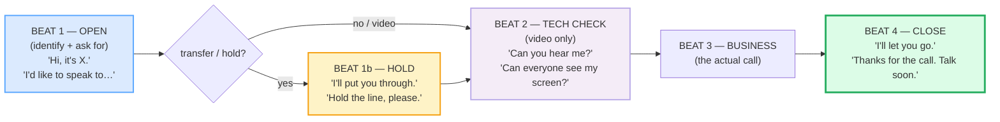

# Phone & Video Call Openings/Closings

> **Phase 1 · speech_acts · bundle #30 · Days 59–60.**
> *"Hi, it's X." / "I think we lost them."*
>
> 🔗 This bundle is the **call-specific** sibling of
> [GREETINGS & INTROS](./GREETINGS_INTROS.md) (openings) and
> [CLOSINGS](./CLOSINGS.md) (the two-step close). Where those teach face-to-face
> turns, this one teaches what changes when you **cannot see the other person**
> (phone) or **depend on a connection** (video). It previews
> [VIDEO-CALL SPECIFICS](../workplace/VIDEO_CALL_SPECIFICS.md) (Phase 2 #42),
> which drills the workplace meeting-on-a-call layer on top of these chunks.
> Pronunciation-wise it leans on [FINAL CONSONANTS](../pronunciation/FINAL_CONSONANTS.md)
> (*"frozen"*, *"lost"*, *"through"* — drop the final and the meaning collapses)
> and [LINKING](../pronunciation/LINKING.md) (*"put you through"* → /pʊtʃuː θruː/).

---

## Why this is bundle #30 (read this first)

A Vietnamese learner who has cleared Phase 1's social functions (#11–#29) can
greet, small-talk, agree, clarify, and close. But the moment the channel changes
— a phone rings, a Zoom call opens — two new failure modes appear that
face-to-face practice never exposed:

1. **The identification trap.** On a phone you cannot be *seen*, so the first
   turn must *identify the speaker*. English uses the dummy *"it"* — **"Hi,
   it's X"** — or the demonstrative *"this is"* — **"Hello, this is X"**.
   Vietnamese learners, translating *"tôi là X"* word-for-word, say **"I am X"**,
   which to a native ear sounds like roll-call or a formal meeting
   self-introduction, not a phone call. It is the single most common phone
   opening error.
2. **The tech-freeze trap.** When a video call's audio or video fails, a native
   speaker **narrates the problem out loud** — *"you're on mute"*, *"you're
   frozen"*, *"I think we lost them"*. A Vietnamese learner tends to **freeze
   and wait** in silence, because these call-specific diagnostic chunks were
   never in any textbook. The call stalls; everyone is uncomfortable.

This bundle drills the chunks that turn those two traps into automatic turns.
After it, you open a call like a native and you **talk through** a tech failure
instead of freezing in it.

---

## 1. The mechanism: the four beats of a call

Every phone or video call, native or learner, runs the same four-beat skeleton.
The beats are fixed; only the chunks inside them vary by channel and register:

Beat 2 (the tech check) is **video-only** — you never ask *"can you hear me?"*
on a phone, because the answer is the call itself. Beat 1b (transfer/hold) is
**phone-only** — video calls dial direct. Knowing *which beat belongs to which
channel* is half the battle.

> From `phone_video_corpus.md`:
>
> | Hi, it's X. | I'll put you through. | Can you hear me? | I think we lost them. |
> |---|---|---|---|
> | /haɪ ɪts/ | /aɪl pʊt juː θruː/ | /kən juː hɪər miː/–/hɪr miː/ | /aɪ θɪŋk wiː lɒst ðəm/–/lɑːst ðəm/ |
>
> The four pinned chunks — one per beat — are the survival set. Every other row
> in the corpus is a register or channel variant of these four.

---

## 2. Phone openings — "Hi, it's X" (the identification beat)

The non-negotiable rule: on a phone, **identify with *it's* or *this is***, never
with *I am*. Cambridge documents *"it's me"* as the phone self-identification at
the `it` entry; *"this is X"* is the formal/neutral twin.

| Chunk | Register | Pragmatic note |
|---|---|---|
| **Hi, it's X.** | Casual, the default | The #1 phone opener. *it's*, not *I am*. Pinned example. |
| **Hello, this is X.** | Neutral → formal | Use with clients, strangers, reception. |
| **Am I speaking to…?** | Neutral check | Confirms *who answered* before you continue. |
| **Am I through to…?** | UK, neutral | "Am I connected to the right line/extension?" |
| **I'd like to speak to…, please.** | Formal request | The canonical ask to reach someone. |
| **Could I speak to…?** | Very polite | Softens the request further. |

> From `phone_video_corpus.md`:
>
> - **Hi, it's X.** /haɪ ɪts/ — Cambridge `it` documents *"it's me"* as phone ID.
> - **I'd like to speak to…, please.** /aɪd laɪk tə spiːk tə/ — Cambridge
>   `speak to somebody` + `I'd like to` (C1 polite request).
> - **Am I through to…?** /əm aɪ θruː tuː/ — Cambridge `through` phone sense:
>   *"I'll put you through (= connect you by phone)."*

**The Vietnamese trap:** *"tôi là X"* → **"I am X"**. On a call this sounds
stilted and wrong — like announcing yourself to a room, not identifying to a
caller. Drill the *it's / this is* swap until it is automatic. (The reverse trap
exists too: face-to-face you *do* say *"I'm X"* when introducing yourself — see
🔗 [GREETINGS & INTROS](./GREETINGS_INTROS.md). The register is channel-specific.)

---

## 3. Phone transfer & hold — "I'll put you through"

When the caller has reached the wrong person, you **transfer** or ask them to
**hold**. Cambridge (B1) and Oxford (C1) both gloss `put through` under the
*Phones* topic with the verbatim example *"Could you put me through to customer
services, please?"* Oxford attests `hold the line` verbatim: *"She asked me to
hold the line."*

| Chunk | When to use it | Pragmatic note |
|---|---|---|
| **I'll put you through.** | You will connect the caller to the right person | The transfer chunk. Cambridge B1, pinned. |
| **Hold the line, please.** | Ask the caller to wait and not hang up | Oxford b2, verbatim attested. |
| **Just a moment, please.** | Brief wait before a transfer | Pairs with "I'll put you through." |
| **Bear with me.** | Polite patience while you sort something out | Oxford: *"If you will bear with me a little longer…"* |
| **Can you hold? / Please hold.** | Ask permission / instruct to wait | Oxford: *"That extension is busy right now. Can you hold?"* |

> From `phone_video_corpus.md`:
>
> - **I'll put you through.** /aɪl pʊt juː θruː/ — Cambridge `put someone through`
>   B1: "to connect a person using a phone."
> - **Hold the line, please.** /həʊld ðə laɪn/–/hoʊld ðə laɪn/ — Oxford `hold`
>   "on phone": *"hold the line — She asked me to hold the line."*
> - **Bear with me.** /beər wɪð miː/–/ber wɪð miː/ — Oxford `bear with`:
>   "to be patient with somebody/something."

**The Vietnamese trap:** the direct translation of *"đợi một chút"* is *"wait a
moment"* — said bare to a caller it sounds like a command. Wrap it: *"Just a
moment, please"* or *"Bear with me"* softens it to the native register.

---

## 4. Video-call tech check — "can you hear/see me?"

A video call opens with a **tech check** before any business. This is the beat
Vietnamese learners freeze on most, because the chunks are call-specific and
absent from general ESL material. Cambridge documents `mute` (adjective /mjuːt/)
for the microphone-off state — the source of *"you're on mute"*.

| Chunk | When to use it | Pragmatic note |
|---|---|---|
| **Can you hear me?** | Open every video call; confirm your mic works | The #1 video opener. |
| **Can you see me?** | Confirm your camera works | Usually paired with "hear me?" |
| **You're on mute.** | Tell someone their mic is off | The most-used video phrase in English. |
| **I think you're muted.** | Softer version of "on mute" | The *hedged* diagnostic (see 🔗 [OPINIONS HEDGED](./OPINIONS_HEDGED.md)). |

> From `phone_video_corpus.md`:
>
> - **Can you hear me?** /kən juː hɪər miː/–/hɪr miː/ — Cambridge `hear` + `can`
>   weak /kən/.
> - **You're on mute.** /jɔːr ɒn mjuːt/–/jʊr ɑːn mjuːt/ — Cambridge `mute` adj
>   /mjuːt/ + `on` /ɒn/–/ɑːn/.

**The Vietnamese trap:** learners often **stay silent** when they cannot hear
someone, or type *"I can't hear"* in the chat instead of saying it. The native
move is to **say the diagnostic aloud**: *"You're on mute"*, *"I can't hear
you"*, *"Can you hear me now?"*. Narrating the problem keeps the call moving.

---

## 5. Video-call connection problems — "you're frozen / breaking up / lost"

When the connection fails, **narrate it**. Cambridge documents both relevant
senses: `frozen` ("not moving at all" — Immobility) for a stuck video frame, and
`break up` ("STOP BEING HEARD: If someone who is talking on a mobile phone is
breaking up, their voice can no longer be heard clearly") for degrading audio.

| Chunk | When to use it | Pragmatic note |
|---|---|---|
| **You're frozen.** | The other person's video has stopped moving | `frozen` literal Immobility sense. |
| **You're breaking up.** | Their audio is becoming impossible to hear | Cambridge `break up` phone sense. |
| **You're cutting out.** | Their audio keeps dropping in and out | `cut out` = "stop working." |
| **I think we lost him/her/them.** | A participant's connection dropped entirely | Oxford `lose` "not hear" sense. **Pinned.** |
| **Can you hear me now?** | After a fix — has audio returned? | The reconnect check. |
| **You're back.** | Confirming their audio/video returned | The all-clear. |

> From `phone_video_corpus.md`:
>
> - **You're frozen.** /jɔːr ˈfrəʊ.zən/–/jʊr ˈfroʊ.zən/ — Cambridge `frozen`
>   "not moving at all."
> - **You're breaking up.** /jɔːr ˈbreɪ.kɪŋ ʌp/ — Cambridge `break up` "STOP
>   BEING HEARD."
> - **I think we lost them.** /aɪ θɪŋk wiː lɒst ðəm/–/lɑːst ðəm/ — Oxford `lose`
>   "not understand/hear": *"His words were lost (= could not be heard)."*

**The Vietnamese trap:** *"I think we lost them"* is **idiomatic** — it does
*not* mean the people are physically lost. It means the *connection* dropped and
we can no longer hear them. Translating it back to Vietnamese word-for-word
(*"tôi nghĩ chúng ta mất họ"*) makes no sense; you have to learn it as a chunk.
🔗 This is the same chunk-not-word discipline drilled in every Phase 1 bundle.

---

## 6. Screen sharing — "let me share my screen"

The other video-call-specific function. *"Can everyone see my screen?"* is the
canonical Zoom/Teams/Meet prompt after you start sharing.

| Chunk | When to use it | Pragmatic note |
|---|---|---|
| **Let me share my screen. / I'll share my screen.** | Announce you are starting a share | Cambridge `share` + `screen`. |
| **Can everyone see my screen? / Can everyone see this?** | Confirm the share is visible to all | The standard post-share check. |
| **Let me stop sharing.** | End your share | Returns focus to people/gallery. |

> From `phone_video_corpus.md`:
>
> - **Can everyone see my screen?** /kən ˈev.ri.wʌn siː maɪ skriːn/ — Cambridge
>   `everyone` /ˈev.ri.wʌn/ + `see` + `screen`.

---

## 7. Closings on a call — "I'll let you go"

A call close reuses the **two-step close** (signal → farewell) drilled in
🔗 [CLOSINGS](./CLOSINGS.md) (bundle #22), with call-specific framing. The
pre-closing *"I'll let you go"* releases the person from the line; the
leave-taking *"Talk soon"* ends it.

| Chunk | Register | Pragmatic note |
|---|---|---|
| **Well, I'll let you go.** | Pre-closing, all-register | Releases the caller politely. |
| **Thanks for the call.** | Appreciation | The call-specific thank-you. |
| **Talk soon.** | Leave-taking, casual | Hints at next contact. |

> From `phone_video_corpus.md`:
>
> - **Well, I'll let you go.** /wel aɪl let juː ɡəʊ/–/ɡoʊ/ — Cambridge `let` +
>   `go`.
> - **Thanks for the call.** /θæŋks fər ðə kɔːl/–/kɑːl/ — Cambridge `call` noun.

> The full signal → appreciation → farewell drill, the register ladder
> (*goodbye* vs *take care* vs *see you*), and the Macmillan verbatim two-step
> attestation live in 🔗 [CLOSINGS](./CLOSINGS.md). Do not re-learn the close
> here — *reuse* it, with *"I'll let you go"* as the call-specific signal.

---

## 8. Pronunciation & delivery notes

- **Final consonants carry the beat.** *"frozen"* /ˈfrəʊ.zən/ drops its /n/ and
  the listener hears *"froze"* — unfinished. *"lost"* /lɒst/ drops its /t/ and
  becomes *"loss"*. *"through"* /θruː/ is the word that makes *"put you
  through"* mean *connect* — drop the final consonant or the /θ/ and the call
  fails. 🔗 [FINAL CONSONANTS](../pronunciation/FINAL_CONSONANTS.md).
- **Linking.** *"put you through"* → /pʊtʃuː θruː/ (the /t/ of *put* glues to
  the /j/ of *you* → /tʃ/); *"can you"* → /kən juː/ often → /kəntʃuː/. 🔗
  [LINKING](../pronunciation/LINKING.md).
- **Weak forms.** *"can"* → /kən/ (not /kæn/) in *"Can you hear me?"*; *"to"* →
  /tə/ in *"I'd like to speak to"*. Strong forms sound robotic. 🔗
  [SENTENCE STRESS](../pronunciation/SENTENCE_STRESS.md).
- **Intonation.** *"Can you hear me?"* rises ↗ (a real yes/no check); *"You're
  on mute."* falls ↘ (a statement of fact, not a question); *"I think we lost
  them."* falls ↘ with a slight sympathetic dip. A rising *"you're on mute?"*
  sounds unsure — say it as a calm statement. 🔗 [INTONATION](../pronunciation/INTONATION.md).
- **/θ/ in *through*.** Tongue-between-teeth — do not substitute /t/ or /s/.
  *"put you through"* with a /t/ → *"put you truu"* is unintelligible. 🔗
  [TH SOUNDS](../pronunciation/TH_SOUNDS.md).

---

## 9. Cheat sheet — the ≤8 survival chunks

The Pareto set. Drill these eight until the four beats are automatic. (Every row
is a corpus attestation above; the closing chunks live in 🔗 [CLOSINGS](./CLOSINGS.md).)

| # | Chunk | IPA | Why it's here |
|---|---|---|---|
| 1 | **Hi, it's X.** | /haɪ ɪts/ | the #1 phone self-ID — pinned (*it's*, not *I am*) |
| 2 | **I'd like to speak to…, please.** | /aɪd laɪk tə spiːk tə/ | the canonical formal request |
| 3 | **I'll put you through.** | /aɪl pʊt juː θruː/ | the transfer chunk (Cambridge B1) |
| 4 | **Hold the line, please.** | /həʊld ðə laɪn/–/hoʊld ðə laɪn/ | the hold chunk (Oxford b2 verbatim) |
| 5 | **Can you hear me?** | /kən juː hɪər miː/–/hɪr miː/ | the #1 video-call opener |
| 6 | **You're on mute.** | /jɔːr ɒn mjuːt/–/jʊr ɑːn mjuːt/ | the most-used video phrase in English |
| 7 | **You're frozen. / You're breaking up.** | /jɔːr ˈfrəʊ.zən/–/ˈfroʊ.zən/ · /jɔːr ˈbreɪ.kɪŋ ʌp/ | narrate the connection failure |
| 8 | **I think we lost them.** | /aɪ θɪŋk wiː lɒst ðəm/–/lɑːst ðəm/ | the dropped-caller diagnostic — pinned |

> Open [`phone_video.html`](./phone_video.html) to drill these as flip cards,
> hear native clips, play the role-play (a video call with tech hiccups),
> shadow, and write.

---

## 10. Vietnamese → English L1 pitfalls table

The "expert payoff." These are the specific interference traps a Vietnamese
speaker hits on phone and video calls — extend, don't replace, the seed rows
from the spec.

| Vietnamese trap (what you do) | English fix (what to do instead) |
|---|---|
| **Says "I am X" on a phone** (word-for-word *"tôi là X"*) | Say **"Hi, it's X"** (casual) or **"Hello, this is X"** (formal). *it's / this is* — never *I am*. Cambridge documents *"it's me"* as phone ID. |
| **Opens with "alô"** (Vietnamese phone greeting, from French *allô*) | English **"Hello?"** (rising, on answering) or **"Hi, it's X"** (on calling). *alô* is not used in English; *hello?* with a rise = "who's this?" |
| **Asks "Who is this?" bluntly** (translating *"ai đấy?"*) | Soften: **"Who's calling, please?"** or **"May I ask who's calling?"** Bare *"who is this?"* sounds suspicious/rude. |
| **Freezes in silence when tech fails** instead of narrating | **Say the diagnostic aloud**: *"You're on mute"*, *"You're frozen"*, *"I think we lost them"*. Narrating keeps the call moving; silence stalls it. |
| **Unfamiliar with video-call tech vocabulary** (mute / frozen / lag / breaking up / share screen) | Drill the 8 survival chunks in §9. These are call-specific and absent from general ESL — learn them as fixed chunks. |
| **Translates "mất kết nối" literally** → "we lost connection" (ok but stiff) | The native chunk is **"I think we lost them"** — idiomatic; *them* = the dropped caller(s), not physical loss. |
| **Says "wait a moment" bare** to a caller (sounds like a command) | Wrap it: **"Just a moment, please"** or **"Bear with me"** — the polite hold register. |
| **Drops final consonants** → *"frozen"* → "froze", *"lost"* → "loss", *"through"* → "thruu" | Release every final: /ˈfrəʊ.zən/, /lɒst/, /θruː/. The final carries the meaning on a call. 🔗 [FINAL CONSONANTS](../pronunciation/FINAL_CONSONANTS.md). |
| **/θ/ in "through" → /t/** → *"put you through"* → *"put you truu"* | Tongue-between-teeth for /θ/. 🔗 [TH SOUNDS](../pronunciation/TH_SOUNDS.md). |
| **Strong-forms grammar words** → *"CAN you HEAR me?"* (robotic, every word stressed) | Weak forms: *"kən juː hɪər miː?"* — only *hear* and *me* carry stress. 🔗 [SENTENCE STRESS](../pronunciation/SENTENCE_STRESS.md). |
| **Says "I will go now" to end a call** (word-for-word *"tôi đi đây"*) | Use the call pre-closing: **"Well, I'll let you go"** + **"Talk soon."** 🔗 [CLOSINGS](./CLOSINGS.md). |
| **Rising intonation on "you're on mute?"** (sounds unsure) | Say it as a calm **statement** (↘): *"You're on mute."* It is information, not a question. 🔗 [INTONATION](../pronunciation/INTONATION.md). |

---

## How to practise this bundle (the daily 20 min)

1. **READ** (5 min) — this guide, §1–§5. Internalize the **four beats** and the
   *it's / this is* (not *I am*) rule.
2. **SHADOW** (7 min) — open `phone_video.html`, drill the 8 flip cards + the
   role-play **aloud**. Exaggerate the tech-check questions (rising) and the
   diagnostics (falling, calm).
3. **PRODUCE** (8 min) — the writing task: write **a video-call opening + a
   tech-issue line** (e.g. *"Can everyone see my screen?"* / *"You're on
   mute."*). Read it aloud; check each final consonant is audible and each
   question rises.

---

## Sources

- Cambridge Advanced Learner's Dictionary — https://dictionary.cambridge.org/dictionary/english/{word} (entries for *it, this, hello, hi, speak, through, put-through, hold, hear, see, mute, frozen, break-up, cut-out, lose, share, screen, everyone, stop, call, talk, soon, let, go, moment, could, now, back*)
- Cambridge `put someone through` (B1) — https://dictionary.cambridge.org/dictionary/english/put-through ("to connect a person using a phone to the person they want to speak to: Could you put me through to customer services, please?")
- Cambridge `through` (phone-connect sense) — https://dictionary.cambridge.org/dictionary/english/through (verbatim: *"through (to) — I'll put you through (= connect you by phone) (to the sales department)."*)
- Cambridge `break up` ("STOP BEING HEARD") — https://dictionary.cambridge.org/dictionary/english/break-up ("If someone who is talking on a mobile phone is breaking up, their voice can no longer be heard clearly.")
- Cambridge `frozen` (Immobility) — https://dictionary.cambridge.org/dictionary/english/frozen ("not moving at all"; /ˈfrəʊ.zən/ UK · /ˈfroʊ.zən/ US)
- Cambridge Grammar: "Phones and telephone conversations" — https://dictionary.cambridge.org/grammar/british-grammar/phones-and-telephone-conversations
- Oxford Advanced Learner's Dictionary — https://www.oxfordlearnersdictionaries.com/definition/english/{word}
- Oxford `hold` ("on phone", Topics: Phones b2) — https://www.oxfordlearnersdictionaries.com/definition/english/hold_1 (verbatim *"hold the line — She asked me to hold the line."*)
- Oxford `put through` (C1) — https://www.oxfordlearnersdictionaries.com/definition/english/put-through ("to connect somebody by phone — Could you put me through to the manager, please?")
- Oxford `bear with` — https://www.oxfordlearnersdictionaries.com/definition/english/bear-with (verbatim *"If you will bear with me a little longer, I'll answer your question."*)
- Oxford `lose` ("not understand/hear") — https://www.oxfordlearnersdictionaries.com/definition/english/lose (*"His words were lost (= could not be heard) in the applause."*)
- Sibling bundle: [CLOSINGS](./CLOSINGS.md) (#22) — the two-step close reused in §7.
- Native audio: YouGlish — https://youglish.com/pronounce/{chunk}/english/us?
- Frequency methodology: wordfrequency.info (spoken sub-corpus) — https://www.wordfrequency.info/
