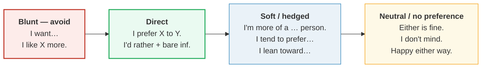

# Expressing Preference

> **Phase 1 · speech_acts · bundle #28 · Days 55–56.**
> *'I'd rather…' / 'I prefer X to Y.'*
>
> 🔗 Builds on [AGREEING DISAGREEING](./AGREEING_DISAGREEING.md) (a preference
> is a mild, pre-emptive agreement/disagreement) and on
> [OPINIONS HEDGED](./OPINIONS_HEDGED.md) (the softer chunks here are hedged
> opinions in disguise). Sits right next to
> [SCHEDULING](./SCHEDULING.md) (#27) — "Does Tuesday work?" often triggers
> exactly these preference chunks. Pronunciation glue:
> [FINAL CONSONANTS](../pronunciation/FINAL_CONSONANTS.md) — `prefer` ends in
> /-r/, `rather` in /-ðər/, `either` in /-ðər/, and the /ð/ is the sound
> Vietnamese substitutes with /z/ or /d/.

---

## Why this bundle matters

Choosing between two options — a restaurant, a meeting time, a tool, a plan — is
one of the highest-frequency social moves in English. Yet most Vietnamese
learners reach for exactly the wrong chunk: **"I want…"**. "I want the Italian
place" sounds blunt, even childish, in a negotiation between adults. The fluent
move is a **preference**, not a demand — `I'd rather…`, `I prefer X to Y`, or a
soft `I'm more of a … person`.

The second reason this bundle is load-bearing is **grammar**. The two anchor
patterns have traps that Vietnamese L1 walks straight into:

- `prefer` takes **`to`** between the two options — never `*than*` (*"I prefer
  coffee **to** tea"*, not *"I prefer coffee than tea"*).
- `would rather` takes a **bare infinitive** — never `*to*` (*"I'd rather
  **go**"*, not *"I'd rather to go"*).

Both traps come from the Vietnamese **"thích…hơn"** frame, which has no
preposition at all, so the learner either drops the linking word or calques the
wrong one. This bundle's whole payoff is fixing those two slots.

---

## 1. The two anchor patterns (drill these first)

### 1a. `I'd rather + bare infinitive`

`'d rather` = `would rather`. It means "would prefer to." The verb after it is
**bare** — no `to`, no `-ing`, no `-s`.

> From `preferences_corpus.md`:
>
> | chunk | IPA |
> |---|---|
> | I'd rather + bare inf | /aɪd ˈrɑːðər/ UK · /aɪd ˈræðər/ US |
>
> Real attestations:
> - *"I'd rather have a beer."* — Cambridge, `rather` → **would rather**.
> - *"I'd rather go to the concert than the play."* — Oxford, *Express Yourself*.

The comparative frame is **`rather … than`** (parallel bare infinitives on both
sides):

> - *"I think I'd rather stay in than go out tonight."* — Oxford, *Express
>   Yourself*.
> - *"I think I'd like to stay at home this evening rather than go out."* —
>   Cambridge, `rather` → **rather than**.

**The Vietnamese trap:** learners insert `to` → *"I'd rather **to** go"*. There
is no `to` — `rather` already carries the "prefer" meaning. Drill the chunk as
one unit: *I'd-rather-go*, *I'd-rather-stay*, *I'd-rather-not*.

### 1b. `I prefer X to Y`

`prefer` links the two options with **`to`** (standard) or **`over`** (esp. US,
informal). Never `*than*`.

> From `preferences_corpus.md`:
>
> | chunk | IPA |
> |---|---|
> | I prefer X to Y. | /aɪ prɪˈfɜːr/ UK · /aɪ prɪˈfɝːr/ US |
>
> Real attestations:
> - *"I prefer red wine to white."* — Cambridge, `prefer`.
> - *"I prefer jazz to rock music."* — Oxford, `prefer` → *prefer something to
>   something*.
> - *"Many people prefer streaming over other forms of consuming media."* —
>   Oxford, `prefer` → *prefer something over something*.

For an action (not a noun), use `would prefer to + infinitive`:

> - *"I'd prefer not to discuss this issue."* — Cambridge, `prefer`.
> - *"I'd prefer to wait here."* — Oxford, *Express Yourself*.

> **Why `to` and not `than`?** Cambridge's grammar panel states it directly: "We
> can use a prepositional phrase with **to** when we compare two things."
> `prefer than` is not a pattern any major dictionary lists — it is an L1 calque.

---

## 2. The register ladder — from blunt to soft

The same preference climbs a register ladder. Direct `I prefer` is fine among
friends but can sound categorical in a meeting; natives soften it. Knowing where
to land on the ladder is what separates "fluent" from "correct-but-rude."

> From `preferences_corpus.md` (the soft + neutral tiers, verbatim):
>
> - **Soft:** *"Industries still **tend to prefer** virgin raw materials to
>   recycled ones."* (Oxford). *"I'm **more of a** morning **person**."*
>   (Cambridge `person`).
> - **Neutral:** *"I'm **happy either way**."* (Oxford, *Express Yourself*, N.
>   American). *"I **don't really mind** whether we talk now or later."*
>   (Oxford, *Express Yourself*, British).

The neutral tier is the **social lubricant** — when you genuinely don't care,
saying so fluently ("Either is fine") lets the other person decide without
awkwardness. Blank *"anything"* or *"I don't know"* reads as disengaged; *"Either
is fine"* reads as easy-going and confident.

---

## 3. The "I'd rather you didn't" subjunctive (advanced)

When the preference is about **someone else's** action, English uses the **past
subjunctive** after `would rather`:

> From `preferences_corpus.md`:
> - *"Well, actually, **I'd rather you didn't**."* — Cambridge Advanced
>   Learner's Dictionary.

This is *not* past tense — it's a polite, distanced way to say "please don't."
Vietnamese has no subjunctive mood, so learners default to *"I'd rather you
**don't**"*, which sounds abrupt. The fix: drill the fixed chunk `I'd rather you
didn't` as one unbreakable unit. (🔗 See
[REQUESTING OFFERING](./REQUESTING_OFFERING.md) for the wider polite-request
system this belongs to.)

---

## 4. Pronunciation notes

- **`rather`** — the /ð/ is the sound Vietnamese replaces with /z/ or /d/. Keep
  the tongue between the teeth. UK /ˈrɑːðər/ vs US /ˈræðər/ — the **vowel**
  differs more than the consonant. 🔗 [TH SOUNDS](../pronunciation/TH_SOUNDS.md).
- **`either`** — the famous transatlantic split: UK /ˈaɪðər/ (rhymes with
  *kite*), US /ˈiːðər/ (rhymes with *feet*). Pick one variety and stay
  consistent within a turn. The /ð/ is the same trap as `rather`.
- **`prefer`** — stress on the second syllable: **pre-FER** /prɪˈfɜːr/. Learners
  often stress the first syllable (*PRE-fer*), which sounds off. The final /r/
  is released in US English, silent or light in UK.
- **`tend to`** — reduces to /tend tə/ (not /tend tuː/). The /d/ of *tend*
  links to the /t/ of *to* — a consonant cluster Vietnamese tends to break with
  a schwa (*"ten-duh-to"*). 🔗 [LINKING](../pronunciation/LINKING.md),
  [FINAL CONSONANTS](../pronunciation/FINAL_CONSONANTS.md).

---

## 5. Cheat sheet — the ≤8 survival chunks

The Pareto set. Drill these eight aloud until the grammar slots are automatic.
(Every row is a corpus attestation in `preferences_corpus.md`.)

| # | Chunk | IPA | Why it's here |
|---|---|---|---|
| 1 | **I'd rather…** | /aɪd ˈrɑːðər/ UK · /aɪd ˈræðər/ US | **pinned** — bare inf, the #1 preference chunk |
| 2 | **I prefer X to Y.** | /aɪ prɪˈfɜːr/ UK · /aɪ prɪˈfɝːr/ US | **pinned** — `to`, never `than` |
| 3 | **I'd prefer to…** | /aɪd prɪˈfɜːr tə/ | `would prefer` + to-infinitive (actions) |
| 4 | **I'd rather X than Y.** | /aɪd ˈrɑːðər … ðæn/ | the comparative frame — parallel bare infs |
| 5 | **I'm more of a … person.** | /aɪm mɔːr əv ə … ˈpɜːsən/ | softer, identity-style preference |
| 6 | **I tend to prefer…** | /aɪ tend tə prɪˈfɜːr/ | hedged — "usually, but not always" |
| 7 | **Either is fine.** | /ˈaɪðər/ UK · /ˈiːðər/ US | neutral — flag the US/UK vowel |
| 8 | **I don't mind.** | /aɪ dəʊnt maɪnd/ UK · /aɪ doʊnt maɪnd/ US | neutral concession (esp. British) |

> Open [`preferences.html`](./preferences.html) to drill these as flip cards,
> hear native clips, play the two-option role-play, shadow, and write.

---

## 6. Vietnamese → English L1 pitfalls table

The "expert payoff." These are the specific interference traps a Vietnamese
speaker hits on expressing preference — extend, don't replace, the seed rows
from the spec.

| Vietnamese trap (what you do) | English fix (what to do instead) |
|---|---|
| **"thích…hơn" has no preposition** → *"I prefer coffee tea"* or *"I prefer coffee than tea"* | Enforce **`prefer X to Y`** (standard) or **`over`** (US). Drill the slot: *coffee-**to**-tea*, *jazz-**to**-rock*. Never `than`. |
| **Adds `to` after `rather`** → *"I'd rather **to** go"* (expecting an infinitive marker) | `would rather` takes a **bare infinitive**. Drill *"I'd-rather-go"* as one chunk — no `to`, ever. |
| **"thích hơn" calque with `like`** → *"I like coffee more tea"* (missing `than`) | The comparative is **`I like X better than Y`** (with `than`). Or skip it — use `I prefer X to Y` instead. |
| **Overuses "I want…"** → *"I want Italian food"* (translating *tôi muốn*) | Swap to a preference chunk: **`I'd rather…` / `I'd prefer…` / `I prefer X to Y`**. "I want" is a demand, not a preference — it sounds blunt in a negotiation. |
| **Uses `than` after `rather`** → *"I'd rather go **to** the concert"* (parallel structure breaks) | The frame is **`rather … than`**: *"I'd rather go to the concert **than** the play."* Keep both sides parallel. |
| **No subjunctive** → *"I'd rather you **don't**"* (sounds abrupt) | Use the past subjunctive: **`I'd rather you didn't.`** Drill it as one fixed, unbreakable chunk. |
| **/ð/ → /z/ or /d/** in `rather` / `either` → "razer" / "ee-zer" | Tongue **between the teeth** for /ð/. 🔗 [TH SOUNDS](../pronunciation/TH_SOUNDS.md). Minimal pairs: *rather/laser*, *either/easer*. |
| **`either` vowel guess** → mixing UK /aɪ/ and US /iː/ mid-turn | Pick **one variety** per turn. UK /ˈaɪðər/, US /ˈiːðər/. Don't blend into *"ay-ther"*. |
| **Breaks the `tend to` cluster** → *"ten-duh-to prefer"* (schwa insertion) | Keep the cluster tight: **/tend tə/**. Link /d/→/t/ without a vowel. 🔗 [LINKING](../pronunciation/LINKING.md). |
| **Blank *"anything"*/"I don't know"* for no-preference** → reads as disengaged | Use the neutral tier: **`Either is fine.` / `I don't mind.` / `Happy either way.`** — signals easy-going, not checked-out. |

---

## How to practise this bundle (the daily 20 min)

1. **READ** (5 min) — this guide, §1–§3.
2. **SHADOW** (7 min) — open `preferences.html`, drill the 8 flip cards + the
   two-option role-play **aloud**, exaggerating the `to`/bare-infinitive slot,
   then relaxing.
3. **PRODUCE** (8 min) — the writing task: write **2 preference sentences** (one
   `I'd rather…`, one `I prefer X to Y`). Read them aloud, recording yourself;
   check the grammar slot is right (`to` after prefer, bare inf after rather).

---

## Sources

- Cambridge Advanced Learner's Dictionary — `prefer`
  https://dictionary.cambridge.org/dictionary/english/prefer (senses, `[ + to
  infinitive ]`, Grammar panel "Would prefer"; *"I prefer red wine to white."* /
  *"I'd prefer not to discuss this issue."*).
- Cambridge Advanced Learner's Dictionary — `rather`
  https://dictionary.cambridge.org/dictionary/english/rather (**rather than** /
  **would rather**; Grammar panel; *"I'd rather have a beer."*).
- Oxford Advanced Learner's Dictionary — `prefer`
  https://www.oxfordlearnersdictionaries.com/definition/english/prefer (*prefer
  something to / over something*; *prefer to do something*; *Express Yourself:
  Expressing a preference*; collocations `verb + prefer: would, tend to`).
- Cambridge — `either`, `mind`, `whatever`, `lean`, `better`, `should`,
  `honest`, `idea`, `person`, `fair-enough`
  (https://dictionary.cambridge.org/dictionary/english/{word}).
- Oxford Dictionary of English Grammar — `would rather` + **bare infinitive**
  (`'I'd rather try than do nothing'`).
- Frequency methodology: wordfrequency.info (spoken sub-corpus) —
  https://www.wordfrequency.info/
- Native audio: YouGlish — https://youglish.com/pronounce/{chunk}/english/us?
