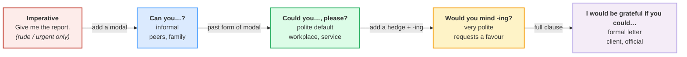
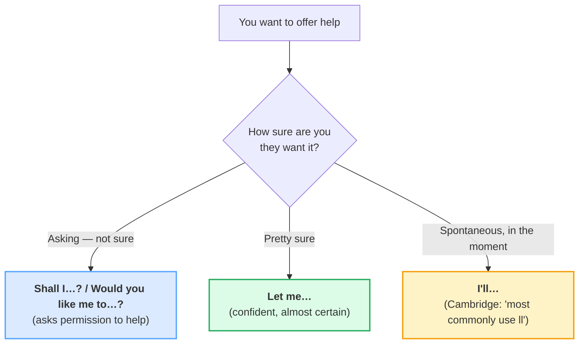

# Requesting & Offering

> **Phase 1 · speech_acts · bundle #15 · Days 29–30.**
> *Polite requests ("Could you…?") and offers ("Shall I…?").*
>
> 🔗 This bundle sits on top of the social foundation: it leans on
> [THANKING](./THANKING.md) (every request/offer closes with *thanks* — see §3)
> and on the pronunciation of modal verbs from
> [FINAL CONSONANTS](../pronunciation/FINAL_CONSONANTS.md) — a dropped /d/ on
> *could* turns it into *cuh*, and the request fails. Later,
> [REQUESTS & REMINDERS](../writing/REQUESTS_REMINDERS.md) (Phase 3) takes the
> same ladder into written email, and [DELEGATING INSTRUCTIONS](../workplace/DELEGATING_INSTRUCTIONS.md)
> (Phase 2) sharpens it for handing off tasks.

---

## Why this bundle matters (read this first)

Vietnamese makes requests and offers the way it does everything else: **directly,
with a pronoun doing the politeness work.** *"Anh cho em mượn cái bút"* (literally
"older-brother give younger-sibling borrow the pen") is a perfectly polite
request in Vietnamese — the hierarchy is encoded in *anh/em*, and the verb *cho*
("give") carries no rudeness.

English has **no pronoun hierarchy.** There is no *anh/em*, no *ông/bà*, no
*cô/chú*. So politeness lives in the **grammar of the verb** — specifically in
how many layers you wrap between the listener and the bare imperative. A
Vietnamese learner who translates *"anh cho em…"* literally as *"Give me…"*
sounds rude in English not because they are rude, but because English expects the
**indirectness to do the work the pronoun used to do.** This single grammatical
calibration — climb the indirectness ladder — is what separates "understood
without awkwardness" from "sounds abrupt."

This bundle drills the two ladders that cover ~90% of workplace and service
English: **requesting** (ask someone to do something) and **offering** (ask if
someone would like you to do something).

---

## 1. The request politeness ladder

English has one structural trick for politeness: **the more grammar between you
and the command, the more respectful.** Cambridge Grammar ("Requests") lays the
ladder out, and every rung is a corpus row:

> From `requesting_offering_corpus.md` (the four rungs, verbatim Cambridge
> attestations):
>
> - **Informal** → *Can you wake me at seven o'clock?*
> - **Polite default** → *Could you call a taxi for me, please?*
> - **Very polite** → *Would you mind opening the window, please?*
>   (Cambridge: "more polite and more common")
> - **Formal letter** → *I would be grateful if you could send me more
>   information about the course.*

**How to pick the rung:** match the social distance. Same-status colleague you
message daily = *Can you*. Client, senior, stranger, or anyone you owe a favour
= *Could you*. A genuine imposition (you're asking them to go out of their way)
= *Would you mind*. A formal written request to an institution = *I would be
grateful if you could*.

> From `requesting_offering_corpus.md` (the high-yield grammatical trap):
>
> | Would you mind opening the window, please? | ✓ correct (-ing form) |
> |---|---|
> | Would you mind **to open** the window? | ✗ Cambridge explicitly flags this |
>
> Cambridge "Mind" warns verbatim: *"Not: Would you mind to get me a newspaper?"*
> The verb after *mind* is **always** the -ing form. Vietnamese learners reach
> for the to-infinitive by analogy with *want to* / *need to* / *would like to* —
> and *mind* breaks the pattern.

---

## 2. The offer ladder (asking if someone would like you to act)

Offering is the mirror image of requesting: you're not asking them to do
something, you're asking **permission to do something for them.** Cambridge
Grammar ("Offers") attests the set and flags one hard rule: **never use the
present simple to offer** (*"I do the ironing"* is wrong) — use *'ll* instead.

> From `requesting_offering_corpus.md` (the offer set, verbatim Cambridge +
> Oxford attestations):
>
> - **Asking** → *Shall I wash the car?* / *Would you like me to walk you home?*
> - **Confident** → *Let me carry your bag. That's too heavy for you.*
>   (Cambridge: "When we are almost certain that a person would like something,
>   we can use *let me*")
> - **Spontaneous** → *I'll do the ironing if you want.*
>   (Cambridge: "We most commonly use *'ll*")

**The US/UK split on *Shall I*:** Cambridge marks *shall* for offers as
**"A2 formal in US"** — it is everyday in British English but sounds formal or
literary to American ears. A US speaker more often reaches for *Should I…?* or
*Do you want me to…?*. Flag the audience before you pick it.

> From `requesting_offering_corpus.md` (the present-simple prohibition):
>
> | I'll do the ironing if you want. | ✓ correct (*'ll*) |
> |---|---|
> | I **do** the ironing if you want. | ✗ present simple can't offer |
>
> Cambridge "Offers" warns verbatim: *"We don't use the present simple to offer
> to do something for someone."*

---

## 3. The uptake: every offer needs a *please* or *thanks*

Cambridge Grammar ("Offers") is blunt: *"We usually say _yes, please_ or _no,
thanks_ when we reply to offers."* This is the line Vietnamese learners miss
most often — accepting with a silent nod, or declining with a bare *"no"* that
reads as blunt in English.

> From `requesting_offering_corpus.md` (the uptake, verbatim Cambridge):
>
> | Accept | Decline |
> |---|---|
> | *Oh yes, please. It looks delicious.* | *No, thanks.* |
> | *Oh, that would be great, thanks.* | *No, thanks. I'm just looking around.* |

And for **responding to a request** (the other side), Cambridge attests the two
warm agreements: *"Of course, here you are."* and *"No problem."*

**The rule of thumb:** an offer or request without a *please* on the way in or a
*thanks* on the way out feels unfinished to a native ear. Add the bookend.

---

## 4. Pronunciation: the modals shrink (and that's where intelligibility hides)

The request/offer chunks live or die on **four tiny modal verbs** — *can,
could, would, shall* — and every one of them has a **weak form** in connected
speech. Vietnamese learners, trained on syllable-timed Vietnamese, tend to
pronounce every English syllable fully, which makes *Could you help me?* sound
stiff and over-emphatic. The native rhythm **reduces** the modal:

| Chunk | Strong (citation) form | Weak (natural spoken) form |
|---|---|---|
| Could you …? | /kʊd juː/ | /kədʒə/ (the /dj/ → /dʒ/ assimilates) |
| Would you …? | /wʊd juː/ | /wədʒə/ |
| Can you …? | /kæn juː/ | /kənjə/ |
| Shall I …? | /ʃæl aɪ/ | /ʃəl aɪ/ |

🔗 This reduction is exactly the weak-form habit drilled in
[SENTENCE STRESS](../pronunciation/SENTENCE_STRESS.md) and
[LINKING](../pronunciation/LINKING.md) — content words strong, grammar words
weak, consonant gluing to vowel across the boundary. A *could* that stays fully
/ kʊd / in fast speech sounds careful to the point of cold.

> **IPA verification note:** *could* `/kʊd/` strong · `/kəd/` weak is the
> verbatim Cambridge pronunciation entry; *shall* `/ʃæl/` strong · `/ʃəl/` weak
> likewise. The /dj/ → /dʒ/ assimilation in *could you* /kədʒə/ is the standard
> yod-coalescence documented in every pronunciation reference.

---

## 5. Cheat sheet — the ≤8 survival chunks

The Pareto set. Drill these eight aloud until the modal shrinks and the *please*
/ *thanks* bookends are automatic. (Every row is a corpus attestation above.)

| # | Chunk | IPA | Why it's here |
|---|---|---|---|
| 1 | **Can you …?** | /kən juː/ weak | informal request — peers, family |
| 2 | **Could you …, please?** | /kʊd juː … pliːz/ | polite default — the workplace workhorse |
| 3 | **Would you mind + -ing?** | /ˈwʊd juː ˈmaɪnd/ | very polite — the favour rung |
| 4 | **Shall I …?** | /ʃæl aɪ/ strong · /ʃəl aɪ/ weak | offer/suggestion (UK-leaning) |
| 5 | **Would you like me to …?** | /ˈwʊd juː laɪk miː tə/ | polite, neutral offer |
| 6 | **Let me …** | /ˈlet miː/ | confident offer (you're sure they want it) |
| 7 | **That'd be great, thanks.** | /ðætd biː ɡreɪt θæŋks/ | accept an offer warmly |
| 8 | **No, thanks.** | /nəʊ θæŋks/ UK · /noʊ θæŋks/ US | decline politely (never a bare *no*) |

> Open [`requesting_offering.html`](./requesting_offering.html) to drill these
> as flip cards, hear native clips, play the workplace role-play, shadow, and
> write a request email line.

---

## 6. Vietnamese → English L1 pitfalls table

The "expert payoff." These are the specific interference traps a Vietnamese
speaker hits on requests and offers — extend, don't replace, the seed rows from
the spec.

| Vietnamese trap (what you do) | English fix (what to do instead) |
|---|---|
| **Translates the imperative + pronoun directly** — *"Give me…"* / *"You do it for me"* (from *"anh cho em…"* / *"anh làm cho em…"*) — and sounds rude because English has no pronoun hierarchy to carry the politeness. | Climb the indirectness ladder (§1): *Could you…, please?* The modal + *please* does the work *anh/em* used to do. Never use the bare imperative except for urgent/direct situations. |
| **Under-hedges requests** — defaults to *Can you* everywhere because it's grammatically simplest, then sounds too casual with a client, a senior, or a stranger. | Match the rung to the social distance: *Can you* (peer) → *Could you* (default) → *Would you mind* (favour) → *I would be grateful if you could* (formal letter). When in doubt, climb one rung. |
| **Reaches for the to-infinitive after *mind*** — *"Would you mind to open the window?"* — by analogy with *want to* / *need to* / *would like to*. | *Mind* takes the **-ing form, always**: *Would you mind open**ing**…?* Cambridge flags this explicitly. Drill it as a fixed chunk. |
| **Offers with the present simple** — *"I do it for you"* / *"I help you"* (Vietnamese has no tense morphology, so the bare verb feels sufficient). | Use *'ll* for spontaneous offers: *"I'**ll** do it."* Cambridge: "We most commonly use *'ll*." Never the present simple to offer. |
| **Drops the *please* / *thanks* uptake** — accepts an offer with a silent nod, declines with a bare *"No"* that reads as blunt (Vietnamese *không* is neutral; English *no* is a refusal, not a softener). | Always bookend: *"Yes, please"* / *"That'd be great, thanks"* to accept; *"No, thanks"* / *"I'm fine, thanks"* to decline. The politeness is in the bookend, not the yes/no. |
| **Pronounces the modal in full /kʊd/ /wʊd/** — trained on syllable-timed Vietnamese, every syllable gets equal weight, so *Could you help me?* sounds stiff and over-careful. | **Reduce** the modal in fast speech: *Could you* /kədʒə/, *Would you* /wədʒə/. 🔗 See [SENTENCE STRESS](../pronunciation/SENTENCE_STRESS.md). Content words strong, modals weak. |
| **Uses *Shall I* in US contexts** (taught as "the polite offer form") and sounds formal/literary to American ears, or avoids it entirely and over-uses *Can I*. | *Shall I* is everyday UK, **"A2 formal in US"** (Cambridge). In US English, prefer *Should I…?* / *Do you want me to…?* for offers; save *Shall I* for UK audiences or formal register. |
| **Misses the *please* on requests** — *"Could you send me the report?"* is grammatically fine but sounds like an order without the softener; Vietnamese *nhé* / *đi* particles don't have a 1:1 translation, so they're dropped. | Add *please* — but **placement matters**: *"Could you send me the report, please?"* (end) is warmer than *"Could you please send me the report?"* (front, slightly more insistent). End-placed *please* is the polite default. |
| **Confuses *Can you* (ability/availability) with *Could you* (polite request)** — *"Can you pass the salt?"* literally asks about ability, which sounds odd in formal contexts. | *Could you* is the safer polite default in any context where you're not close. *Can you* reads as "are you able to" — fine with family, risky with a client. |
| **Stops at the request, omits the closing *thanks*** — *"Could you send the file?"* … (silence) … — Vietnamese often closes with a nod or a particle (*nhé*), which is invisible in English. | Always close: *"Could you send the file? **Thanks.**"* 🔗 See [THANKING](./THANKING.md). The *thanks* completes the speech act; without it the request hangs. |

---

## How to practise this bundle (the daily 20 min)

1. **READ** (5 min) — this guide, §1–§4 (the two ladders + the uptake).
2. **SHADOW** (7 min) — open `requesting_offering.html`, drill the 8 flip cards
   + the workplace role-play **aloud**, shrinking every modal (*Could you*
   → /kədʒə/) and adding the *please* / *thanks* bookends.
3. **PRODUCE** (8 min) — the writing task: write one polite request email line
   (*Could you…* or *Would you mind…*) for a real task at work or school. Read
   it aloud; check the modal shrinks and the *please* / *thanks* are present.

---

## Sources

- Cambridge Grammar, "Requests" — https://dictionary.cambridge.org/grammar/british-grammar/requests (the politeness ladder: *can you* → *could you* → *would you mind* → *I would be grateful if you could*; attested sentences for *Could you call a taxi for me, please?*, *Would you mind collecting my suit…*, *I would be grateful if you could…*, *You couldn't stop at a bank machine, could you?*, *Of course, here you are*, *No problem*)
- Cambridge Grammar, "Mind" — https://dictionary.cambridge.org/grammar/british-grammar/mind (*would you mind* + -ing "more polite and more common"; the to-infinitive prohibition; attested *Would you mind opening the window, please?*, *Do you mind turning down the volume…*)
- Cambridge Grammar, "Offers" — https://dictionary.cambridge.org/grammar/british-grammar/offers (the offer ladder: *Shall I* / *Would you like me to* / *Let me* / *I'll*; the present-simple prohibition; *yes, please* / *no, thanks* uptake; attested *Shall I wash the car?*, *Would you like me to walk you home?*, *Let me get you some more soup*, *I'll do the ironing if you want*, *Is there anything I can do?*, *Oh yes, please*, *That would be great, thanks*, *No, thanks. I'm just looking around.*)
- Cambridge Dictionary, *could* pronunciation — https://dictionary.cambridge.org/us/pronunciation/english/could (UK/US strong `/kʊd/` · weak `/kəd/`, verbatim)
- Cambridge Dictionary, *shall* — https://dictionary.cambridge.org/dictionary/english/shall (UK/US strong `/ʃæl/` · weak `/ʃəl/`; "A2 formal in US" register note)
- Oxford Advanced Learner's Dictionary, *help* — https://www.oxfordlearnersdictionaries.com/definition/english/help_1 (*Would you like me to help you with that?*, *Can I help you with that?*, *Shall I carry that for you?*)
- Oxford Advanced Learner's Dictionary, *shall* — https://www.oxfordlearnersdictionaries.com/definition/english/shall (UK default for offers/suggestions; US "formal")
- Brown, P. & Levinson, S. *Politeness: Some Universals in Language Usage* (CUP, 1987) — negative-face politeness = indirectness as respect.
- Nguyen, "The systematic reduction of English syllable-final consonants" (GMU Linguistics Club) — https://orgs.gmu.edu/lingclub/WP/texts/6_Nguyen.pdf (Vietnamese L1 phonology background; the same syllable pressure that drops finals also weakens modal verbs).
- Native audio: YouGlish — https://youglish.com/pronounce/{chunk}/english/us?
- Frequency methodology: wordfrequency.info (spoken sub-corpus) — https://www.wordfrequency.info/
