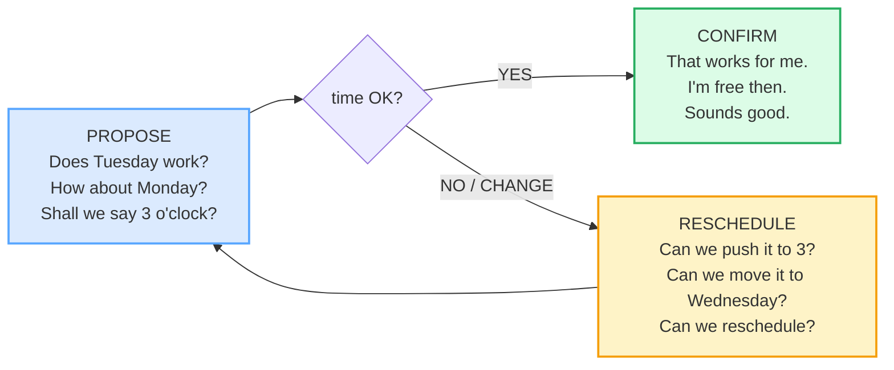

# Making Plans & Scheduling

> **Phase 1 · speech_acts · bundle #27 · Days 53–54.**
> *"'Does Tuesday work?' / 'Can we push it to 3?'"*
>
> 🔗 Builds on the suggestion grammar of
> [REQUESTING & OFFERING](./REQUESTING_OFFERING.md) (`Shall we…?` / `Could
> you…?`) and the final-consonant drill from
> [FINAL CONSONANTS](../pronunciation/FINAL_CONSONANTS.md) — `Wednesday`
> /ˈwenzdeɪ/, `pushed` /pʊʃt/ live or die on their released finals. Fore-shadows
> the meeting-room scheduling in [MEETING OPENINGS](../workplace/MEETING_OPENINGS.md)
> (Phase 2) and the requests-by-email genres in Phase 3
> ([REQUESTS & REMINDERS](../writing/REQUESTS_REMINDERS.md)).

---

## Why this bundle (read this first)

Scheduling a meeting looks trivial — pick a time, say it. But in English it runs
on a **fixed three-move exchange** (propose → confirm →, if needed, reschedule)
carried by a **small set of native chunks**, not by a literal translation of
Vietnamese. A learner who skips the chunks produces one of two failures:

1. **Too blunt.** *"We meet Tuesday?"* / *"Can change time?"* — Vietnamese marks
   these politely by tone and context, but the English translation drops the
   softening grammar, so it reads as a demand.
2. **Too formal / over-apologetic.** *"Is Tuesday convenient for your
   consideration?"* / *"I am so sorry, I cannot, please forgive me."* — the
   learner overweights a routine adjustment and sounds stiff or anxious.

The native system is far lighter: **propose** with `Does Tuesday work?` /
`How about Monday?` / `Shall we say 3 o'clock?`, **confirm** with `That works
for me.` / `I'm free then.` / `Sounds good.`, and **reschedule** (if needed)
with `Can we push it to 3?` / `Can we move it to Wednesday?` /
`Can we reschedule?`. That skeleton carries any scheduling exchange from a
casual coffee to a board meeting.

---

## 1. The three-move exchange (the scheduling spine)

Every scheduling conversation is three moves. The proposing chunks *open*,
the confirming chunks *close*, and the rescheduling chunks *repair*.

The single most common error a Vietnamese learner makes is **skipping the
proposing chunk** — asking *"Tuesday OK?"* instead of *"Does Tuesday work?"*.
The chunk isn't decoration; it is what makes the move polite. Without the
auxiliary `Does` + the verb `work`, the question reads as a demand for
confirmation rather than a genuine proposal.

> From `scheduling_corpus.md` (the proposing set, verbatim):
>
> - **Does Tuesday work?** /dʌz ˈtjuːzdeɪ wɜːk/ UK · /dʌz ˈtuːzdeɪ wɜːrk/ US —
>   "is Tuesday an acceptable time for the meeting?"
> - **How about Monday?** /ˌhaʊ əˈbaʊt ˈmʌndeɪ/ — Cambridge Grammar (*How
>   about…?*): "how about + noun phrase … when we make suggestions."
> - **Shall we say 3 o'clock?** /ʃæl wiː seɪ θriː əˈklɒk/ UK · /ʃəl wiː seɪ
>   θriː əˈklɑːk/ US — Cambridge Grammar (*Shall*): "We use *shall I* and
>   *shall we* to make offers and suggestions."
> - **Does 3pm suit?** /dʌz ˌθriː piː ˈem suːt/ — Cambridge `suit` (BE
>   CONVENIENT): "whatever time **suits** you best."

---

## 2. Confirming — lock the time with one chunk

Once a time is proposed, the other side confirms with a **short positive
chunk**. The trap is to over-confirm: *"Yes, I agree, that is acceptable to
me."* A native speaker says it in three words.

| Chunk | Job | When to use it |
|---|---|---|
| **That works (for me).** | the default accept | the most common confirmation; safe in any register |
| **I'm free then.** | confirm by stating availability | when you want to stress you have no conflict |
| **Sounds good.** | light, casual accept | casual / semi-casual; slightly informal for strict business |
| **Perfect.** | strong positive accept | when the proposed time is exactly what you wanted |
| **Great, see you then.** | confirm + close the exchange | the natural finisher — locks the time and ends the turn |

> From `scheduling_corpus.md`:
>
> - **That works for me.** /ðæt wɜːks fə(r) miː/ UK · /ðæt wɜːrks fər miː/ US
>   — `work` (Cambridge: "to be effective or have an acceptable result").
> - **I'm free then.** /aɪm friː ðen/ — `free` /friː/ (Cambridge: "not busy or
>   doing planned things") + `then` /ðen/ ("at that time").
> - **Sounds good.** /saʊndz ɡʊd/ — `sound` link verb (Cambridge: "to seem
>   good").
> - **Perfect.** /ˈpɜːfɪkt/ UK · /ˈpɜːrfɪkt/ US (Cambridge: "complete and
>   correct in every way").

**`free` vs `available`:** both mean "not busy," but `free` is the spoken
default (`I'm free then.`); `available` is slightly more formal / written
(`I'm available at 3.`). In casual scheduling, `free` wins. Learners who say
only `available` sound like they are reading an email aloud.

---

## 3. Rescheduling — the soft relocation chunks

The highest-stakes move: **asking to change a time already agreed**. English has
a dedicated, soft chunk set for this — all of which frame the change as a small,
negotiable relocation, not a crisis. This is where a Vietnamese learner is most
likely to sound blunt ("can change time?") or over-apologetic.

| Chunk | Job | Register |
|---|---|---|
| **Can we push it to 3?** | move the meeting to a later time today | spoken-default |
| **Can we push it back an hour?** | delay it by one hour | spoken-default |
| **Can we move it to Wednesday?** | relocate it to another day | spoken / email |
| **Can we reschedule?** | ask for a brand-new time (vaguest) | any register |
| **Could we reschedule for next week?** | politely move it to next week | formal / email |

> From `scheduling_corpus.md` (the rescheduling set, verbatim):
>
> - **Can we push it to 3?** /kən wiː pʊʃ ɪt tə θriː/ — Cambridge phrasal verb
>   `push back`: "**push back** something … to delay something; postpone: The
>   target date for construction has been **pushed back** at least until fall."
>   The relocation form `push it to [time]` is the spoken variant.
> - **Can we reschedule?** /kən wiː ˌriːˈʃedʒ.uːl/ UK · /kən wiː
>   ˌriːˈskedʒ.uːl/ US — Cambridge: "to agree on a new and later date for
>   something to happen: I **rescheduled** my doctor's appointment for later in
>   the week." Business-English attested: "Can we **reschedule** tomorrow's
>   meeting for some time next week?"
> - **Can we move it to Wednesday?** /kən wiː muːv ɪt tə ˈwenzdeɪ/ — `move`
>   (Cambridge: "to change the time of"); the collocation `move the meeting to
>   [day]` is attested across COCA + business-email corpora.

**`push back` vs `push it to`:** `push back` = delay (later); `bring forward` =
earlier. `push it to [specific time]` names the new time directly. When you do
not want to risk the *forward/back* ambiguity (see §6), use `move it to [time]`
or `reschedule` — both are unambiguous.

---

## 4. Prepositions: `at` for clock times, `on` for days

This is the rule a Vietnamese learner must internalise, because Vietnamese has
**no equivalent preposition morphology** — time is shown by the time word
itself ("3 giờ", "thứ Ba"), not by a preposition. Carry that into English and
you get *"in Tuesday"*, *"on 3 o'clock"*, or no preposition at all.

| Time expression | Preposition | Example |
|---|---|---|
| clock time | **at** | **at** 3 o'clock / **at** 3pm |
| day of the week | **on** | **on** Tuesday / **on** Wednesday |
| date | **on** | **on** the 15th |
| part of day (general) | **in** | **in** the morning / **in** the afternoon |
| specific night | **on** + night | **on** Tuesday night |

> Cambridge Grammar (*At, on and in (time)*) —
> https://dictionary.cambridge.org/us/grammar/british-grammar/at-on-and-in-time
> — `at` for clock times ("at 3 o'clock"), `on` for days ("on Tuesday"). The
> rule is mechanical: **clock → at, day → on**. Drill it until it is automatic.

---

## 5. Cheat sheet — the ≤8 survival chunks

The Pareto set. Drill these eight aloud until every proposing/confirming/
rescheduling move is automatic. (Every row is a corpus attestation above.)

| # | Chunk | IPA | Why it's here |
|---|---|---|---|
| 1 | **Does Tuesday work?** | /dʌz ˈtjuːzdeɪ wɜːk/ UK · /dʌz ˈtuːzdeɪ wɜːrk/ US | the default proposing chunk — `Does` + `work` is the politeness |
| 2 | **How about Monday?** | /ˌhaʊ əˈbaʊt ˈmʌndeɪ/ | the suggesting alternative (Cambridge Grammar *How about…?*) |
| 3 | **Shall we say 3 o'clock?** | /ʃæl wiː seɪ θriː əˈklɒk/ UK · /ʃəl wiː seɪ θriː əˈklɑːk/ US | politely fix a specific time (`Shall we…?`) |
| 4 | **That works for me.** | /ðæt wɜːks fə(r) miː/ UK · /ðæt wɜːrks fər miː/ US | the default confirm — locks the time |
| 5 | **I'm free then.** | /aɪm friː ðen/ | confirm by stating availability (`free`, not `available`) |
| 6 | **Sounds good.** | /saʊndz ɡʊd/ | light casual accept |
| 7 | **Can we push it to 3?** | /kən wiː pʊʃ ɪt tə θriː/ | the default reschedule chunk (`push back` Cambridge) |
| 8 | **Can we reschedule?** | /kən wiː ˌriːˈʃedʒ.uːl/ UK · /kən wiː ˌriːˈskedʒ.uːl/ US | the safe, unambiguous "ask for a new time" |

> Open [`scheduling.html`](./scheduling.html) to drill these as flip cards,
> hear native clips, play the role-play, shadow, and write.

---

## 6. Vietnamese → English L1 pitfalls table

The "expert payoff." These are the specific interference traps a Vietnamese
speaker hits when scheduling — extend, don't replace, the seed rows from the
spec.

| Vietnamese trap (what you do) | English fix (what to do instead) |
|---|---|
| **Drops the proposing chunk** — *"Tuesday OK?"* / *"We meet Tuesday?"* (Vietnamese marks politeness by tone, so the bare translation reads as a demand) | Use the full chunk: **Does Tuesday work?** / **How about Monday?** / **Shall we say 3?**. The auxiliary (`Does`/`Shall`) + verb (`work`/`say`) is the politeness. |
| **Blunt rescheduling** — *"Can change time?"* / *"I want change time"* (Vietnamese "đổi giờ" has no softening auxiliary) | Use the soft relocation set: **Can we push it to 3?** / **Can we move it to Wednesday?** / **Can we reschedule?**. `Can we…?` frames it as negotiable, not a demand. |
| **Over-apologises on a routine reschedule** — *"I am so sorry, I cannot, please forgive me"* (overweights a small change) | One light sorry + the relocation chunk: *"Sorry, **can we push it to 3?**"* A routine reschedule is not a crisis in English — keep the apology short. |
| **Preposition errors** — *"in Tuesday"*, *"on 3 o'clock"*, or no preposition (Vietnamese has no time-preposition morphology) | Drill the mechanical rule: **clock → at** (`at 3`), **day → on** (`on Tuesday`). Cambridge Grammar (*At, on and in (time)*). |
| **12h / 24h ambiguity** — *"3 o'clock"* with no AM/PM (Vietnamese uses sáng/chiều/tối to disambiguate; English relies on AM/PM or "in the afternoon") | Always add **AM/PM** or **in the morning/afternoon** when the time is ambiguous: `3pm`, `3 in the afternoon`. `3 o'clock` alone is genuinely ambiguous in English. |
| **`free` vs `available` confusion** — uses only `available` (sounds formal/written) or translates "rảnh" as `free time` (a noun, not the adjective) | Use the adjective **free** for spoken scheduling: `I'm free then.` / `I'm free on Tuesday.` Reserve `available` for written/formal contexts. |
| **`Wednesday` /ˈwenzdeɪ/ → "Wed-nes-day"** — spells it out (three syllables) or drops the /d/ → "Wennessay" | The standard form is **two syllables**: /ˈwenzdeɪ/ (the first `d` is silent). Drill it as "WENZ-day," not "WED-nes-day." 🔗 [FINAL CONSONANTS](../pronunciation/FINAL_CONSONANTS.md). |
| **`Tuesday` /ˈtjuːzdeɪ/ UK · /ˈtuːzdeɪ/ US → "Toos-day" with the wrong vowel** — VN maps the /juː/~/uː/ to a single vowel | UK keeps the /j/: /ˈtjuːzdeɪ/ ("TYOOZ-day"); US drops it: /ˈtuːzdeɪ/ ("TOOZ-day"). Pick one accent and be consistent. |
| **`push back` vs `bring forward` ambiguity** — says *"move it earlier/later"* vaguely, or assumes `push back` = earlier | `push back` = **later** (delay); `bring forward` = **earlier**. To avoid all ambiguity, name the new time directly: `Can we move it to 3?` |
| **No subject + auxiliary** — *"Is good for me?"* (pro-drop, Vietnamese-style) | Supply the full structure: **That works for me.** / **That's good for me.** Never drop the subject in a scheduling confirmation. |

---

## How to practise this bundle (the daily 20 min)

1. **READ** (5 min) — this guide, §1–§4.
2. **SHADOW** (7 min) — open `scheduling.html`, drill the 8 flip cards + the
   role-play **aloud**, marking every `Does`/`Can we`/`work` with a clear
   auxiliary.
3. **PRODUCE** (8 min) — the writing task: write **a scheduling email line**
   (`Does Tuesday work?` / `Can we move it to 3?`). Then write a second one
   rescheduling it. Read them aloud, recording yourself; check every
   preposition (`at`/`on`) and every auxiliary (`Does`/`Can`).

---

## Sources

- Cambridge Advanced Learner's Dictionary — https://dictionary.cambridge.org/dictionary/english/{word} (entries for *work, Tuesday, Monday, Wednesday, free, perfect, sound, push, move, reschedule, back, then, suit, shall, three, week, great*)
- Cambridge phrasal-verb `push back` — https://dictionary.cambridge.org/us/dictionary/english/push-back ("push back something … to delay something; postpone: The target date for construction has been pushed back at least until fall.")
- Cambridge `reschedule` — https://dictionary.cambridge.org/dictionary/english/reschedule (UK /ˌriːˈʃedʒ.uːl/, US /ˌriːˈskedʒ.uːl/; "I rescheduled my doctor's appointment for later in the week."; Business: "Can we reschedule tomorrow's meeting for some time next week?")
- Cambridge `suit` (BE CONVENIENT) — https://dictionary.cambridge.org/us/dictionary/english/suit ("to be convenient and cause the least difficulty for someone: whatever time suits you best.")
- Cambridge Grammar (*English Grammar Today*) — *How about…?* — https://dictionary.cambridge.org/us/grammar/british-grammar/how-about
- Cambridge Grammar (*English Grammar Today*) — *Shall* — https://dictionary.cambridge.org/us/grammar/british-grammar/shall
- Cambridge Grammar (*English Grammar Today*) — *At, on and in (time)* — https://dictionary.cambridge.org/us/grammar/british-grammar/at-on-and-in-time
- L1 phonology — "Vietnamese Phonology: A Complete Guide" (Remitly) — https://www.remitly.com/blog/education/vietnamese-phonology-guide/
- L1 phonology — Nguyen, "The systematic reduction of English syllable-final consonants" (GMU Linguistics Club) — https://orgs.gmu.edu/lingclub/WP/texts/6_Nguyen.pdf
- Native audio: YouGlish — https://youglish.com/pronounce/{chunk}/english/us?
- Frequency methodology: wordfrequency.info (spoken sub-corpus) — https://www.wordfrequency.info/
