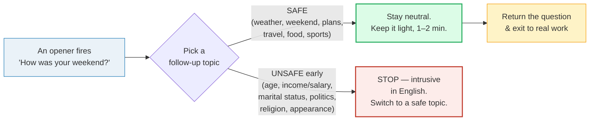

# Small Talk

> **Phase 1 · speech_acts · bundle #12 · Days 23–24.**
> *Weather, weekend, plans — the social lubricant.*
>
> 🔗 This bundle sits right after
> [GREETINGS & INTROS](./GREETINGS_INTROS.md) (the opener that *starts* a
> conversation) and feeds two later bundles: [TOPIC TRANSITIONS](./TOPIC_TRANSITIONS.md)
> (how to move *out* of small talk into real content) and [CLOSINGS](./CLOSINGS.md)
> (how to exit gracefully). The pronunciation layer it leans on is
> [FINAL CONSONANTS](../pronunciation/FINAL_CONSONANTS.md) — every "weekend",
> "plans", "sounds" needs its `-s`/final cluster audible or the opener breaks.

---

## Why this is bundle #12 (read this first)

If a Vietnamese speaker is ever judged as **"cold"**, **"blunt"**, or
**"all business"** by an English-speaking colleague, the cause is almost never
their grammar — it is that they **skipped the small talk**. Vietnamese
conversation culture is comfortable moving straight to the point (often after a
warm but *different* kind of greeting — "Ăn cơm chưa?" / "have you eaten?"),
and Vietnamese small talk, when it happens, reaches for **age, marital status,
income, children, "where are you going?"** — topics that signal *closeness* in
Vietnamese but signal *intrusiveness* in English.

English-speaking work cultures, by contrast, run on a thin layer of
**phatic** communion — talk whose *purpose is not information but connection*.
The Monday "How was your weekend?", the elevator "Weird weather lately, huh?",
the kitchen "Been busy?" are not real questions. They are social lubricant: a
low-stakes exchange that confirms "we are on good terms" before any real work
begins. Skipping them reads as rude; fumbling them reads as awkward.

This single fix — **master ~8 small-talk chunks and the safe/unsafe topic
border** — does more for how *warm* you sound than any vocabulary list. It is
why it sits at Day 23, the second bundle of Phase 1.

---

## 1. The mechanism: small talk is *phatic*, not informational

Small talk is **phatic communication** — language used for its social function,
not its content. The two cultures disagree on what that function looks like:

| | Vietnamese (L1) | English-speaking (target) |
|---|---|---|
| Default greeting among acquaintances | "Ăn cơm chưa?" / "Đi đâu đấy?" (Have you eaten? / Where are you going?) | "How's it going?" / "How was your weekend?" |
| Function of the greeting | Genuine check-in; an answer is expected | Phatic; a short positive reply + return question is the script |
| Acceptable "getting to know you" topics | Age, marital status, children, income, job rank — normal & caring | **Intrusive** — avoid until much later in a relationship |
| Entering a work conversation | Often straight to the point after "Xin chào" | A 30–60 sec small-talk buffer is expected first |
| Weather as a topic | Rare (climate is stable) | **Universal safe opener** — the default fallback |

So when an English speaker opens with **"How was your weekend?"**, they are *not*
requesting a detailed itinerary. The expected script is: short positive reply →
(optional) one concrete detail → return the question. A 3-minute monologue, or a
one-word "Fine" with no return question, both break the script.

> From `small_talk_corpus.md`:
>
> | How was your weekend? |
> |---|
> | /ˌhaʊ wəz jɔː ˌwiːkˈend/ UK · /ˌhaʊ wəz jɔːr ˈwiːkend/ US |
>
> The single most-attested Monday-morning opener in English-speaking workplaces
> — 81 YouGlish US clips of the exact phrase, and the model "safe" opener named
> across the British Council and EF pragmatics guides.

---

## 2. The safe / unsafe topic border

Not all topics are equal. Small talk works because a small, agreed set of
**neutral** topics is pre-approved across the culture — and a different set is
**off-limits** until a relationship is much deeper. The border is mechanical:

> From `small_talk_corpus.md` (the safe-topic anchors, verbatim):
>
> - **weather** /ˈweðə(r)/ UK · /ˈweðər/ US — the universal safe topic
> - **weekend** /ˌwiːkˈend/ UK · /ˈwiːkend/ US — the core small-talk unit
> - **plans** /plænz/ — things you intend to do
> - **busy** /ˈbɪzi/ — having a lot to do

**The Vietnamese trap:** topics that are *normal, even caring* in Vietnamese —
"How old are you?", "Are you married?", "What's your salary?", "How many kids
do you have?", "Where are you going?" — land as **intrusive** or even rude in
English, especially early in a relationship or from a colleague. EF EnglishLive
and Verywell Mind both list **finances/salary, politics, religion, age, and
appearance** as the canonical "avoid" set. The fix is not to suppress curiosity
— it is to **park those topics** until you know someone well, and lead with the
safe four (weather / weekend / plans / travel-food-sports) in the meantime.

---

## 3. The openers + their weekday slot

Small talk has a calendar. The *same* safe topic is opened with a *different*
chunk depending on the day:

| When | Opener (corpus-attested) |
|---|---|
| Monday morning | **How was your weekend?** |
| Tue–Wed | **So, how's your week been?** / **Been busy?** |
| Thu–Fri | **Any plans for the weekend?** |
| Any day (fallback) | **Weird weather lately, huh?** |

> From `small_talk_corpus.md`:
>
> - **How was your weekend?** /ˌhaʊ wəz jɔːr ˈwiːkend/ US — Mon opener
> - **So, how's your week been?** /ˌhaʊz jɔː ˈwiːk bɪn/ US — mid-week opener
> - **Been busy?** /bɪn ˈbɪzi/ — work-check opener (casual subject-drop)
> - **Any plans for the weekend?** /ˈeni plænz fər ðə ˈwiːkend/ US — Thu/Fri opener
> - **Weird weather lately, huh?** /wɪrd ˈweðər ˈleɪtli hʌ/ US — universal fallback

Note the **tag question** ending on the weather opener ("…, huh?") — it invites
agreement and keeps the exchange symmetrical. 🔗 This is the bridge to
[TOPIC TRANSITIONS](./TOPIC_TRANSITIONS.md) — tag questions are also how you
hand off a topic smoothly.

---

## 4. The follow-ups (don't let the opener die)

An opener with no follow-up dies after one turn. These short backchannels show
you are listening and hand the floor back:

> From `small_talk_corpus.md`:
>
> - **Oh yeah?** /ˌoʊ ˈjeə/ US — backchannel (rising tone, not a real question)
> - **No way!** /ˌnoʊ ˈweɪ/ US — surprised/enthusiastic reaction
> - **That sounds nice.** /ðæt ˈsaʊndz ˈnaɪs/ — warm, approving follow-up
> - **I know, right?** /aɪ ˈnoʊ ˈraɪt/ US — agreeing with a shared observation

🔗 The rhythm of opener → short reply → follow-up → return question is the
micro-structure of all casual English conversation; [FLUENCY FILLERS](../discourse/FLUENCY_FILLERS.md)
extends it to the "buying time" layer when you need a second to think.

---

## 5. Cheat sheet — the ≤8 survival chunks

The Pareto set. Drill these eight aloud until the weak forms and the `-s`
endings are all audible. (Every row is a corpus attestation above.)

| # | Chunk | IPA | Why it's here |
|---|---|---|---|
| 1 | **How was your weekend?** | /ˌhaʊ wəz jɔːr ˈwiːkend/ | the universal Mon opener (weak *was* /wəz/) |
| 2 | **Any plans for the weekend?** | /ˈeni plænz fər ðə ˈwiːkend/ | Thu/Fri lookahead (weak *for* /fər/, *the* /ðə/) |
| 3 | **So, how's your week been?** | /ˌhaʊz jɔː ˈwiːk bɪn/ | mid-week check-in |
| 4 | **Been busy?** | /bɪn ˈbɪzi/ | work-check opener (subject-drop) |
| 5 | **Weird weather lately, huh?** | /wɪrd ˈweðər ˈleɪtli hʌ/ | universal safe fallback (tag question) |
| 6 | **Oh yeah?** | /ˌoʊ ˈjeə/ | backchannel (rising, not a real question) |
| 7 | **No way!** | /ˌnoʊ ˈweɪ/ | surprised reaction |
| 8 | **That sounds nice.** | /ðæt ˈsaʊndz ˈnaɪs/ | warm follow-up (audible `-s` on *sounds*) |

> Open [`small_talk.html`](./small_talk.html) to drill these as flip cards,
> hear native clips, play the role-play, shadow, and write.

---

## 6. Vietnamese → English L1 pitfalls table

The "expert payoff." These are the specific interference traps a Vietnamese
speaker hits on small talk — extend, don't replace, the seed rows from the spec.

| Vietnamese trap (what you do) | English fix (what to do instead) |
|---|---|
| **Skips small talk entirely** → walks into a meeting/room and jumps straight to business | Insert a **30–60 sec small-talk buffer** first. Open with "How was your weekend?" / "Been busy?" even in a work setting — it is expected, not a waste of time. |
| **"Ăn cơm chưa?" ("have you eaten?") as a greeting** → used to mean "how are you?" | Do **not** translate it. In English "Have you eaten?" reads as a **literal lunch invitation**, not a greeting. Use "How's it going?" / "How was your weekend?" instead. |
| **"Đi đâu đấy?" / "Where are you going?" as a greeting** | Avoid — in English it sounds like an **interrogation**, not a hello. Use "How's your day going?" if you want a passing greeting. |
| **Asks age / marital status / income / children early** (normal & caring in VN) | **Park these** — they are intrusive-in-EN until you know someone well. Lead with the safe four: weather, weekend, plans, travel/food/sports. |
| **Stops at "Fine" / "Good" with no return question** → the exchange dies | Memorize the **reply-and-return** script: short positive reply → (one detail) → return the question. "Pretty good, thanks. You?" |
| **Drops the `-s` on "weekend"/"plans"/"sounds"** → "How was your weekend?" / "That sound nice" | Enforce every `-s`/final cluster. 🔗 See [FINAL CONSONANTS](../pronunciation/FINAL_CONSONANTS.md) — the `-s` on "plans" /plænz/ and "sounds" /saʊndz/ is exactly the sound Vietnamese drops. |
| **Pro-drop / missing subject** → "Is good." / "Been to Hanoi?" | Supply the subject: "It's good." / "Have you been to Hanoi?" English requires a grammatical subject even in casual speech (the one exception is the casual opener "Been busy?", an accepted ellipsis). |
| **Over-agrees / says "yes" to everything to be polite** | English small talk rewards **short genuine content** over blanket agreement. A real one-line detail ("Went hiking") beats five "yes"s. |
| **Gives a 3-minute monologue** to a phatic "How was your weekend?" | The phatic question wants a **15-second** answer. One positive word + one concrete detail + return question is the script. |
| **Misreads the tag question** "…, huh?" / "…, right?" as a real question | Treat tag questions as **invitations to agree**, not requests for data. The expected reply is "I know, right?" / "Yeah, isn't it?", not an analysis. |

---

## How to practise this bundle (the daily 20 min)

1. **READ** (5 min) — this guide, §1–§4.
2. **SHADOW** (7 min) — open `small_talk.html`, drill the 8 flip cards + the
   office-kitchen role-play **aloud**, hitting every weak form (*was* /wəz/,
   *for* /fər/) and every `-s` ending (*plans*, *sounds*).
3. **PRODUCE** (8 min) — the writing task: **write 3 small-talk openers + 1
   follow-up each**, picking the right opener for the day of the week. Read
   them aloud; check the safe/unsafe border.

---

## Sources

- Cambridge Advanced Learner's Dictionary — https://dictionary.cambridge.org/dictionary/english/{word} (entries for *weekend* /ˌwiːkˈend/ UK · /ˈwiːkend/ US [fetched live 2026-06-23], *weather*, *busy*, *plans*, *relaxing*, *weird*, *bad*, *way*, *nice*, *right*, *sounds*).
- Oxford Advanced Learner's Dictionary — https://www.oxfordlearnersdictionaries.com/definition/english/weekend_1
- British Council, "Your guide to small talk topics, phrases and openers in English" — https://englishonline.britishcouncil.org/blog/articles/your-guide-to-small-talk-topics-phrases-and-openers-in-english/
- EF EnglishLive, "Topics to Avoid in English Small Talk" — https://englishlive.ef.com/en/blog/english-in-the-real-world/topics-avoid-english-small-talk/
- Verywell Mind, "10 Best and Worst Small Talk Topics" — https://www.verywellmind.com/small-talk-topics-3024421
- EnglishClub, "Small Talk: Conversation Starters" — https://www.englishclub.com/speaking/small-talk_conversation-starters.php
- Dickerson, W.B. (ed.), *Weathering the ESL Storm* (ERIC ED400691) — https://files.eric.ed.gov/fulltext/ED400691.pdf ("How was your weekend?" as phatic greeting).
- r/VietNam, "why do we ask 'ăn cơm chưa?'" — https://www.reddit.com/r/VietNam/comments/1snu6ss/why_do_we_ask_an_com_chua/
- Native audio: YouGlish — https://youglish.com/pronounce/{chunk}/english/us? ("how was your weekend" = 81 US clips).
- Frequency methodology: wordfrequency.info (spoken sub-corpus) — https://www.wordfrequency.info/
