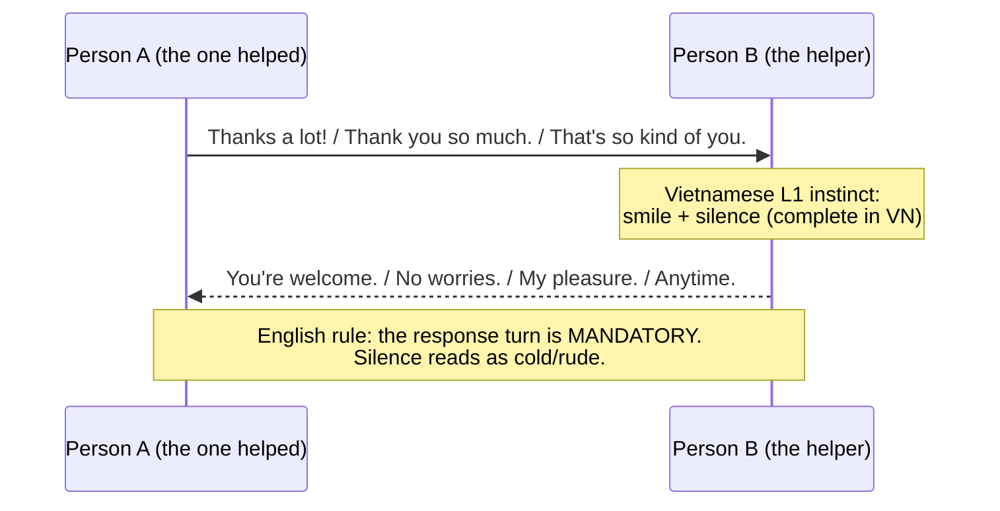
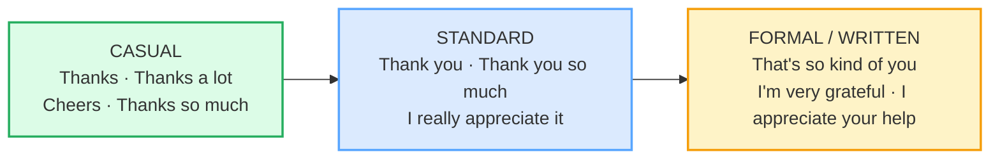

# Thanking & Responding

> **Phase 1 · speech_acts · bundle #13 · Days 25–26.**
> *"That's so kind" / "No worries" / "Anytime."*
>
> 🔗 Builds on [FINAL CONSONANTS](../pronunciation/FINAL_CONSONANTS.md) — the
> chunks here are only intelligible if you release the finals: *gratefu**l***,
> *apprecia**te***, *pleasu**re***. Sibling bundles:
> [GREETINGS & INTROS](./GREETINGS_INTROS.md) (thanking opens/closes social
> contact), [APOLOGIZING & RESPONDING](./APOLOGIZING.md) (apologies and thanks
> share the same response set — *No worries*, *No problem*), and later
> [SYMPATHY](./SYMPATHY.md) (*"I'm so sorry to hear that"* vs *"I'm very
> grateful"* — register cousins).

---

## Why this bundle matters (read this first)

Thanking looks trivial — every beginner learns *"thank you"*. But fluency here is
**not** the word; it is the **system** around it: choosing the right register
(*Thanks* vs *I'm very grateful*), and — the part Vietnamese learners almost
always miss — **answering** a thank-you. In Vietnamese, *"cảm ơn"* is often left
hanging; a smile or a tiny nod is a complete response. In English, **silence
after "thank you" reads as cold or even rude.** The response set (*You're
welcome* / *No worries* / *My pleasure* / *Anytime*) is *mandatory* output, and
the casual responses (*No worries*, *Anytime*) are unfamiliar uptake to a
Vietnamese ear.

So this bundle is two speech acts in one: **thanking** *and* **responding to
thanks**. Drill both halves, or you sound half-fluent.

---

## 1. The mechanism: a thank-you is a two-turn pair

In pragmatics, thanking is an **adjacency pair** — it demands a second turn. The
first turn (the thanks) and the second turn (the response) are bound together;
leaving the second turn empty breaks the social contract.

> From `thanking_corpus.md` (the pinned real exchange, verbatim from Cambridge):
>
> > *"Thanks for the advice." — "No worries."*
> >
> > — Cambridge `no worries` entry,
> > https://dictionary.cambridge.org/dictionary/english/no-worries

---

## 2. The register ladder: casual → formal

The same gratitude climbs a ladder. Picking the wrong rung is the most common
intermediate error — *"I'm very grateful"* to a barista is oddly stiff;
*"Cheers"* in a job-interview thank-you note is too casual.

> From `thanking_corpus.md` (the three rungs, verbatim):
>
> - **Casual:** *Thanks* /ˈθæŋks/, *Thanks a lot* /ˈθæŋks ə ˈlɒt/ (UK) ·
>   /ˈθæŋks ə ˈlɑːt/ (US), *Cheers* /tʃɪəz/ (UK) · /tʃɪrz/ (US)
> - **Standard:** *Thank you* /ˌθæŋk ˈjuː/, *Thank you so much*,
>   *I really appreciate it* /aɪ ˈrɪli əˈpriː.ʃi.eɪt ɪt/
> - **Formal/written:** *That's so kind of you*, *I'm very grateful*
>   /aɪm ˈveri ˈɡreɪt.fəl/, *I appreciate your help*

> ⚠ **Register trap — "Thanks a lot":** with flat/falling intonation it is a
> sincere casual thank; with a rising, lengthened, flat tone it is **sarcastic**
> ("Well, *thanks a lot* for nothing."). Cambridge flags this dual use. When in
> doubt, use *Thanks so much* (sincere in any tone).

---

## 3. The response set: answer the thank-you

This is the half Vietnamese learners skip. After someone thanks you, English
**requires** a verbal response. The response set climbs the same register ladder:

| Register | Response | When |
|---|---|---|
| Casual | *No worries* · *No problem* · *Anytime* | Friends, peers, casual service |
| Neutral | *You're welcome* | The safe default anywhere |
| Warm-formal | *My pleasure* · *Don't mention it* | Hospitality, professional warmth, favours |

> From `thanking_corpus.md` (the response set, verbatim from the Oxford
> "Express Yourself: Thanking somebody" panel):
>
> > *"That's all right." · "Don't mention it." · "No problem." · "My pleasure." ·
> > "I'm glad I could help."*

**The Vietnamese trap:** in L1, a *"cảm ơn"* is frequently answered with
silence, a small smile, or *"không có gì"* muttered. Carrying that silence into
English is the #1 pragmatics failure here — it reads as cold, dismissive, or
rude. *You're welcome* is the zero-risk default when you don't know which to pick.

---

## 4. Delivery notes for the hard words

These three words carry the formal register, and they are exactly the words whose
finals and medial sounds Vietnamese has no slot for — so they come out garbled.

- **grateful** /ˈɡreɪt.fəl/ — release the final **/fəl/**; do not say
  "gray-te-full" (three full syllables). It is **GRAYT-f'l** — the /f/ and /l/
  blend into one syllable.
- **appreciate** /əˈpriː.ʃi.eɪt/ — the medial **/ʃ/** (the "sh" sound, spelt
  *ci*) is the trap: Vietnamese has no /ʃ/ in that position, so learners say
  "a-PREE-see-ate". It is "a-PREE-**sh**ee-ate".
- **pleasure** /ˈpleʒ.ər/ (UK) · /ˈpleʒ.ɚ/ (US) — the **/ʒ/** (voiced "sh",
  like the *s* in *measure*) does not exist in Vietnamese; learners substitute
  /dʒ/ ("ple-jer") or /z/. Touch your throat — the cords must **buzz** on /ʒ/.

🔗 These three finals/medials are exactly what [FINAL CONSONANTS](../pronunciation/FINAL_CONSONANTS.md)
and [TH SOUNDS](../pronunciation/TH_SOUNDS.md) drill. The thanking chunk is only
as fluent as its hardest consonant.

---

## 5. Cheat sheet — the ≤8 survival chunks

The Pareto set. With these eight you can thank and respond at any register. (Every
row is a corpus attestation above.)

| # | Chunk | IPA | Why it's here |
|---|---|---|---|
| 1 | **Thanks** | /ˈθæŋks/ | the everyday casual go-to |
| 2 | **Thank you so much** | /ˌθæŋk juː soʊ mʌtʃ/ | warm standard thanks |
| 3 | **That's so kind of you** | /ˌðæts soʊ ˈkaɪnd əv juː/ | warm, slightly formal — a personal kindness |
| 4 | **I really appreciate it** | /aɪ ˈrɪli əˈpriː.ʃi.eɪt ɪt/ | sincere standard thanks for help |
| 5 | **I'm very grateful** | /aɪm ˈveri ˈɡreɪt.fəl/ | formal; the writing / email register |
| 6 | **You're welcome** | /jɔːr ˈwel.kəm/ | the safe neutral response — default to this |
| 7 | **No worries** | /noʊ ˈwʌr.iz/ | the casual response (no silence after "thank you") |
| 8 | **My pleasure** | /maɪ ˈpleʒ.ər/ | warm, semi-formal response |

> Open [`thanking.html`](./thanking.html) to drill these as flip cards, hear
> native clips, play the favor→thanks→response role-play, shadow, and write.

---

## 6. Vietnamese → English L1 pitfalls table

The "expert payoff." These are the specific interference traps a Vietnamese
speaker hits on thanking and responding — extend, don't replace, the seed rows.

| Vietnamese trap (what you do) | English fix (what to do instead) |
|---|---|
| **"Cảm ơn" needs a pronoun** — *"cảm ơn anh"*, *"cảm ơn chị"* — so you freeze searching for the English "title" | English thanking is **pronoun-free**: *Thanks*, *Thank you*, *I appreciate it* — no *anh/chị/em* needed. Drop the pronoun entirely; it's built into *you*. |
| **Silence after "thank you"** — L1 often answers *"cảm ơn"* with a smile or nothing; carrying that into English reads as **cold/rude** | Always answer a thank-you with a verbal response: *You're welcome* (safe default), *No worries* (casual), *My pleasure* (warm). The response turn is **mandatory**. |
| **Under-thanking** — one quiet *"thank you"* for a big favour, because L1 gratitude is shown by deed/repetition, not volume | Match the favour's weight: small → *Thanks*; medium → *Thank you so much* / *I really appreciate it*; large/formal → *I'm very grateful* / *That's so kind of you*. |
| **Over-thanking / repeating "thank you, thank you"** — stacking thanks the Vietnamese way ("cảm ơn, cảm ơn nhiều") sounds anxious in English | Say it **once**, with the right chunk and warm tone. *Thank you so much — I really appreciate it* (two chunks, once) beats *thank you thank you thank you*. |
| **"No worries" / "Anytime" feel too casual or dismissive** — you avoid them, or read them as rude when a native uses them | These are **standard friendly** responses, not dismissive. *No worries* = "it was no trouble"; *Anytime* = "I'd help you any time." Use them freely with peers. |
| **"Thanks a lot" said flatly** — you don't hear your own sarcasm risk, and a flat tone flips it to irony | Use *Thanks so much* for a guaranteed-sincere casual thanks. Reserve *Thanks a lot* for when you can control a warm, falling intonation. |
| **Drops the final consonant** on the formal words — *"gray-te-fu"* (grateful), *"a-pree-see-ate"* (appreciate) | Release every final: *gratefu**l*** /ˈɡreɪt.fəl/, *apprecia**te*** /əˈpriː.ʃi.eɪt/. 🔗 Drill with [FINAL CONSONANTS](../pronunciation/FINAL_CONSONANTS.md). |
| **/ʒ/ → /dʒ/ or /z/** on *pleasure* — *"ple-jer"* or *"ple-zer"* — Vietnamese has no /ʒ/ | Hold the voiced "sh": touch your throat, the cords **buzz** on /ʒ/. *pleasure* /ˈpleʒ.ər/. Practise *measure / pleasure / treasure* together. |
| **Translates *"không có gì"* literally** → "no have nothing" or just freezes | Map *"không có gì"* to the English response set: *You're welcome*, *No worries*, *Don't mention it* (the closest idiom = "don't even mention it"). |
| **Confuses thanking and apologising responses** — *"No worries"* answers BOTH *"thank you"* and *"sorry"*, which feels wrong from L1 logic | *No worries* / *No problem* are genuinely dual-purpose — they answer a thank **and** a small apology. Learn both uses; it's one chunk, two speech acts. 🔗 See [APOLOGIZING](./APOLOGIZING.md). |

---

## How to practise this bundle (the daily 20 min)

1. **READ** (5 min) — this guide, §1–§4.
2. **SHADOW** (7 min) — open `thanking.html`, drill the 8 flip cards + the
   favor→thanks→response role-play **aloud**. Pay special attention to the
   response turn — say it every time, never leave a "thank you" hanging.
3. **PRODUCE** (8 min) — the writing task: write a **2-line thank-you** — one
   casual, one formal — plus the response you'd give if you were thanked. Read
   them aloud, recording yourself; check the hard finals (*grateful*,
   *appreciate*, *pleasure*) are clean.

---

## Sources

- Cambridge Advanced Learner's Dictionary —
  https://dictionary.cambridge.org/dictionary/english/{word}
  (verified this session: *grateful* /ˈɡreɪt.fəl/, *appreciate*
  /əˈpriː.ʃi.eɪt/, *pleasure* UK /ˈpleʒ.ər/ · US /ˈpleʒ.ɚ/, *anytime*
  /ˈen.i.taɪm/; plus *thank-you*, *thanks*, *cheers*, *welcome*, *worry*,
  *problem*, *kind*, *lot*).
- Cambridge `no worries` entry —
  https://dictionary.cambridge.org/dictionary/english/no-worries
  (pinned attestation: *"Thanks for the advice." — "No worries."*).
- Cambridge `you're welcome` entry —
  https://dictionary.cambridge.org/dictionary/english/you-re-welcome.
- Oxford Advanced Learner's Dictionary —
  https://www.oxfordlearnersdictionaries.com/definition/english/grateful
  ("Express Yourself: Thanking somebody" panel; same panel under *appreciate*).
- Nguyen, "The systematic reduction of English syllable-final consonants"
  (GMU Linguistics Club) — https://orgs.gmu.edu/lingclub/WP/texts/6_Nguyen.pdf
  (final-consonant interference on *grateful*, *appreciate*, *pleasure*).
- Native audio: YouGlish — https://youglish.com/pronounce/{chunk}/english/us?
- Frequency methodology: wordfrequency.info (spoken sub-corpus) —
  https://www.wordfrequency.info/
