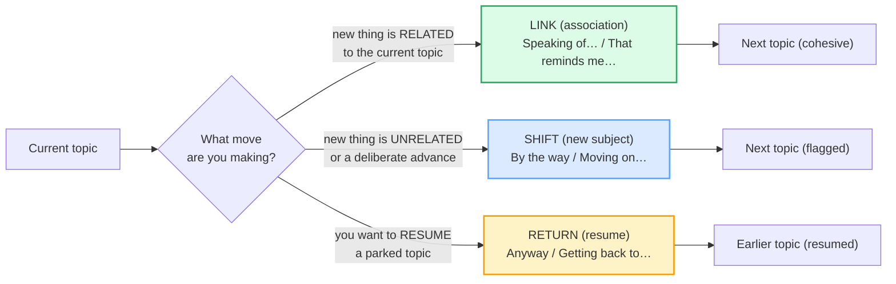
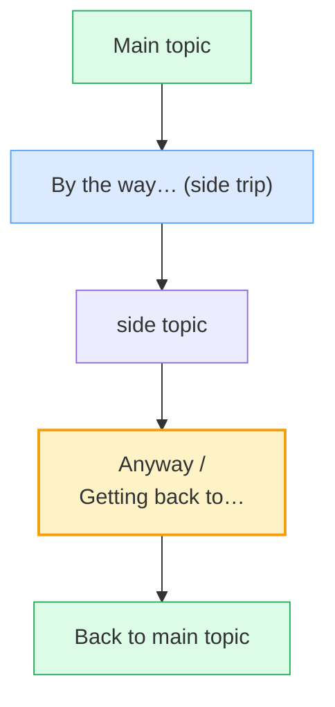

# Transitioning Topics

> **Phase 1 · speech_acts · bundle #21 · Days 41–42.**
> *'Speaking of…' / 'That reminds me…' / 'Anyway.'*
>
> 🔗 Builds on [FINAL CONSONANTS](../pronunciation/FINAL_CONSONANTS.md) (every
> transition ends in a /ŋ/, /d/ or /kt/ a Vietnamese learner drops) and on
> [INTERRUPTING](./INTERRUPTING.md) — the "As I was saying…" line you learned
> there is a *topic return* marker, and this bundle puts it in its full family.
> Sibling: [SMALL TALK](./SMALL_TALK.md) — small talk lives or dies on whether
> you can **bridge** from one topic to the next instead of jumping cold.

---

## Why this is bundle #21 (read this first)

Vietnamese conversation is **relationship-led and topic-chained by association**:
one thought reminds the speaker of another, so the talk simply drifts to the
next topic without any signpost (Cultural Atlas, VNU Journal). The two speakers
share so much context — family, status, the running situation — that **naming
the topic change out loud would feel redundant or even stiff**. English
conversation runs the opposite way: it is **linear and signposted**, and a
listener who is handed a brand-new topic with **no bridge** experiences it as a
non-sequitur — "wait, where did that come from?" The Vietnamese learner lands in
one of three failure modes:

1. **Abrupt topic jumps** — drops a new topic with no marker ("The weather is
   nice. I bought a new phone.") → conversation feels disjointed; the listener
   silently rebuilds the thread.
2. **Overuses `and` as a universal connector** ("…and I went to the beach, and
   my boss called, and the meeting is Tuesday") → every topic sounds equally
   important, no signal which is the side trip and which is the main thread.
3. **Silent awkward transitions** — senses the jump, freezes, waits for the
   other person → the conversation stalls, and the learner reads as hesitant.

This bundle teaches the structural fix: **three families of topic markers** —
**link** via association, **shift** to a new subject, **return** to an earlier
one — deployed **at the boundary, before the new content**. Say the marker
first, then the topic. That one habit makes a Vietnamese learner's English
sound instantly more fluent than 100 new vocabulary words.

---

## 1. The mechanism: topic markers as road signs

A topic marker is a **discourse marker** (Fraser, 2009; Schiffrin, 1987) whose
only job is to **tell the listener what kind of topic move is coming**, so the
listener can prepare. English listeners lean on these markers heavily because
English packs more new information per turn than Vietnamese — without a signpost,
the listener cannot tell a *side trip* from a *main advance*.

The single rule: **the marker rides in front of the new topic, not after it.**
"**Speaking of** Mai, did you see her talk?" is fluent; "Did you see Mai's talk,
**speaking of** Mai" is broken. The marker is the door, and you walk through it
forward.

> From `topic_transitions_corpus.md`:
>
> | Speaking of… | By the way… | Anyway |
> |---|---|---|
> | /ˈspiːkɪŋ əv/ | /baɪ ðə ˈweɪ/ | /ˈeniweɪ/ |
>
> One from each family — **link**, **shift**, **return**. All three are real
> dictionary idioms, not paraphrases: Cambridge lists `speaking of someone/
> something`, `by the way`, and gives `anyway` its own "as a discourse marker"
> grammar section.

---

## 2. Link via association (the "related thought" joiners)

When the new topic is **related** to the current one, name the connection out
loud. These two are the highest-frequency linkers in spoken English — both
appear in the Fraser (2009) and JSTOR topic-marker inventories.

| # | Chunk | When to use | Register |
|---|---|---|---|
| 1 | **Speaking of…** | the new topic shares a word/theme with the current one | neutral |
| 2 | **That reminds me…** | the current topic *triggered* a related thought | neutral |

> From `topic_transitions_corpus.md` (verbatim attestations):
>
> - "**Speaking of** birthdays, Abe's is Friday." — Cambridge, *speaking of
>   someone/something* idiom entry.
> - "**That** (= what you have just said, done, etc.) **reminds me**, I must get
>   some cash." — Oxford Advanced Learner's Dictionary, *remind* entry.
> - "Oh, **that reminds me**, we were invited to John's for dinner." — Fraser
>   (2009), *An approach to discourse markers*.

**The mechanism:** `Speaking of` **names the shared anchor word** ("Speaking of
Mai…", "Speaking of birthdays…"), so the listener hears the link explicitly.
`That reminds me` names the **mental event** ("this just came to mind because of
what you said"), so the listener hears that the new topic is a triggered
association, not a random jump. Both keep the conversation **cohesive**.

**The Vietnamese trap:** learners drop the linker and jump straight to the new
topic, expecting the listener to infer the association (which works in
Vietnamese because the shared context is dense). In English the listener spends
two seconds going "…huh?" before they reconstruct the link — by then the speaker
is three sentences in. Drill the linker **before** the topic as one fixed
chunk.

---

## 3. Shift to a new subject (the "I'm changing the topic" markers)

When the new topic is **unrelated** to the current one, or you are making a
**deliberate advance** (next agenda item, next story), flag the boundary. These
three cover the register range from casual to meeting-formal.

| # | Chunk | When to use | Register |
|---|---|---|---|
| 3 | **By the way…** | a side point, possibly unrelated, often small | neutral |
| 4 | **Changing the subject…** | flagging a deliberate move away | neutral |
| 5 | **Moving on…** | the meeting-room signpost to the next item | formal |

> From `topic_transitions_corpus.md` (verbatim attestations):
>
> - "I think we've discussed everything we need to — **by the way**, what time
>   is it?" — Cambridge, *by the way* idiom entry.
> - "I'd tried to explain the situation, but he just **changed the subject**."
>   — Cambridge, *change the subject* phrase (B2).
> - `Moving on` — Cambridge, *move on* phrasal verb ("to start doing something
>   new"); the canonical meeting signpost.

**The mechanism:** `By the way` is the lightest shifter — it flags "this is a
side point, don't weigh it against the main thread." `Changing the subject`
names the move explicitly, useful when the current topic is uncomfortable or
exhausted. `Moving on` is the **agenda signpost** — it says "we're done with
item N, here is item N+1"; use it in meetings and presentations (🔗 see
[SHORT PRESENTATIONS](../workplace/SHORT_PRESENTATIONS.md) for the full
signposting family: *First…, next…, finally…*).

**The Vietnamese trap:** learners misuse `By the way` for a **related** topic
("Speaking of Mai — by the way, did you see her talk?"). That doubles the
markers and cancels them out. Rule: **related → `Speaking of` / `That reminds
me`; unrelated → `By the way` / `Changing the subject`.** Never both at once.

---

## 4. Return to an earlier subject (the "getting back" markers)

When a topic was **parked** for a side trip (a `By the way` digression, an
interruption), these markers bring the conversation home. They are the mirror
of the shifters.

| # | Chunk | When to use | Register |
|---|---|---|---|
| 6 | **Anyway** | closing a side trip / resuming the main thread | neutral |
| 7 | **Getting back to…** | resuming an explicitly parked topic | neutral |
| 8 | **As I was saying…** | resuming one's own interrupted point | neutral |

> From `topic_transitions_corpus.md` (verbatim attestations):
>
> - "**Anyway**, as I said, I'll be away next week." — Cambridge, *anyway*
>   discourse-marker grammar section.
> - "So, **anyway**, back to what I was saying." — Oxford, *anyway* sense 3.
> - `Getting back to…` and `As I was saying…` — both in the British Council /
>   EAQUALS Core Inventory for General English (Continuing discourse section).

**The mechanism:** `Anyway` is the **lightest returner** — it closes whatever
side trip just happened and drops you back on the main thread ("…anyway, where
were we?"). `Getting back to` **names the topic you're returning to** ("Getting
back to the budget…"), so the listener orients instantly. `As I was saying` is
the resume-**my-interrupted-point** line — it reclaims your own turn after
someone broke in (🔗 see [INTERRUPTING](./INTERRUPTING.md) §4 for the turn-
taking mechanics).

**The Vietnamese trap:** after a digression, learners **forget where the main
thread was** and start a fresh topic instead of returning. The result: every
side trip costs the conversation a topic, and by minute ten the thread is gone.
Drill `Anyway` + `Getting back to` as the **return ticket** — without them you
never come home.

---

## 5. Cheat sheet — the ≤8 survival chunks

The Pareto set. Drill these eight aloud until each one leaves the mouth as a
**single chunk** at the topic boundary, before the new content. (Every row is a
corpus attestation above.)

| # | Chunk | IPA | Why it's here |
|---|---|---|---|
| 1 | **Speaking of…** | /ˈspiːkɪŋ əv/ | LINK — names the shared anchor word (bundle's pinned example) |
| 2 | **That reminds me…** | /ðæt rɪˈmaɪndz miː/ | LINK — names the triggered association |
| 3 | **By the way…** | /baɪ ðə ˈweɪ/ | SHIFT — the lightest side-point marker |
| 4 | **Changing the subject…** | /ˈtʃeɪndʒɪŋ ðə ˈsʌbdʒekt/ | SHIFT — names the topic move explicitly |
| 5 | **Moving on…** | /ˈmuːvɪŋ ɒn/–/ˈmuːvɪŋ ɑːn/ | SHIFT — the meeting-room signpost |
| 6 | **Anyway** | /ˈeniweɪ/ | RETURN — closes a side trip (bundle's pinned example) |
| 7 | **Getting back to…** | /ˈɡetɪŋ bæk tə/ | RETURN — names the topic you're resuming |
| 8 | **As I was saying…** | /əz aɪ wəz ˈseɪɪŋ/ | RETURN — reclaims your interrupted point |

> Open [`topic_transitions.html`](./topic_transitions.html) to drill these as
> flip cards, hear native clips, play the topic-shift role-play, shadow, and
> write.

---

## 6. Vietnamese → English L1 pitfalls table

The "expert payoff." These are the specific interference traps a Vietnamese
speaker hits on transitioning topics — extend, don't replace, the seed rows
from the spec.

| Vietnamese trap (what you do) | English fix (what to do instead) |
|---|---|
| **Jumps topics with no bridge** — "The weather is nice. I bought a new phone." — because Vietnamese topic-chains by association need no signpost | Always deploy a marker **before** the new topic. Related → `Speaking of…` / `That reminds me…`; unrelated → `By the way…`. The marker is the bridge, not optional decoration. |
| **Overuses `and` as a universal connector** — "…and I went to the beach, and my boss called, and the meeting is Tuesday" | Replace `and` with the right marker for the move. Side trip → `By the way`; advance → `Moving on`; return → `Anyway`. `and` chains equal items; markers **rank** them. |
| **Silent awkward transitions** — senses the jump, freezes, waits for the other person | Drill the **linker + topic** chunk aloud until it fires automatically. The 1-second pause to insert a marker is *fluent*, not hesitant — it shows you're managing the conversation. |
| **Misuses `By the way` for a related topic** — "Speaking of Mai — by the way, did you see her talk?" (doubles + cancels the markers) | Rule: **related → `Speaking of` / `That reminds me`; unrelated → `By the way` / `Changing the subject`.** Never stack two markers for one move. |
| **Forgets where the main thread was** after a digression → starts a fresh topic instead of returning | Drill `Anyway` + `Getting back to {topic}` as the **return ticket**. After every `By the way` side trip, plan the `Anyway` that brings you home. |
| **Stresses the wrong syllable in `anyway`** → "any-WAY" (mapping the Vietnamese even-syllable rhythm onto English) | Stress the **first** syllable: **ANY**way /ˈeniweɪ/. Tap the table on "ANY", not on "way". 🔗 See [SENTENCE STRESS](../pronunciation/SENTENCE_STRESS.md). |
| **Drops the final /ŋ/ in `speaking` / `saying`** → "speakin of", "as I was sayin" | Hold the back of the tongue up for /ŋ/ and release audibly. The /ŋ/ is what makes it a complete discourse marker, not a mumbled filler. 🔗 See [FINAL CONSONANTS](../pronunciation/FINAL_CONSONANTS.md). |
| **Drops the final /d/ in `remind`** → "That remin' me" | Touch the tongue to the /d/ ridge and release. /rɪˈmaɪnd/ — the final /d/ carries the grammar (3rd person `-s` follows it: `reminds`). |
| **Drops the /kt/ cluster in `subject`** → "Changing the subje" | Drill the cluster tight: /ˈsʌbdʒekt/. No schwa inserted ("subje-kuh"), no final /t/ dropped. 🔗 See [CONSONANT CLUSTERS](../pronunciation/CONSONANT_CLUSTERS.md). |
| **Translates "nói về / về vấn đề đó" too literally** → "About the problem that…" as a topic opener | Use the English fixed chunk instead: `Speaking of {X}` / `Getting back to {X}`. The Vietnamese topicalisation construction has no direct English equivalent and sounds bookish. |
| **Uses `Incidentally` / `On a different note` too early** — formal markers deployed in casual chat, sounding stiff | Match register. Casual chat → `By the way` / `Anyway`. Formal meeting → `Moving on` / `I'd like to turn to`. Save the Latinate markers for writing. |

---

## How to practise this bundle (the daily 20 min)

1. **READ** (5 min) — this guide, §1–§4.
2. **SHADOW** (7 min) — open `topic_transitions.html`, drill the 8 flip cards +
   the role-play **aloud**. Pay special attention to deploying the marker
   **before** the topic, and to the stressed first syllable of **ANY**way.
3. **PRODUCE** (8 min) — the writing task: write **2 transition sentences** —
   one with `Speaking of…`, one with `Getting back to…`. Read each aloud into a
   recorder; check the marker comes first and every final consonant is audible.

---

## Sources

- Cambridge Advanced Learner's Dictionary —
  https://dictionary.cambridge.org/dictionary/english/{word_or_phrase}
  (entries for *anyway* — UK/US /ˈen.i.weɪ/, the "Anyway as a discourse marker"
  grammar section, "Anyway, as I said, I'll be away next week."; *by the way*
  idiom A2, "by the way, what time is it?"; *speaking of someone/something*
  idiom, "speaking of birthdays, Abe's is Friday."; *subject* noun /ˈsʌb.dʒekt/
  + *change the subject* B2, "he just changed the subject."; *move on* phrasal
  verb; *speaking*, *move*, *back*, *incidentally*; weak-form notes for *of*
  /əv/, *to* /tə/, *the* /ðə/, *was* /wəz/, *as* /əz/.)
- Oxford Advanced Learner's Dictionary —
  https://www.oxfordlearnersdictionaries.com/definition/english/{word}
  (*anyway* B1, sense 3 "used when changing the subject… or returning to a
  subject", "So, anyway, back to what I was saying." cross-checks the Cambridge
  form /ˈeniweɪ/; *remind* — "That (= what you have just said) reminds me, I
  must get some cash.", /rɪˈmaɪnd/.)
- Fraser, B. (2009), *An approach to discourse markers*, International Review of
  Pragmatics 1: 293–320 — topic-management marker class (`by the way`, `that
  reminds me`, `speaking of`, `incidentally`); "Oh, that reminds me, we were
  invited to John's for dinner."
  https://www.researchgate.net/publication/245296163_An_approach_to_discourse_markers
- Müller, S. (2005), *Types of English discourse markers* (JSTOR 44362602) —
  topic-orienting markers.
  https://www.jstor.org/stable/44362602
- *Discourse Markers across Language* (SciSpace PDF, drawing on Schiffrin 1987)
  — `speaking of`, `that reminds me`, `to return to my original point`.
  https://scispace.com/pdf/discourse-markers-across-language-41yiav8dgm.pdf
- British Council / EAQUALS Core Inventory for General English — the Continuing
  discourse section lists `Anyway`, `As I was saying`, `Getting back to`.
  https://www.eaquals.org/wp-content/uploads/EAQUALS_British_Council_Core_Curriculum_April2011.pdf
- Cambridge *English Vocabulary in Use* (Upper-Intermediate, McCarthy &
  O'Dell) — `as I was saying` under Everyday fixed expressions.
- Cultural Atlas, "Vietnamese — Communication" — relationship-led, topic-chained
  discourse vs English linear signposted discourse.
  https://culturalatlas.sbs.com.au/vietnamese-culture/vietnamese-culture-communication
- VNU Journal of Science, "Communication Across Cultures" — Vietnamese
  conversational structure vs English.
  https://js.vnu.edu.vn/FS/article/view/2661/3237
- Native audio: YouGlish —
  https://youglish.com/pronounce/{chunk_or_phrase_with_underscores}/english/us?
- Frequency methodology: wordfrequency.info (spoken sub-corpus) —
  https://www.wordfrequency.info/
