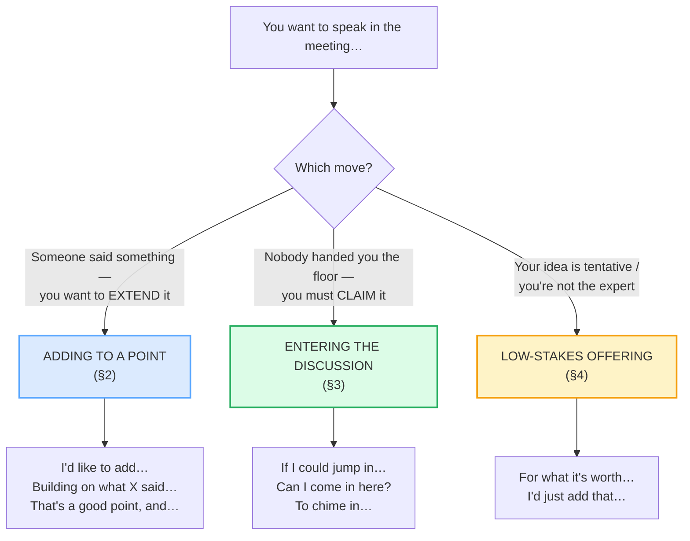

# Contributing in Meetings

> **Phase 2 · workplace · bundle #32 · Days 63–64.**
> *"I'd like to add…" / "Building on what X said."*
>
> 🔗 Builds on [MEETING OPENINGS](./MEETING_OPENINGS.md) (you've opened the
> meeting — now *speak inside* it). Sharpens into
> [DIPLOMATIC DISAGREEMENT](./DIPLOMATIC_DISAGREEMENT.md) (the disagreeing
> sibling of *building on*). Relies on
> [INTERRUPTING](../speech_acts/INTERRUPTING.md) (Phase 1) for the floor-taking
> move and on [LINKING](../pronunciation/LINKING.md) for the connected-speech
> rhythm of *I'd like to* /aɪdˈlaɪktə/.

---

## Why this is the bundle that separates the silent from the fluent

In a Vietnamese-language meeting, the polite junior *listens*. Hierarchy is
strong, face (*thể diện*) is precious, and a junior waits to be *called* by a
senior before speaking; an unsolicited opinion can read as disrespectful. The
cost of silence is low.

In an English-language meeting, the math inverts. **Silence reads as
disengagement, not respect.** Facilitators expect proactive contribution, and
the highest-value move is not a lone idea but the **collaborative build** —
"I'd like to add…", "Building on what X said…", "That's a good point, and…".
A learner who waits to be called may never be called. This bundle teaches the
chunks that let you *enter* the discussion and *extend* it, face intact.

---

## 1. The three moves of a contributor

Every useful contribution in an English meeting is one of three pragmatic
moves. Knowing the move tells you which chunk to reach for:

> From `contributing_corpus.md` (the three moves, verbatim):
>
> - **Adding to a point** → **I'd like to add…** /aɪd ˈlaɪk tə æd/, **Building
>   on what X said…** /ˈbɪldɪŋ ɒn wɒt ɛks sɛd/, **That's a good point, and…**
>   /ðæts ə ɡʊd ˈpɔɪnt ænd/
> - **Entering the discussion** → **If I could jump in…**
>   /ɪf aɪ kʊd dʒʌmp ɪn/, **Can I come in here?**
>   /kæn aɪ kʌm ɪn hɪə/, **To chime in…** /tə tʃaɪm ɪn/
> - **Low-stakes offering** → **For what it's worth…**
>   /fə wɒt ɪts wɜːθ/ UK · /fər wʌts wɜːrθ/ US

---

## 2. Adding to a point (the highest-value move)

This is the move English meetings reward most: take a colleague's idea and
*build* on it. It signals collaboration, it advances the thread, and — crucially
for the face-conscious learner — it **borrows the other person's authority** so
yours never has to stand alone.

> From `contributing_corpus.md`:
>
> | Building on what X said… | I'd like to add… |
> |---|---|
> | /ˈbɪldɪŋ ɒn wɒt ɛks sɛd/ UK · /ˈbɪldɪŋ ɑːn wʌt ɛks sɛd/ US | /aɪd ˈlaɪk tə æd/ |
>
> Oxford Learner's records `build on` as "to use something as a basis for
> further progress" with the example *This study builds on earlier work.* That is
> exactly the meeting move: the colleague's idea is the *earlier work*; yours
> is the *further progress*.

**Why "Building on what X said" beats "But I think…":** "But" deletes the prior
point; "Building on" *credits* it and then extends. The first costs the speaker
face (in any culture); the second adds to both speakers' credit.

---

## 3. Entering the discussion (claiming the floor politely)

When nobody has invited you, you must invite yourself — but politely. The
politeness comes from **hedging** (*if I could*, *can I*) plus the **collaborative
frame** (*chime in* implies agreement, not contradiction).

> From `contributing_corpus.md`:
>
> - **If I could jump in…** /ɪf aɪ kʊd dʒʌmp ɪn/ — Oxford `jump in` = "to
>   interrupt a conversation" (*Before she could reply Peter jumped in with an
>   objection*). The *If I could* front-hedge makes the interruption courteous.
> - **To chime in…** /tə tʃaɪm ɪn/ — Cambridge `chime in` = "to interrupt or
>   speak in a conversation, usually to agree with what has been said." The
>   *agree* framing is what keeps it friendly.

🔗 See [INTERRUPTING](../speech_acts/INTERRUPTING.md) for the harder,
floor-holding version ("Sorry to interrupt…"); here we use the *softer*
entering move because a brainstorm expects contributions, not objections.

---

## 4. Low-stakes offering (the face-saving hedge)

When you're not the expert or the idea is half-formed, *For what it's worth…*
does the face-management work for you: it tells the room "feel free to ignore
this," so a rejection costs nothing.

> From `contributing_corpus.md`:
>
> | For what it's worth… |
> |---|
> | /fə wɒt ɪts wɜːθ/ UK · /fər wʌts wɜːrθ/ US |
>
> Merriam-Webster glosses the idiom as "an expression used to say that one is
> not sure how helpful something one is about to say will be." That is the
> pragmatic contract: low stakes, low face-risk, still on the record.

---

## 5. Cheat sheet — the ≤8 survival chunks

The Pareto set. Drill these eight aloud until the floor-taking is automatic.
(Every row is a corpus attestation above.)

| # | Chunk | IPA | Why it's here |
|---|---|---|---|
| 1 | **I'd like to add…** | /aɪd ˈlaɪk tə æd/ | the canonical polite addition |
| 2 | **Building on what X said…** | /ˈbɪldɪŋ ɒn wɒt ɛks sɛd/ | the collaborative build — credits + extends |
| 3 | **Just to add to that…** | /dʒʌst tə æd tə ðæt/ | lighter version of #1 |
| 4 | **That's a good point, and…** | /ðæts ə ɡʊd ˈpɔɪnt ænd/ | validate, then extend |
| 5 | **If I could jump in…** | /ɪf aɪ kʊd dʒʌmp ɪn/ | polite floor-claim |
| 6 | **Can I come in here?** | /kæn aɪ kʌm ɪn hɪə/ | ask to enter |
| 7 | **To chime in…** | /tə tʃaɪm ɪn/ | enter + agree |
| 8 | **For what it's worth…** | /fə wɒt ɪts wɜːθ/ | low-stakes hedge |

> Open [`contributing.html`](./contributing.html) to drill these as flip cards,
> hear native clips, play the brainstorm role-play, shadow, and write a
> build-on line.

---

## 6. Vietnamese → English L1 pitfalls table

The "expert payoff." These are the specific interference traps a Vietnamese
speaker hits when contributing in an English-language meeting — extend, don't
replace, the seed rows from the spec.

| Vietnamese trap (what you do) | English fix (what to do instead) |
|---|---|
| **Waits to be called by a senior** — hierarchy says juniors speak only when invited; you stay silent through the whole meeting | English meetings expect **proactive contribution**. Use *If I could jump in…* / *Can I come in here?* to claim the floor yourself. Silence reads as disengagement, not respect. |
| **Fears a "wrong" idea will lose face** (*thể diện*) → under-contributes, even when you have a relevant point | Use the low-stakes hedge **For what it's worth…** or **I'd just add that…** — it tells the room the idea is tentative, so a rejection costs no face. A half-formed idea said aloud beats a perfect idea unsaid. |
| **Missing the "build on" move** — Vietnamese discussion culture favors independent positions, not chaining off a colleague | Reach for **Building on what X said…** / **That's a good point, and…** — the collaborative build is the highest-value move in an English meeting. It credits the colleague *and* extends the thread. |
| **Drops the final consonant** on *point*, *add*, *build* → "poin'", "ad'", "bil'" | Release every final: *point* /pɔɪnt/, *add* /æd/, *build* /bɪld/. The /t/ and /d/ carry the meaning. 🔗 See [FINAL CONSONANTS](../pronunciation/FINAL_CONSONANTS.md). |
| **Reduces "I'd like to" to "I like"** — drops the contraction /d/ → the polite hedge vanishes | Drill the contraction chunk: **I'd** /aɪd/ + **like to** /ˈlaɪk tə/ → /aɪd ˈlaɪk tə/. The /d/ is the past-purpose politeness marker; losing it sounds blunt ("I like to add" = a statement of preference, not a request). 🔗 See [LINKING](../pronunciation/LINKING.md). |
| **Avoids direct contradiction but says nothing** — silent disagreement instead of a diplomatic alternative | The English move is to *build then pivot*: **That's a good point, and…** / **Building on that…** followed by your alternative. Silence is invisible; a hedged alternative is visible collaboration. 🔗 See [DIPLOMATIC DISAGREEMENT](./DIPLOMATIC_DISAGREEMENT.md). |
| **Mistakes "chime in" for rude interruption** — translates it as cutting people off | *Chime in* is explicitly the **friendly** entry (Cambridge: "usually to agree"). Use it when you want to *support* a point, not block one. The rude cousin is *butt in* / *barge in* — avoid those. |
| **Stresses the wrong syllable** in *contribute* → "CON-tri-bute" | Stress the **second** syllable: *con-TRIB-ute* /kənˈtrɪbjuːt/. (Oxford confirms.) Mis-stress marks you instantly as non-native. 🔗 See [WORD STRESS](../pronunciation/WORD_STRESS.md). |

---

## How to practise this bundle (the daily 20 min)

1. **READ** (5 min) — this guide, §1–§4.
2. **SHADOW** (7 min) — open `contributing.html`, drill the 8 flip cards +
   the brainstorm role-play **aloud**, exaggerating the contractions
   (*I'd* /aɪd/, *what's* /wɒts/) and the final consonants (*point*, *add*).
3. **PRODUCE** (8 min) — the writing task: write a contribution line that
   builds on a colleague's point ("Building on what [name] said, I'd add
   that…"). Say it aloud; record and self-check the contraction + finals.

---

## Sources

- Oxford Advanced Learner's Dictionary — https://www.oxfordlearnersdictionaries.com/definition/english/{add_1,build-on,jump-in,come-in,come-back-to,contribute} (entries for *add, build on, jump in, come in, come back to, contribute*; verb-forms IPA tables for *add* /æd/ → *adding* /ˈædɪŋ/ and *contribute* /kənˈtrɪbjuːt/ → *contributing* /kənˈtrɪbjuːtɪŋ/).
- Cambridge Advanced Learner's Dictionary — https://dictionary.cambridge.org/dictionary/english/{point,discussion,idea,suggestion} and https://dictionary.cambridge.org/us/dictionary/english/chime-in (*point, chime in, idea, discussion, suggestion*; `chime` /tʃaɪm/).
- Merriam-Webster — https://www.merriam-webster.com/dictionary/for%20what%20it%27s%20worth (idiom: *for what it's worth*).
- Ludwig.guru — https://ludwig.guru/s/i+would+like+to+add+something (real usage of *I'd like to add*).
- Cambridge Dictionary Blog — https://dictionaryblog.cambridge.org/2020/01/29/let-down-and-look-after-the-difference-between-phrasal-verbs-and-prepositional-verbs/ (real usage).
- Nguyen, "The systematic reduction of English syllable-final consonants" (GMU Linguistics Club) — https://orgs.gmu.edu/lingclub/WP/texts/6_Nguyen.pdf
- "Vietnamese Phonology: A Complete Guide" (Remitly) — https://www.remitly.com/blog/education/vietnamese-phonology-guide/
- Native audio: YouGlish — https://youglish.com/pronounce/{chunk}/english/us?
- Frequency methodology: wordfrequency.info (spoken sub-corpus) — https://www.wordfrequency.info/
