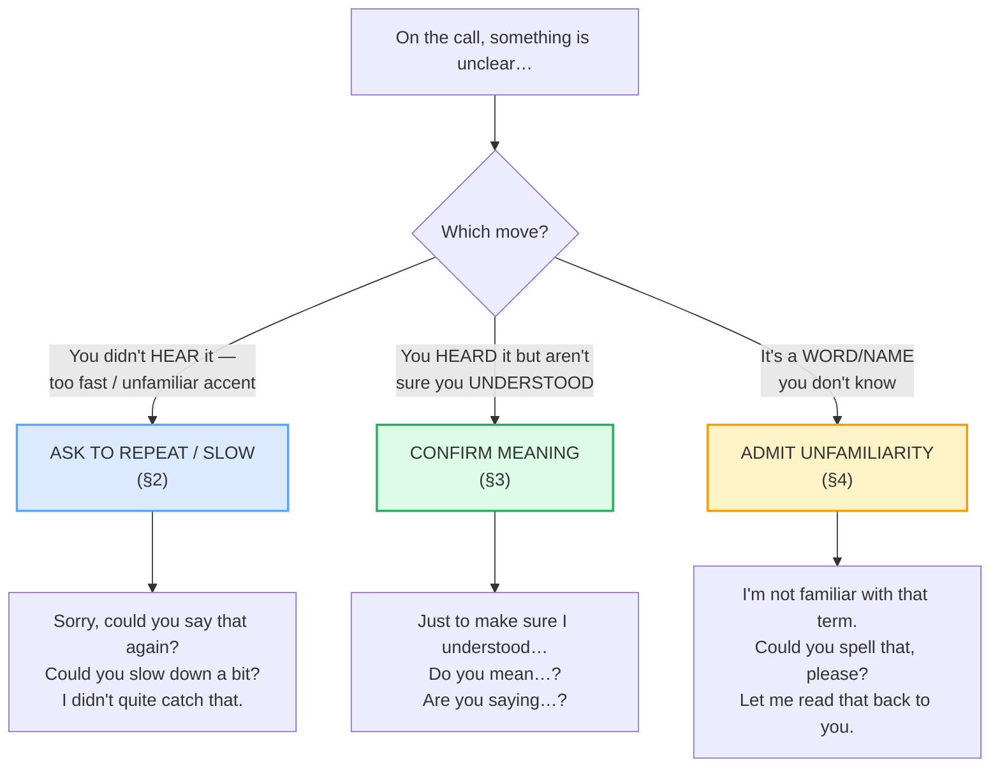

# Cross-Cultural Clarification

> **Phase 2 · workplace · bundle #41 · Days 81–82.**
> *Checking meaning politely across accents/cultures.*
>
> 🔗 This is the **cross-cultural / professional register** of
> [CLARIFYING](../speech_acts/CLARIFYING.md) (Phase 1, casual). Where the casual
> bundle gives you *"Sorry, I didn't catch that" / "What do you mean by…?"*, this
> bundle adds the ELF (English as a Lingua Franca) layer: how to clarify across an
> unfamiliar accent, a fast speaker, or a term you've never met — on a video call
> where silence is costly. Relies on
> [CHECKING UNDERSTANDING](../speech_acts/CHECKING_UNDERSTANDING.md) for the
> confirm-back move and on [FINAL CONSONANTS](../pronunciation/FINAL_CONSONANTS.md)
> + [LINKING](../pronunciation/LINKING.md) for *catch* /kætʃ/ and the weak *could
> you* /kʊdʒə/.

---

## Why this is the bundle that saves you from the smile-and-nod disaster

In a Vietnamese-language interaction, if you don't understand, the polite move is
often to **save face for everyone**: you smile, you nod, you let it pass.
Hierarchy is strong (*thể diện* — face — is precious), and admitting "I didn't
understand" can feel like losing face or, worse, implying the speaker was unclear.
The cost of a silent misunderstanding is usually low — you can recover later,
offline.

In an English-language **workplace / ELF** setting, the math inverts. A
smile-and-nod hides a gap that explodes later: the wrong feature ships, the wrong
deadline is set, the wrong name lands on the contract. **In ELF, explicit
clarification is the norm, not rudeness.** The research consensus (Mauranen,
Cambridge CUP; Baker, Taylor & Francis) is that ELF communication is
*co-constructed* — both speakers accommodate, and asking *"Do you mean…?"* is the
competence, not a deficit. A native English speaker on a call with a German and a
Japanese colleague asks for repetition too; it is not a Vietnamese problem.

This bundle gives you the three polite moves that keep a cross-cultural call on
the rails: **ask to repeat / slow down**, **confirm meaning**, and **admit
unfamiliarity** — all framed so neither side loses face.

---

## 1. The three clarification moves

Every cross-cultural clarification is one of three pragmatic moves. Knowing the
move tells you which chunk to reach for:

> From `cross_cultural_clarifying_corpus.md` (the three moves, verbatim):
>
> - **Ask to repeat / slow down** → **Sorry, could you say that again?**
>   /ˈsɒri kʊd juː seɪ ðæt əˈɡen/, **Could you slow down a bit?**
>   /kʊd juː sləʊ daʊn ə bɪt/, **I didn't quite catch that.**
>   /aɪ ˈdɪdnt kwaɪt kætʃ ðæt/
> - **Confirm meaning** → **Just to make sure I understood…**
>   /dʒʌst tə meɪk ʃʊə aɪ ˌʌndəˈstʊd/, **Do you mean…?** /duː juː miːn/,
>   **Are you saying…?** /ɑːr juː ˈseɪɪŋ/
> - **Admit unfamiliarity** → **I'm not familiar with that term.**
>   /aɪm nɒt fəˈmɪl.i.ər wɪð ðæt tɜːm/, **Could you spell that, please?**
>   /kʊd juː spel ðæt pliːz/, **Let me read that back to you.**
>   /let miː riːd ðæt bæk tə juː/

---

## 2. Ask to repeat / slow down (the first-line defence)

When a speaker's accent or speed beats you, the only wrong move is silence. The
polite frame is the same everywhere in English: **apology + modal request** —
*"Sorry, could you…?"* The *could* is the negative-politeness hedge: it makes the
request a question, not an order, so it costs no face on either side.

> From `cross_cultural_clarifying_corpus.md`:
>
> | Could you slow down a bit? | I didn't quite catch that. |
> |---|---|
> | /kʊd juː sləʊ daʊn ə bɪt/ UK · /kʊd juː sloʊ daʊn ə bɪt/ US | /aɪ ˈdɪdnt kwaɪt kætʃ ðæt/ |
>
> Cambridge records `slow down` as "to move slower, or to cause someone or
> something to move slower" and `catch` as "to hear or understand — *I didn't
> quite catch what she said.*" Note the *quite*: it is a **politeness hedge**.
> "I didn't catch that" is blunt; "I didn't *quite* catch that" shares the blame
> (maybe *I* mis-heard, not that *you* mumbled). That single word is what keeps
> the clarification face-safe across cultures.

**Why "What?" is the trap:** A bare "What?" sounds impatient or even rude in
English — it implies the speaker was unclear. The fix is always the softened
*"Sorry?"* (rising intonation) or the full *"Sorry, could you say that again?"*.

---

## 3. Confirm meaning (check that you understood correctly)

The highest-value move in a cross-cultural call: you *think* you understood, so
you **paraphrase it back** before acting on it. This catches the accent-based
mishap before it becomes a shipped mistake. Cambridge itself demonstrates the
construction in the `mean` entry: *"Do you mean the one with short blond hair?"*
/ *"You mean the entire family?"* — a dictionary-attested checking pattern.

> From `cross_cultural_clarifying_corpus.md`:
>
> | Do you mean…? | Just to make sure I understood… |
> |---|---|
> | /duː juː miːn/ | /dʒʌst tə meɪk ʃʊə aɪ ˌʌndəˈstʊd/ UK · /dʒʌst tə meɪk ʃʊr aɪ ˌʌndərˈstʊd/ US |
>
> Cambridge's `mean` entry prints the live examples *"Do you mean the one with
> short blond hair?"* and *"You mean the entire family?"* — so *Do you mean…?* is
> not an invented classroom sentence; it is a real native checking construction
> straight from the dictionary. *Just to make sure* is the diplomatic frame: it
> tells the speaker "this is me double-checking, not you being unclear."

**The two confirm frames differ in force:** *Do you mean…?* asks for a yes/no on
your guess; *Are you saying…?* rephrases the whole point and invites a
correction. Use the second when the stakes are higher (a deadline, a number, a
scope).

---

## 4. Admit unfamiliarity politely (the move Vietnamese learners fear most)

This is the hardest move for a face-conscious learner: admitting you don't know a
term feels like exposing a gap. **In an ELF setting it is the most normal thing
in the world.** The speaker used a word or name you've never met — the competent
move is to ask for it, not to fake it. Cambridge itself models the construction:
*"I'm sorry, I'm not familiar with your poetry."*

> From `cross_cultural_clarifying_corpus.md`:
>
> | I'm not familiar with that term. | Could you spell that, please? |
> |---|---|
> | /aɪm nɒt fəˈmɪl.i.ər wɪð ðæt tɜːm/ UK · /aɪm nɑːt fəˈmɪl.i.jɚ wɪθ ðæt tɜːrm/ US | /kʊd juː spel ðæt pliːz/ |
>
> Cambridge's `familiar` entry prints *"I'm sorry, I'm not familiar with your
> poetry."* — so *I'm not familiar with…* is a dictionary-attested construction.
> Follow it with *"Could you spell that, please?"* for a name or acronym, and
> close with *"Let me read that back to you"* to confirm a number or spelling
> before the call ends. The triple — admit, ask, read back — is the
> face-safe loop that guarantees nothing slips.

---

## 5. Cheat sheet — the ≤8 survival chunks

The Pareto set. Drill these eight aloud until the clarification is automatic.
(Every row is a corpus attestation above.)

| # | Chunk | IPA | Why it's here |
|---|---|---|---|
| 1 | **Sorry, could you say that again?** | /ˈsɒri kʊd juː seɪ ðæt əˈɡen/ | the canonical polite repeat request |
| 2 | **Could you slow down a bit?** | /kʊd juː sləʊ daʊn ə bɪt/ | ask a fast speaker to slow down |
| 3 | **I didn't quite catch that.** | /aɪ ˈdɪdnt kwaɪt kætʃ ðæt/ | softer than "what?" — the *quite* hedges |
| 4 | **Just to make sure I understood…** | /dʒʌst tə meɪk ʃʊə aɪ ˌʌndəˈstʊd/ | diplomatic confirm-back frame |
| 5 | **Do you mean…?** | /duː juː miːn/ | yes/no confirm on your guess |
| 6 | **I'm not familiar with that term.** | /aɪm nɒt fəˈmɪl.i.ər wɪð ðæt tɜːm/ | admit you don't know a word — politely |
| 7 | **Could you spell that, please?** | /kʊd juː spel ðæt pliːz/ | ask for a name/acronym aloud |
| 8 | **Let me read that back to you.** | /let miː riːd ðæt bæk tə juː/ | confirm a number/spelling before you hang up |

> Open [`cross_cultural_clarifying.html`](./cross_cultural_clarifying.html) to
> drill these as flip cards, hear native clips, play the cross-cultural video-call
> role-play, shadow, and write a polite clarification line.

---

## 6. Vietnamese → English L1 pitfalls table

The "expert payoff." These are the specific interference traps a Vietnamese
speaker hits when clarifying across accents/cultures in an ELF workplace —
extend, don't replace, the seed rows from the spec.

| Vietnamese trap (what you do) | English fix (what to do instead) |
|---|---|
| **Smiles and nods to save face** (*thể diện*) when you didn't understand an accent — fakes comprehension to avoid implying the speaker was unclear | In ELF, **explicit clarification is the norm**, not rudeness. Use *Sorry, could you say that again?* / *I didn't quite catch that.* Faking understanding causes costly miscommunication; the competent move is to check. |
| **Internalizes "I should understand everything"** → shame; you blame yourself, not the accent/line/connection | Recognize that **even native speakers ask for repetition** in ELF calls. The default move is to check, not to suffer silently. Asking *Could you slow down a bit?* signals professionalism, not weakness. |
| **Says a bare "What?"** — the direct Vietnamese instinct (*"Cái gì?"*) maps onto the abrupt English "What?" which sounds impatient/rude | Replace with **"Sorry?"** (rising intonation) or the full **"Sorry, could you say that again?"** The *sorry* + *could* licenses the interruption politely. |
| **Stays silent instead of interrupting** an elder/senior — interrupting feels disrespectful in Vietnamese hierarchy | Frame it as a question, not an interruption: **"Sorry, could you…?"** The apology-softener makes a clarification request courteous even mid-sentence. |
| **Drops the *quite* in "I didn't quite catch that"** → says "I didn't catch that" (blunter) or drops the final /tʃ/ on *catch* → "I didn't catch dat" | Keep the **hedging *quite*** — it shares the blame ("maybe *I* mis-heard"). And release the final cluster: *catch* /kætʃ/, not "ca". 🔗 See [FINAL CONSONANTS](../pronunciation/FINAL_CONSONANTS.md). |
| **Goes imperative — "Slow down" / "Repeat"** — Vietnamese imperative style, which sounds bossy in English | Always frame as a **modal question**: *Could you slow down a bit?* The *could you* is negative politeness; the bare imperative sounds like an order. |
| **Mispronounces *familiar*** → "fa-MIL-li-ar" (wrong stress) or flattens /fəˈmɪl.i.jɚ/ → /feˈmilija/ | Stress the **second** syllable: *fa-MIL-i-ar* /fəˈmɪl.i.jɚ/ US · /fəˈmɪl.i.ər/ UK. The /ljɚ/ cluster is hard for Vietnamese — drill it slow. 🔗 See [WORD STRESS](../pronunciation/WORD_STRESS.md). |
| **Fears "I'm not familiar with that term" loses face** → pretends to know the term, then guesses wrong downstream | Use the **admit → ask → read-back** loop: *I'm not familiar with that term. Could you spell that, please? Let me read that back to you.* Asking is the high-status move in ELF; faking it is the costly one. |

---

## How to practise this bundle (the daily 20 min)

1. **READ** (5 min) — this guide, §1–§4.
2. **SHADOW** (7 min) — open `cross_cultural_clarifying.html`, drill the 8 flip
   cards + the video-call role-play **aloud**, exaggerating the *could you*
   /kʊdʒə/ linking, the final /tʃ/ on *catch*, and the second-syllable stress on
   *familiar*.
3. **PRODUCE** (8 min) — the writing task: write a polite clarification line
   (*Just to make sure I understood… / Do you mean…?*). Say it aloud; record and
   self-check the hedge + the final consonants.

---

## Sources

- Cambridge Advanced Learner's Dictionary — https://dictionary.cambridge.org/dictionary/english/{slow-down,catch,mean_1,familiar,spell,read,again,term,quite,understand,say} (entries for *slow down* phrasal verb /sləʊ/–/sloʊ/; *catch* /kætʃ/ "to hear or understand"; *mean* /miːn/ with the checking examples *"Do you mean the one with short blond hair?"* / *"You mean the entire family?"*; *familiar* /fəˈmɪl.i.ər/–/fəˈmɪl.i.jɚ/ with *"I'm sorry, I'm not familiar with your poetry."*; *spell* /spel/; *read* /riːd/; *again* /əˈɡen/; *term* /tɜːm/–/tɜːrm/; *quite* /kwaɪt/; *understood* /ˌʌndəˈstʊd/–/ˌʌndərˈstʊd/; *saying* /ˈseɪɪŋ/).
- Oxford Advanced Learner's Dictionary — https://www.oxfordlearnersdictionaries.com/definition/english/catch_1 (*catch* "to hear or understand"; *spell* "to say or write the letters of a word in the correct order").
- Mauranen, "English as a Lingua Franca and Transcultural Communication," *Ontologies of English* (CUP) — https://www.cambridge.org/core/books/ontologies-of-english/english-as-a-lingua-franca-and-transcultural-communication/3CC88D84A33CA199E11B211F4FD823D4
- Baker, "English as a lingua franca and interculturality," *Language and Intercultural Communication* (Taylor & Francis) — https://www.tandfonline.com/doi/full/10.1080/14708477.2023.2254285
- "English as Lingua Franca" (Bridge Education Group) — https://bridge.edu/languages/wp-content/uploads/2023/09/English-as-Lingua-Franca-English.pdf
- Speech Active, "English Consonant Sounds" (`catch` /kætʃ/) — https://www.speechactive.com/category/english-pronunciation/english-consonant-sounds/
- University of Biskra Phonetics lecture (`catch` /kætʃ/ minimal pair) — http://archive.univ-biskra.dz/moodle2020/pluginfile/268921/mod_resource/content/1/Lecture%201%2B2%2B3_English%20Phonetics%20and%20Phonology_Slideshow_1st%20Year.pdf
- Nguyen, "The systematic reduction of English syllable-final consonants" (GMU Linguistics Club) — https://orgs.gmu.edu/lingclub/WP/texts/6_Nguyen.pdf
- "Vietnamese Phonology: A Complete Guide" (Remitly) — https://www.remitly.com/blog/education/vietnamese-phonology-guide/
- Native audio: YouGlish — https://youglish.com/pronounce/{chunk}/english/us?
- Frequency methodology: wordfrequency.info (spoken sub-corpus) — https://www.wordfrequency.info/
