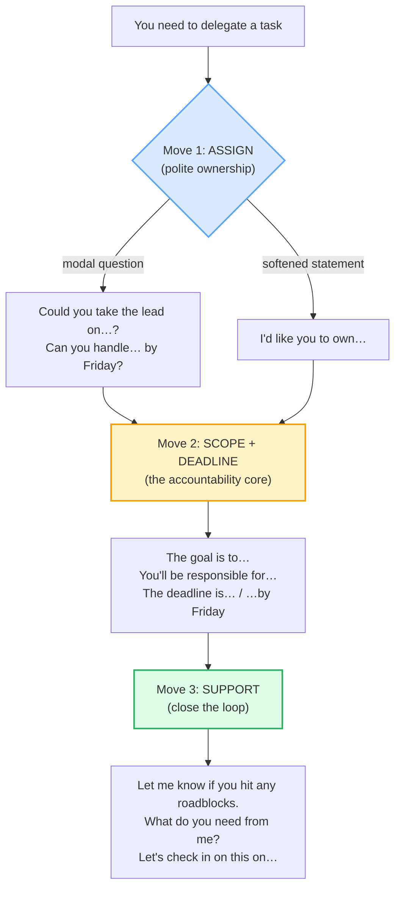

# Delegating & Giving Instructions

> **Phase 2 · workplace · bundle #45 · Days 89–90.**
> *"Could you own X by Y?" — clear, kind, accountable.*
>
> 🔗 This is the **capstone of Phase 2** — the bundle where the workplace skills
> you have drilled all converge. It leans on
> [CONTRIBUTING IN MEETINGS](./CONTRIBUTING.md) (the ownership verbs), on
> [STATUS UPDATES](./STATUS_UPDATES.md) (the follow-up cadence), and on
> [FEEDBACK GIVING](./FEEDBACK_GIVING.md) (SBI redresses the same face-threat a
> direct command does). It feeds straight into Phase 3 — see
> [REQUESTS & REMINDERS](../writing/REQUESTS_REMINDERS.md) for the written
> equivalent ("Could you… by Friday?").

---

## Why this is bundle #45 (read this first)

Vietnamese workplaces run on **hierarchy**. Hofstede's power-distance index
scores Vietnam ≈70 — one of the highest in the world — which means a manager
delegating to a report does it **imperatively**: *"Em làm cái báo cáo này"*
(literally "You do this report") is normal, polite, and expected. The report
hears an order from above and executes it. No face is lost, because the
hierarchy already grants the manager the right to command.

English professional workplaces run on **low power-distance norms**. The *same*
sentence — "Do this report" — sounds **authoritarian, rude, and micromanaging**
to a native English ear. The English delegator wraps the assignment in three
layers of redress:

1. **A polite modal question** — *"Could you take the lead on…?"* (not "Do
   this").
2. **A clear scope + deadline** — *"You'll be responsible for X, by Friday."*
3. **An explicit support offer** — *"Let me know if you hit any roadblocks."*

This three-move arc — **assign → scope + deadline → support** — is the whole
bundle. Master it and you sound like a competent English-speaking lead; skip any
of the three and you sound either bossy (imperative) or vague (no scope).
Vietnamese learners fail this bundle in two opposite directions: they are
**too directive** ("You must do this") when delegating down, and **too vague**
(no deadline, no scope) when delegating across or up, because pinning a peer or
senior down feels face-threatening. English gives you the language to be **clear
+ kind + accountable** at once.

> From `delegating_instructions_corpus.md`:
>
> | Could you take the lead on…? | Let me know if you hit any roadblocks. |
> |---|---|
> | /kʊd juː teɪk ðə liːd ɒn/ UK · /kəd ju teɪk ðə liːd ɑːn/ US | /let miː nəʊ ɪf juː hɪt ˈeni ˈrəʊd.blɒks/ UK · /let miː noʊ ɪf ju hɪt ˈeni ˈroʊd.blɑːks/ US |
>
> The opener assigns ownership *politely* (modal question, not imperative); the
> closer offers support *explicitly* (you do not disappear after handing off).
> Between them sits the scope + deadline. Three moves, one delegation.

---

## 1. The mechanism: why English delegation is polite-ownership, not command

Oxford documents the verb `delegate` /ˈdelɪɡeɪt/ as *"to give part of your
work, power or authority to somebody in a lower position than you"* — and notes
that *"Some managers find it difficult to delegate."* The English word itself
carries the idea that you are **handing over authority**, not issuing an order.
That is why every chunk in this bundle is phrased to **transfer ownership
while preserving the other person's autonomy**.

Skip move 1 → you sound bossy. Skip move 2 → the recipient guesses the scope
and the deadline, and the work misses. Skip move 3 → you have **abdicated**,
not delegated — the task is dumped, not handed off. All three moves, every
time.

---

## 2. Move 1 — Assign (the polite-ownership opener)

The opener's job is to **transfer ownership without sounding authoritarian**.
English gives you two shapes for this:

**A modal question** — *"Could you take the lead on…?"* / *"Can you handle… by
Friday?"* The modal (`could` / `can`) softens the imperative into a request;
the verb (`take the lead on` / `handle`) names ownership, not compliance.

**A softened statement** — *"I'd like you to own…"* The `I'd like you to`
frame (modal `would` + `like`) turns a command into a stated preference, which
is how English managers give an instruction that is *functionally* an order but
*pragmatically* a request.

> From `delegating_instructions_corpus.md` (the three assignment shapes,
> verbatim):
>
> - **Could you take the lead on…?** — /kʊd juː teɪk ðə liːd ɒn/ UK ·
>   /kəd ju teɪk ðə liːd ɑːn/ US — the polite modal question (pinned)
> - **I'd like you to own…** — /aɪd laɪk juː tə əʊn/ UK ·
>   /aɪd laɪk ju tə oʊn/ US — the softened ownership statement
> - **Can you handle… by Friday?** — /kæn juː ˈhæn.dəl baɪ ˈfraɪ.deɪ/ —
>   assignment with the deadline built in

**The Vietnamese trap:** learners reach for *"You must…"* or *"Please do…"*
because that is how hierarchy talks in Vietnamese (*"Em phải làm…"* /
*"Làm ơn làm…"*). Both sound like orders in English. The fix is mechanical —
**swap the imperative for a modal question** (`Could you…?` / `Can you…?`) or
the `I'd like you to…` frame. 🔗 This is the same modal-politeness move you
drilled in [REQUESTING & OFFERING](../speech_acts/REQUESTING_OFFERING.md).

---

## 3. Move 2 — Scope + deadline (the accountability core)

This is the move Vietnamese learners omit most often. Once ownership is
assigned, the English delegator **names the goal, the scope of responsibility,
and the deadline** — explicitly, in the same breath. Cambridge documents `be
responsible for` as the delegation phrase verbatim: *"to have control and
authority over something or someone and the duty of taking care of it"* —
*"He is responsible for the council's waste management department."*
Cambridge Business English documents `deadline` with the full collocation set:
`set/give a deadline`, `a deadline of [date]`, `a tight deadline`, `meet/miss/
extend the deadline`.

> From `delegating_instructions_corpus.md`:
>
> - **The goal is to…** — /ðə ɡəʊl ɪz tə/ UK · /ðə ɡoʊl ɪz tə/ US —
>   naming the outcome (scope-setter)
> - **You'll be responsible for…** — /juːl biː rɪˈspɒn.sə.bəl fə/ UK ·
>   /juːl biː rɪˈspɑːn.sə.bəl fər/ US — naming what is owned end-to-end
> - **The deadline is…** — /ðə ˈded.laɪn ɪz/ — pinning the due date
> - **…by Friday** — /baɪ ˈfraɪ.deɪ/ — the deadline-pinning preposition
>   (`by` = no later than)

**The Vietnamese trap:** in a high-context culture, the scope and the deadline
are often **assumed understood** from the relationship and the setting — so the
Vietnamese delegator says *"Please help with the report"* and expects the
report to know which report, for whom, by when. English professional norms are
**low-context**: if you do not say "by Friday," there is no Friday. The fix is
to **always attach a deliverable + a time**: *"…by end of day Friday,"*
*"…before our Monday standup."* A delegation without a deadline is not a
delegation — it is a wish.

---

## 4. Move 3 — Support (close the loop, never dump and disappear)

The move that separates delegation from **abdication**. After assigning scope
and deadline, the English delegator **explicitly offers help and schedules a
follow-up**. Cambridge documents `check in` (CONTACT sense) — *"to contact
someone by making a phone call, short visit, etc., usually in order to make
sure there are no problems"* — with the collocation `check in with`.
`roadblock` carries the figurative sense "anything that stops progress" —
*"There have been several roadblocks in the peace process."*

> From `delegating_instructions_corpus.md` (the four support shapes, verbatim):
>
> - **Let me know if you hit any roadblocks.** —
>   /let miː nəʊ ɪf juː hɪt ˈeni ˈrəʊd.blɒks/ UK ·
>   /let miː noʊ ɪf ju hɪt ˈeni ˈroʊd.blɑːks/ US — the canonical support
>   offer (pinned)
> - **What do you need from me?** — /wɒt duː juː niːd frɒm miː/ UK ·
>   /wɑːt du ju niːd frɑːm miː/ US — the resource-check question
> - **Let's check in on this on…** — /lets tʃek ɪn ɒn ðɪs ɒn/ UK ·
>   /lets tʃek ɪn ɑːn ðɪs ɑːn/ US — scheduling the follow-up
> - **Let me know how it's going.** — /let miː nəʊ haʊ ɪts ˈɡəʊ.ɪŋ/ UK ·
>   /let miː noʊ haʊ ɪts ˈɡoʊ.ɪŋ/ US — a low-pressure status prompt

**The Vietnamese trap:** the support offer feels redundant — "if they need
help, they will ask." But in a low power-distance workplace, the **delegator is
expected to offer first**; silence reads as indifference or as setting the
report up to fail. The fix is to **always close the delegation with a support
line** — even a short *"Let me know if you hit any roadblocks"* signals "I have
not disappeared, and I am accountable too."

---

## 5. Cheat sheet — the ≤8 survival chunks

The Pareto set. Drill these eight aloud until the three-move arc is automatic.
(Every row is a corpus attestation above.)

| # | Chunk | IPA | Why it's here |
|---|---|---|---|
| 1 | **Could you take the lead on…?** | /kʊd juː teɪk ðə liːd ɒn/ UK · /kəd ju teɪk ðə liːd ɑːn/ US | the polite-ownership opener (modal, not imperative) |
| 2 | **I'd like you to own…** | /aɪd laɪk juː tə əʊn/ UK · /aɪd laɪk ju tə oʊn/ US | the softened ownership statement |
| 3 | **Can you handle… by Friday?** | /kæn juː ˈhæn.dəl baɪ ˈfraɪ.deɪ/ | assignment + deadline in one move |
| 4 | **The goal is to…** | /ðə ɡəʊl ɪz tə/ UK · /ðə ɡoʊl ɪz tə/ US | naming the scope/outcome |
| 5 | **You'll be responsible for…** | /juːl biː rɪˈspɒn.sə.bəl fə/ UK · /juːl biː rɪˈspɑːn.sə.bəl fər/ US | naming the ownership boundary |
| 6 | **…by Friday** | /baɪ ˈfraɪ.deɪ/ | the deadline pin (`by` = no later than) |
| 7 | **Let me know if you hit any roadblocks.** | /let miː nəʊ ɪf juː hɪt ˈeni ˈrəʊd.blɒks/ UK · /let miː noʊ ɪf ju hɪt ˈeni ˈroʊd.blɑːks/ US | the canonical support offer |
| 8 | **Let's check in on this on…** | /lets tʃek ɪn ɒn ðɪs ɒn/ UK · /lets tʃek ɪn ɑːn ðɪs ɑːn/ US | scheduling the follow-up |

> Open [`delegating_instructions.html`](./delegating_instructions.html) to
> drill these as flip cards, hear native clips, play the role-play, shadow, and
> write.

---

## 6. Vietnamese → English L1 pitfalls table

The "expert payoff." These are the specific interference traps a Vietnamese
speaker hits when delegating or giving instructions in English — extend, don't
replace, the seed rows from the spec.

| Vietnamese trap (what you do) | English fix (what to do instead) |
|---|---|
| **Top-down imperative** — "You must do this" / "Do this report" (Vietnamese hierarchy, Hofstede power-distance ≈70, makes imperative sound normal) | Swap the imperative for a **modal question** (`Could you…?` / `Can you…?`) or the `I'd like you to…` frame. 🔗 See [REQUESTING & OFFERING](../speech_acts/REQUESTING_OFFERING.md). |
| **Too vague to save face** — "Please help with the report" with no scope, no deadline (Vietnamese indirectness avoids pinning someone down) | Name the **deliverable + the deadline explicitly**: *"You'll be responsible for the Q3 report, by Friday."* A delegation without a deadline is a wish. |
| **Omits the deadline** — assumes it is "understood" from context (high-context culture) | Always attach a time: *"…by end of day Friday,"* *"…before our Monday standup."* English professional norms are **low-context** — if you don't say it, it isn't there. |
| **Omits ownership language** — uses "help with" / "assist on" instead of `own` / `take the lead on` (feels presumptuous to claim ownership) | Use **ownership verbs**: *"I'd like you to own…"*, *"Could you take the lead on…?"* `own` in English workplace culture = "take full responsibility for," not arrogance. |
| **No support offer** — dumps the task and disappears (assumes "if they need help, they'll ask") | Always close with a **support line**: *"Let me know if you hit any roadblocks"* / *"What do you need from me?"* Silence reads as indifference in a low power-distance workplace. |
| **Struggles delegating to seniors/peers** — Vietnamese age/status hierarchy makes assigning work to an older or senior colleague feel impossible | Use **hedged ownership**: *"I was wondering if you could…"* / *"Would you be able to…?"* 🔗 See [DIPLOMATIC DISAGREEMENT](./DIPLOMATIC_DISAGREEMENT.md) for the hedging toolkit. |
| **Drops the final /k/ in `roadblock`** — Vietnamese has no /bl/ + /k/ coda cluster → "roadblo" | Hold the **/bl/ cluster tight** then release the **/k/** audibly: /ˈrəʊd.blɒk/. Touch the back of the tongue to the soft palate for the /k/. 🔗 See [FINAL CONSONANTS](../pronunciation/FINAL_CONSONANTS.md) + [CONSONANT CLUSTERS](../pronunciation/CONSONANT_CLUSTERS.md). |
| **/θ/ → /t/ in `the` / `Thursday`** — tongue stays behind teeth → "te lead" | Tongue-**between-teeth** for /θ ð/: `the` /ðə/, `Thursday` /ˈθɜːz.deɪ/. 🔗 See [TH SOUNDS](../pronunciation/TH_SOUNDS.md). |
| **Flat intonation on `Could you…?`** — Vietnamese is tonal, so the learner carries word-tone, not pragmatic-intonation → the request sounds like a statement | Give `Could you…?` a **polite rise-then-fall**: rise on `Could`, fall through `take the lead on`, slight rise at the end to mark it as a request. 🔗 See [INTONATION](../pronunciation/INTONATION.md). |
| **Uses `must` / `have to` for polite delegation** — Vietnamese modal system maps obligation onto English `must`, which sounds like a legal contract | Reserve `must` / `have to` for **hard rules** ("You must submit timesheets by Friday" = company policy). For delegation use **`Could you…?`** / **`I'd like you to…`**. |

---

## How to practise this bundle (the daily 20 min)

1. **READ** (5 min) — this guide, §1–§4. Internalize the three-move arc:
   assign → scope + deadline → support.
2. **SHADOW** (7 min) — open `delegating_instructions.html`, drill the 8 flip
   cards + the role-play **aloud**, exaggerating the modal politeness on
   `Could you…?` and the final /k/ on `roadblock`, then relaxing.
3. **PRODUCE** (8 min) — the writing task: write a delegation message (task +
   deadline + support). Use `Could you… by…` and `Let me know if you hit any
   roadblocks`. Read it aloud; check each move is present.

---

## Sources

- Cambridge Advanced Learner's Dictionary —
  https://dictionary.cambridge.org/dictionary/english/{word}
  (entries: *handle_1* [DEAL WITH = be in charge of — *"Who handles the
  marketing in your company?"*], *responsible* [`be responsible for` delegation
  phrase — *"He is responsible for the council's waste management
  department"*], *deadline* [Business English collocations: set/give/meet/miss/
  extend a deadline], *roadblock* [figurative = anything that stops progress],
  *check-in* [phrasal verb CONTACT sense + `check in with`], *own*, *lead*,
  *goal*, *by*, *could*, *you*, *take*, *the*, *on*, *like*, *to*, *can*,
  *Friday*, *let*, *me*, *know*, *if*, *hit*, *any*, *what*, *do*, *need*,
  *from*, *how*, *going*)
- Oxford Advanced Learner's Dictionary, `delegate` (verb) /ˈdelɪɡeɪt/ —
  https://www.oxfordlearnersdictionaries.com/definition/english/delegate_2
  (*"to give part of your work, power or authority to somebody in a lower
  position than you"*; *"Some managers are reluctant to delegate work to their
  subordinates."*)
- Mind Tools, "How to Delegate Effectively" (the assign → scope → support arc)
  — https://www.mindtools.com/auyamr5/how-to-delegate-effectively
- Atlassian, "Healthy delegation" (ownership-language: "I'd like you to own…")
  — https://www.atlassian.com/work-management/guides/delegation
- Harm Reduction Hacks, "Roadblock Tips: Delegation" (attests `roadblock` +
  delegation pairing) —
  https://www.harmreductionhacks.org/2022/06/06/roadblock-tips-delegation/
- @englishonlinewithnice (ESL teaching clip), attests *"Maria, can you take the
  lead on the client presentation next week?"* —
  https://www.tiktok.com/@englishonlinewithnice/video/7509986043731414278
- Brown, P. & Levinson, S. *Politeness: Some Universals in Language Usage*
  (CUP, 1987) — face-threatening acts (FTAs); a direct command threatens the
  hearer's negative face, which modal questions redress.
- Hofstede Insights, "Country Comparison" (Vietnam power-distance ≈70) —
  https://www.hofstede-insights.com/country-comparison/ (explains why
  imperative delegation feels natural to a Vietnamese speaker).
- Native audio: YouGlish — https://youglish.com/pronounce/{chunk}/english/us?
- Frequency methodology: wordfrequency.info (spoken sub-corpus) —
  https://www.wordfrequency.info/
