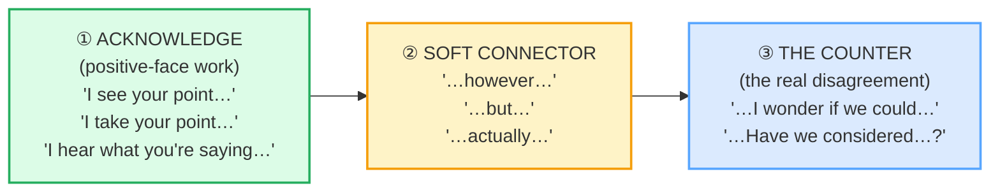

# Diplomatic Disagreement

> **Phase 2 · workplace · bundle #33 · Days 65–66.**
> *"'I see your point, however…' / 'I wonder if we could…'"*
>
> 🔗 This is the **professional register** of disagreement. It builds directly on
> [AGREEING & DISAGREEING (casual)](../speech_acts/AGREEING_DISAGREEING.md) —
> that bundle's *"Not sure I agree, actually"* is fine among friends; this bundle
> is the same move calibrated for a meeting room. It also leans on
> [GIVING HEDGED OPINIONS](../speech_acts/OPINIONS_HEDGED.md) (the *"I'd say…"*
> hedge) and previews [GIVING FEEDBACK](./FEEDBACK_GIVING.md) (SBI — where you
> *must* soften the counter so the hearer can hear it).

---

## Why this bundle exists (read this first)

A Vietnamese learner in an English-speaking meeting usually does one of two
things — both of them costly:

1. **Suppresses the disagreement entirely.** Vietnamese culture prizes harmony
   and *giữ thể diện* (keeping/saving face), so the learner stays silent, nods,
   and the team loses the input.
2. **States the disagreement bluntly** when they finally do speak: *"No, you're
   wrong,"* *"I disagree,"* *"That's not right."* In Vietnamese this sounds
   firm-but-acceptable; in English it lands as an attack on the colleague's
   positive face, and the meeting turns cold.

English professional culture has a **third gear** that Vietnamese does not train:
the **partial-agreement-before-but** pattern. You name the other person's point
first (*"I see your point…"*), *then* introduce your counter with a soft
connector (*"…however,"* *"…but"*), or you **recast the counter as a question**
(*"I wonder if we could…"*). This is not evasion — it is the load-bearing
structure of every disagreement in every English-language meeting, and it is the
single biggest register-climb between casual and professional English.

---

## 1. The mechanism: why English softens disagreement

Brown & Levinson's (1987) politeness theory labels disagreement a **face-
threatening act (FTA)**: it threatens the hearer's **positive face** (their
desire to be liked/approved) and sometimes their **negative face** (their freedom
from imposition). Every language redresses FTAs; English's default professional
redress is the **acknowledge-then-counter** sandwich:

The acknowledgement is **not a concession**. *"I see your point"* means *"I
register that you have an argument"* — it says nothing about whether you agree.
Cambridge records the core idiom verbatim: *"take someone's point — I take your
point (= I understand that what you are saying is important)."* The hearer's face
is paid first; *then* the counter can land without feeling like an ambush.

> From `diplomatic_disagreement_corpus.md`:
> (the acknowledge-then-counter set, verbatim)
>
> - **I see your point, however…** /aɪ ˈsiː jɔː ˈpɔɪnt haʊˈevə/ UK ·
>   /aɪ ˈsiː jɔːr ˈpɔɪnt haʊˈevər/ US
> - **I take your point, but…** /aɪ ˈteɪk jɔː ˈpɔɪnt bʌt/
> - **I hear what you're saying, but…** /aɪ ˈhɪə wɒt jɔː ˈseɪɪŋ bʌt/ UK ·
>   /aɪ ˈhɪr wʌt jɔːr ˈseɪɪŋ bʌt/ US
> - **That's an interesting take, but…** /ðæts ən ˈɪntrəstɪŋ ˈteɪk bʌt/
> - **I'm not sure I agree, actually** /aɪm nɒt ʃʊə(r) aɪ əˈɡriː ˈæktʃuəli/ UK ·
>   /aɪm nɑːt ʃʊr aɪ əˈɡriː ˈæktʃuəli/ US

---

## 2. The question-form counter — disagreement as a collaborative probe

The second engine of diplomatic disagreement is to **turn the counter into a
hedged question**. This is negative-face politeness: a question gives the hearer
an exit, treats the counter as a shared investigation, and lets the group adopt
your view without anyone losing face. Three openers do almost all the work:

| Opener | What it signals | Example finish |
|---|---|---|
| **I wonder if we could…** | a tentative counter framed as a polite suggestion | …look at the timeline again? |
| **Might it be worth considering…?** | a very hedged counter: maybe we should think about X | …a phased rollout instead? |
| **Have we considered…?** | a counter shaped as an inclusive group question | …the compliance angle? |

> From `diplomatic_disagreement_corpus.md`:
> (the tentative/indirect set, verbatim)
>
> - **I wonder if we could…** /aɪ ˈwʌndə(r) ɪf wi kʊd/ UK ·
>   /aɪ ˈwʌndər ɪf wi kʊd/ US — Oxford Learner's documents *"I wonder if…"* as
>   the polite-request/suggestion pattern.
> - **Might it be worth considering…?** /maɪt ɪt bi ˈwɜːθ kənˈsɪdərɪŋ/ UK ·
>   /maɪt ɪt bi ˈwɜːrθ kənˈsɪdərɪŋ/ US — the `worth + -ing` collocation is
>   recorded across Cambridge + Oxford.
> - **Have we considered…?** /hæv wi kənˈsɪdəd/ UK · /hæv wi kənˈsɪdərd/ US —
>   present-perfect question (Cambridge `consider`).

**The Vietnamese trap:** Vietnamese has no obligatory modal/hedging layer of
this kind. A learner who wants to disagree goes straight to the declarative
content (*"We should look at the timeline"* — which sounds like an order), or
worse, *"You should…"*. The question form (*"Have we considered…?"*) is
**structurally unfamiliar** — it feels like asking permission when it is actually
asserting a counter. Drill the question form until it stops feeling weak; in
English, the question form is the *strongest* way to land a counter without
breaking the room.

---

## 3. Delivery notes — the intonation that makes it land

A diplomatic counter is undone by the wrong tune even when the words are right:

- **Acknowledge with a slight rise, then a pause.** *"I see your point… ↑"* (beat)
  → *"…however…"*. The pause is where the hearer's face gets paid. Vietnamese
  learners often run the two halves together (*"I-see-your-point-however…"*),
  which reads as sarcasm — as if the acknowledgement were a throwaway.
- **Drop the pitch on the counter's main stress.** *"…I **won**der if we
  **could**…"* — low and slow reads as considered, not confrontational. A high,
  fast delivery reads as an attack regardless of the words.
- **Actually is a down-toner, not a filler.** *"I'm not sure I agree,
  actually"* — the trailing *actually* signals *"I'm not trying to start a
  fight; this is just where I land."* Without it, *"I'm not sure I agree"*
  alone can sound flat/blunt.

---

## 4. The register ladder (casual → professional)

The same disagreement, four registers. This bundle is the **professional** rung;
🔗 [AGREEING & DISAGREEING](../speech_acts/AGREEING_DISAGREEING.md) covers the
casual rung.

| Register | How you'd say it |
|---|---|
| Blunt (avoid in meetings) | "No, that's wrong." / "I disagree." |
| Casual (friends/peers) | "Not sure I agree, actually." / "Hmm, I don't think so." |
| **Professional (this bundle)** | "I see your point, however… I wonder if we could…?" |
| Very formal (client/exec) | "I take your point. Might it be worth considering…?" |

---

## 5. Cheat sheet — the ≤8 survival chunks

The Pareto set. Drill these eight aloud until the acknowledge-pause-counter rhythm
is automatic. (Every row is a corpus attestation above.)

| # | Chunk | IPA | Why it's here |
|---|---|---|---|
| 1 | **I see your point, however…** | /aɪ ˈsiː jɔː(r) ˈpɔɪnt haʊˈevə(r)/ | the canonical acknowledge-then-counter opener |
| 2 | **I take your point, but…** | /aɪ ˈteɪk jɔː(r) ˈpɔɪnt bʌt/ | slightly more formal variant; CALD idiom |
| 3 | **I hear what you're saying, but…** | /aɪ ˈhɪə(r) wɒt/wʌt jɔː(r) ˈseɪɪŋ bʌt/ | the empathetic acknowledge variant |
| 4 | **That's an interesting take, but…** | /ðæts ən ˈɪntrəstɪŋ ˈteɪk bʌt/ | validate the *viewpoint*, then counter |
| 5 | **I'm not sure I agree, actually** | /aɪm nɒt/nɑːt ʃʊə(r) aɪ əˈɡriː ˈæktʃuəli/ | hedged disagreement + *actually* down-toner |
| 6 | **I wonder if we could…** | /aɪ ˈwʌndə(r) ɪf wi kʊd/ | tentative counter as polite suggestion |
| 7 | **Might it be worth considering…?** | /maɪt ɪt bi ˈwɜː(r)θ kənˈsɪdərɪŋ/ | very hedged counter (negative-face work) |
| 8 | **Have we considered…?** | /hæv wi kənˈsɪdə(r)d/ | inclusive group-question counter |

> Open [`diplomatic_disagreement.html`](./diplomatic_disagreement.html) to drill
> these as flip cards, hear native clips, play the role-play, shadow, and write.

---

## 6. Vietnamese → English L1 pitfalls table

The "expert payoff." These are the specific interference traps a Vietnamese
speaker hits when disagreeing in a professional English setting — extend, don't
replace, the seed rows from the spec.

| Vietnamese trap (what you do) | English fix (what to do instead) |
|---|---|
| **Suppresses disagreement entirely** to preserve harmony (*giữ thể diện* / avoidance of conflict) | Use the acknowledge-then-counter pattern: *"I see your point, however…"* — it lets you disagree *without* breaking harmony. Silence costs the team your input. |
| **States disagreement bluntly** when finally speaking: *"No, you're wrong,"* *"I disagree"* | Never open with the counter. Open with the acknowledgement (*"I take your point…"*), pause, *then* the counter. The acknowledgement is not a concession. |
| **Goes straight to the declarative** ("We should do X" / "You should…") which sounds like an order | Recast the counter as a hedged question: *"I wonder if we could…?"* / *"Have we considered…?"*. The question form is the strongest soft counter in English. |
| **Under-uses the partial-agreement-before-but pattern** (it is structurally unfamiliar in Vietnamese) | Drill the 8-chunk cheat sheet until the *acknowledge → connector → counter* rhythm is automatic. This is the single biggest register-climb to professional English. |
| **Drops the down-toner *actually*** → *"I'm not sure I agree"* alone can sound flat/blunt | Add the trailing *actually*: *"I'm not sure I agree, actually."* It signals "not trying to start a fight." |
| **Runs acknowledge + counter together** ("I-see-your-point-however…") → reads as sarcasm | Insert a real pause after the acknowledge: *"I see your point… ↑" (beat) "…however…"*. The pause is where the hearer's face gets paid. |
| **High, fast, rising intonation on the counter** → sounds confrontational regardless of words | Drop the pitch on the counter's main stress, slow down: *"…I **won**der if we **could**…"*. Low and slow = considered, not attacked. |
| **Confuses *interesting* with *good*** → *"That's an interesting take"* said flatly reads as passive-aggressive | Say *interesting* with a genuine slight rise, then the counter: *"That's an interesting take, but…"*. The word is neutral; the tune decides. |
| **Skips articles/copula under stress** → *"Is good idea, but…"* | Under meeting pressure, defaults regress first. Drill the full chunk with article+copula intact: *"That's **an** interesting take, **but**…"*. 🔗 See [FINAL CONSONANTS](../pronunciation/FINAL_CONSONANTS.md). |
| **/θ/ in *worth* → /t/** → *"wort"* | Tongue-between-teeth for /θ/ in *worth* /wɜːθ/. A dropped /θ/ turns a hedge into a mumble. 🔗 See [TH SOUNDS](../pronunciation/TH_SOUNDS.md). |

---

## How to practise this bundle (the daily 20 min)

1. **READ** (5 min) — this guide, §1–§4.
2. **SHADOW** (7 min) — open `diplomatic_disagreement.html`, drill the 8 flip
   cards + the role-play **aloud**, exaggerating the acknowledge-pause-counter
   rhythm, then relaxing.
3. **PRODUCE** (8 min) — the writing task: write a diplomatic disagreement using
   *"I see your point, however…"* **and** *"Have we considered…?"*, then read it
   aloud recording yourself; check the pause after the acknowledgement is real.

---

## Sources

- Cambridge Advanced Learner's Dictionary — https://dictionary.cambridge.org/dictionary/english/{word}
  (entries: *point* [incl. "take someone's point" idiom], *point-taken*,
  *however*, *actually*, *take_2* [n. = view], *worth_1*, *consider*, *agree*)
- Oxford Advanced Learner's Dictionary —
  https://www.oxfordlearnersdictionaries.com/definition/english/{word}
  (entries: *see_1* [understand sense], *wonder_1* [verb — "I wonder if…"
  polite request/suggestion pattern], *wonder_2*)
- Brown, P. & Levinson, S. *Politeness: Some Universals in Language Usage*
  (CUP, 1987) — positive face / negative face / face-threatening acts (FTAs);
  disagreement as a classic FTA.
- "Politeness theory" — Wikipedia (summary of Brown & Levinson 1987) —
  https://en.wikipedia.org/wiki/Politeness_theory
- EBSCO Research Starter, "Politeness theory" —
  https://www.ebsco.com/research-starters/social-sciences-and-humanities/politeness-theory
- Native audio: YouGlish — https://youglish.com/pronounce/{chunk}/english/us?
  (every clip in the player verified HTTP 200 on 2026-06-23; URL-encode spaces
  as `+`, apostrophes as `%27`).
- Frequency methodology: wordfrequency.info (spoken sub-corpus) —
  https://www.wordfrequency.info/
