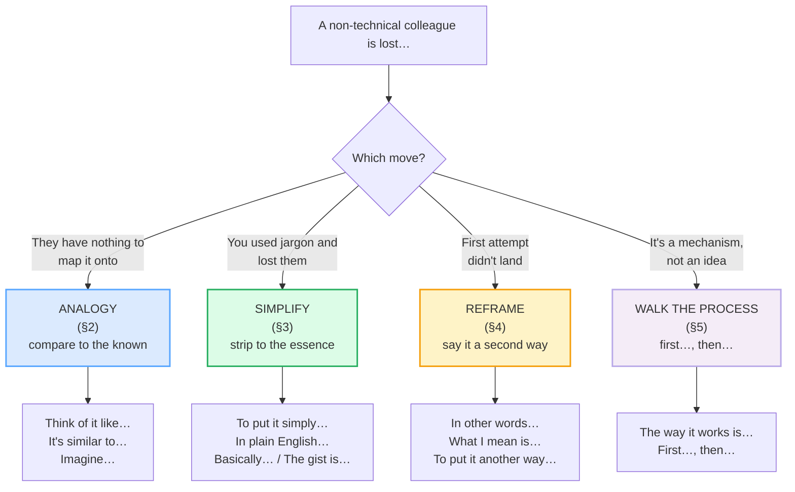

# Explaining Technical Concepts Simply

> **Phase 2 · workplace · bundle #43 · Days 85–86.**
> *"'Think of it like…" / analogy-first explanations.*
>
> 🔗 This is the **explaining layer** on top of
> [CLARIFYING](../speech_acts/CLARIFYING.md) (Phase 1) and
> [CHECKING UNDERSTANDING](../speech_acts/CHECKING_UNDERSTANDING.md) (Phase 1).
> Where clarifying is *you* asking "what do you mean?", this bundle is the
> inverse: *you* are the one who knows the technical thing, and a non-technical
> colleague needs it in plain language. It leans on
> [SHORT PRESENTATIONS](./SHORT_PRESENTATIONS.md) for the signposting (*First…,
> then…*) and on [FINAL CONSONANTS](../pronunciation/FINAL_CONSONANTS.md) for
> the dropped finals that wreck *like* /laɪk/ and *works* /wɜːrks/.

---

## Why this is the bundle that stops the glazed-over eyes

Vietnamese technical communication has two failure modes, and both break when you
switch to English. The first is the **jargon-dump**: you prove expertise by
stacking terminology — *"the API gateway throttles the idempotent payload"* —
because in a Vietnamese professional context, dense vocabulary reads as
authority. The second is the opposite extreme — **over-vague**: *"it's like, a
thing that connects, you know"* — because you assume shared context the listener
does not have.

English-language workplace culture wants neither. The competent explainer
**leads with an analogy** (*"Think of it like…"*), **strips the jargon**
(*"To put it simply…"*), **checks** (*"Does that make sense?"*), and only then
layers the technical detail back in. The analogy is not dumbing down — it is the
scaffolding that lets the non-expert hold the technical idea long enough to act
on it. Andrew Ng, explaining AI to a general audience, opens with *"Think of it
like this: — Traditional code: You tell the computer…"*. That frame — familiar
first, technical second — is what this bundle drills.

---

## 1. The four explaining moves

Every simple explanation of a technical concept is a combination of four
pragmatic moves. Knowing the move tells you which chunk to reach for:

> From `explaining_simply_corpus.md` (the four moves, verbatim):
>
> - **Analogy** → **Think of it like…** /ˈθɪŋk əv ɪt laɪk/, **It's similar
>   to…** /ɪts ˈsɪm.ɪ.lər tə/, **Imagine…** /ɪˈmædʒ.ɪn/, **It's basically…**
>   /ɪts ˈbeɪ.sɪ.kəl.i/
> - **Simplify** → **To put it simply…** /tə pʊt ɪt ˈsɪm.pli/, **In plain
>   English…** /ɪn pleɪn ˈɪŋ.ɡlɪʃ/, **Basically…** /ˈbeɪ.sɪ.kəl.i/, **The gist
>   is…** /ðə dʒɪst ɪz/
> - **Reframe** → **In other words…** /ɪn ˈʌð.ɚ wɜːrdz/, **What I mean is…**
>   /wɑːt aɪ miːn ɪz/, **To put it another way…** /tə pʊt ɪt əˈnʌð.ɚ weɪ/
> - **Process** → **The way it works is…** /ðə weɪ ɪt wɜːrks ɪz/, **First…,
>   then…** /fɜːrst ðen/

---

## 2. Analogy openers (compare the unknown to the known)

The single highest-value move. Before any definition, give the listener a
**concrete thing they already understand**. Cambridge records *think of* as a
phrasal verb — *"I think of him as someone who will always help me"* — and the
imperative *Think of it like this…* is the standard native analogy opener (Andrew
Ng: *"Think of it like this: — Traditional code: You tell the computer…"*).
*Imagine…* does the same job by asking the listener to build a mental picture:
Cambridge's own example is *"Imagine Robert Redford when he was young — that's
what John looks like."*

> From `explaining_simply_corpus.md`:
>
> | Think of it like… | Imagine… |
> |---|---|
> | /ˈθɪŋk əv ɪt laɪk/ | /ɪˈmædʒ.ɪn/ |
>
> Cambridge's `imagine` entry prints *"Imagine Robert Redford when he was young —
> that's what John looks like."* — so the imperative *Imagine…* as an analogy
> frame is a dictionary-attested construction, not a classroom invention. The
> genius of the analogy move is it does the listener's work *for* them: instead
> of defining the unknown in terms of more unknowns, you bolt it onto something
> already in their head.

**Why "Think of it like" beats a definition:** a definition (*"An API is a set of
definitions and protocols for building and integrating application software"*)
assumes shared vocabulary. An analogy (*"Think of it like a waiter — you tell it
your order, it goes to the kitchen, and brings back your food"*) assumes only
everyday experience. In a cross-functional workplace, the analogy wins every
time.

---

## 3. Simplification moves (strip the jargon, give the essence)

When you catch yourself mid-jargon — or when you see the listener's face change —
the fix is to **stop and restate in plain words**. Cambridge records *simply* as
"in an easy way" and prints the dictionary example *"To put it simply, we won't
pay until we've received the goods we ordered"* — a dictionary-attested
simplification frame. Cambridge also lists the fixed idiom *"to put it
bluntly/simply/briefly, etc."* *gist* is the noun for "the essence without the
details": Cambridge prints *"Here's the gist: the answer is to be in control."*

> From `explaining_simply_corpus.md`:
>
> | To put it simply… | The gist is… |
> |---|---|
> | /tə pʊt ɪt ˈsɪm.pli/ | /ðə dʒɪst ɪz/ |
>
> The Cambridge *simply* entry literally prints *"To put it simply, we won't pay
> until we've received the goods we ordered"* — so *To put it simply…* is a
> dictionary-attested simplification opener. (PINNED ROW.) The *gist* entry
> prints *"Here's the gist: the answer is to be in control"* and *"Just give me
> the gist"* — so *The gist is…* is a real native summarizing frame. The move
> says: "I'm dropping the technical sentence; here is the core, in words you
> already own."

**The condescension trap:** simplifying is *not* talking down. The line is in
the chunk: *"To put it simply…"* re-casts the idea for clarity; *"Let me dumb
this down for you"* implies the listener is stupid. The first is professional;
the second is an insult. Keep the simplification frame about *the language*, not
*the listener*.

---

## 4. Reframing moves (say it a second way when the first failed)

When the analogy or the first explanation still hasn't landed, do **not** repeat
the same sentence louder. Re-cast the idea in different words. Cambridge attests
*in other words* as the standard reformulation idiom throughout the English
Corpus. *What I mean is…* takes ownership ("maybe *my* explanation was unclear,
let me fix it"), and *To put it another way…* is the canonical reframing frame
that pairs with Cambridge's idiom family *"to put it bluntly/simply/briefly,
etc."*

> From `explaining_simply_corpus.md`:
>
> | In other words… | What I mean is… |
> |---|---|
> | /ɪn ˈʌð.ɚ wɜːrdz/ | /wɑːt aɪ miːn ɪz/ |
>
> *In other words* is the workhorse reformulation idiom — it signals "I'm about
> to give you the same idea in a different shape, pick the one that clicks."
> *What I mean is…* is the self-correcting variant: it absorbs the blame for a
> muddy first attempt, which is exactly the face-safe move a Vietnamese learner
> tends to avoid. 🔗 See [HANDLING BEING MISUNDERSTOOD]
> (../capstone/HANDLING_MISUNDERSTOOD.md) for the capstone version of this move.

---

## 5. Process moves (walk through "how it works" step by step)

When the concept is a *mechanism* (an auth flow, a build pipeline, a caching
layer), a single analogy isn't enough — the listener needs the **sequence**. The
move is to open with *"The way it works is…"* and step through with *"First…,
then…"*. Cambridge records *work* as "to do the job or activity that you are
intended to do." The signposting (*First…, then…, finally…*) is the same skeleton
as a short presentation — 🔗 see [SHORT PRESENTATIONS](./SHORT_PRESENTATIONS.md).

> From `explaining_simply_corpus.md`:
>
> | The way it works is… | First…, then… |
> |---|---|
> | /ðə weɪ ɪt wɜːrks ɪz/ | /fɜːrst ðen/ |
>
> *The way it works is…* opens the mechanism; *First…, then…* sequences it. The
> two together turn a wall of technical detail into a path the listener can
> walk. The most common Vietnamese-L1 failure here is to **dump all the steps in
> one breath with no signposts** — the listener cannot tell where one step ends
> and the next begins.

---

## 6. Cheat sheet — the ≤8 survival chunks

The Pareto set. Drill these eight aloud until the analogy-first instinct is
automatic. (Every row is a corpus attestation above.)

| # | Chunk | IPA | Why it's here |
|---|---|---|---|
| 1 | **Think of it like…** | /ˈθɪŋk əv ɪt laɪk/ | the canonical analogy opener — familiar first |
| 2 | **It's similar to…** | /ɪts ˈsɪm.ə.lɚ/ | "this is almost the same as a thing you know" |
| 3 | **Imagine…** | /ɪˈmædʒ.ɪn/ | ask the listener to build a mental picture |
| 4 | **To put it simply…** | /tə pʊt ɪt ˈsɪm.pli/ | drop the jargon, restate in plain words (PINNED) |
| 5 | **Basically…** | /ˈbeɪ.sɪ.kəl.i/ | reduce to the core / "the main thing is…" |
| 6 | **The gist is…** | /ðə dʒɪst ɪz/ | the essence, without the details |
| 7 | **In other words…** | /ɪn ˈʌð.ɚ wɜːrdz/ | re-cast the idea when the first attempt missed |
| 8 | **The way it works is…** | /ðə weɪ ɪt wɜːrks ɪz/ | open a how-it-works mechanism walkthrough |

> Open [`explaining_simply.html`](./explaining_simply.html) to drill these as
> flip cards, hear native clips, play the technical-to-non-technical role-play,
> shadow, and write an analogy-first explanation.

---

## 7. Vietnamese → English L1 pitfalls table

The "expert payoff." These are the specific interference traps a Vietnamese
speaker hits when explaining technical concepts simply in an English workplace —
extend, don't replace, the seed rows from the spec.

| Vietnamese trap (what you do) | English fix (what to do instead) |
|---|---|
| **Jargon-dumps to show expertise** — stacks terminology (*"the API gateway throttles the idempotent payload"*) because dense vocab reads as authority in a Vietnamese professional context | Lead with an **analogy first, technical second**. Use *Think of it like…* / *It's similar to…* to bolt the concept onto something the listener already knows. Expertise in English = making complex things *accessible*, not dense. |
| **Assumes shared context** — drops the listener into the middle of a technical idea with no on-ramp; *"you know, the usual pipeline"* when the listener has never seen the pipeline | Open with the **analogy or the simplification frame**: *To put it simply…* / *The gist is…*. Spell out the shared context you're assuming before you build on it. |
| **Dumps acronyms unparsed** — *"so the SSO uses JWT over OIDC"* with no expansion, because the acronym *is* the word in Vietnamese tech speak | **Spell it out on first use**, then abbreviate: *"single sign-on — SSO — Think of it like one key that unlocks every door."* Never assume the listener parses the acronym. |
| **Skips the "does that make sense?" check** — explains in one long turn and moves on, because checking feels like doubting the listener's intelligence | End the explanation with a **comprehension check**: *"Does that make sense?"* / *"So, does that track?"* 🔗 See [CHECKING UNDERSTANDING](../speech_acts/CHECKING_UNDERSTANDING.md). Checking is politeness, not condescension. |
| **Condescends when simplifying** — *"Let me dumb this down"* / talks down to the listener, because the Vietnamese word for "explain simply" (*giải thích đơn giản*) carries no insult | Keep the frame about **the language, not the listener**: *To put it simply…* (re-casting the words), never *"Let me dumb this down for you"* (implying the listener is stupid). |
| **Drops the final consonant on *like* /laɪk/** → "thi" or "lye", and on *gist* /dʒɪst/ → "jis" — the analogy connector vanishes | Release the final /k/ on *like* and the final /st/ on *gist*. The analogy opener is useless if the listener hears a different word. 🔗 See [FINAL CONSONANTS](../pronunciation/FINAL_CONSONANTS.md). |
| **Mis-stresses *basically*** → "ba-SI-cal-ly" (wrong syllable) or rushes all five syllables equally | Stress the **first** syllable: **BA**-si-cal-ly /ˈbeɪ.sɪ.kəl.i/. The four weak syllables after it reduce; don't give them equal weight. 🔗 See [WORD STRESS](../pronunciation/WORD_STRESS.md). |
| **Flattens the /ɜːr/ in *works*** /wɜːrks/ → "wooks" or "vorks" (Vietnamese has no /ɜːr/) | Drill the NURSE vowel: round the lips, tongue mid-central, add the /r/. *works* /wɜːrks/ is high-frequency in every process explanation — get it right. |
| **Repeats the same sentence louder** when the listener doesn't get it, instead of re-casting | Use the **reframe move**: *In other words…* / *What I mean is…* / *To put it another way…*. A second *different* shape of the idea beats a louder copy of the first. |

---

## How to practise this bundle (the daily 20 min)

1. **READ** (5 min) — this guide, §1–§5.
2. **SHADOW** (7 min) — open `explaining_simply.html`, drill the 8 flip cards +
   the technical-to-non-technical role-play **aloud**, hitting the analogy opener
   *Think of it like…* and the final /k/ on *like*.
3. **PRODUCE** (8 min) — the writing task: explain a concept from your field
   using an analogy (*Think of it like…* / *Basically…*). Say it aloud; record
   and self-check that you led with the analogy, not the jargon.

---

## Sources

- Cambridge Advanced Learner's Dictionary — https://dictionary.cambridge.org/dictionary/english/{simply,basically,gist,imagine,similar,plain,word,another,mean_1,work,first,think-of,think,like} (entries for *simply* /ˈsɪm.pli/ with *"To put it simply, we won't pay until we've received the goods we ordered"* + idiom *"to put it bluntly/simply/briefly, etc."*; *basically* /ˈbeɪ.sɪ.kəl.i/ with *"Basically, they want a lot more information…"*; *gist* /dʒɪst/ with *"Here's the gist: the answer is to be in control."*; *imagine* /ɪˈmædʒ.ɪn/ with *"Imagine Robert Redford when he was young…"*; *think of* phrasal verb; *similar* /ˈsɪm.ɪ.lər/–/ˈsɪm.ə.lɚ/; *word* /wɜːd/–/wɜːrd/; *another* /əˈnʌð.ər/–/əˈnʌð.ɚ/; *mean* /miːn/; *work* /wɜːk/–/wɜːrk/; *first* /fɜːst/–/fɜːrst/).
- Oxford Advanced Learner's Dictionary — https://www.oxfordlearnersdictionaries.com/definition/english/simply_1 (*simply* "in a way that is easy to understand"; *gist* "the main or general meaning").
- Andrew Ng, "Why you should learn to code, not fear AI" (LinkedIn) — https://www.linkedin.com/posts/andrewyng_deepseek-r1-uncensored-qwq-32b-puts-reasoning-activity-7305984835708141570-XVKU (native use of *"Think of it like this:…"* as analogy opener).
- Luke's English Podcast, "How to Learn English" — https://teacherluke.co.uk/2020/06/18/669-how-to-learn-english/ (native *"Perhaps think of it like this…"*).
- Cambridge English Corpus attestation of *in other words* (PMC/NIH) — https://pmc.ncbi.nlm.nih.gov/articles/PMC9069966/.
- "Vietnamese Phonology: A Complete Guide" (Remitly) — https://www.remitly.com/blog/education/vietnamese-phonology-guide/ (jargon-as-status + final-consonant loss on *like*, *gist*, *works*).
- Nguyen, "The systematic reduction of English syllable-final consonants" (GMU Linguistics Club) — https://orgs.gmu.edu/lingclub/WP/texts/6_Nguyen.pdf.
- Native audio: YouGlish — https://youglish.com/pronounce/{chunk}/english/us?
- Frequency methodology: wordfrequency.info (spoken sub-corpus) — https://www.wordfrequency.info/
