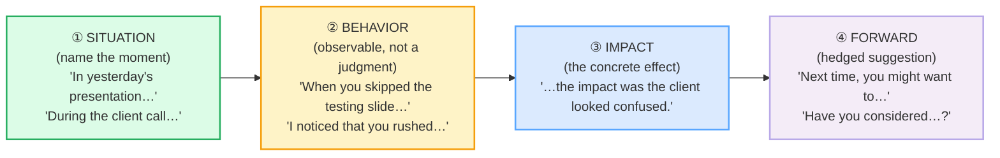

# Giving Feedback

> **Phase 2 · workplace · bundle #36 · Days 71–72.**
> *SBI: "When you…, the impact was…; could you…"*
>
> 🔗 This is the **constructive-communication** partner to [DIPLOMATIC
> DISAGREEMENT](./DIPLOMATIC_DISAGREEMENT.md) — that bundle softens a *counter*;
> this bundle structures a *critique* so the hearer can actually hear it. It also
> leans on [GIVING HEDGED OPINIONS](../speech_acts/OPINIONS_HEDGED.md) (the
> *"I'd say…"* hedge) and [GIVING ADVICE & SUGGESTIONS](../speech_acts/ADVISING.md)
> (*"You might want to…"* / *"Have you tried…?"*) — the forward-looking
> suggestion half of SBI is exactly that bundle's engine. Preview:
> [RECEIVING FEEDBACK](./FEEDBACK_RECEIVING.md) (bundle #37).

---

## Why this bundle exists (read this first)

A Vietnamese learner asked to give a colleague feedback usually does one of two
things — both of them costly:

1. **Avoids the critical feedback entirely.** Vietnamese culture prizes harmony
   and *giữ thể diện* (keeping/saving face), so the learner either says nothing,
   or wraps the critique so vaguely (*"Maybe next time, somehow, it could be a
   bit better, perhaps…"*) that the colleague cannot act on it. The feedback
   never lands.
2. **Delivers it bluntly when finally forced to** — *"Your presentation was
   bad,"* *"You are not clear,"* *"You did it wrong."* The learner, fearing
   they've been too harsh, then overcorrects with vague praise (*"But good
   job!"*) — the infamous **feedback sandwich** that English-speaking colleagues
   read as insincere.

English professional culture has a **third gear** that Vietnamese does not
train: **specific, behavior-focused feedback** built on the **SBI™ model**
(Situation–Behavior–Impact, originated by the Center for Creative Leadership).
You name the **specific situation** (*"in yesterday's presentation"*), the
**observable behavior** (*"when you skipped the testing slide"*), and the
**impact** (*"the impact was the client looked confused"*) — then a
**forward-looking, hedged suggestion** (*"Next time, you might want to…"* /
*"Have you considered…?"*). It is specific without being personal, honest
without being harsh. It is the single load-bearing structure of every feedback
conversation in an English-speaking workplace.

---

## 1. The mechanism: why English uses SBI (specific + behavior-focused)

Brown & Levinson's (1987) politeness theory labels criticism a **face-
threatening act (FTA)**: it threatens the hearer's **positive face** (their
desire to be liked/approved). Every language redresses FTAs; English's default
professional redress is the **SBI™ structure**, which works by **separating the
person from the behavior**. You never say *"You are disorganized"* (a character
attack); you say *"When you submitted the report late, the impact was the team
couldn't review it"* (a behavior + a consequence). The hearer's face is
protected because the critique is about something they *did*, not something
they *are* — and it names a specific moment, not a vague pattern.

The Center for Creative Leadership — the originator of the framework — states
the structure verbatim: *"Describe the Situation… Describe the actual,
observable Behavior… Describe the Impact that the person's behavior had."* The
canonical sentence frame that collapses ②+③ into one move is `When you
[behavior], the impact was [impact]`.

> From `feedback_giving_corpus.md`:
> (the SBI constructive core, verbatim)
>
> - **When you…, the impact was…** /wen juː ði ˈɪmpækt wəz/ UK ·
>   /wen ju ði ˈɪmpækt wəz/ US — the SBI™ frame (CCL originator source).
> - **I noticed that…** /aɪ ˈnəʊtɪst ðət/ UK · /aɪ ˈnoʊtɪst ðət/ US — the
>   factual observation opener (Cambridge `notice`).
> - **One area to work on is…** /wʌn ˈeəriə tə wɜːk ɒn ɪz/ UK ·
>   /wʌn ˈeriə tə wɜːrk ɑːn ɪz/ US — the specific improvement focus.

---

## 2. Positive feedback that's specific (not vague "good job")

The other half of SBI is **positive feedback** — and it has the same
specificity rule. A vague *"Good job!"* or *"Nice work"* tells the hearer
nothing they can repeat; a specific *"One thing that worked well was your
opening — it grabbed everyone's attention"* tells them exactly what to keep
doing. Three openers do almost all the work:

| Opener | What it signals | Example finish |
|---|---|---|
| **One thing that worked well was…** | names a specific success to repeat | …your opening — it grabbed the room. |
| **You did a great job on…** | specific praise for a named piece of work | …the data section — really clear. |
| **I really liked how you…** | admires the specific *manner* of doing X | …walked us through it step by step. |

> From `feedback_giving_corpus.md`:
> (the positive / specific-praise set, verbatim)
>
> - **One thing that worked well was…** /wʌn θɪŋ ðət wɜːkt wel wəz/ UK ·
>   /wʌn θɪŋ ðət wɜːrkt wel wəz/ US — Cambridge `work` = "be effective."
> - **You did a great job on…** /juː dɪd ə ɡreɪt dʒɒb ɒn/ UK ·
>   /ju dɪd ə ɡreɪt dʒɑːb ɑːn/ US — the `great job` collocation.
> - **I really liked how you…** /aɪ ˈrɪəli laɪkt haʊ juː/ UK ·
>   /aɪ ˈriːəli laɪkt haʊ ju/ US — `like` + `how` manner compliment.

**The Vietnamese trap:** learners default to *"Good job"* / *"Very good"* with
no specifics — which sounds perfunctory, not genuine. Specificity is what makes
praise land; without it, the hearer cannot tell whether you mean it or are just
being polite. Pair every piece of praise with **what specifically** worked.

---

## 3. The forward-looking suggestion — never "you should"

After the SBI observation, offer a **specific, hedged suggestion** the person
can act on. Two openers carry almost all the load, and both are **hedged**
(modal `might` / question form) — they treat the suggestion as an option the
person can adopt, not an order:

| Opener | What it signals | Example finish |
|---|---|---|
| **Next time, you might want to…** | a forward-looking, hedged suggestion | …slow down on the testing slide. |
| **Have you considered…?** | a suggestion shaped as a polite question | …adding a summary at the end? |

> From `feedback_giving_corpus.md`:
> (the forward-looking suggestion set, verbatim)
>
> - **Next time, you might want to…** /nekst ˈtaɪm ju maɪt ˈwɒnt tə/ UK ·
>   /nekst ˈtaɪm ju maɪt ˈwɑːnt tə/ US — `might want to` polite hedge.
> - **Have you considered…?** /hæv ju kənˈsɪdəd/ UK · /hæv ju kənˈsɪdərd/ US —
>   Cambridge Dictionary Blog documents this as a polite-suggestion frame:
>   *"Have you considered/thought about speaking to James?"*

**The Vietnamese trap:** Vietnamese has no obligatory modal-hedging layer of
this kind. A learner who wants to suggest goes straight to the imperative
(*"You should…"* / *"Do X"*), which in English lands as an order from a boss,
not a peer's suggestion. Drill `Next time, you might want to…` and `Have you
considered…?` until the hedge feels natural; in English, the hedge is what
makes the suggestion hearable. 🔗 See [GIVING ADVICE &
SUGGESTIONS](../speech_acts/ADVISING.md).

---

## 4. Delivery notes — the intonation that makes it land

Even with the right words, the wrong tune undoes SBI:

- **Pause between behavior and impact.** *"When you skipped the testing
  slide… ↑" (beat) "…the impact was the client looked confused."* The pause
  signals *"I'm being precise, not attacking."* Vietnamese learners often run
  the two halves together, which reads as a rehearsed complaint.
- **Drop the pitch on the impact.** *"…the **im**pact was…"* — low and factual.
  A rising, anxious intonation signals *"I feel guilty saying this,"* which
  makes the hearer anxious too. State the impact as a neutral fact.
- **The forward suggestion rises slightly.** *"Next time, you might want
  to… ↑"* — a slight rise invites collaboration; a flat fall reads as a
  command. *"Have you considered…?"* is a real question — let it sound like
  one.
- **Avoid the feedback sandwich.** Praising → criticizing → praising
  (*"Great job! But X was bad. Anyway, nice work!"*) is widely read in
  English-speaking workplaces as insincere or manipulative — the hearer waits
  for the "but" and discounts the praise. Give positive and constructive
  feedback as **separate, specific statements** instead.

---

## 5. The register ladder (vague → specific → professional)

The same feedback, four registers. This bundle is the **professional / SBI**
rung.

| Register | How you'd say it |
|---|---|
| Vague (avoid — lands as insincere) | "Good job… but maybe do better next time?" |
| Blunt / personal (avoid — face attack) | "Your presentation was confusing." / "You're disorganized." |
| **Professional SBI (this bundle)** | "When you skipped the slide, the impact was the client looked confused. Next time, you might want to slow down there." |
| Coaching / very soft (peer, sensitive) | "I noticed the client looked confused on that slide — have you considered walking through it next time?" |

---

## 6. Cheat sheet — the ≤8 survival chunks

The Pareto set. Drill these eight aloud until the *specific-praise → SBI →
forward-suggestion* rhythm is automatic. (Every row is a corpus attestation
above.)

| # | Chunk | IPA | Why it's here |
|---|---|---|---|
| 1 | **One thing that worked well was…** | /wʌn θɪŋ ðət wɜː(r)kt wel wəz/ | specific positive opener (no vague "good job") |
| 2 | **You did a great job on…** | /juː dɪd ə ɡreɪt dʒɒb/ UK · /dʒɑːb/ US | specific praise for a named piece of work |
| 3 | **I really liked how you…** | /aɪ ˈrɪəli/ UK · /ˈriːəli/ US laɪkt haʊ juː/ | admires the specific *manner* |
| 4 | **When you…, the impact was…** | /wen juː ði ˈɪmpækt wəz/ | the SBI™ constructive frame (pinned) |
| 5 | **I noticed that…** | /aɪ ˈnəʊtɪst/ UK · /ˈnoʊtɪst/ US ðət/ | factual observation opener (not a judgment) |
| 6 | **One area to work on is…** | /wʌn ˈeəriə/ UK · /ˈeriə/ US tə wɜː(r)k ɒn ɪz/ | specific, named improvement focus |
| 7 | **Next time, you might want to…** | /nekst ˈtaɪm ju maɪt ˈwɒnt/ UK · /ˈwɑːnt/ US tə/ | forward-looking hedged suggestion (pinned) |
| 8 | **Have you considered…?** | /hæv ju kənˈsɪdəd/ UK · /kənˈsɪdərd/ US | suggestion as polite question |

> Open [`feedback_giving.html`](./feedback_giving.html) to drill these as flip
> cards, hear native clips, play the role-play, shadow, and write.

---

## 7. Vietnamese → English L1 pitfalls table

The "expert payoff." These are the specific interference traps a Vietnamese
speaker hits when giving feedback in a professional English setting — extend,
don't replace, the seed rows from the spec.

| Vietnamese trap (what you do) | English fix (what to do instead) |
|---|---|
| **Avoids critical feedback entirely** to preserve harmony (*giữ thể diện* / fear of offending) | Use the SBI frame: *"When you…, the impact was…"* — it lets you be honest **without** being harsh. Silence costs the colleague the chance to improve. |
| **Delivers criticism bluntly when finally forced** — "Your presentation was bad" / "You are not clear" | Never attack the person. Describe the **behavior** + **impact**: *"When you skipped the slide, the impact was the client looked confused."* Separate the person from the behavior. |
| **Gives vague praise** — "Good job" / "Very good" with no specifics | Name the specific thing: *"One thing that worked well was your opening."* Specificity is what makes praise land; vague praise reads as perfunctory. |
| **Uses the feedback sandwich** (praise → criticize → praise) to soften | English-speaking workplaces read the sandwich as insincere. Give positive and constructive feedback as **separate, specific statements**. |
| **Goes straight to "You should…"** for the suggestion → sounds like an order | Hedge it: *"Next time, you might want to…"* / *"Have you considered…?"*. The modal/question form is what makes a suggestion hearable. 🔗 See [GIVING ADVICE](../speech_acts/ADVISING.md). |
| **Wraps critique in vague hedges** — "Maybe somehow it could be a bit better, perhaps" → the colleague cannot act on it | Be specific about **what** behavior and **what** impact. Vagueness to save face defeats the purpose: feedback that can't be acted on is no feedback. |
| **Fear of offending seniors** → stays silent in upward feedback | SBI works upward too — it is factual, not personal: *"When the deadline moved twice, the impact was the team had to redo the work."* Frame around the situation, not the senior's character. |
| **Runs behavior + impact together** ("When-you-skipped-the-slide-the-impact-was…") → reads as a rehearsed complaint | Insert a real pause after the behavior: *"When you skipped the slide… ↑" (beat) "…the impact was…"*. The pause signals precision, not attack. |
| **Rising, anxious intonation on the impact** → signals guilt, makes the hearer anxious | Drop the pitch on the impact, state it as a neutral fact: *"…the **im**pact was the client looked confused."* Low and factual. |
| **Drops past-tense `-ed` on feedback verbs** → "When you skip the slide, the impact is…" (loses the "specific past moment" framing) | SBI is past-tense by design — it names a **specific past situation**. Drill *"skippe**d**"*, *"notice**d**"*, *"like**d**"*, "*work**ed***"* with audible finals. 🔗 See [FINAL CONSONANTS](../pronunciation/FINAL_CONSONANTS.md). |

---

## How to practise this bundle (the daily 20 min)

1. **READ** (5 min) — this guide, §1–§5.
2. **SHADOW** (7 min) — open `feedback_giving.html`, drill the 8 flip cards +
   the role-play **aloud**, exaggerating the pause between behavior and impact,
   then relaxing.
3. **PRODUCE** (8 min) — the writing task: write a 3-line SBI feedback using
   *"When you…, the impact was…"* **and** *"Next time, you might want to…"*,
   then read it aloud recording yourself; check the pause after the behavior is
   real and the past-tense endings are audible.

---

## Sources

- Center for Creative Leadership, "Improve Talent Development With Our SBI
  Feedback Model" (originator of the SBI™ framework) —
  https://www.ccl.org/articles/leading-effectively-articles/sbi-feedback-model-a-quick-win-to-improve-talent-conversations-development/
- CCL, "Use Situation-Behavior-Impact (SBI)™ To Understand Intent" —
  https://www.ccl.org/articles/leading-effectively-articles/closing-the-gap-between-intent-vs-impact-sbii/
- American College of Surgeons, "The Situation–Behavior–Impact™ (SBI™) Feedback
  Tool" (PDF) — https://www.facs.org/media/pshbyz4v/sbi-feedback.pdf
- FeedbackPulse, "How to Use the SBI Feedback Model at Work (+ Template)" —
  https://feedbackpulse.com/resources/sbi-feedback-model
- Revolution Learning & Development, "The SBI Feedback Model" —
  https://www.revolutionlearning.co.uk/article/the-sbi-feedback-model/
- Workstream, "The Importance of Employee Feedback" —
  https://www.workstream.us/blog/the-importance-of-employee-feedback
- Cambridge Advanced Learner's Dictionary —
  https://dictionary.cambridge.org/dictionary/english/{word}
  (entries: *work_1* [be effective], *great*, *job_1*, *like_1* [past *liked*],
  *really*, *notice* [past *noticed*], *impact*, *area*, *consider* [past
  *considered*], *might_1*, *want_1*, *next*, *time*, *have*, *you*)
- Cambridge Dictionary Blog, "You could always email him — making suggestions
  sound nicer" (attests `Have you considered…?`) —
  https://dictionaryblog.cambridge.org/2016/03/23/you-could-always-email-him-making-suggestions-sound-nicer/
- Brown, P. & Levinson, S. *Politeness: Some Universals in Language Usage*
  (CUP, 1987) — criticism as a face-threatening act redressed by SBI + hedges.
- Native audio: YouGlish — https://youglish.com/pronounce/{chunk}/english/us?
  (every clip in the player verified HTTP 200 on 2026-06-23; URL-encode spaces
  as `+`, apostrophes as `%27`).
- Frequency methodology: wordfrequency.info (spoken sub-corpus) —
  https://www.wordfrequency.info/
