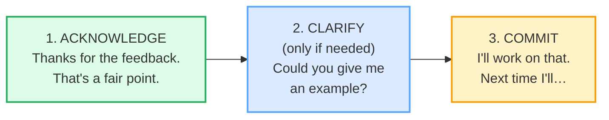

# Receiving Feedback

> **Phase 2 · workplace · bundle #37 · Days 73–74.**
> *Receiving criticism gracefully: "Thanks for the feedback; I'll work on that."*
>
> 🔗 This bundle is the **receiver's** mirror of [FEEDBACK GIVING](./FEEDBACK_GIVING.md)
> (bundle #36 — the SBI *giver* side). Where that one teaches you to *deliver*
> "When you…, the impact was…; could you…", this one teaches you to *receive*
> criticism without losing face — yours or the giver's. 🔗 It also leans on
> [DIPLOMATIC DISAGREEMENT](./DIPLOMATIC_DISAGREEMENT.md) (bundle #33 — the same
> acknowledge-then-respond engine, applied when you *do* want to push back).

---

## Why this bundle exists (read this first)

The single highest-leverage workplace skill a Vietnamese-L1 professional can add
is **graceful feedback reception**. In Vietnamese workplace culture, criticism
collides with **face** (*thể diện*): being corrected in front of others is felt
as a status wound, so the default L1 responses are a **defensive justification**
("Nhưng mà…", "Không phải lỗi của em" = "But…", "It wasn't my fault") or a **stony
silence** that the giver reads as sulking. Both leak into English and read, to a
native manager, as **immature or uncoachable** — even when the work is excellent.

Native English speakers, by contrast, are trained from school age in a three-move
ritual that *defuses* the threat before anything is argued:

**Acknowledge → (Clarify) → Commit.** That arc is the whole bundle. Every chunk
below is one of those three moves. Drill the arc and you will sound — in the space
of one sentence — like a professional who can *take* feedback, which is what
managers actually promote.

---

## 1. The acknowledge move (don't skip it)

The most common L1-Vietnamese error is to **skip straight to the defense**. The
native convention demands an **uptake token first** — a short phrase that says "I
heard you, and I'm not fighting you." Cambridge records `Thanks for…` as the
standard grateful formula; `That's a fair point` concedes the validity of the
point *without* conceding the argument; `I appreciate…` expresses grateful
recognition (CALD sense 2: *"to be grateful for something"*).

> From `feedback_receiving_corpus.md` (the acknowledge set, verbatim):
>
> - **Thanks for the feedback.** /ˈθæŋks fə ðə ˈfiːdbæk/
> - **That's a fair point.** /ðæts ə feə ˈpɔɪnt/ UK · /ðæts ə fer ˈpɔɪnt/ US
> - **I appreciate that.** /aɪ əˈpriː.ʃi.eɪt ðæt/
> - **I appreciate the honesty.** /aɪ əˈpriː.ʃi.eɪt ðə ˈɒnəsti/ UK ·
>   /aɪ əˈpriː.ʃi.eɪt ðə ˈɑːnəsti/ US
> - **I hadn't thought of it that way.** /aɪ ˈhædənt ˈθɔːt əv ɪt ðæt weɪ/ UK ·
>   /aɪ ˈhædənt ˈθɑːt əv ɪt ðæt weɪ/ US

**Why `I hadn't thought of it that way` is the game-changer:** it reframes the
feedback as *new information* rather than an accusation. It tells the giver "you
just taught me something," which flatters them and protects your face at the same
time — the most efficient double-move in the language.

---

## 2. The clarify move (ask, don't defend)

If the feedback is vague or you genuinely don't know what to fix, the skilled
move is a **clarifying question**, *not* a counter-argument. A defensive *"but…"*
turns feedback into a fight; a curious *"Could you say more about…?"* turns it
into a dialogue. The modal `Could you…?` is Cambridge's polite-request form; it
keeps the tone **collaborative, not combative**.

> From `feedback_receiving_corpus.md` (the clarify set, verbatim):
>
> - **Could you give me an example?** /kʊd ju ˈɡɪv mi ən ɪɡˈzɑːmpəl/ UK ·
>   /kʊd ju ˈɡɪv mi ən ɪɡˈzæmpəl/ US
> - **Could you say more about…?** /kʊd ju ˈseɪ mɔːr əˈbaʊt/

**The Vietnamese trap:** learners either (a) mount an instant defense ("But I
did…") or (b) nod silently without understanding and then repeat the same
mistake. The clarify move avoids *both* — it shows engagement *and* buys you the
specifics you need to actually improve.

---

## 3. The commit move (close the loop)

Acknowledgement alone reads as passive; a **commitment move** is what separates
graceful reception from dismissal. Cambridge records `work on` (phrasal verb:
*"to try hard to achieve or improve something"*) and `keep something in mind`
(CALD: *"to remember a fact or piece of information, especially one that might be
useful in the future"*). `Next time I'll…` is the forward-looking repair frame.

> From `feedback_receiving_corpus.md` (the commit set, verbatim):
>
> - **I'll work on that.** /aɪl ˈwɜːk ɒn ðæt/ UK · /aɪl ˈwɜːrk ɑːn ðæt/ US
> - **I'll keep that in mind.** /aɪl ˈkiːp ðæt ɪn ˈmaɪnd/
> - **Next time I'll…** /ˈnekst ˈtaɪm aɪl/

> **Pinned sanity-check examples** (the corpus MUST contain these two verbatim —
> they are the bundle's spine):
>
> | Pinned chunk | IPA | Source |
> |---|---|---|
> | **Thanks for the feedback.** | /ˈθæŋks fə ðə ˈfiːdbæk/ | https://youglish.com/pronounce/thanks+for+the+feedback/english/us? |
> | **I'll work on that.** | /aɪl ˈwɜːrk ɑːn ðæt/ US | https://dictionary.cambridge.org/dictionary/english/work-on |

---

## 4. Delivery notes (how it should *sound*)

- **Stress the feeling word, not the filler.** Say *"I **appreciate** that"* —
  not *"I appreciate **that**"*. The content word (`appreciate`, `fair`, `work`)
  carries the meaning; the grammar words (`I`, `that`, `the`) reduce to schwas.
- **`I'll` is one syllable** /aɪl/, not two ("I will"). Dropping it to "I will"
  sounds stiff and formal for spoken reception.
- **`Thanks` /θæŋks/** — the **/θ/** is the th-sound (tongue between teeth).
  Vietnamese learners often say *"tanks"* (/tæŋks/) which a native hears as the
  military vehicle. 🔗 Drill this in [TH SOUNDS](../pronunciation/TH_SOUNDS.md).
- **Soften the consonant cluster in `next time`** /nekst taɪm/ — the /kst/+
  /t/ sequence is exactly where Vietnamese drops a sound. 🔗 See
  [CONSONANT CLUSTERS](../pronunciation/CONSONANT_CLUSTERS.md).
- **`Could you`** often reduces to /kədʒə/ in fast speech — "Couldja give me…?"
  Don't force it, but recognise it when you hear it. 🔗 See
  [REDUCTIONS](../pronunciation/REDUCTIONS.md).

---

## 5. Cheat sheet — the ≤8 survival chunks

The Pareto set. Drill these eight aloud until the arc (acknowledge → clarify →
commit) is automatic. (Every row is a corpus attestation above.)

| # | Chunk | IPA | Why it's here |
|---|---|---|---|
| 1 | **Thanks for the feedback.** | /ˈθæŋks fə ðə ˈfiːdbæk/ | the canonical grateful uptake (don't skip it) |
| 2 | **That's a fair point.** | /ðæts ə fer ˈpɔɪnt/ | concedes validity without conceding the argument |
| 3 | **I appreciate that.** | /aɪ əˈpriː.ʃi.eɪt ðæt/ | grateful recognition — warmer than "OK" |
| 4 | **I hadn't thought of it that way.** | /aɪ ˈhædənt ˈθɑːt əv ɪt ðæt weɪ/ | reframes feedback as *new info* (face-saver) |
| 5 | **Could you give me an example?** | /kʊd ju ˈɡɪv mi ən ɪɡˈzæmpəl/ | clarify without defending |
| 6 | **Could you say more about…?** | /kʊd ju ˈseɪ mɔːr əˈbaʊt/ | open-ended probe (curious, not combative) |
| 7 | **I'll work on that.** | /aɪl ˈwɜːrk ɑːn ðæt/ | the commit move — specific + forward-looking |
| 8 | **Next time I'll…** | /ˈnekst ˈtaɪm aɪl/ | time-bounded repair contract |

> Open [`feedback_receiving.html`](./feedback_receiving.html) to drill these as
> flip cards, hear native clips, play the role-play, shadow, and write.

---

## 6. Vietnamese → English L1 pitfalls table

The "expert payoff." These are the specific interference traps a Vietnamese
speaker hits when receiving feedback in English — extend, don't replace, the
seed rows from the spec.

| Vietnamese trap (what you do) | English fix (what to do instead) |
|---|---|
| **Face-wound reflex** — criticism triggers *thể diện* loss, so you justify ("Nhưng mà…" / "But…") or accuse ("Không phải lỗi của em" / "It wasn't my fault") before acknowledging | Force the **acknowledge-first** rule: say *"Thanks for the feedback"* or *"That's a fair point"* **before** any "but". The defense can come *after* — never *instead of* — the uptake. |
| **Stony silence** when criticised — Vietnamese politeness says don't argue back, but a native manager reads silence as sulking or not listening | Use a **commitment token**: *"I'll work on that"* or *"I hadn't thought of it that way."* Silence is never the safe option in English feedback culture. |
| **Missing "thank you" uptake** — Vietnamese thanks for *gifts*, not for *criticism*; saying thanks for negative feedback feels perverse to a Vietnamese ear | Learn the chunk whole: **"Thanks for the feedback"** is a *formula*, not a literal thank-you. It signals "received", not "I am happy about this." |
| **Treating feedback as personal attack** — VN criticism often *is* aimed at the person, so the learner hears "your work is late" as "you are lazy" | Hear the **SBI structure** (🔗 [FEEDBACK GIVING](./FEEDBACK_GIVING.md)): "When you… (Situation+Behaviour), the impact… (Impact)." Respond to the *behaviour*, not to an imagined insult. |
| **Drops /θ/** → "tanks" for *Thanks*, "tought" for *thought* | Tongue-between-teeth drill for /θ/ in *Thanks* /θæŋks/ and *thought* /θɔːt/. 🔗 [TH SOUNDS](../pronunciation/TH_SOUNDS.md). |
| **Drops the /kst/ cluster** → "nest time" for *next time* | Hold the cluster tight: /nekst/. 🔗 [CONSONANT CLUSTERS](../pronunciation/CONSONANT_CLUSTERS.md). |
| **No contraction** → "I will work on that" (stiff) instead of "I'll work on that" | Drill the contraction **`I'll`** /aɪl/ as one syllable. Spoken English contracts; formal uncontracted "I will" sounds like a written email, not a live reply. |
| **Over-apologises** — "Sorry, sorry, I'm so sorry" — because VN *xin lỗi* culture stacks apologies, but in English this reads as low-status / grovelling | One acknowledge + one commit is enough. Replace the apology stack with *"I'll work on that / Next time I'll…"*. 🔗 [APOLOGIZING](../speech_acts/APOLOGIZING.md). |
| **Asks for clarification as a challenge** → "What do you mean?" (sounds hostile) | Soften with the modal: **"Could you say more about…?"** / **"Could you give me an example?"** The `Could you…?` form is face-saving in English. |

---

## How to practise this bundle (the daily 20 min)

1. **READ** (5 min) — this guide, §1–§4.
2. **SHADOW** (7 min) — open `feedback_receiving.html`, drill the 8 flip cards +
   the role-play **aloud**, hitting the acknowledge → clarify → commit arc every
   time. Exaggerate the /θ/ in *Thanks*, then relax.
3. **PRODUCE** (8 min) — the writing task: write a graceful feedback-reception
   reply (Thanks for…; I'll work on…). Read it aloud; check the contraction
   `I'll` is one syllable and the /θ/ in *Thanks* is audible.

---

## Sources

- Cambridge Advanced Learner's Dictionary — https://dictionary.cambridge.org/dictionary/english/{word}
  (entries for *feedback, fair, point, appreciate, honesty, work-on, mind,
  example, could, give, more, about, next, time, keep, that*)
- Oxford Advanced Learner's Dictionary — https://www.oxfordlearnersdictionaries.com/definition/english/wonder_1
  (polite-request / hedging parallels)
- Wiktionary — `example` /ɪɡˈzɑːm.pəl/ (RP) cross-check — https://en.wiktionary.org/wiki/example
- EngDict — `example` /ɪɡˈzæm.pəl/ US, `fair` /fer/ US cross-check — https://www.engdict.com/en/dictionary/example
- Brown, P. & Levinson, S. *Politeness: Some Universals in Language Usage* (CUP, 1987) — positive-face vs negative-face framing of the acknowledge / clarify / commit arc.
- Forvo — `honesty` /ˈɒnɪsti/ attestation — https://forvo.com/word/honesty/
- Native audio: YouGlish — https://youglish.com/pronounce/{chunk or phrase}/english/us?
- Frequency methodology: wordfrequency.info (spoken sub-corpus) — https://www.wordfrequency.info/
