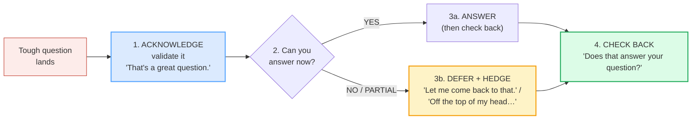

# Handling Q&A

> **Phase 2 · workplace · bundle #44 · Days 87–88.**
> *"That's a great question." / "Let me come back to that."*
>
> 🔗 Sibling bundles this one builds on: [CONTRIBUTING](./CONTRIBUTING.md)
> (the floor-holding that lets you pause before answering),
> [DIPLOMATIC DISAGREEMENT](./DIPLOMATIC_DISAGREEMENT.md) (softening when a
> question challenges your point), [CHECKING & CONFIRMING](../speech_acts/CHECKING_UNDERSTANDING.md)
> (the check-back move is the same family), [HEDGING & VAGUENESS](../discourse/HEDGING_VAGUENESS.md)
> (the partial-knowledge hedges, expanded).

---

## Why this bundle exists (read this first)

A presentation is only half the performance. The other half is the **Q&A**: the
open floor after the slides, where the audience tests whether what you said
holds. Two failure modes wreck a Vietnamese L1 speaker here, and neither is about
English level:

1. **Bluff** — Vietnamese face culture (*thể diện*) reads "I don't know" as a
   loss of face, so the instinct is to invent an answer, however wrong. In an
   English-speaking workplace this reads as **dishonesty or incompetence**, not
   confidence.
2. **Freeze** — the opposite reflex: silence, a mumbled "yes/no", or a stalled
   "uhhhhh…" while panic searches for the perfect sentence. The audience reads
   this as **unprepared**, even when you actually do know the material.

English gives you a third path that neither bluff nor freeze accounts for:
**graceful deferral + honest partial answer + check-back.** "That's a great
question — let me come back to that" is not an admission of defeat; it is the
*expected, professional* move. Native speakers say it dozens of times a week.
This bundle is the four chunks that turn Q&A from a threat into a strength.

---

## 1. The four-move Q&A sequence

Every tough question in a workplace Q&A maps to the same arc — **acknowledge →
buy/defer → answer (or hedge) → check back**. Memorise the *sequence*, then fill
it with the chunks below:

The sequence is the difference between a fluent Q&A and a panicked one. Even if
you ultimately *defer*, you acknowledge first — never jump straight to "I don't
know."

---

## 2. Move 1 — Acknowledge (validate before you answer)

The first words out of your mouth should **name the question as worth asking**.
This does two jobs at once: it shows respect to the asker, and it buys you ~2
seconds to start forming the answer. It is *not* filler — it is a taught
presentation skill.

> From `handling_questions_corpus.md`:
>
> - **That's a great question** /ˌðæts ə ˌɡreɪt ˈkwestʃən/
> - **That's a good question** /ˌðæts ə ˌɡʊd ˈkwestʃən/ — the Cambridge entry
>   for *question* itself glosses this as *"= I don't know the answer."*
> - **I'm glad you asked** /aɪm ˌɡlæd ju ˈæskt/ US — warmer; use when the
>   question lets you make a point you wanted to make anyway.
> - **Thanks for asking** /ˌθæŋks fər ˈæskɪŋ/ US — thanks-led; slightly formal.

> **The Vietnamese trap here:** there is no L1 equivalent of "validate the
> question" — Vietnamese politeness goes straight to answering (or to silence).
> So learners either skip the acknowledgement and look abrupt, or over-use a
> single memorised "Yes, thank you" that sounds robotic. Drill **all four**
> acknowledges so you can vary them.

---

## 3. Move 2 — Buy time / defer (you can't answer right now)

When you genuinely don't have the answer, **defer, don't bluff**. Defer = promise
to return with it. This is the move that Vietnamese face culture trains you *not*
to make — and making it anyway is what marks you as a competent English-speaking
professional.

> From `handling_questions_corpus.md`:
>
> - **Let me come back to that** /ˌlet mi ˌkʌm ˈbæk tə ðæt/ — parks the
>   question for later *in the same session*.
> - **I'll get back to you on that** /aɪl ˌɡet ˈbæk tə ju ɑːn ðæt/ US —
>   promises a later (usually written) follow-up. Confirmed in Chatterfox
>   Business English as *"a normal and professional"* move, not an apology.
> - **I'd need to check** /aɪd ˈniːd tə tʃek/ — honest partial-knowledge
>   deferral; signals you won't guess.
> - **Let me check and get back to you** /ˌlet mi ˈtʃek ən ˌɡet ˈbæk tə ju/ —
>   the combined buy-time + defer line.

> **The Vietnamese trap here:** face culture reads "I'll get back to you" as
> "I don't know = I'm incompetent." It is the *opposite*: in an English
> workplace, **guessing and being wrong** is what loses trust; **deferring and
> following up** is what builds it. Re-train the reflex: *defer = professional,
> not failure.*

---

## 4. Move 3 — Hedge partial knowledge (you know *some* of it)

The hardest case: you know **part** of the answer. The fluent move is to **hedge
before the part** — mark the limits of what you're sure of, then give what you
have. This is the evidential/vagueness family (`as far as I know`, `off the top
of my head`), confirmed as hedges in Collins and the Cambridge Core linguistics
literature.

> From `handling_questions_corpus.md`:
>
> - **As far as I know** /əz ˌfɑːr əz aɪ ˈnoʊ/ US — Collins COBUILD glosses it:
>   *"to indicate that you are not absolutely sure of the statement… and you may
>   be wrong. [vagueness]"*
> - **Off the top of my head** /ɑːf ðə ˈtɑːp əv maɪ ˈhed/ US — "from memory,
>   without checking — approximate."
> - **To be honest, I'm not 100% sure** /tə bi ˈɑːnəst…/ — explicit
>   partial-knowledge hedge ("100%" read *"a hundred percent"*).
> - **To the best of my knowledge** /tə ðə best əv maɪ ˈnɒlɪdʒ/ — formal
>   variant for written/meetings.

> **The Vietnamese trap here:** Vietnamese has no grammatical evidential system,
> so learners state partial knowledge as if it were fact — and then, when it
> turns out wrong, lose credibility. The fix is mechanical: **prefix any
> un-checked claim with a hedge.** "Off the top of my head, it's around 20%"
> is bulletproof; "It's 20%" (when you guessed) is a trap.

---

## 5. Move 4 — Check back (confirm the answer landed)

After you answer (or defer), **close the loop**: invite the asker to confirm the
answer was enough. This is the Q&A sibling of the comprehension check in
🔗 [CHECKING & CONFIRMING](../speech_acts/CHECKING_UNDERSTANDING.md).

> From `handling_questions_corpus.md`:
>
> - **Does that answer your question?** /ˌdʌz ðæt ˈænsər jɔːr ˈkwestʃən/ US —
>   explicit; invites a follow-up if not.
> - **Does that make sense?** /ˌdʌz ðæt ˈmeɪk ˈsens/ — softer; checks
>   comprehension, not just sufficiency.
> - **Would you like me to go into more detail?**
>   /ˌwʊd ju ˈlaɪk mi tə ˌɡoʊ ˈɪntə mɔːr ˈdiːteɪl/ US — offers depth;
>   deferential.

> **The Vietnamese trap here:** Vietnamese deference says "don't question the
> listener's understanding" (it sounds like doubting them). In English, a
> check-back reads as **helpful, not challenging** — it shows you care whether
> your answer landed. Add one to every answer.

---

## 6. Cheat sheet — the ≤8 survival chunks

The Pareto set. Drill these eight aloud until the four-move sequence is
automatic. (Every row is a corpus attestation above.)

| # | Chunk | IPA | Why it's here |
|---|---|---|---|
| 1 | **That's a great question** | /ˌðæts ə ˌɡreɪt ˈkwestʃən/ | Move 1 — acknowledge (the pinned opener) |
| 2 | **I'm glad you asked** | /aɪm ˌɡlæd ju ˈæskt/ US | Move 1 — warmer acknowledge |
| 3 | **Let me come back to that** | /ˌlet mi ˌkʌm ˈbæk tə ðæt/ | Move 2 — defer in-session (pinned) |
| 4 | **I'll get back to you on that** | /aɪl ˌɡet ˈbæk tə ju ɑːn ðæt/ US | Move 2 — promise written follow-up |
| 5 | **I'd need to check** | /aɪd ˈniːd tə tʃek/ | Move 2 — honest partial-knowledge deferral |
| 6 | **As far as I know** | /əz ˌfɑːr əz aɪ ˈnoʊ/ US | Move 3 — hedge (the core evidential) |
| 7 | **Off the top of my head** | /ɑːf ðə ˈtɑːp əv maɪ ˈhed/ US | Move 3 — hedge (memory/estimate) |
| 8 | **Does that answer your question?** | /ˌdʌz ðæt ˈænsər jɔːr ˈkwestʃən/ US | Move 4 — check back |

> Open [`handling_questions.html`](./handling_questions.html) to drill these as
> flip cards, hear native clips, play the Q&A role-play, shadow, and write.

---

## 7. Vietnamese → English L1 pitfalls table

The "expert payoff." These are the specific interference traps a Vietnamese
speaker hits when handling Q&A — extend, don't replace, the seed rows from the
spec.

| Vietnamese trap (what you do) | English fix (what to do instead) |
|---|---|
| **Bluffs an answer to save face** (*thể diện*) rather than admit not knowing — invents a number/fact under pressure | Use **defer + follow-up**: *"Let me come back to that."* / *"I'll get back to you on that."* Defer = professional, not incompetent. |
| **Freezes / goes silent** when a tough question lands — reads as unprepared, even when you know the material | **Acknowledge first** to buy 2 seconds: *"That's a great question."* It fills the silence with a fluent chunk while you think. |
| **Jumps straight to "I don't know"** with no softening — sounds abrupt / dismissive in English | Wrap it: acknowledge → defer → check-back. Never lead with bare "I don't know." *"That's a good question — I'd need to check. Does that work for now?"* |
| **States partial knowledge as fact** (no L1 evidential system) → loses credibility when it's wrong | **Hedge before the part**: *"As far as I know…"* / *"Off the top of my head…"* Prefix every un-checked claim. |
| **Never checks back** — Vietnamese deference reads a check-back as "doubting the listener" | In English a check-back reads as **helpful**: *"Does that answer your question?"* Add one to every answer. |
| **Memorises ONE phrase and over-uses it** ("Yes, thank you" to everything) — sounds robotic | Drill **all four** acknowledges and rotate them: *great question / good question / glad you asked / thanks for asking*. |
| **Skips the acknowledgement** and answers cold — sounds abrupt, even rude, to an English ear | Always open with an acknowledge chunk. The sequence (acknowledge → defer/answer → check-back) is the polite default, not "answer immediately." |
| **Drops final consonants** on the load-bearing words → *question* → "ques-chin", *asked* → "ass", *check* → "che" | Release every final: ques-**tion** /tʃən/, as**k**t /æskt/, che**ck** /tʃek/. 🔗 See [FINAL CONSONANTS](../pronunciation/FINAL_CONSONANTS.md). |
| **Confuses /θ/ and /t/** in *That's* → "Tat's" | Tongue-between-teeth for /θ/. 🔗 See [TH SOUNDS](../pronunciation/TH_SOUNDS.md). |
| **Reads "100%" number-for-number** ("one zero zero percent") | Read it as *"a hundred percent"*: /ə ˈhʌndrəd pərˈsent/. |

---

## How to practise this bundle (the daily 20 min)

1. **READ** (5 min) — this guide, §1–§5.
2. **SHADOW** (7 min) — open `handling_questions.html`, drill the 8 flip cards
   + the Q&A role-play **aloud**, hitting every final consonant on *question,
   asked, check, back*.
3. **PRODUCE** (8 min) — the writing task: write one **defer line** +
   one **partial-knowledge hedge** (e.g. *"Let me come back to that…"* +
   *"Off the top of my head, I'd say…"*). Read it aloud, recording yourself;
   check you acknowledge before you defer.

---

## Sources

- Cambridge Advanced Learner's Dictionary —
  https://dictionary.cambridge.org/dictionary/english/{word}
  (entries for *question, great, good, glad, ask, come back, get back, check,
  honest, sure, knowledge, answer, make sense, detail, need*; the *question*
  entry itself prints *"That's a good question." (= I don't know the answer.)"*).
- Oxford Advanced Learner's Dictionary —
  https://www.oxfordlearnersdictionaries.com/definition/english/question1
- Collins COBUILD English Dictionary (US) —
  https://www.collinsdictionary.com/us/dictionary/english/as-far-as-i-know
  (attested entry + example: *"It only lasted a couple of years, as far as I
  know."*).
- Chatterfox, "Business English Vocabulary #4: I'll Get Back to You" —
  https://chatterfox.com/business-english-vocabulary-4-ill-get-back-to-you/
  (confirms *"I'll get back to you"* as a normal, professional defer move).
- Sapling, "25 'I Will Get Back To You' Templates" —
  https://sapling.ai/snippet-templates/i-will-get-back-to-you
  (attested defer-line variants).
- Wiktionary, "off the top of one's head" —
  https://en.wiktionary.org/wiki/off_the_top_of_one%27s_head
  (attested example: *"I cannot think of any good examples off the top of my
  head…"*).
- Cambridge Core, *English Language and Linguistics* — "Last I heard: on the use
  of evidential *last I* fragments" —
  https://www.cambridge.org/core/journals/english-language-and-linguistics/article/last-i-heard-on-the-use-of-evidential-last-i-fragments/529CE45F040FFB98522789F9ADD75EE9
  (classifies *"as far as I know"* as an evidential hedge).
- Native audio: YouGlish — https://youglish.com/pronounce/{chunk}/english/us?
- Frequency methodology: wordfrequency.info (spoken sub-corpus) —
  https://www.wordfrequency.info/
