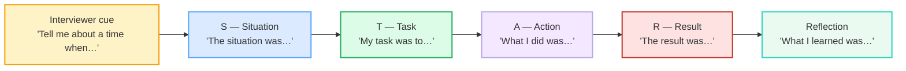

# Behavioral Interview Q&A

> **Phase 2 · workplace/ · bundle #39 · Days 77–78.**
> *STAR: Situation, Task, Action, Result.*
>
> 🔗 Builds on [FEEDBACK GIVING](./FEEDBACK_GIVING.md) (the SBI frame is the
> cousin of STAR — both are "context → action → impact" structures) and
> [SHORT PRESENTATIONS](./SHORT_PRESENTATIONS.md) (signposting: "First…, next…,
> finally…" is the same skill as "The situation was…, my task was…"). The
> self-promotion this bundle asks for is the opposite of
> [DIPLOMATIC DISAGREEMENT](./DIPLOMATIC_DISAGREEMENT.md)'s softening — here you
> *claim* your contribution, out loud, with numbers.

---

## Why this bundle (read this first)

A Vietnamese learner in an English-language behavioral interview fails for a
reason that has **nothing to do with English level**: they **under-sell**.
Vietnamese interview culture rewards humility, modesty, and hierarchy —
"khiêm tốn", "mình chỉ làm nhiệm vụ thôi". English-language behavioral
interviews reward the **opposite**: a concrete, **first-person**, **quantified**
story where *you* are the agent. The interviewer opens with a fixed cue —
*"Tell me about a time when…"* — and expects a structured **STAR** answer where
the **Action** step is dominated by **"I"**, not **"we"**.

This bundle teaches the cue phrases (so you recognise the question instantly),
the four STAR lead-in frames (so your answer is structured), and the one-line
reflection (so you sound self-aware). The hard part is **not the English** — it
is the **cultural switch** from humble to specific.

---

## 1. The cue: recognise the question, then switch to STAR mode

English behavioral interviews use a small set of **fixed openings**. The moment
you hear any of these, the interviewer is asking for **one real past story**,
told in STAR order. Miss the cue and you give a vague, general answer ("Yes, I
am good at handling conflict") instead of a concrete one ("Let me tell you
about a time…").

> From `interviews_behavioral_corpus.md` (the five cues, verbatim):
>
> - **Tell me about a time when…** /ˌtel mi əˈbaʊt ə ˈtaɪm wen/ — the #1 cue
> - **Give me an example of…** /ˌɡɪv mi ən ɪɡˈzɑːmpəl əv/ — asks for a concrete
>   instance
> - **Describe a situation where…** /dɪˈskraɪb ə ˌsɪtʃuˈeɪʃn weər/ — asks for
>   context + outcome
> - **Walk me through a time…** /ˌwɔːk mi θruː ə ˈtaɪm/ — wants step-by-step
> - **What's a time you…** /ˌwɒts ə ˈtaɪm ju/ — informal variant

All five are confirmed as the canonical behavioral-cue set in The Muse, MIT
CAPD, and Indeed STAR guides. They all mean the same thing: *tell me a real
story, in STAR order*.

---

## 2. The answer: the four STAR lead-in frames

The STAR model (Situation, Task, Action, Result) is confirmed across every
major interview-prep source. The trick is **not** to memorise a script — it is
to memorise four **spoken signpost phrases** that keep your answer on track
even when you are nervous:

| Stage | Lead-in frame | What it does |
|---|---|---|
| **S** — Situation | *The situation was…* | Sets the scene in 1–2 sentences. |
| **T** — Task | *My task was to…* | States *your* responsibility / goal. |
| **A** — Action | *What I did was…* | The core — **first person, specific, mostly "I"**. Spend ~60% of your time here. |
| **R** — Result | *The result was…* | The outcome — **ideally a number** (%, $, time saved). |

> From `interviews_behavioral_corpus.md` (the four frames, verbatim):
>
> - **The situation was…** /ðə ˌsɪtʃuˈeɪʃn wəz/ — sets the context
> - **My task was to…** /maɪ ˈtɑːsk wəz tə/ (US: /maɪ ˈtæsk…/) — states the goal
> - **What I did was…** /ˌwɒt aɪ dɪd wəz/ (US: /ˌwɑːt…/) — narrates the action
> - **The result was…** /ðə rɪˈzʌlt wəz/ — states the outcome (quantify it)

> **PINNED sanity-check** (the two examples the corpus MUST contain): the cue
> **"Tell me about a time when…"** /ˌtel mi əˈbaʊt ə ˈtaɪm wen/ (The Muse STAR
> guide) and the result frame **"The result was…"** /ðə rɪˈzʌlt wəz/
> (Cambridge: *result* /rɪˈzʌlt/). Both are real, cited, and in the corpus.

### Why "What I did was…" beats "We did…"

This is the single biggest gap for Vietnamese learners. In Vietnamese
workplace culture, attributing success to the team ("chúng tôi", "tập thể") is
polite. In an English behavioral interview, **the interviewer is hiring *you*,
not your team** — they need to isolate *your* contribution. "We launched the
product" tells them nothing about you; "What I did was I redesigned the
onboarding flow, which cut drop-off by 18%" tells them everything. Switch
**"we" → "I"** in the Action step.

---

## 3. The reflection: the "R+" layer

A standout answer adds one line after the Result. This is the **reflection** —
it signals self-awareness, growth, and coachability, three traits
English-language interview culture explicitly rewards.

> From `interviews_behavioral_corpus.md` (the three reflection phrases):
>
> - **What I learned was…** /ˌwɒt aɪ ˈlɜːnd wəz/ (US: /ˌwɑːt aɪ ˈlɜːrnd…/) —
>   the takeaway
> - **In hindsight,…** /ɪn ˈhaɪndsaɪt/ — looking back
> - **It taught me…** /ɪt ˈtɔːt mi/ (US: /ɪt ˈtɑːt…/) — the lesson

You do not need all three. Pick one, keep it to a single sentence, and move on.
The reflection is the difference between "I did the task" and "I did the task
*and I grew from it*".

---

## 4. Pronunciation & delivery notes

| Word | IPA | Vietnamese trap |
|---|---|---|
| **result** | /rɪˈzʌlt/ | Stress on **second** syllable (re-**SULT**), not "RE-sult". Final /lt/ cluster — release the /t/. |
| **situation** | /ˌsɪtʃuˈeɪʃn/ | Stress on **third** syllable (si-tu-**A**-tion). The /tʃ/ + /ʃn/ ending is a cluster Vietnamese drops. |
| **task** | /tɑːsk/ UK · /tæsk/ US | Final /sk/ cluster — keep it tight, no schwa ("tas-suh"). |
| **prioritize** | /praɪˈɒrətaɪz/ UK · /praɪˈɔːrətaɪz/ US | Stress on **second** syllable. US /ɔːr/ vs UK /ɒ/ — pick one variety and stay consistent. |
| **hindsight** | /ˈhaɪndsaɪt/ | Final /saɪt/ — the /t/ must be audible, or it sounds like "hindside". |

🔗 These final clusters connect back to
[FINAL CONSONANTS](../pronunciation/FINAL_CONSONANTS.md) — under interview
pressure the dropped-final habit comes back. Drill *result*, *task*,
*prioritize* until every final is audible.

---

## 5. Cheat sheet — the ≤8 survival chunks

The Pareto set. Drill these eight aloud until the cue → STAR reflex is
automatic. (Every row is a corpus attestation above.)

| # | Chunk | IPA | Why it's here |
|---|---|---|---|
| 1 | **Tell me about a time when…** | /ˌtel mi əˈbaʊt ə ˈtaɪm wen/ | the #1 cue — recognise it, switch to STAR |
| 2 | **Give me an example of…** | /ˌɡɪv mi ən ɪɡˈzɑːmpəl əv/ | cue variant — same meaning |
| 3 | **The situation was…** | /ðə ˌsɪtʃuˈeɪʃn wəz/ | STAR — S: set the scene |
| 4 | **My task was to…** | /maɪ ˈtɑːsk wəz tə/ | STAR — T: state your goal |
| 5 | **What I did was…** | /ˌwɒt aɪ dɪd wəz/ | STAR — A: **"I", not "we"** |
| 6 | **The result was…** | /ðə rɪˈzʌlt wəz/ | STAR — R: quantify the outcome |
| 7 | **What I learned was…** | /ˌwɒt aɪ ˈlɜːnd wəz/ | reflection — the "R+" layer |
| 8 | **In hindsight,…** | /ɪn ˈhaɪndsaɪt/ | reflection — looking back |

> Open [`interviews_behavioral.html`](./interviews_behavioral.html) to drill
> these as flip cards, hear native clips, play the mock-interview role-play,
> shadow, and write a STAR answer.

---

## 6. Vietnamese → English L1 pitfalls table

The "expert payoff." These are the specific interference traps a Vietnamese
speaker hits in a behavioral interview — extend, don't replace, the seed rows
from the spec.

| Vietnamese trap (what you do) | English fix (what to do instead) |
|---|---|
| **Under-sells / false modesty** — "I just did my job", "It was nothing", "chỉ là việc nhỏ" | Claim your contribution explicitly. Lead the Action step with **"What I did was…"** and name the specific decision you made. Humility reads as lack of contribution in English interview culture. |
| **Uses "we" instead of "I"** in the Action step — "We launched the project", "chúng tôi đã làm" | The interviewer is hiring **you**, not your team. Switch to **"I"** for your personal actions: "What I did was I redesigned…". Reserve "we" for genuinely shared decisions. |
| **No quantified results** — "the result was good", "khách hàng hài lòng" | Quantify every Result with a number: **%, $, time saved, headcount**. "The result was a **20%** increase" beats "the result was positive". |
| **Answers too briefly or rambles** — either 2 sentences or 5 minutes of unrelated detail | Use the four STAR signpost phrases as a timer: ~1 sentence (S) + 1 (T) + 3–4 (A) + 1 (R) + 1 (reflection). The frames keep you bounded. |
| **Self-promotion discomfort = face** (khiêm tốn, sợ "khoe khoang") | Reframe: in English interview culture, **specificity is not bragging** — it is doing the interviewer's work for them. A number is a fact, not a boast. |
| **Drops final clusters under pressure** — "resul" for *result*, "tas" for *task* | Interview nerves bring back the dropped-final habit. Drill *result* /rɪˈzʌlt/, *task* /tɑːsk/–/tæsk/ until the /lt/ and /sk/ are automatic. 🔗 [FINAL CONSONANTS](../pronunciation/FINAL_CONSONANTS.md). |
| **Wrong word stress** — "RE-sult" (first syllable), "SIT-uation" | English stress is meaning-bearing. *result* = re-**SULT**, *situation* = si-tu-**A**-tion. Wrong stress makes you harder to understand even with perfect grammar. |
| **Vague generalities instead of one concrete story** — "Yes, I am good at conflict" | Behavioral questions want **one specific story**, not a self-assessment. Answer "Tell me about a time…" with "Let me tell you about a time when…", then STAR. |
| **Hesitation fillers from Vietnamese** — "ờ…", "um…", long silences | Use English fluency fillers to buy time: **"That's a great question"**, **"Let me think of a good example"**. 🔗 [FLUENCY FILLERS](../discourse/FLUENCY_FILLERS.md). |

---

## How to practise this bundle (the daily 20 min)

1. **READ** (5 min) — this guide, §1–§4.
2. **SHADOW** (7 min) — open `interviews_behavioral.html`, drill the 8 flip
   cards + the mock-interview role-play **aloud**, exaggerating "I" (not "we")
   in the Action step.
3. **PRODUCE** (8 min) — the writing task: write a 4-line STAR answer
   (Situation / Task / Action / Result) for *"Tell me about a time you handled
   a conflict."* Read it aloud; check the Action step is dominated by "I" and
   the Result has a number.

---

## Sources

- The Muse — "STAR Method: How to Use This Technique to Ace Your Next Job Interview" — https://www.themuse.com/advice/star-interview-method
- MIT Career Advising & Professional Development — "Using the STAR method for your next behavioral interview" — https://capd.mit.edu/resources/the-star-method-for-behavioral-interviews/
- Indeed — "How To Use the STAR Interview Response Technique" — https://www.indeed.com/career-advice/interviewing/how-to-use-the-star-interview-response-technique
- Province of British Columbia — "Sample Behavioural Questions by Competency" (PDF) — https://www2.gov.bc.ca/assets/gov/careers/for-hiring-managers/resources-for-hiring-managers/sample_behavioural_interview_questions.pdf
- Cambridge Advanced Learner's Dictionary — https://dictionary.cambridge.org/dictionary/english/{word} (entries for *result, describe, situation, task, conflict, deadline, prioritize, resolve, hindsight*)
- Cambridge pronunciation page (*task*) — https://dictionary.cambridge.org/pronunciation/english/task
- Cambridge wordlist PDF (*describe*, *example* IPA) — https://www.cambridge.es/content/download/6130/510/SP1_Wordlist.pdf
- Oxford Advanced Learner's Dictionary (*example*, *interview*) — https://www.oxfordlearnersdictionaries.com/definition/english/example_1
- DiVA-portal phonetics reference (*task* /tɑːsk/–/tæsk/) — https://www.diva-portal.org/smash/get/diva2:1078326/ATTACHMENT01.pdf
- italki pronunciation cross-reference (*result* /rɪˈzʌlt/, citing Cambridge + Oxford) — https://www.italki.com/en/post/question-346562
- Native audio: YouGlish — https://youglish.com/pronounce/{chunk}/english/us?
- Frequency methodology: wordfrequency.info (spoken sub-corpus) — https://www.wordfrequency.info/
