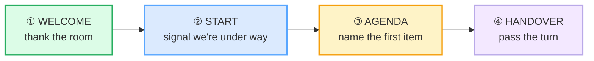

# Meeting Openings

> **Phase 2 · workplace · bundle #31 · Days 61–62.**
> *"Thanks everyone for joining." / "Let's get started."*
>
> 🔗 This is the first **workplace** bundle — it layers on the social functions
> of Phase 1. A meeting opening is just [GREETINGS & INTRO](../speech_acts/GREETINGS_INTROS.md)
> + [TOPIC TRANSITIONS](../speech_acts/TOPIC_TRANSITIONS.md) under a professional
> register. Later bundles build directly on it:
> [CONTRIBUTING IN MEETINGS](./CONTRIBUTING.md) (once it's open, how you chime
> in), [DIPLOMATIC DISAGREEMENT](./DIPLOMATIC_DISAGREEMENT.md) (how you push
> back), [STATUS UPDATES](./STATUS_UPDATES.md) (what you say when the handover
> reaches you).

---

## Why this is the gateway bundle for workplace speaking

A Vietnamese professional's first English meeting usually goes one of two ways —
both wrong. Either they **over-defer** ("Respectfully, I would like to humbly
wait…") or they **freeze** and wait to be called on, because that is exactly how
a Vietnamese meeting works: the most senior person opens, juniors stay silent
until invited, and elaborate formal openings signal respect. English meetings
invert almost all of that. The chair still opens, but the opening is **short,
efficient, and egalitarian** — a thank-you, a one-line agenda, a handover — and
everyone is expected to contribute from the first minute.

The single skill that unlocks the rest of Phase 2 is the **four-move opening**:
welcome → start → agenda → handover. Get those four chunks out cleanly and the
meeting is yours to participate in. Stumble on the opening and you spend the
rest of the meeting recovering.

---

## 1. The four-move opening (the anatomy)

Every English meeting opening is some combination of these four moves. The
chunks vary by register (casual internal sync vs. formal client call), but the
**skeleton is constant**:

| Move | Job | Casual internal sync | Formal / external |
|---|---|---|---|
| ① Welcome | acknowledge the room | "Good to see you all." | "Thanks everyone for joining." |
| ② Start | transition social→business | "Let's dive in." | "Let's get started." / "Shall we begin?" |
| ③ Agenda | name the first item | "First item…" | "We've got three things on the agenda." |
| ④ Handover | pass the turn | "Over to you, Mai." | "Mai, would you like to kick us off?" |

The two pinned chunks of this bundle sit at moves ① and ② — they are the spine:

> From `meeting_openings_corpus.md`:
>
> | Thanks everyone for joining. | Let's get started. |
> |---|---|
> | /ˈθæŋks ˈevriwʌn fə(r) ˈdʒɔɪnɪŋ/ | /lets ɡet ˈstɑːtɪd/ UK · /lets ɡet ˈstɑːrtɪd/ US |
> | Cambridge `join` /dʒɔɪn/; phrase attested (Oxford House video-conferencing guide) | Cambridge `start` UK /stɑːt/ US /stɑːrt/; idiom *get started* = "to begin" |

---

## 2. The welcome move — thank the room (briefly)

English openings are **short on ceremony**. A thank-you that runs more than one
clause sounds stiff. The three chunks below cover the whole register range:

> From `meeting_openings_corpus.md`:
>
> - **Thanks everyone for joining.** /ˈθæŋks ˈevriwʌn fə(r) ˈdʒɔɪnɪŋ/ — the
>   default external/cross-team welcome.
> - **Thanks for making the time.** /ˈθæŋks fə(r) ˈmeɪkɪŋ ðə ˈtaɪm/ — acknowledges
>   people carved a slot from a busy day; very common in client/vendor calls.
> - **Good to see you all.** /ɡʊd tə ˈsiː juː ˈɔːl/ — warm, internal, recurring
>   team.

**Why "making the time" and not "giving your time"?** `make the time` =
proactively free up a slot (the neutral, expected framing); `give your time`
sounds like a favour or a sacrifice and reads as over-formal or even mildly
guilt-tripping in a peer meeting. The collocation `make the time` is attested
across the Oxford House, Lougha Institute and English Center business-English
sources (see Sources).

---

## 3. The start move — "Let's get started" is the default

> From `meeting_openings_corpus.md`:
>
> - **Let's get started.** /lets ɡet ˈstɑːtɪd/ UK · /lets ɡet ˈstɑːrtɪd/ US —
>   neutral default; works in 90% of internal meetings.
> - **Shall we begin?** /ʃəl wi bɪˈɡɪn/ — consultative, slightly formal; the
>   `shall we…?` frame politely invites agreement instead of asserting it.
> - **Let's dive in.** /lets ˈdaɪv ˈɪn/ — energetic, informal; signals "no
>   preamble, straight to work".

**The pragmatic choice:** `Let's get started` is the safe default — it is
neither cold nor over-warm. `Shall we begin?` adds a hair of formality (useful
with senior stakeholders or when the room includes people you don't know well).
`Let's dive in` is for tight, trusted teams where everyone is already briefed.

**Pronunciation note (L1-relevant):** `started` ends in the cluster /tɪd/ (UK)
or /tərd/ (US). Vietnamese has no consonant clusters and tends to drop the
final /d/ → "Let's get start-it". Hold the cluster: drill
/ˈstɑːtɪd/ → release the final /d/ audibly. 🔗 See
[FINAL CONSONANTS](../pronunciation/FINAL_CONSONANTS.md).

---

## 4. The agenda move — "agenda" is the hinge word

Once started, the chair names what the meeting is for. The word **agenda**
/əˈdʒendə/ is the pivot — and it is a classic Vietnamese trap (mis-stressed or
given a parasitic vowel after /dʒ/).

> From `meeting_openings_corpus.md`:
>
> - **First item on the agenda.** /ˌfɜːst ˈaɪtəm ɒn ðə əˈdʒendə/ UK ·
>   /ˌfɜːrst ˈaɪtəm ɑːn ðə əˈdʒendə/ US — opens the first topic.
> - **We've got X on the agenda.** /wiːv ɡɒt … ɒn ðə əˈdʒendə/ UK ·
>   /wiːv ɡɑːt … ɑːn ðə əˈdʒendə/ US — scopes the whole meeting.
> - **Moving on to…** /ˈmuːvɪŋ ˈɒn tə/ UK · /ˈmuːvɪŋ ˈɑːn tə/ US — the
>   transition cue between items.

**Stress is on the second syllable:** a-**GEN**-da, not **A**-gen-da. Vietnamese
learners often front-stress it (influenced by Vietnamese's sesquisyllabic
pattern) or break the /dʒ/ with a vowel → /əˈdʒenədə/. Drill the stress with a
clap on the second syllable: a-**GEN**-da.

---

## 5. The handover move — pass the turn by name

The handover is where Vietnamese learners freeze — they expect to be *called*,
not to *be called on and start immediately*. In English, the handover is
explicit and the named person is expected to begin within a second or two.

> From `meeting_openings_corpus.md`:
>
> - **X, would you like to kick us off?** /wʊd juː ˈlaɪk tə kɪk ʌs ˈɒf/ UK ·
>   /wʊd juː ˈlaɪk tə kɪk ʌs ˈɔːf/ US — formal handover; `kick off` = "to
>   start/commence" (Cambridge + Collins).
> - **Over to you, X.** /ˈəʊvə tə juː/ UK · /ˈoʊvər tə juː/ US — the neutral
>   default; `over to you` = "it's your turn to take action" (Cambridge *over*).

**`kick off` is borrowed from football** (the opening kick) and is now standard
business idiom — Cambridge and Collins both list the "commence a discussion/job"
sense. It is **not** slang in a meeting context; it is the expected formal
handover verb.

---

## 6. Cheat sheet — the ≤8 survival chunks

The Pareto set. These eight carry you through almost every meeting opening in
English. Drill them aloud as a single flowing sequence: welcome → start →
agenda → handover. (Every row is a corpus attestation above.)

| # | Chunk | IPA | Why it's here |
|---|---|---|---|
| 1 | **Thanks everyone for joining.** | /ˈθæŋks ˈevriwʌn fə(r) ˈdʒɔɪnɪŋ/ | default external welcome (pinned) |
| 2 | **Thanks for making the time.** | /ˈθæŋks fə(r) ˈmeɪkɪŋ ðə ˈtaɪm/ | acknowledges busy calendars |
| 3 | **Good to see you all.** | /ɡʊd tə ˈsiː juː ˈɔːl/ | warm internal welcome |
| 4 | **Let's get started.** | /lets ɡet ˈstɑːtɪd/ UK · /lets ɡet ˈstɑːrtɪd/ US | neutral start — the default (pinned) |
| 5 | **Shall we begin?** | /ʃəl wi bɪˈɡɪn/ | consultative / formal start |
| 6 | **Let's dive in.** | /lets ˈdaɪv ˈɪn/ | energetic informal start |
| 7 | **First item on the agenda.** | /ˌfɜːst ˈaɪtəm ɒn ðə əˈdʒendə/ UK · /ˌfɜːrst ˈaɪtəm ɑːn ðə əˈdʒendə/ US | names the first topic |
| 8 | **X, would you like to kick us off?** | /wʊd juː ˈlaɪk tə kɪk ʌs ˈɒf/ UK · /wʊd juː ˈlaɪk tə kɪk ʌs ˈɔːf/ US | formal handover by name |

> Open [`meeting_openings.html`](./meeting_openings.html) to drill these as flip
> cards, hear native clips, play the role-play, shadow, and write a 3-line
> opening.

---

## 7. Vietnamese → English L1 pitfalls table

The "expert payoff." Vietnamese meeting culture and English meeting culture
collide on **hierarchy, ceremony, and turn-taking** — and the opening is where
the collision is most visible. These are the specific interference traps a
Vietnamese speaker hits when opening or being handed the floor in an English
meeting.

| Vietnamese trap (what you do) | English fix (what to do instead) |
|---|---|
| **Over-defers / waits to be called** — in VN meetings the most senior opens and juniors stay silent until invited; you freeze when the turn reaches you | Take the turn within ~1–2 seconds of a handover. Lead with the chunk, not an apology: *"Sure — thanks. So, on the Q3 numbers…"*. Silence reads as unprepared, not respectful. |
| **Overly elaborate formal openings** — translates the VN ceremonial opening word-for-word ("Respectfully, I would like to humbly begin by expressing…") | English openings are **one clause each**: welcome → start → agenda → handover. Cut the ceremony. *"Thanks everyone for joining. Let's get started. First item…"* is complete and correct. |
| **Hedges the start with apology** — *"Sorry, can I start?"* / *"Maybe we can begin?"* | Don't ask permission to start a meeting you're chairing. *"Let's get started"* is a polite assertion, not a command. Save *"sorry"* for genuine interruptions (🔗 [INTERRUPTING](../speech_acts/INTERRUPTING.md)). |
| **Drops final consonants** → *"Let's get start-it"* (drops /d/), *"thank"* (drops /s/), *"kic-off"* (drops the /k/ release) | Release every final: /ˈstɑːtɪd/, /θæŋks/, /kɪk ɒf/. 🔗 Drill [FINAL CONSONANTS](../pronunciation/FINAL_CONSONANTS.md) first — every opening chunk ends in a sound VN omits. |
| **Mis-stresses `agenda`** → /ˈædʒendə/ (front-stress) or /əˈdʒenədə/ (parasitic vowel after /dʒ/) | Stress the **second** syllable: a-**GEN**-da /əˈdʒendə/. The /dʒ/ is one sound — no vowel inserted. |
| **`/θ/ → /t/`** → *"tanks everyone"* for *thanks* | Tongue between the teeth for /θ/: **th**anks /θæŋks/. 🔗 [TH SOUNDS](../pronunciation/TH_SOUNDS.md). |
| **Translates "xin phép" / "cho phép" literally** → *"With your permission, I would like to open…"* | There is no English equivalent at meeting-open. Permission-asking belongs to *interrupting*, not *opening*. Use *"Let's get started."* |
| **Names the agenda but never hands over** — lists items, then waits for someone to volunteer | Always end the opening with an explicit handover **by name**: *"Mai, would you like to kick us off?"* Silence is not an invitation in English. |
| **Weak /ə/ vs full forms confused** — stresses grammar words (*for*, *to*, *the*) in "Thanks **for** making **the** time" | Keep **for/to/the** weak: /fə(r)/, /tə/, /ðə/. Stress only content words: **Thanks**, **making**, **time**. 🔗 [SENTENCE STRESS](../pronunciation/SENTENCE_STRESS.md). |
| **No /r/ in US `start`, `started`** → says UK form in a US room (or vice versa) | Match the room's accent. US `started` /ˈstɑːrtɪd/ has a clear /r/; UK /ˈstɑːtɪd/ does not. Flag your default and stay consistent. |

---

## How to practise this bundle (the daily 20 min)

1. **READ** (5 min) — this guide, §1–§5.
2. **SHADOW** (7 min) — open `meeting_openings.html`, drill the 8 flip cards,
   then run the role-play **aloud** as Person A (the chair): welcome → start →
   agenda → handover, no pauses, as one flowing sequence.
3. **PRODUCE** (8 min) — the writing task: write a **3-line meeting opening**
   (welcome + agenda + handover) for a real meeting you have this week. Read it
   aloud, recording yourself; check every final consonant is audible and
   `agenda` is stressed on the second syllable.

---

## Sources

- Cambridge Advanced Learner's Dictionary — https://dictionary.cambridge.org/dictionary/english/{word} (entries for *start* UK /stɑːt/ US /stɑːrt/ incl. idiom *get started* = "to begin"; *begin* /bɪˈɡɪn/; *join* /dʒɔɪn/; *over* incl. *over to you* = "it's your turn to take action"; *kick off* = "to start a discussion/activity"; *dive in* = "start doing something enthusiastically"; *move on*; *make*; *see*; *good*; *time*; *all*; *thanks* /θæŋks/)
- Oxford Advanced Learner's Dictionary — https://www.oxfordlearnersdictionaries.com/definition/english/agenda (*agenda* /əˈdʒendə/, OPAL W; *begin* /bɪˈɡɪn/)
- Collins English Dictionary — https://www.collinsdictionary.com/dictionary/english/kick-off (*kick off* = "to commence a discussion, job, etc.")
- Cambridge pronunciation page — https://dictionary.cambridge.org/pronunciation/english/agenda
- Oxford English Dictionary (OED) — https://www.oed.com/dictionary/join_n (*join* /dʒɔɪn/)
- OUP "Go Live!" irregular-verb list — https://elt.oup.com/student/golive/level02/irregular-verb-list (*begin* /bɪˈɡɪn/)
- Oxford House Barcelona, "The Ultimate Guide to Video Conferencing in English" — https://oxfordhousebcn.com/en/the-ultimate-guide-to-video-conferencing-in-english/
- Lougha Institute, "100 essential business English phrases" — https://loughainstitute.com/en/resources/business-english-phrases
- The English Center (Amsterdam), "17 Spoken Business English Tips" — https://englishcenter.nl/17-spoken-business-english-tips/
- Express Series, *English for Meetings* (Oxford University Press) — https://lib.pardistalk.ir/library/Express-Series/English-for-Meetings.pdf
- Native audio: YouGlish — https://youglish.com/pronounce/{phrase}/english/us? (clips for *thanks for joining*, *let's get started*, *shall we begin*, *kick off*, *agenda*, *over to you*, *dive in* — all verified HTTP 200)
- Frequency methodology: wordfrequency.info (spoken sub-corpus) — https://www.wordfrequency.info/
