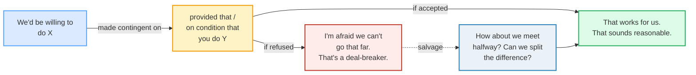
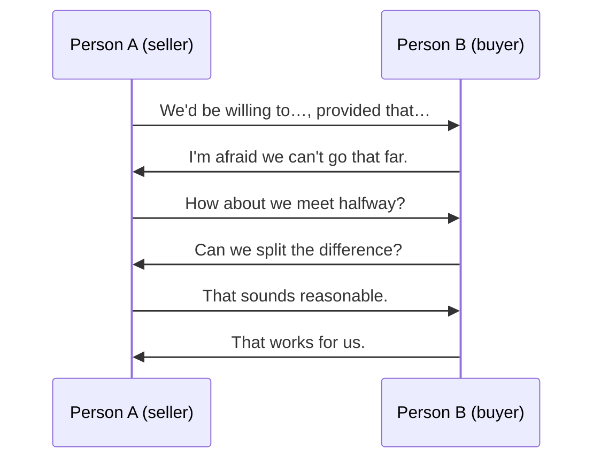

# Negotiating

> **Phase 2 · workplace · bundle #38 · Days 75–76.**
> *"If you can do X, we could agree to Y."*
>
> 🔗 This is the **workplace negotiation** bundle. It sits on top of
> [DIPLOMATIC DISAGREEMENT](./DIPLOMATIC_DISAGREEMENT.md) (the
> acknowledge-then-counter pattern — negotiation *is* managed disagreement) and
> [CONTRIBUTING](./CONTRIBUTING.md) (offering proposals in a meeting). Later,
> [PROPOSALS](../writing/PROPOSALS.md) carries the same propose-condition-accept
> logic into writing.

---

## Why this is bundle #38 (read this first)

A negotiation in English is **not** two people stating positions and waiting.
It is a sequence of **conditional trades**: *"if you give X, we can give Y."*
The whole exchange runs on three small sets of chunks:

1. **Conditional propose** — name your offer *and* the condition it depends on.
2. **Compromise** — propose the midpoint when neither side will move fully.
3. **Accept / decline** — close the trade, or refuse it *without* breaking the
   relationship.

A Vietnamese learner who can produce these three sets fluently can negotiate a
price, a deadline, or a scope change in English. A learner who can't is left
either **conceding too much** (the L1 harmony reflex — *giữ thể diện*) or
**holding rigid** (the other L1 reflex — refusing to move to save face). This
bundle is the cure for both.

---

## 1. The mechanism: the conditional trade

English negotiation is built on a **concession-for-concession** structure. You
never give something for nothing — you give it *on condition*. The conditional
is the grammatical engine:

> From `negotiating_corpus.md`:
>
> - **If you can do X, we could agree to Y.** /ɪf ju kæn duː X, wi kʊd əˈɡriː
>   tuː Y/ — the canonical concession-for-concession trade template.
> - **We'd be willing to…, provided that…** /wiːd bi ˈwɪlɪŋ tuː, prəˈvaɪdɪd
>   ðæt/ — the formal conditional offer.
> - **On condition that…** /ɒn kənˈdɪʃn ðæt/ — the strict, formal version
>   (legal/contractual tone).

**The pragmatic engine:** `provided (that)` and `on condition that` are
Cambridge-documented conditional conjunctions meaning *"if, or only if."* The
soft modal `could` /kʊd/ (not *will*) keeps the offer **tentative** — it signals
"this is negotiable," which is exactly the face-saving move that lets the other
side counter without losing face. `willing` (CALD: *"ready or eager to do
something"*) names your offer without committing you to it unconditionally.

---

## 2. Compromise — when neither side will move fully

When two positions are far apart, English has a **shared idiom set** for
proposing the midpoint. Cambridge's thesaurus lists all three as synonyms of
*compromise*:

> From `negotiating_corpus.md`:
>
> - **How about we meet halfway?** /ˌhaʊ əˈbaʊt wi miːt ˌhɑːfˈweɪ/ UK ·
>   /ˌhaʊ əˈbaʊt wi miːt ˌhæfˈweɪ/ US — CALD idiom: *"to do some of the things
>   that someone wants you to do, in order to show that you want to reach an
>   agreement."*
> - **Can we split the difference?** /kæn wi splɪt ðə ˈdɪfrəns/ — CALD idiom:
>   *"to accept only part of what you originally wanted when making an
>   agreement involving money"* (the price/deadline midpoint).
> - **Let's find some middle ground.** /lets faɪnd sʌm ˈmɪdl ɡraʊnd/ — CALD:
>   *"a position between two opposite opinions."*

These three are **interchangeable in function** but not in register:
`split the difference` is most concrete (money/numbers), `meet halfway` is the
all-purpose workhorse, `middle ground` is slightly more abstract (principles,
scope). Use all three — repetition with variation is how native negotiators
keep the conversation moving without sounding repetitive.

---

## 3. Accept / decline — closing without breaking the relationship

The hardest move for a Vietnamese speaker. Direct refusal feels rude in the L1;
English solves it with two down-toners and one walk-away phrase:

| Move | Chunk | Why it works |
|---|---|---|
| Accept (warm) | **That works for us.** | `work` = "be acceptable" (CALD) — short, decisive, positive. |
| Accept (judgement) | **That sounds reasonable.** | `reasonable` = "fair and practical" — validates the other side's offer. |
| Decline (polite) | **I'm afraid we can't go that far.** | `I'm afraid (that)` = "I'm sorry to say" (CALD polite formula) + `go that far` = "reach that limit." Refusal **without** aggression. |
| Walk away | **That's a deal-breaker.** | Names the non-negotiable term clearly — the formal way to signal "we cannot agree to this." |

> From `negotiating_corpus.md`:
>
> - **That works for us.** /ðæt wɜːks fɔː ʌs/ UK · /ðæt wɜːrks fɔːr əs/ US
> - **That sounds reasonable.** /ðæt saʊndz ˈriːzənəbl/
> - **I'm afraid we can't go that far.** /aɪm əˈfreɪd wi kɑːnt ɡəʊ ðæt fɑː/
>   UK · /aɪm əˈfreɪd wi kænt ɡoʊ ðæt fɑːr/ US
> - **That's a deal-breaker.** /ðæts ə ˈdiːlˌbreɪkə/ UK · /ðæts ə
>   ˈdiːlˌbreɪkər/ US

**The pragmatic key:** `I'm afraid` is not "fear" here — it is the **polite
refusal formula** (CALD: *"used to politely tell someone something that may
annoy, upset, or disappoint them"*). Vietnamese has no exact equivalent; the
nearest is *"xin lỗi nhưng…"* but the English chunk is a fixed, expected
formula. Using it marks you as a fluent, professional negotiator.

---

## 4. The negotiation turn map

A full negotiation cycles through propose → compromise → accept/decline, often
more than once. The mermaid below maps a single cycle — a real deal may loop 2–3
times before landing:

🔗 Contrast with [DIPLOMATIC DISAGREEMENT](./DIPLOMATIC_DISAGREEMENT.md) — there
the move was acknowledge → counter; here the move is **offer → counter-offer**,
and every offer is conditional. The grammar is different (conditional + modal)
but the face-saving instinct is the same.

---

## 5. Cheat sheet — the ≤8 survival chunks

The Pareto set. Drill these eight aloud until every conditional is automatic.
(Every row is a corpus attestation above.)

| # | Chunk | IPA | Why it's here |
|---|---|---|---|
| 1 | **If you can…, we could…** | /ɪf ju kæn, wi kʊd/ | the conditional-trade template — the engine |
| 2 | **We'd be willing to…, provided that…** | /wiːd bi ˈwɪlɪŋ tuː, prəˈvaɪdɪd ðæt/ | formal conditional offer |
| 3 | **How about we meet halfway?** | /ˌhaʊ əˈbaʊt wi miːt ˌhɑːfˈweɪ/ UK · /ˌhaʊ əˈbaʊt wi miːt ˌhæfˈweɪ/ US | the all-purpose compromise idiom |
| 4 | **Can we split the difference?** | /kæn wi splɪt ðə ˈdɪfrəns/ UK · /kæn wi splɪt ðə ˈdɪfərəns/ US | the price/number midpoint |
| 5 | **Let's find some middle ground.** | /lets faɪnd sʌm ˈmɪdl ɡraʊnd/ | abstract compromise (principles/scope) |
| 6 | **That works for us.** | /ðæt wɜːks fɔː ʌs/ UK · /ðæt wɜːrks fɔːr əs/ US | warm acceptance |
| 7 | **I'm afraid we can't go that far.** | /aɪm əˈfreɪd wi kɑːnt ɡəʊ ðæt fɑː/ UK · /aɪm əˈfreɪd wi kænt ɡoʊ ðæt fɑːr/ US | polite refusal (down-toned) |
| 8 | **That's a deal-breaker.** | /ðæts ə ˈdiːlˌbreɪkə/ UK · /ðæts ə ˈdiːlˌbreɪkər/ US | the walk-away term |

> Open [`negotiating.html`](./negotiating.html) to drill these as flip cards,
> hear native clips, play the role-play, shadow, and write.

---

## 6. Vietnamese → English L1 pitfalls table

The "expert payoff." These are the specific interference traps a Vietnamese
speaker hits in an English negotiation — the two failure modes are opposite
(concede too much vs. hold rigid), and the cure for both is the **conditional
trade**.

| Vietnamese trap (what you do) | English fix (what to do instead) |
|---|---|
| **Concedes too much to preserve harmony** (*giữ thể diện* / collectivist conflict-avoidance) — accepts the first offer to avoid conflict | Never accept unconditionally. Always attach a condition: **"We'd be willing to…, provided that…"** — a concession earns a concession. |
| **Holds rigid to save face** — refuses to move a number/term because moving "loses face" | Reframe moving as a **trade**, not a loss: **"If you can do X, we could agree to Y."** You aren't giving in — you're trading. |
| **Misses the concession-for-concession logic** — Vietnamese negotiation is often positional ("this is my price"), not conditional ("if…then") | Drill the conditional template until it's automatic. Every offer should have an *if* attached. No free concessions. |
| **States a position as a declarative** — "We want $10,000" (sounds blunt/demanding) | Soften with a modal + condition: **"We could accept $10,000, if you can…"** The `could` keeps it negotiable. |
| **Cannot say "no" politely** — direct refusal feels rude, so the learner either says "yes" (and resent) or stays silent | Use the polite-refusal formula: **"I'm afraid we can't go that far."** It refuses without aggression — the L1 has no exact equivalent, so drill it as a fixed chunk. |
| **Silence is misread** — a Vietnamese pause (thinking / harmony-keeping) reads to a Western negotiator as rejection or stalling | Fill the gap with a fluency move: **"Let me think about that"** / **"That's an interesting point"** — then the counter. Silence in English negotiation is a weapon, not a courtesy. |
| **Under-uses the compromise idioms** — translates literally ("chia đôi" → "divide in two") instead of using the shared idiom | Use the set: **"meet halfway" / "split the difference" / "middle ground."** Cambridge lists all three as *compromise* synonyms — these are the expected, native-sounding moves. |
| **Overuses "deal-breaker" as a threat** — uses it early to sound tough, which kills the negotiation | Reserve **"That's a deal-breaker"** for the genuine walk-away term (the one thing you cannot accept). Use it once; mean it. |
| **Drops the `that` in "provided that / on condition that"** under stress → "provided you can…" (acceptable, but loses the formal register) | In formal/contractual tone, keep the **`that`**: "provided **that** you can deliver by Friday." |
| **Confuses `reasonable` with `cheap`/`low`** → "That's reasonable" said about a low price sounds like approval of cheapness | `reasonable` = "fair and practical" (CALD) — it's a judgement of fairness, not size. **"That sounds reasonable"** = "I judge this fair." |
| **Stresses the wrong syllable in `negotiable`** → /ˌniːɡəʊʃiˈeɪbl/ (wrong) | Stress the **second** syllable: /nɪˈɡəʊʃiəbl/ UK · /nɪˈɡoʊʃiəbl/ US. Same for `negotiate` /nɪˈɡəʊʃieɪt/. |
| **/θ/ missing in the conditional** → drops the /θ/ in `both` / `worth`, or the final cluster in `halfway` → "halfway" sounds like "haf-way" | Keep the final cluster tight: **halfway** /ˌhɑːfˈweɪ/. 🔗 See [FINAL CONSONANTS](../pronunciation/FINAL_CONSONANTS.md). |

---

## How to practise this bundle (the daily 20 min)

1. **READ** (5 min) — this guide, §1–§4.
2. **SHADOW** (7 min) — open `negotiating.html`, drill the 8 flip cards + the
   role-play **aloud**. Pay attention to the conditional rhythm: short pause
   after the offer, then the condition.
3. **PRODUCE** (8 min) — the writing task: write a conditional proposal
   (*"If you can…, we could…"*). Then write the reply you'd give if the other
   side refused, using a compromise idiom. Read both aloud.

---

## Sources

- Cambridge Advanced Learner's Dictionary — https://dictionary.cambridge.org/dictionary/english/{word}
  (entries for *agree*, *provided* [incl. "provided (that)"], *condition* [incl.
  "on condition that"], *willing*, *meet-halfway*, *split-the-difference*,
  *middle-ground*, *compromise*, *work* / *work-with*, *reasonable*, *afraid*,
  *negotiable*, *non-negotiable*, *if*, *how_2*)
- Cambridge Academic Content Dictionary — `split the difference` idiom.
- Oxford Advanced Learner's Dictionary — https://www.oxfordlearnersdictionaries.com/definition/english/deal-breaker
  (*deal-breaker* headword).
- Cambridge Thesaurus — *compromise* synonyms
  (https://dictionary.cambridge.org/thesaurus/compromise): *"settle · agree ·
  meet halfway · split the difference."*
- Brown, P. & Levinson, S. *Politeness: Some Universals in Language Usage*
  (CUP, 1987) — negative face / face-threatening acts (FTAs); a refusal is a
  classic FTA that `I'm afraid…` down-tones.
- "Politeness theory" — Wikipedia — https://en.wikipedia.org/wiki/Politeness_theory
- Native audio: YouGlish — https://youglish.com/pronounce/{chunk}/english/us?
  (every clip verified HTTP 200 on 2026-06-23).
- Frequency methodology: wordfrequency.info (spoken sub-corpus) —
  https://www.wordfrequency.info/
